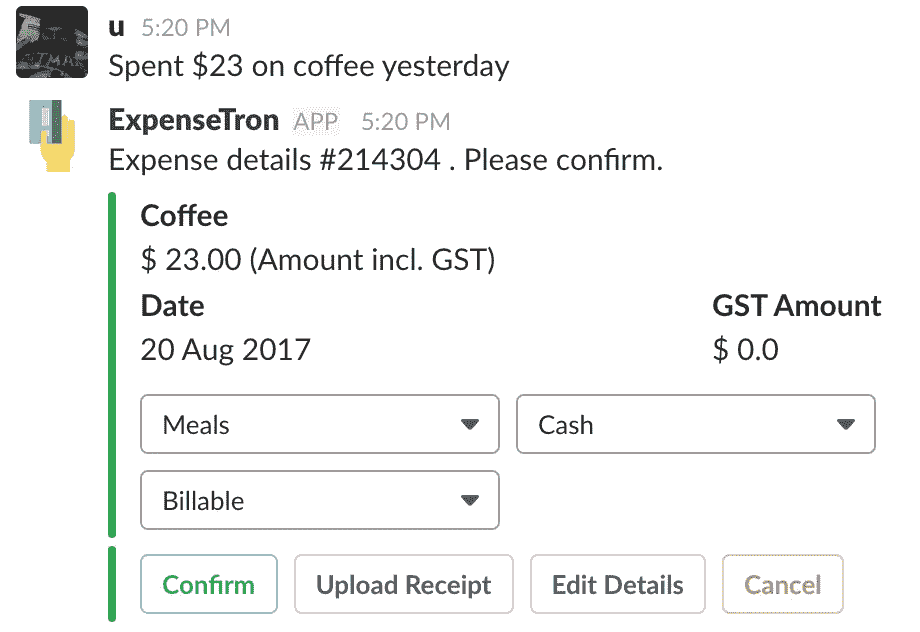

# 设计聊天机器人不同于设计应用程序的 10 种方式

> 原文：<https://medium.com/hackernoon/10-ways-how-designing-a-chat-bot-is-different-from-designing-an-app-a19dec07e7ad>

我们，Anaek，在交互的未来下了很大的赌注。带有复选框、单选按钮和难看的文件上传的长长的 web 表单将为一种新型的交互方式让路——一口大小的交互和上下文交互。一个简单的问题，可以通过按下按钮来回答，一个自由形式的答案或用表情符号来反应。无聊将让位于互动，繁琐将让位于快速，全有或全无将被一次一个所取代。

与任何其他应用程序或网络产品相比，在聊天机器人世界中设计产品有一些显著的不同。在这篇文章中，我们试图捕捉一些关键的差异。

Making a bot needs a different toolkit and new set of best practices

O **n-boarding** 一个聊天机器人的新用户和一个应用程序的新用户是非常不同的。缺乏视觉线索、有限的空间和测试机器人“人工智能”的倾向通常会导致失败。从一开始就做好两件事是最重要的。第一，确保你引导用户(把它想象成一个证人的交叉询问，引导她证明你的观点是允许的)以你的机器人理解的方式回应或互动。这可以通过多种方式来实现，包括提供一组回答示例，如“嗨，你是这间办公室的经理吗？如果平台上有按钮或快速提示，请用“是或否”来回答。

Leveraging buttons in [Slack](http://www.slack.com) on [OfficeAmp](http://www.officeamp.com) Bot

第二，设定正确的期望值。没有什么比破坏一个机器人并在 twitter 上发布它的截图更有趣的了。你的机器人越有趣、越健谈，就越有可能通过压力测试。保持紧凑，直奔主题。使用表情符号来保持乐观和可爱是可以的，但是问“那里的天气怎么样”或者“最近怎么样！”是自找麻烦。

为聊天机器人设计工作流程是与传统网络/应用程序最显著的区别。与 web/app 不同，最有效的交互可能不是让你到达你想去的地方。把用户带到她想去的地方附近，然后轻轻地为实际的目的地铺平道路，这是完全可以的。

[ExpenseTron](http://www.expensetron.com) in action in Slack: Using context and defaults to intelligently extract the information available, guess what you can’t extract and then let the user change the rest

例如，举一个简单的费用申报交互的例子。机器人需要知道几件事情来提交正确的费用，如花费的金额、费用的类别、支付方式、费用的日期、费用是否可计费等。它将从你说的话中提取尽可能多的内容，并猜测其余的内容，而不是交互式地询问所有这些内容。是的，这可能无法一蹴而就，但根据我们的经验，最好是请求原谅并提供一个解决问题的方法，而不是要求用户做很多事情。相比之下，传统的 web 表单需要在点击提交之前填写所有内容。这感觉更自然，如果你聪明地提取，也会快得多。

特征发现是当今机器人世界中最棘手的问题之一。从某种意义上来说，你的机器人能做的大部分事情(假设它能做很多)基本上都是复活节彩蛋。一旦你开始与一些机器人聊天，它们就会给你一连串的功能和命令。如果你想恐吓用户，让他们再也不回来，这绝对是一个完美的方法。在这里，再次引导用户尝试一些事情，但是是在需要做的基础上。猜测用户在寻找什么，并不断向他们介绍具体的行动。没有边栏，也没有链接功能的标题。这是在机器人世界中运作的[渐进披露原则](https://www.nngroup.com/articles/progressive-disclosure/)。

你需要根据用户在任何时候想要达到的目标，聪明地向他们展示更多的东西。在我们之前的费用示例中，当用户提交第一笔费用时，您可以通过简单的“太好了！你刚刚提交了你的第一笔费用。现在，输入“报告”即可下载您的费用报告。”

聊天机器人世界中的 VPing 比传统的网络/应用程序要强大得多。“先做假的再做”和机器人是天造地设的一对。异步耗时用例，如研究工作、校对、文档数据提取和挖掘、图像识别、寻求专家帮助等，可以通过一个简单的机器人来实现，该机器人收集完成任务所需的所有信息，离线手动完成，然后在完成后 doing 用户。这是一个很好的起步方式，可以评估需求，为早期客户提供高质量的服务，同时了解更多关于规模自动化的信息。

错误恢复是一个独特而有趣的问题。一个好的聊天机器人永远不会让你觉得你犯了错误，或者它不明白你说的话，从这个意义上说，你最好的错误恢复机制是永远不需要的。“你的意思是”和“我不明白，试试这些”的健康组合..取而代之”通常是一个好的解决方案，但这也是事情变得复杂的地方。机器人需要能够理解用户特定的行话，并从以前的错误中学习。当然，这说起来容易做起来难。在企业用例中，来自一个用户的知识可能适用于也可能不适用于整个团队，这就变得更加困难了。

机器人还需要能够在响应的同时记录上下文。它们是有用的用户信息的来源。一天中的时间、用户之前的输入、交互速度等参数都是机器人需要存储和操作的数据点。

接收反馈并提供支持是聊天机器人相对于传统网络/应用程序的最大优势之一。理想情况下，你绝不会希望用户因为任何事情离开聊天机器人平台。无论是学习新功能、提出问题、获得支持，甚至是付款，一切都应该在平台内进行。这里的平台也有自己的工作。就像 Slack 的按钮和下拉选择器一样，我们预计会有更多这样的高级交互工具出现，这将使平台更具吸引力，而不是限制性的。在此之前，你的主要目标是尽可能减少与外界的互动。

Slackbot offering documentation right inside Slack

这变得稍微容易支持，因为当机器人不能理解用户输入时，它总是可以搜索它的知识库和密切反映用户谈论的表面文章。Slackbot 在这方面做得很好。

衡量成功不仅仅是计算满足互动目标的人数。它进行的交互次数、遇到的失败，以及如果它涉及到机器人的猜测(就像我们之前的费用示例)，那么它对机器人进行的错误尝试的次数都是衡量机器人成功的有用指标。让用户到达那里是不够的，机器人如何让她到达那里也非常重要。现在还只是早期，将会有更多关于跟踪和测量机器人参与和使用的公开信息，但从一开始就开发一个强大的特定于应用程序的数据收集和分析系统是非常重要的。

这里的本地化简单来说就是将文本翻译成另一种语言，如此而已。与传统的 web/app 产品不同，传统的 web/app 产品有一个用户界面，文本/字符串需要放入特定的框中，而聊天机器人世界没有这样的限制。事实上，同时使用多种语言是可能的。想象一下，一个在美国出生和长大的孩子会如何与他们交谈——当父母用英语和他们的母语混合说话时，孩子几乎总是用英语回答。如果做得好，这将会非常强大。

L 因为所有的交互都发生在一个底层的协作平台上，所以所有的交互/工作流都可以很容易地通过用户之间的直接对话来补充。在 [AttendanceBot](https://www.attendancebot.com) 的早期，我们不允许用户在申请请假时提供理由。我们设定的期望是，人们应该能够通过向他们的经理发送一个关于 Slack 的直接消息来直接告诉他们休假的原因。这是一个很好的方式，通过简单的方法增强机器人的功能，将你的部分功能转移到平台上。

因此，作为一等公民，机器人及其底层平台以单点登录的形式为整体体验提供了一个令人敬畏的附加功能。如果除了聊天平台之外，您还需要一个单独的 web 界面(比如一些管理功能，如设置或高级功能，如仪表板)，您可以随时使用底层的“登录方式...”功能平台的功能。

External links to a settings dashboard for [AttedanceBot](http://www.AttendanceBot.com) using SSO of the Slack platform

不需要新的注册或密码，也不需要供应/取消供应用户。这与前面提到的利用平台相关，但值得一提，特别是因为它与企业相关。

对于美国和严肃的机器人应用来说，现在还为时尚早。这些是我们遇到的一些早期的差异。你是做聊天机器人的产品管理/设计的吗？请告诉我们你对我们的学习有什么看法，并在评论中分享你的想法。