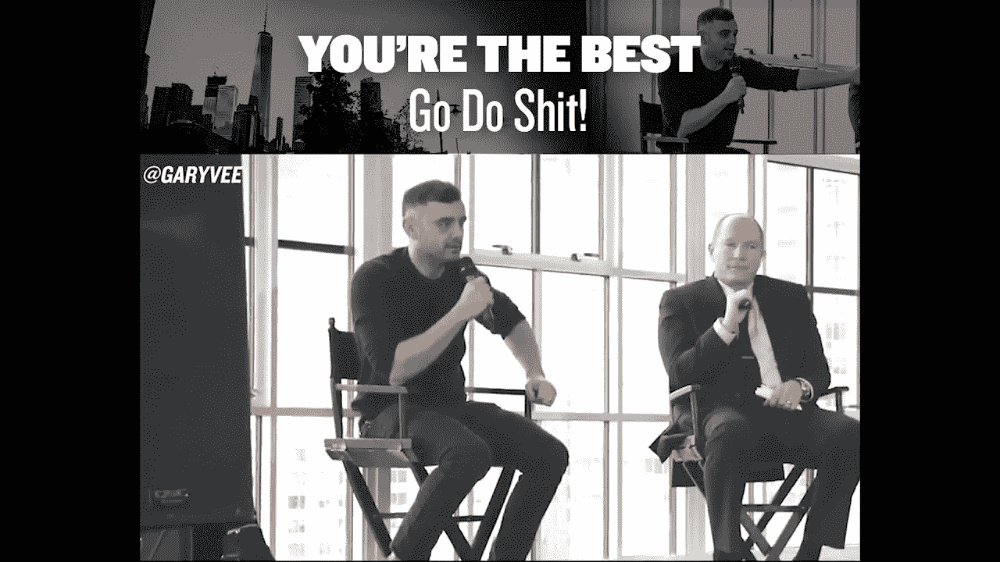

# 成为一名出色的联合创始人的 11 条建议

> 原文：<https://medium.com/hackernoon/11-tips-on-being-a-kick-ass-co-founder-765af8796545>

有很多关于如何找到一个好的联合创始人的文章和建议。但有可能你已经作为联合创始人参与了一家初创公司，而且你的公司发展得非常快。这是一个很好的做法，评估自己，并找出你是一个多么好的联合创始人。

我们很多人选择最好的朋友和 T1 一起开公司。然后你有两个选择:要么你成为两个失败者，一起工作了几个月，然后打起架来互相憎恨，要么你成为两个了不起的创始人，解决问题并创造出伟大的东西。面对现实吧，创业很难。风险很高，事态升级很快。下面是一些实用的建议，可以让你从“那些”家伙变成牛人。

## 1.每天都有进步

每天问问自己，你是否真的把公司从 A 点移到了 b 点。你有没有让公司更接近它的里程碑？坦白地说，如果你不这样做，你就是在伤害公司(也就是你自己和你的合作伙伴)。在一家只有几个联合创始人的初创公司，如果有一个人没有做出贡献，哪怕只有一天，也意味着那天公司很大一部分人都不在。影响大。除非你们每一天都有所贡献，否则你无法实现自己的目标。

**实用提示:**

*   **在一天结束时写一份简短的每日进度报告**。它会让你保持一致，如果你错过了你的工作，会让你来个 180 度大转弯。
*   不要整天被一个单一的任务所阻碍。如果你在某一天被分配做 5 件事，不要在最难的任务上被阻塞一整天。虽然有些人建议先做最难的事情，但通常(尤其是对初创公司而言)最好是完成 4 个简单的任务，而不是 5 个未完成的任务。
*   **遇阻求助**。如果你在一项任务上坚持了两个多小时，而且进展不顺利，不要受阻。继续下一个任务。你可以随时寻求帮助，或者以后把剩下的任务外包出去。

正如 YC 合伙人保罗·布赫海特(Paul Buchheit)常说的，当你被太多的任务轰炸时，[寻找“90/10 解决方案”](https://blog.ycombinator.com/ycs-essential-startup-advice/?utm_source=hackernewsletter&utm_medium=email&utm_term=fav)。那就是:

> 寻找一种方法，让你只用 10%的工作/努力/时间就能完成 90%的事情。如果你努力寻找，几乎总会有 90/10 的解决方案。最重要的是，对于一个真实的客户问题，一个 90%的解决方案是可以立即得到的，这比一个 100%的解决方案要好得多，而后者需要很长时间才能建立起来。

## 2.做一个信徒，而不是一个阻挠者

Photo credit: slate.com

在创业公司，任何事情都有自己的时间。在开始的时候，你头脑风暴和计划，然后你进入执行模式。一个非常常见的错误是回到头脑风暴，并在执行模式下不断改变你的产品的计划和基本特性。头脑风暴并不总是奏效。一旦你有了一个想法，停止怀疑，每天回到原点。你不能一直回到你最初的想法。相反，尽可能快地实现你的想法，然后测试它。如果没用，你可以再来一次头脑风暴。你应该锁定一个目标，除非有明显的原因，否则不要改变它。

很多创业想法在一开始看起来都很可怕。比如 Airbnb，一开始看起来是一个很可笑的想法，但是创始人相信它，执行它，并没有每天从一件事跳到另一件事。

如果你发现自己甚至在证明你最初的假设之前就在争论你创业的基本想法，谈论潜在的支点，你正在伤害你的公司、你自己和你的联合创始人。在某些时候，你应该闭上眼睛，对所有的批评和仇恨充耳不闻，然后实施。你可以测试一下。不断猜测你的目标只会有害。看在上帝的份上，接受你的直觉是对的，并执行它。正如[沙拉姆·福拉德加-默瑟所说](https://www.forbes.com/sites/theyec/2014/05/07/10-tips-for-healthy-co-founder-relationships/#a21ebc12d357):

> **专注于你自己的项目。**由于共同创业伴随着大量的责任，因此很容易分心。在任何时候，你都可以解决成千上万的问题；你一直在努力保持专注。归根结底，任何时候都只有一个“最重要的任务”。集中你的精力，不要担心你的伴侣在做什么——他们知道。

You are the best, go do shit — Gary Vaynerchuk

## 3.论点:你的联合创始人和你的时间是你最大的财富

我们创业公司的许多人将任务外包给承包商和自由职业者，这通常并不便宜。自由职业者每小时的花费从 20 美元到 150 美元不等。如果他们的时间花了你那么多，你的时间价值更高。所以要明白，你浪费在和伴侣争吵上的每一分钟都在让你赔钱。

**实际例子:**

*   如果你不同意某事，考虑看看你是否能不争论就让它过去。你不喜欢网站的颜色？你的 logo 不美观？问问自己到底有多重要。可能还没有人关心你的公司，更不用说你的商标或者你的调色板了。所以，如果你能避免一个小时对一个不重要的问题的激烈讨论，就让它过去吧！
*   刚想出一个新的支点想法？不要告诉别人！当你处于执行模式时，不是谈论其他创业想法的时候。这会伤害你的注意力，也会伤害你伴侣的动力和信心。这只能表明你不相信你的合作伙伴和你创业的根本目标。这表明你不重视你花在市场调查上的时间。除非你完全确定你最初的想法是错误的，否则无论如何都要避免这种对话。想象一下，经过数周的市场调查，你决定在一块空地上建一所医院。在路上，你的搭档打电话给你说:“嘿，去他妈的医院，我想我们应该在这里建一所学校”。第二天，他打电话给你说:“嘿，去餐馆怎么样？”。当你每天从一件事跳到另一件事时，你的联合创始人会有什么感觉？？

保持专注是 Jessica Livingston 的《[如何不失败](https://blog.ycombinator.com/how-not-to-fail/)》中提到的创业秘诀之一。

## 4.不要有创意，坚持计划！

致力于你的计划:请珍惜你花在计划上的时间。如果你划分和分配任务，你需要交付，句号。如果你负责做 *A* ，却花时间做 *B* ，你就是在伤害公司。你的伴侣认为你在讨论和达成一致的事情上花费时间，而你却决定去做别的事情。那你们为什么要开计划会议呢？

**实用提示:**

在 [PlusOne](http://okplusone.com) 中，我们基于两周的行动计划冲刺来运作:在每个冲刺阶段的开始，我们会根据用户反馈等各种情况来讨论、集思广益并评估我们的优先事项和里程碑。我们为达到那个里程碑计划新的任务，并把它们放在电子表格中。下一步是执行:我们开始执行时要明白，花在不在电子表格上的任务上的每一分钟都是在浪费公司的资产。通过这样做，在每个冲刺阶段结束时，我们已经将公司从 A 点转移到 B 点，而不是被转移。

## 5.保持开放的心态，相信你伴侣的判断

如果你不相信你伴侣的判断，立即停止和他们一起工作。但是，如果你这样做，了解他们从何而来，不要成为一个令人讨厌的顽童。如果他们有不同的观点，以开放的心态考虑，不要像一个疯狂的 CEO 一样微观管理他们。他们有可能看到你看不到的东西。正如珍妮·布克所说:

> 这不仅导致首席执行官迅速成为主要瓶颈，对其他团队也是如此，而且也极大地挫伤了为他工作的人的积极性。
> 
> 疯狂的首席执行官们为那些他们还在继续工作的人支付大量的钱。

## 6.不要在背后说三道四！

Photo credit: pexels.com

大多数科技创业公司的创始人都是受过教育、有技术背景的人。但这意味着你应该根据数据、统计和研究来说话。所以不要因为你觉得事情必须如此就说些什么。相反，只有在你真正调查过这个话题，并且有数据支持的情况下，才说出来。与其大声思考，不如理解你需要采取额外的步骤，在提出观点之前更深入。清晰、具体、直截了当。你提出的每个建议都应该切实可行，否则就是浪费时间。

**不说这些:**

*   我有一种感觉，我们的用户界面很糟糕
*   在我看来，我们登录页面上的图片很难看

**改说这些:**

*   我研究了我们的分析和用户行为。我注意到 90%的人在前两分钟离开我们的应用程序，因为他们对我们的信息感到困惑。我研究了其他几个应用程序，并提出了这种菜单项的替代排序，只需 30 分钟即可实现。
*   我采访了我们的 10 个用户。80%的人告诉我我们的登陆页面看起来很俗气。我访问了我们竞争对手的 5 个登录页面。都是用一个潮男/潮女的简单图，看起来很成功。我已经在 Fiverr 上和这个自由职业者谈过了，并订购了一张改进的图片，这样我们就可以遵循同样的方法。

你看到了一个随意的模糊建议和一个全面的、实用的、科学的解决方案之间的区别，这就把我带到了下一个问题。

## 7.提供完整的解决方案

有可能事情不对劲，而你有办法解决它。在提出你的想法之前，你需要想清楚。例如，假设您想要添加一个新功能，用户可以在您网站的各种内容下进行评论。一种方法是在下一次会议上不考虑任何其他事情就说出来，然后争论这个问题(会议不是用来大声思考的！).另一种方法是想清楚，做好功课，然后这样说:

> 我们的分析结果显示，我们的用户并不介意在我们的页面上花更多的时间，他们实际上与帖子互动。我们为什么不添加评论呢？我对我们需要安装在后端的实现和包做了一些研究。根据我的评估，我们可以在不到 10 个小时的时间内实现它的 MVP 版本并进行实验。

还是那句话，一个只是抛砖引玉，一个是综合解决方案。

## 8.陪着你的共同创始人

Photo credit: pexels.com

许多初创公司的联合创始人经历了巨大的压力，他们筋疲力尽。事实上，如果你是初创公司早期的联合创始人，几乎所有事情都与你作对:你的父母认为你离开稳定的公司工作是疯狂的。你的女朋友/男朋友(如果你还有女朋友/男朋友的话)对你唠叨不休，因为你没有花足够的时间和他们在一起。你睡眠不足。你没有足够的时间去健身房。你的自由职业者没有正确地完成他的工作，一切都在边缘。因此，你至少可以做的是，不要成为另一个让你的联合创始人烦恼的人。要明白，你可能是这个世界上唯一能够(也必须)支持他/她的人，做不到这一点会有严重的后果。

就像任何其他关系一样，共同出资关系也需要培育。[正如蒂姆·霍顿所说](http://blog.onevest.com/blog/2015/5/14/tips-for-an-effective-co-founder-relationship):

> 有意识地培养创始人关系，如果不是比一开始就找到合适的人选更重要的话，也是同等重要的。

## 10.尝试引导-跟随策略

In dancing, one person leads, and the other one follows, and it’s ok!

当你和你的一个朋友在一辆车里时，只有一个人可以开车。这并不代表司机有什么优越感，只是不能动不动就商量着做决定。再比如搭档跳舞:两个人跳舞，一个人要领舞，另一个人要跟。这并不一定意味着领导者是一个更好的舞者，但舞蹈的本质要求一个人来驱动轮子，共同创造一个美好的画面。

正如加里·维纳查克所说:

> 在创业公司中，联合创始人不仅是首席执行官，还是他们自己的电工、水管工和瓦工。问题是每个人都想成为建筑师。

如果所有的联合创始人都想同时否决一切，并对每一件事情都固执己见，他们会拖公司的后腿。最好尽早就谁该领导谁该跟随达成一致。许多非关键的决定可以很快做出，不需要所有的联合创始人都附和。如果需要，这些角色可以定期更换。

**实用小贴士:**

*   在 [PlusOne](http://okplusone.com) 中，我们试验了来自舞蹈社区的*角色互换领导跟随策略*。每次冲刺开始的时候，我们约定一个人是领跑者，另一个人是跟随者。对于较小的事情，领导者做出决定，而追随者接受。每两周，我们交换角色。这样可以避免很多不必要的争论和头脑风暴。

## 11.6 分和 10 分一样好

要明白在很多情况下，6 分和 10 分一样好。所以，不要成为一个控制狂，如果你能忍受你的共同创始人 6 级的决定，保持冷静，并遵循。你浪费在说服他从 6 点到 10 点的时间可以用在更重要的任务上。