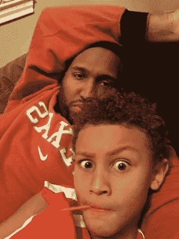

# 1995 年资源奖/技术多样性

> 原文：<https://medium.com/hackernoon/1995-source-awards-diversity-in-tech-e5c911f8a3b3>

**所以**在过去的几天里，当我们庆祝和纪念 MLK 的时候，有很多关于#diversityintech 以及如何修复它的推文和讨论。科技要反映社会状况还有很长的路要走。我很高兴有讨论发生，但我不确定进行讨论的人是否有合适的人参与。有黑人、拉丁裔和 LGBT 朋友长大的普通学校的学生在哪里？如果你的[网络](https://hackernoon.com/tagged/network)都跟随斯坦福、麻省理工、[谷歌](https://hackernoon.com/tagged/google)管道，我不确定你是领导这些讨论的合适人选。我认为你应该在餐桌上有一席之地，因为你的经历超级有价值，但你的 12 个弟子不可能和你一样。

周末我和一个朋友讨论了大约两个小时，为什么她认为少数民族不能赶上简单的多元化倡议。她是一名在全国许多低收入地区工作过的教师，所以我相信她知道自己在说什么。她提到了社区服务的必要性，以及与社区中的孩子建立信任和关系所需的时间。因此，仅仅有一天的技术交流或一位演讲嘉宾是无法完成任务的。在任何有意义的改变发生之前，需要有人扎根并真正投资于社区。我很感激她与我分享这一点，因为很长一段时间以来，我一直认为每个人都可以成功，因为我周围有很多人都成功了。

明确地说，我的成长经历很棒。我的父母都很投入(也许太投入了，哈哈)，总是拥有我想要的一切。我也有天赋。我超级聪明，擅长运动，我的朋友也是如此。我的朋友向我解释说，我的正常实际上是例外。作为一个黑人，6 英尺 7 英寸(有一个跳投)，伟大的考试成绩和等级为我的成功奠定了基础。我的许多朋友去了常春藤盟校、军事学院、斯坦福或类似的学校。这不正常，但对我来说很正常。我也有一些队友，他们的测试成绩不是最好的，但是在体育方面很棒。他们还是上了大学。在我的圈子里，即使我们拥有一切，技术也从来没有被作为职业选择引入。事实上，我的一个队友在旧金山拥有一家估值数亿美元的公司，但我们一直知道他会在计算机方面有所作为。他也是我们篮球队中唯一的白人。但他是最酷的家伙，而且仍然是一个伟大的朋友。他的公司有妇女和少数民族为他们工作，他们正在扼杀它。但我认为，从小到大，他每天下午 3 点到 6 点都被黑人包围，这一事实给了他一种大多数科技公司首席执行官都没有的视角。

像 Code 2040 这样的项目很了不起，但是知识的集中需要传播到纽约市和旧金山以外的地方。我儿子在德克萨斯州排名第一的小学上学，他们参加了“代码小时”活动。如果他没去那所学校，他会被介绍给这个好机会吗？我希望我在成长的过程中对编程有更多的了解。计算机科学，我们用 C++工作的地方，实际上是高中唯一的 B I。89.4 分，老师也不会凑个 90 分。呃。回头见 4.0 绩点。怎样才能让有色人种的孩子谈论科技带来的机遇？也许如果卡戴珊姐妹或家庭主妇将其内置到一个应用程序中呢？？勒布朗需要开始什么吗？我不知道。

最终，我非常高兴这些多样性会议正在发生。我仍然认为他们还有很长的路要走。这是一个意识问题。我觉得应该有更多“正常”的有色人种参与进来。黑色推特是例外，但它不仅仅是由常春藤联盟的毕业生组成的，这是魔法的一部分。

这与 1995 年源奖有什么关系？它们发生在纽约，纽约是科技公司的硅谷。东海岸(传统科技公司和行业)一直是主导者，死囚区(多样性)开始赢得奖项，并希望得到他们的尊重，而不是更多的口头承诺。苏格·奈特，他凭借《走出康普顿》一炮而红，登上舞台，说了一些基本上引发了音乐游戏大变革的话。

我不同意苏格·奈特对任何事情的处理方式或他的人生选择，但我确实认识到他对自己公司的信心和热情以及他的信念，这从他在 Source Awards 的演讲中可以看出。

> “所有的艺术家，谁不想在一个唱片公司的执行制片人…所有的视频，所有的记录，跳舞……然后来死囚区！"

当我阅读所有这些关于#diversityintech 的推文和文章时，我立即想到了苏格的话。我不知道为什么。有时候，这些专家和技术领导者似乎只是想得到参与多样性讨论的赞扬(除了 Slack 的@Stewart，这是合法的)。希望在未来，所有这些讨论将真正导致变化，这将是美妙的。在 Dangle，我们没有真正的多元化讨论，因为这就是我们。我是一个黑人，正在开发一个育儿应用程序(那是另一天的会议)，我有一个混血儿，他在镇上最好的学校上学，但仍然在贫民区理发。我不会有任何其他方式。

> “对于所有的工程师/产品人员/业务开发人员，他们不想待在一个高管们……总是谈论多样性、接受采访，但不改变任何事情……然后就来晃来晃去的公司！”