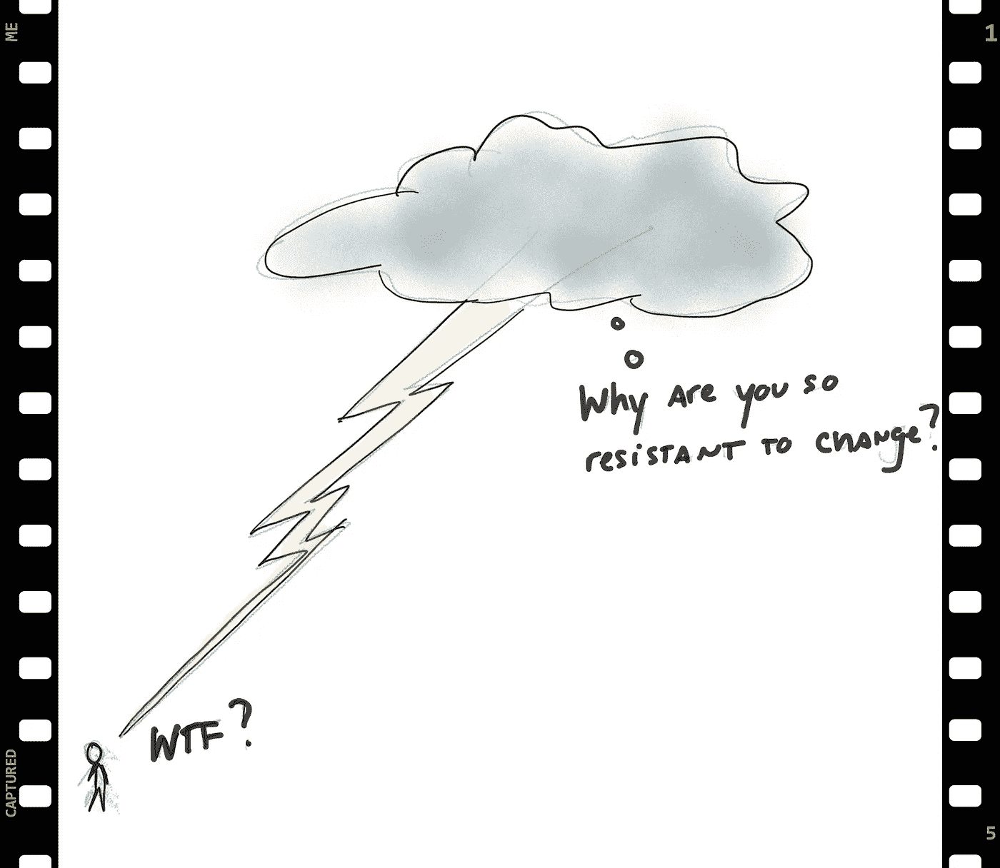

# 关于变革、组织健康和变革机构的 30 个想法

> 原文：<https://medium.com/hackernoon/30-thoughts-on-change-org-health-and-change-agency-3522483fa146>

今天，我发现自己在给一位朋友写一份清单，这位朋友在他们公司遇到了困难的转变。我喜欢列表，所以我当然走得太远了。

这些都不是非常突破性或深刻的，但我发现自己需要一个偶尔提醒。作为一名正在康复的专业煤矿金丝雀，我犯了书中的所有错误。

1.  所有组织都有问题。健康的组织有较少的慢性问题，愈合损伤更快。问题似乎会自己解决…最终。
2.  即使在健康的组织中，持续改进也是一项艰巨的工作。解决长期问题是极其困难的工作。
3.  在不健康的情况下增加技术人员不会自动解决问题。它经常让事情变得更糟。让人们在功能失调的情况下茁壮成长的技能可能不会转化为健康的情况。反之亦然。
4.  健康的组织更有能力提升有前途(但经验不足)的人。组织中一个常见的说法是“我们找不到任何有经验的人”。他们真正想说的是，他们没有培养潜力的带宽。
5.  矛盾的是，一个能够灵活(并且果断)应对威胁的组织能够花更少的时间来“检验未来”和优化未来的威胁。也就是说，健康的公司确实会采取积极的措施来培养长期的弹性，即使这在短期内“没有意义”(例如，控制技术债务，或者将团队轮换到不熟悉的代码领域)。
6.  当问题加剧时，人们很容易责怪那些“旁观”的人。请记住，那些人中有许多人试图举旗。还有一些人尽了最大努力，但由于缺乏信息/反馈，不知不觉地造成了问题。
7.  当我们对提议的解决方案拥有一些所有权时，我们会在事情上投入更多的精力。“高高在上”强加的完美解决方案将不如人们觉得投资的本土解决方案。
8.  当在他们之间交谈时，顾问们会说你的组织的问题不是唯一的。他们也会承认，这种观点并不是找到工作的最佳方式。然后他们会解释为什么不再全职工作。雇佣顾问时要记住这一点。
9.  短期结果不一定是长期生存能力和健康的良好指标。一个问题领域的结果不一定是另一个问题领域成功的良好预测。极其成功的公司可能不具备应对新挑战的能力。
10.  成功的(长期意义上的)公司能够进行高风险的旁注，而不用担心损害他们的核心业务。这些努力大部分都会失败。
11.  当谈到理解我们的成功时，我们低估了运气的影响。当我们面对失败时，我们高估了运气的影响。
12.  总会有权衡的。地方一级的高度自治和灵活性往往会带来全球一级的协调挑战。类似地，一个被优化来处理大型跨职能项目的组织很可能不具备处理小型本地项目的能力。在处理这些权衡时，表现出色的领导团队表现出技能、深思熟虑、灵活性、纪律性和透明度。没有行动，文化宣言是空洞的。
13.  该组织中约有%的人在争取时间，直到方便(且经济上有利)的退出。这种表现方式将因人而异。例如，个人贡献者可能会从快速退出中受益。高管们可能会受益于更长的任期，以保持积极的叙述。
14.  你不是唯一“看到问题”的人。人们很容易把人们定型为 1)“逆潮流而动，安于现状”，或者 2)像你一样…开放并愿意改变(很明显！).事情没有那么黑白分明。有些人在何时何地下注非常有策略。其他人尝试猎枪爆炸方法。当有疑问时，与任期较长的人交谈，以了解大局。
15.  我们都想做最好的工作。当外界因素让事情变得困难时，我们的自然反应是战斗。因此，很容易将我们的个人需求等同于组织的需求(例如，“我们为什么不更具创新性呢？”而不是“我渴望更具创新性和挑战性的工作，我还不想辞去这份工作。”)试着把注意力集中在你的需求上，而不是把一切都变成“整个组织”。
16.  注意那些看起来不会有任何结果的广泛重复的幕后对话(也称“抱怨会话”)。如果这种情况持续几个月以上，您可以相当有把握地认为，一个顽固的系统性问题正在酝酿之中，仅凭“常识”是无法解决问题的。小心行事，保护您的情感投资。
17.  你可以把许多问题归结为关键高管之间的关系。信任和安全问题会渗透到公司的其他部门。诱人的解决方案是撤换这些高管(或者增加缓冲和中间人)。更有趣的是，询问如何使系统对小范围毒性更具弹性，以避免此问题再次发生。
18.  一个组织的命运在很大程度上取决于少数关键的早期决策(如市场定位、融资策略、早期产品决策等)。)这些决定被深深地烙进了背景中，很容易被低估，也很难被识别。
19.  同样，一个组织的命运很大程度上与关键承诺有关:对投资者、高级领导人、董事会等。这些承诺很少被记录在案，也很少与整个组织共享。
20.  组织通常是围绕关键高管/领导者的优势和劣势构建的(例如，一层专门负责“管理”首席执行官的副总裁)。这里显而易见的问题是，当环境发生变化，人们离开时，留给你的是一个不适合的结构。
21.  新的工作方式涉及新的词汇。可能需要几个月/几年的时间(以及大量的重复)来发展共同理解的功能水平。这需要*努力*。诱惑是要么 1)在你开始(努力)之前试着建立，要么 2)只是开始，并希望事情会解决。这两种方式似乎都不太管用。定期检查和调整计划。
22.  情境意识和应对环境变化所需的技能并不总是相关联的。也有可能在某方面非常熟练，但是既没有意识到也没有能力改变。平衡的团队有手艺、感觉能力、反应能力和杠杆/支持。
23.  一线人员有理由怀疑变革举措。他们(通常是正确的)认为，这些计划将 1)无法解释“实地”的现实，2)让他们收拾残局，3)无法解决系统性问题——尤其是那些与领导力和中层管理相关的问题。要让变革持续下去，你需要与合理的怀疑主义作斗争。
24.  领导者在发起变革时，通常会低估“涟漪效应”。一个小小的调整会产生深远的影响。前线经常低估全球变化的复杂性。看似很小的常识性调整，在整个组织范围内实施起来可能非常复杂。
25.  许多变革努力将会失败，尤其是当它们雄心勃勃并解决重要问题的时候。惩罚这些失败会引发恐惧和对变革的抵制。
26.  解决根本原因可能无法解决“问题”，因为症状(以及这些症状之间的关系)可能已经成为比最初原因更有害的问题。
27.  我们注定要找些事情/人来责备。更难的是接受 1)我们自己部分(或全部)应受责备，以及 2)不可能挑出一个因素来责备。
28.  “一切照旧”有着惊人的惯性——足以粉碎任何与“一切照旧”相矛盾的善意努力，或者与“一切照旧”并行(而不是其一部分)的努力。
29.  在外界看来停滞不前的情况，很可能是多个领导人支持的变革举措陷入僵局。
30.  将团队与功能障碍和注意力分散隔离开来(又名“狗屎伞”)可能会使这些团队非常高效。但这并不能消除功能障碍。如果这一层失败了(大坝决口)，或者你被迫增加另一层层级，团队(或新经理)将会被淹没。