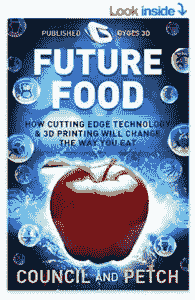

# 3D 打印食物，现代普罗米修斯？

> 原文：<https://medium.com/hackernoon/3d-printing-food-the-modern-prometheus-b4f3615d3dbe>

*摘自《未来食品:尖端技术如何改变你的饮食方式》*

一个肯定会引起消费者恐惧和厌恶的方法是，将机械化食物链中众多阶段中的一个暴露在通常不会受到的审查之下。仅在最近几年，对大公司的不信任和怀疑食品科学非自然或潜在有害的持续运动就产生了大量的新闻纸。麦当劳被迫回复声称他们的鸡块

由一种神秘的淡红色黏液组成，通常被称为【粉红黏糊糊】。该公司拍摄的证明粘液存在的视频片段并没有让消费者感觉好多少，因为它揭示了米色而不是粉红色的粘液被用来制作鸡块。

日益增长的环境意识和有机食品对消费者更好的信念似乎表明，一种新形式的加工食品的引入，可能是加工食品的终极形式，不会成功。欧洲和美国的消费者已经表现出不愿意消费转基因蔬菜或水果[【2】](http://michaelpetch.com/2016/01/07/3d-printing-and-the-future-of-food/#_ftn2)。一些评论家声称，这源于经典著作《弗兰肯斯坦》中玛丽·雪莱干涉事物“自然秩序”的警示故事所创造的强大意象。很明显，虽然“弗兰肯食品”的说法没有受到质疑，但很少有人愿意回忆起雪莱杰作的另一个名字，“现代普罗米修斯”。我们也许应该记住，在古希腊，普罗米修斯是人类的捍卫者，通过他的技术天赋，人类据说繁荣昌盛。事实上，公众舆论与大多数学术研究背道而驰，这些研究表明转基因作物的使用不会带来任何危害。然而，在某些情况下，感知比现实更重要。

从这个角度来看，一旦最初的新鲜感消退，3D 打印似乎将面临一场艰难的斗争，以获得主流认可。此外，市场研究公司 Gartner 进行的研究表明，3D 打印正准备跌入“幻灭的低谷”，这是热衷于写“下一件大事”的记者和评论员创造出过高期望后不可避免的一步。然而，正如律师兼技术游说者迈克尔温伯格(Michael Weinberg)指出的那样，“炒作周期虽然有助于跟踪媒体报道，但不一定是跟踪技术出现的最佳方式”。

另一个批评这种观点的声音来自杰夫·利普顿，他可能是勒德分子，目前正在康奈尔大学完成博士论文。本论文的目标是解决 3D 打印中的五个关键领域。利普顿是康奈尔创新机器实验室的长期成员，在 3DP 技术应用于食品的早期，该实验室进行了许多开创性的研究。对食物在人类生存中的核心作用的认识[【5】](http://michaelpetch.com/2016/01/07/3d-printing-and-the-future-of-food/#_ftn5)，不仅体现在营养价值上，还体现在围绕其准备和消费的仪式上，这标志着该项目脱离了对工程学的严格关注和对多学科问题的纯机械解决方案。

自成立以来，该研究小组在 3D 打印和食品技术的新兴领域做出了巨大的实践和学术贡献。我们的目标是以三种特定的方式使用这项技术。该小组正在研究如何将这项技术融入厨房，它在提供特定营养方面的用途，以及如何和为什么它可以用来创建复杂的模式。后两个想法都是定制的例子，也是 3D 打印可以在不增加成本的情况下带来巨大好处的领域。为了取得进展，利普顿看到了需要克服的五个问题。问题领域是温度稳定性、处理传统食品、通过数据驱动食品成分的能力、一起生产多种食品以及控制质地。

在与利普顿交谈时，他解释道，“我们专注于几个不同的基本思想。一种想法是，3D 打印食物需要能够融入厨房。还有一个就是 3D 打印整体上有两个好处，就是定制化和几何复杂度。具体到食品，我们正在考虑定制营养和 3D 打印复杂图案。”

*要继续阅读，请点击此链接并购买“* [*【未来食物:尖端技术和 3D 打印将如何改变你的饮食方式*](http://www.amazon.com/Future-Food-Technology-Printing-Presents-ebook/dp/B00Y9BPZVU/) *”*

[【1】](http://michaelpetch.com/2016/01/07/3d-printing-and-the-future-of-food/#_ftnref1)更多关于 pink goop 的故事和一些图片在这里:[http://www . the guardian . com/sustainable-business/food-blog/McDonalds-mcnuggets-pink-goop-transparency-open-thread](http://www.theguardian.com/sustainable-business/food-blog/mcdonalds-mcnuggets-pink-goop-transparency-open-thread)

[【2】](http://michaelpetch.com/2016/01/07/3d-printing-and-the-future-of-food/#_ftnref2)n . DESA int，&m . Varbanova(2013)。投票决定欧洲公众对转基因生物看法的用途和价值:限制和前进方向。*转基因作物和食品:农业和食物链中的生物技术*， *4* (3)，183–194。

[【3】](http://michaelpetch.com/2016/01/07/3d-printing-and-the-future-of-food/#_ftnref3)更多关于转基因生物的争论可以在这里找到[http://academics review . org/reviewed-content/genetic-roulette/section-1/](http://academicsreview.org/reviewed-content/genetic-roulette/section-1/)

[【4】](http://michaelpetch.com/2016/01/07/3d-printing-and-the-future-of-food/#_ftnref4)Gartner hype-cycle 的解释及其对新兴技术的应用:[http://www . Gartner . com/technology/research/methodologies/hype-cycle . JSP](http://www.gartner.com/technology/research/methodologies/hype-cycle.jsp)

[【5】](http://michaelpetch.com/2016/01/07/3d-printing-and-the-future-of-food/#_ftnref5)科恩，D. L .，利普顿，J. I .，卡特勒，m .，库尔特，d .，韦斯科，a .，&利普森，H. (2009)。亲水胶体印刷:定制食品生产的新平台。*自由实体造型*。

> [黑客中午](http://bit.ly/Hackernoon)是黑客如何开始他们的下午。我们是 [@AMI](http://bit.ly/atAMIatAMI) 家庭的一员。我们现在[接受投稿](http://bit.ly/hackernoonsubmission)，并乐意[讨论广告&赞助](mailto:partners@amipublications.com)机会。
> 
> 如果你喜欢这个故事，我们推荐你阅读我们的[最新科技故事](http://bit.ly/hackernoonlatestt)和[趋势科技故事](https://hackernoon.com/trending)。直到下一次，不要把世界的现实想当然！

