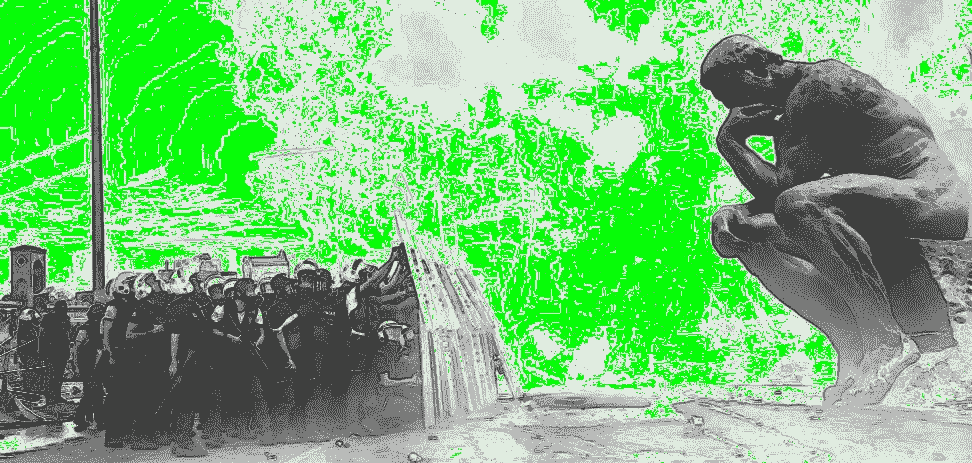

# 区块链如何改变人权未来的 4 个令人难以置信的例子

> 原文：<https://medium.com/hackernoon/4-incredible-examples-of-how-blockchain-is-changing-the-future-of-human-rights-f68ac4a9c068>

> 作者 [Alyssa Satara](https://www.quora.com/profile/Alyssa-Satara) ，伦敦城市大学国际公法&人权法学硕士(2016)。[原载](https://www.quora.com/What-are-the-use-cases-of-Blockchain-outside-of-bitcoin/answer/Alyssa-Satara)于 [Quora](http://quora.com?ref=hackernoon) 。

区块链最广为人知的是比特币和以太币(以太坊的货币)等加密货币背后的技术，但区块链不仅仅是一种金融工具。

可以说这是一个加密的协议数据库。这意味着一旦“交易”达成，任何一方都不能回头重写条款。智能合同是一个完美的例子，这是一种总部位于区块链的合同，只要双方都完成了自己的交易，就可以通过完成协议条款来追究双方的责任。

区块链作为一个记账平台或账本，是廉洁的，强制透明的，并绕过审查。通过解决金融、政治和制度腐败问题，这有可能带来巨大的社会变革——并极大地保护每个人的人权。

我们已经看到一些惊人的工作正在展开。

以下是方法。

## **1。应对难民危机**

今年，UNWFP 向 10，000 多名叙利亚难民发送了基于加密货币的凭证。

据 Coindesk 报道，在以太坊联合创始人 Gavin Wood 和区块链大数据公司 Datarella 的领导下，平价技术公司将这一平台付诸行动，并帮助数千名难民使用加密货币购买食物。

2014 年，叙利亚危机已经“成为我们这个时代最大的人道主义紧急事件”，联合国难民事务高级专员安东尼奥·古特雷斯说。如今，全球难民危机仍在加剧，投入巨资的机构和国家不得不寻找新的解决方案来解决原本无法控制的局面。

以太坊技术绕过官僚主义和国际不确定性的机会不仅让难民直接获得捐赠，也是让他们参与旨在解决国际难民危机的对话的巨大第一步。

## **2。为世界上最贫困的人创造金融渠道**

用于向难民提供金融凭证的同一个区块链平台也在努力弥合世界各地的贫困差距。正如我们已经看到的，区块链可以为没有银行账户的人充当类似银行的机构。

只要你有智能手机，你就有办法方便地获得金钱。

此外，区块链是一个分散的系统，这意味着您不会像在典型的金融机构那样需要支付转账费用。这扰乱了国际社会经济格局，因为汇款费用高昂，因此会阻碍企业进入世界某些地区，切断发展中国家的机会。这也给向海外家人汇款的人造成了财务压力。

[去年，向撒哈拉以南非洲汇款的总成本超过 300 亿美元](https://qz.com/673302/it-still-costs-more-to-send-money-to-africa-than-anywhere-else/)，根据经济分析局的数据，美国每年的国际金融汇款高达 500 亿美元。

[BitPesa](https://www.bitpesa.co/) ，一个在非洲和世界其他地方之间发送和收集加密支付的平台，是区块链技术所能提供的积极影响和经济自由的一个极好的例子。

考虑到[非洲是目前汇款成本最高的大陆，这是非常有希望的。](https://remittanceprices.worldbank.org/sites/default/files/rpw_report_march_2016.pdf)

这项技术解决了全球贫困的两大变量。首先，对于需要向家人汇款的移民、移民和难民来说，汇款变得更加便宜；其次，与难以到达的国家做生意变得更加方便。

仅此一项就有可能减少极端贫困。

## **3。防止选民欺诈**

自美国 2016 年大选以来，网络安全和选民欺诈一直备受关注。不幸的是，这不是第一次选民合法性受到质疑。

选民欺诈是对全球富有成效和负责任的民主形成的一种严重影响。

区块链技术有能力提供一个不可破解的电子计票系统。该系统可以在选民登记期间确保选举的安全，并且可以说明选民的身份并确保选票在以后不会被篡改。

就像区块链充当加密货币的公共账本一样，它也可以为统计的选票创建一个永久的公共账本——承诺在世界各地实现公平民主选举的未来。

已经有一家名为[跟随我的投票](https://followmyvote.com/can-stop-voter-fraud/)的创业公司在做这个项目。

## **4。提高政府效率**

区块链有能力加快政府能力，并影响公共福利、医疗保健和教育等功能。

例如，政府程序可能很慢，难以理解，并且非常容易腐败。区块链作为一种解决方案，可以帮助政府在各种意义上更加高效和安全。

世界各地医院的陈旧技术给医疗患者及其记录带来了不必要的问题。MedRec 是区块链寻求改善医疗保健的一个完美例子。根据麻省理工学院媒体实验室的说法，MedRec 是，“[一种新颖的、分散的电子病历记录管理系统，它使用区块链技术来管理身份验证、机密性、责任和数据共享。”](https://www.media.mit.edu/research/groups/1454/medrec)

区块链作为一项技术和一个产业，在很大程度上仍然没有定义。我们正处于探索阶段，离任何既定或成熟的解决方案还很远。然而，这是一个有希望的(相关的)解决方案，旨在解决一些人权最脆弱的领域:腐败、金融不平等和获取信息。

通过为透明度树立一个国际先例——希望是一个标准——区块链理工大学正在缩小经济差距，解决人权保护问题。

> By [Alyssa Satara](https://www.quora.com/profile/Alyssa-Satara) ，伦敦城市大学国际公法&人权法学硕士(2016)。[原载](https://www.quora.com/What-are-the-use-cases-of-Blockchain-outside-of-bitcoin/answer/Alyssa-Satara)于 [Quora](http://quora.com?ref=hackernoon) 上。
> 
> 更多来自 Quora[的趋势科技答案，请访问](https://medium.com/u/3853f85f7d5e?source=post_page-----f68ac4a9c068--------------------------------)[HackerNoon.com/Quora](https://hackernoon.com/quora/home)。