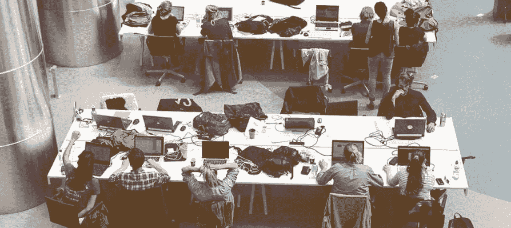

# 每次都能按时成功完成团队项目的 4 种方法

> 原文：<https://medium.com/hackernoon/4-ways-to-finish-team-projects-successfully-and-on-time-every-time-88c7b3622bda>

[Photo: travelfoto via [Shutterstock](http://www.shutterstock.com/pic.mhtml?id=282783836&src=lb-41467169)]

提示:有一种东西叫做过度头脑风暴。

Back 2004 年，[普华永道审查了](http://www.hr.com/SITEFORUM?&t=/Default/gateway&i=1116423256281&application=story&active=no&ParentID=1119278050447&StoryID=1119654909203&xref=https%3A//www.google.com/)来自 30 个国家 200 家公司的 10，640 个项目，涉及多个行业，发现只有 2.5%的公司完成了 100%的项目。对于任何有工作的人来说，这可能不会太令人惊讶——项目总是被推迟和偏离轨道。但是成本会越积越多。根据一项衡量标准，在项目和计划上每投入 10 亿美元，组织就会损失 1 . 09 亿美元。

无论我们的角色是什么，我们总是被赋予创造和执行新的计划和事业的任务——所以为什么不投入更多的精力来确保它们成功呢？学习如何更有效地领导和交付项目不仅对我们的公司有好处，它往往可以成就或毁掉我们的职业生涯。记住这一点，这四条规则会有所帮助。

## 1.做你的功课，但不要过度头脑风暴

项目管理协会[报告](http://www.pmi.org/learning/pulse.aspx)只有 64%的项目达到了目标。最好的项目从“思考”开始，只有当有一个可行的计划时才进行“行动”。想法和实现之间的鸿沟是许多项目失败的第一点。事实上，如果你和你的项目团队能够列出共同的目标，并为实现这些目标制定一个经过仔细考虑的计划，那么你已经成功了 80%。

> *因为文化可以归结为团队共享的信念、期望和目的感，它可以根据项目而改变。*

做好这一点需要大量的研究和提出正确的问题。但是有过度头脑风暴这种事。把数百个问题贴在墙上，或者把每一个可能的、不成熟的想法放进谷歌文档，可能是一个糟糕的举动。在项目开始时产生太多的想法只会使人困惑。诀窍是保持简单、务实和有针对性。

不要只是要求每个人先把每个想法都摆在桌面上，试着问以下三个问题(按这个顺序):

*   我们为什么要这样做？
*   我们目前在这方面的能力如何？
*   我们需要哪些里程碑来跟踪我们的进展？

换句话说:定义、评估、计划。

## 2.考虑团队文化

你已经知道，要有一个良好的开端，你需要团队中的每个人都了解自己的角色，并能很好地合作。但是，当我们习惯于谈论整个组织的工作文化时，它往往在团队层面上受到冷落。

团队动力[都与文化](http://www.fastcompany.com/3031092/how-to-create-a-culture-of-innovation-in-the-workplace)有关。当你做到了这一点，就更容易预测人际关系问题，有效地指导团队成员，或者快速替换他们。因为文化可以归结为团队共享的信念、期望和目的感，它可以根据项目而改变。因此，从战略上考虑你的项目团队的文化，就像你考虑它的目标一样。

文化是完成任何一种团队合作所需的正式的、已建立的规则的补充。当你面对没有规则的问题时，对项目使命的理解和承诺可以帮助指导你的团队。

## 3.从小处着手

任何项目的开始都有如此多的未知，通常不可能制定出通往成功的精确路线。因此，重要的是不要过早地陷入太多的细节。一旦你定义了你的项目的基本范围，这通常足以开始概述一些最初的里程碑。把后面的留到以后。随着每一小步的迈出，前进的道路变得越来越清晰。

重要的是要知道你什么时候已经尽可能地计划好了，什么时候该去工作了。当我们在最初的几个星期后有了具体的东西来展示自己时，我们就有了未来几个月的基础。项目团队可以像任何人一样拖延时间。正如斯蒂芬·金[所说](http://www.goodreads.com/quotes/156272-amateurs-sit-and-wait-for-inspiration-the-rest-of-us)，“业余爱好者坐着等待灵感，我们其余的人只是起身去工作。”

## 4.创建、修改、重用

> *在一个项目开始的时候产生太多的想法只会让你迷惑。*

我在计算机科学学校学到的最大一课是可重用性的概念。在软件工程中，指在软件产品开发过程中以某种形式使用现有资产。不仅仅是代码，资产是生命周期的所有产品和副产品——包括从设计到实现技术的一切。因此，重用需要在资产从一个阶段累积到下一个阶段时单独维护这些资产的版本。

这个概念可以应用于任何项目。例如，作为一名作者，我首先写一些小的博客文章，然后博客变成长篇文章，文章成为一本新书的基础。重用给了我们速度和效率，而不是每次我们想要创建新资产时都要重新发明轮子。

这不仅可以帮助团队在项目过程中建立他们已经完成的工作时保持高效，还可以帮助每个人保持积极性。当你能看到你的工作逐步建立起来——而不仅仅是看到你在装配线上的位置——你更有可能看到整个过程，成功地和在期限内完成。

[图片:travelfoto via[Shutterstock](http://www.shutterstock.com/pic.mhtml?id=282783836&src=lb-41467169)

*连续创业者* [*费萨尔·霍克*](http://www.fastcompany.com/user/faisal-hoque) *是* [*沙多卡*](http://www.shadoka.com/) *的创始人，使创业、成长和社会影响成为可能。他是《万物互联:如何在创造、创新和可持续发展的时代进行变革和领导》等书籍的作者。免费使用万物互联* [*领导力 app*](http://app.everythingconnectsthebook.com/login.php)*。*

版权所有(c) 2016，作者 Faisal Hoque。保留所有权利。

**原文章**[***@ fast company***](http://www.fastcompany.com/3059125/your-most-productive-self/how-to-finish-team-projects-successfully-and-on-time-every-time)**。**

> [黑客中午](http://bit.ly/Hackernoon)是黑客如何开始他们的下午。我们是 [@AMI](http://bit.ly/atAMIatAMI) 家庭的一员。我们现在[正在接受投稿](http://bit.ly/hackernoonsubmission)并乐意[讨论广告&赞助](mailto:partners@amipublications.com)机会。
> 
> 如果你喜欢这个故事，我们推荐你阅读我们的[最新科技故事](http://bit.ly/hackernoonlatestt)和[趋势科技故事](https://hackernoon.com/trending)。直到下一次，不要把世界的现实想当然！

