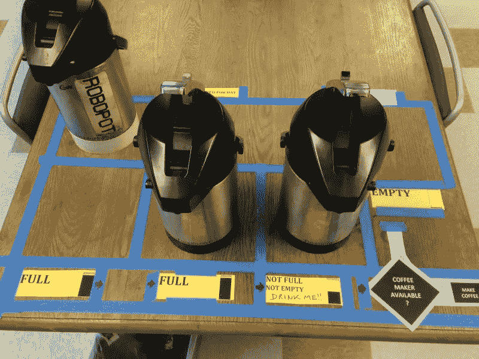

# 我学到的关于产品管理的 50 件事

> 原文：<https://medium.com/hackernoon/50-things-ive-learned-about-product-management-300cc67ca6ee>

## 星期天，睡不着，下午 2 点后喝了咖啡版…

It’s often the little things that count…

1.  你错的次数比你对的次数多。诀窍是尝试几次来解决这个问题。
2.  你的公司可以(几乎)做错任何事情，但在短期内仍能增长。
3.  你可以(几乎)做对每一件事，而且跑不过房间里的大象。
4.  没有强大的产品愿景，你最终会将产品策略外包给公司的其他部门。
5.  不要雇佣产品经理做(平庸的)项目经理。如果这是你所需要的，有很棒的项目经理。
6.  让人们不再烦你的最好方法是持续传递价值(有数据支持)。真正的结果(和一个骄傲的团队)早餐什么都吃。
7.  手工艺和商业并不矛盾。不计后果的增长和手艺是不相容的。
8.  把垃圾传给其他部门(比如“支持会处理的”)总会反过来咬你一口。
9.  你团队里有人有更好的主意。你会知道吗？
10.  闪亮的物体有时会起作用。但闪亮的东西总会褪色。
11.  要学习如何成为一名优秀的项目经理，花时间在一个拥有优秀项目经理的团队中工作。
12.  展示——用数据、故事和例子——不要说。
13.  驱逐所有不确定性往往会驱逐原创性(和创新)。
14.  你倾向于去你想去的地方。如果你过于关注竞争对手，你会向他们靠近，而不是向他们前面的某个点靠近。
15.  如果你在争论 UX 对底线的影响，你可能应该考虑为一家更有远见的公司工作。
16.  每个人都讨厌售票系统。还有维基。这部分是因为我们用额外的流程/指标/垃圾让我们的票务系统超负荷，而且没有人真正为维基做出贡献。
17.  对于用户故事，重要的是对话。进行对话！
18.  在某种程度上，你会有好处的怀疑。好好珍惜。
19.  当英雄主义成为常态，那么只有英雄主义才会产生合理的结果。
20.  在你发送那封关于煤矿中的金丝雀的邮件之前，记一周的日记并进行反思。
21.  如果不合适，就在有芥蒂之前离开。
22.  产品经理实际管理的是一个*产品*吗？如果没有，需要产品经理吗？
23.  如果团队没有邀请你去回顾，你必须找出原因并解决这个问题。
24.  除非有人尝试在他们的数据、环境和日常工作中使用该功能，否则一切都是未知数。你必须留出时间根据反馈进行迭代。
25.  销售人员会告诉您，他们需要一种方法来跟踪功能请求。他们没有。他们需要一种能够达成交易、白皮书、客户推荐和明确可用市场的产品。
26.  试图将一架 747 降落在一艘快艇上从来都不是一个好主意。小批量工作，在最后负责任的时刻做计划。
27.  人们说产品经理需要学会说“不”。试试“不，因为…”努力去理解一些事情。
28.  团队总是能发现成功的地方。他们可能不会公开叫你出去，但他们会变得无所事事。
29.  当你忙着处理多项任务时，很容易让人觉得你很冷漠。
30.  不要以为私下抱怨的人，也会当众去垫。
31.  在你成为 10 倍工程师之前，问问你自己，你是不是一个 10 倍产品经理，你是否专注于 10%的事情，这些事情将真正推动结果。
32.  花时间在支持队列中，抓住客户成功电话，并尝试完成一些交易。
33.  大多数情况下，你最大的竞争就是现状。内部也是如此。
34.  已经放弃你的用户没有回复你的 NPS 调查。
35.  如果你可以雇佣/解雇，对投资者负责，并控制预算过程，你就是该产品的 CEO。如果不是，你很可能是产品经理。
36.  讨论你在寻求让其他事情变得更好的过程中忽略了什么，或者让什么变得更糟。建立对权衡的共识。
37.  知道什么时候该闪开。如果你很优秀，你永远都有工作要做。不要把自己插入到每一次谈话和决定中。
38.  当心复杂的优先化方案，它们(主要)是为了让每个人在内部更舒服。在大多数情况下，餐巾背面的试探法已经足够好了。
39.  没有什么比一个试图自我推销的首相更让人痛苦的了。和你的团队一起庆祝(失败和学习)。
40.  尽情享受你的团队表现出色的时刻。这很少发生。不是因为谁做错了什么，而是因为这太难了！
41.  如果你发现自己经常要求一些小的评估——那些可能需要一天、两天或三天的事情——确保你真的朝着最重要的结果努力。如果那是决定性的工厂，那么故事的价值一定非常微弱。
42.  它不是你在特性发布说明中添加了多少要点(或者完成的故事点或者团队的速度)。你可以讲述客户的成功故事，以及你可以为企业创造的短期和长期成果。
43.  你可以爱上大多数产品“问题”。不要排除不性感的领域。你的快乐很大程度上取决于你的直属团队，以及组织是否愿意让你和团队解决问题。这可能发生在任何地方。
44.  当人们不停地问你路线图时，这通常是一个信号，表明他们对现在发生的事情不满意。
45.  每天划出时间进行战略性思考。每天划出时间与顾客互动。
46.  如果你的团队进展缓慢，让他们安全地公开讨论他们正在挖掘和/或处理的债务。
47.  有空！这是显而易见的，但是很多项目经理都把他们的日程表排得满满的。
48.  不要过早的强行收敛。通常最好的前进道路是在一段混乱时期之后。
49.  如果有疑问，就不要去想了，去收集数据。构建一些东西并进行测试。同样的事情也发生在充满无尽猜想的会议上。对行动有偏见！
50.  避免突然停止努力，让团队大吃一惊。这似乎是武断的，而且(希望)他们被赋予了结果。

> [黑客中午](http://bit.ly/Hackernoon)是黑客如何开始他们的下午。我们是 [@AMI](http://bit.ly/atAMIatAMI) 家庭的一员。我们现在[接受投稿](http://bit.ly/hackernoonsubmission)，并乐意[讨论广告&赞助](mailto:partners@amipublications.com)机会。
> 
> 如果你喜欢这个故事，我们推荐你阅读我们的[最新科技故事](http://bit.ly/hackernoonlatestt)和[趋势科技故事](https://hackernoon.com/trending)。直到下一次，不要把世界的现实想当然！

