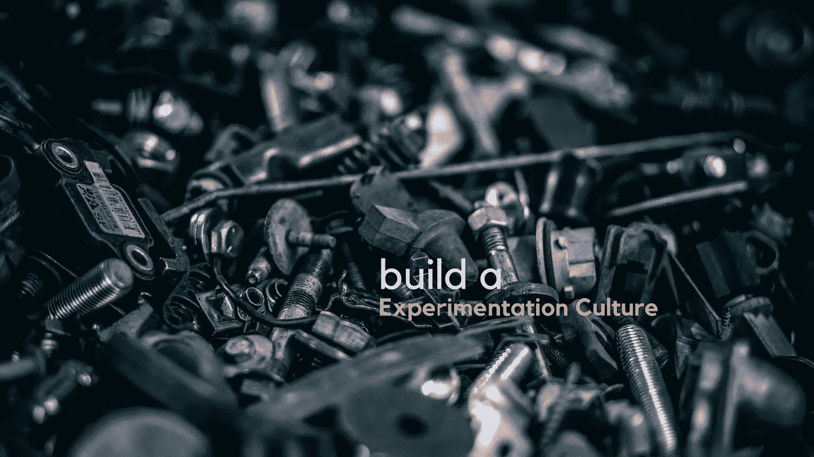

# 在你的公司建立实验文化的 6 个步骤

> 原文：<https://medium.com/hackernoon/6-steps-to-build-a-culture-of-experimentation-in-your-company-7f09d5257edf>

在一个不断变化的[商业](https://hackernoon.com/tagged/business)环境中，通过建立实验文化来改变局面的能力是生存的必备条件。如今，病毒式传播是许多公司的成功载体，它并不依赖于运气——而是一种经过设计的增长黑客技术。

你可以一直观察你的竞争对手做得对的地方，并实施同样的事情。但是你怎么知道它会成功呢？

成功来自于数百次甚至数千次不成功的实验。归结起来就是运行测试，直到你找到成功的秘诀。

在利用竞争对手的成功时，有必要关注你所拥有的资源。一切都从建立实验文化开始，这里有六个步骤告诉你如何将它引入你的组织。

# **欢迎失败**

在一个高度创新和竞争激烈的数字领域，坦然面对失败是任何创业公司的生存本能。

拥抱失败应该成为公司文化的一部分——否则，就不可能鼓励实验。

> Cosmopolitan 早在 1999 年就推出了酸奶品牌，2013 年推出的 Facebook Home 也没有成功。尽管有这些失败,《Cosmopolitan》仍然是一本受欢迎的杂志，脸书是当今最成功的社交媒体平台之一。

一切都始于你引导公司的方向——鼓励员工提出打破常规的想法，奖励提出最具创新性建议的人会有很大帮助。

如果幸运的话，最初的活动可能会成功启动。但是在这个过程中，你一定会经历失败。

每次竞选只有 50%的成功机会。虽然失败令人失望，但实验是，而且永远是一项重要的投资。

# **追求高回报，但要循序渐进**

在一个高度不确定的市场中，孤注一掷的商业策略是有风险的。考虑到市场的波动性，你应该准备好启动增量变化，但你应该始终以高回报为目标。

第一次尝试就中大奖的情况很少发生，你希望持续增长，而不仅仅依靠纯粹的运气。

你需要对你的商业模式进行细微的调整，同时保持对当前商业活动的投入，这样就不太可能引起组织内部的动荡。[逐步改进](http://www.innovationmanagement.se/2015/11/18/business-model-commitment-and-experimentation/)累积起来帮助你实现目标。

最终结果可能是一个与你最初创建的组织不同的组织，但重要的是你的创业公司生存下来了。

# **分析**

你现在在做什么活动？你的实验成功了吗？你能做些什么来使它们更加有效呢？

这是你在这个阶段需要回答的一些问题。您需要记录当前活动的结果，评估其影响，并解释结果。所有这些信息可以帮助你计划未来的实验和测试。

# **构思**

当你想要最高的回报，但你的时间有限时，用你现有的资源进行实验。在遇到有用的东西之前，你需要浏览很多想法。

除非你有大量的想法，否则不可能进行 A/B 测试。是的，大多数想法会有中性或负面的影响，但当你碰上黄金时，每一次失败都是值得的。

在构思中，你需要让所有的测试都有价值——即使是那些失败的测试。

如果你的销售额在过去的一个月里下降了，你需要测试一个假设。如果你认为问题出在你的销售邮件上，你需要测试这个假设，看看它是否是转化率较低的原因。

为了确定销售邮件是否是罪魁祸首，你需要测试你的假设。分析你过去六个月的数据，并创建一封电子邮件，将新的转化率与过去几个月的数据进行比较。

如果你的假设是正确的，你就会知道问题可能是什么。如果不是，可以测试另一个假设，再做一个测试。

# **分清主次**

因为你有大量的想法，但这并不意味着你必须使用所有的想法——这将是非常昂贵和耗时的。你需要优先考虑成功几率更高的想法。

在此过程中，请考虑以下事项:

成功的概率是高、中还是低？

需要多长时间？

它需要营销、设计或工程团队的参与吗？

这将是一项合作努力吗？

是昙花一现还是会有可持续的效果？

# **测试**

现在，到了最后一步测试。记住，你在寻找可扩展的实验。

你需要从一个假设开始，然后设定一个目标。为你的测试设定一个时间框架也是必要的，理想的是 30 到 90 天。

使用[实验文档](https://www.dropbox.com/s/cs589xxrx9y51by/Growth%20Marketing%20Experiments%20Template%20.xlsx?dl=0)也可以更容易地记录这个过程，并比较数据。

# **建立实验文化**

这一过程并不止于第六步。如果你正在建立一种实验文化，你需要重复这个过程。发现实验成功后，你又回到了起点。

对你和你的团队来说，建立一种实验文化需要时间，但是一旦你发现了一个金块，这种努力将会是值得的。