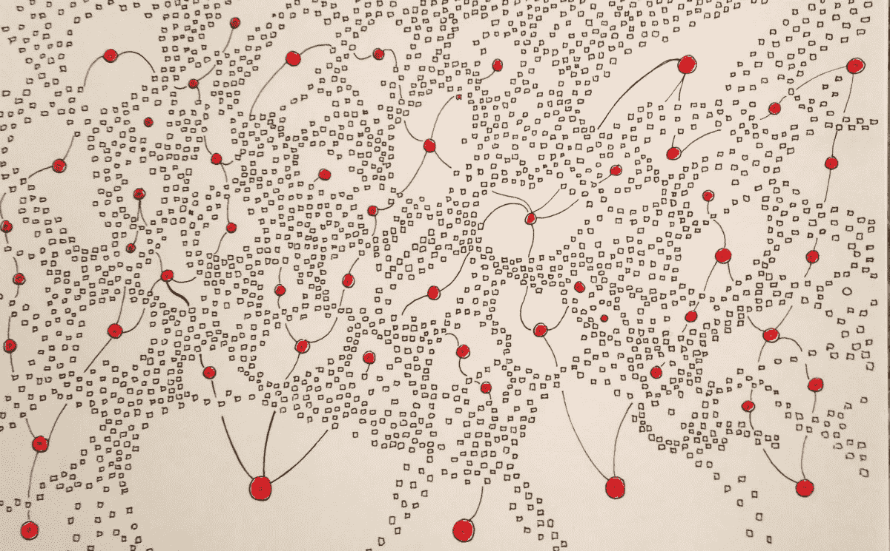

# 呈现偏见、约束，让 60 件事成为可能

> 原文：<https://medium.com/hackernoon/60-things-we-could-do-886bd1ed9846>

注意:如果你时间不够，可以向下滚动，直接进入好的列表。

软件产品开发是一个优化问题。向优化问题添加目标、约束和不确定性会增加复杂性。如果你已经这样做了一段时间，你就会知道短期收益和长期结果之间不断的推拉关系。

> 当前偏差是指人们在考虑两个未来时刻之间的权衡时，倾向于给予更接近当前时刻的收益更大的权重(奥多诺格和拉宾，1999)。

简而言之，人们倾向于今天就想得到回报，但把失去的痛苦推到未来。([来源](http://blog.alphaarchitect.com/2014/05/22/good-bad-want-now/#gs.nBwtQtc))

一个很好的例子是构建一个特性来关闭一个新客户。钱就在你面前。你能感觉到。如果你建造 X，你会赚到$Y。很容易忽略实际成本(包括机会成本)。如果你专注于更有风险、但更有价值的事情会怎样？我们往往会忽略这一选择，这是有道理的，因为对未来想得太远(或太深)会产生麻痹效果。如果花那么长时间，狮子会吃了你的。

其他例子涉及[组织弹性](https://hackernoon.com/40-ways-to-invest-in-more-resilient-teams-c2ac7d008591)。追求短期收益(快速增加员工数量、增加层级、提高效率的专业化分工)可能很有诱惑力，但不考虑长期影响。简而言之，我们增加了约束和新的目标。这使得浏览问题空间更加困难。熵随之而来。

我经常遇到那些非常努力的组织，但是他们似乎不能产生任何前进的动力。他们在没有任何影响的情况下将越来越多的过程分层。他们每个季度都在追踪一种新症状。但是当你真正采访各种各样的演员时，你会发现他们的世界是多么疯狂地受限制。我们不是在谈论无法找到全局最优解。那太雄心勃勃了。相反，即使是平庸的前进方式也是不可能的，或者需要令人麻木的三维象棋。

“安装”Agile 而不删除约束将会失败。

这让我想起了前几天我和乔希·塞登的一次对话。乔希正确地指出，我的帖子[非前沿人士误解的 42 件事](https://hackernoon.com/40-things-non-front-liners-misunderstand-fcb2f55088f9)基本上是向皈依者说教，非前沿人士不会明白。如果一个开发人员或 UX 把这个发给一个主管，他们会得到一个“嗯”。他的挑战——我需要一段时间来执行——是找出如何引出“嗯，我想我明白你的意思了，我现在明白了，我们应该就此采取行动！”

但是怎么做呢？

当你总结 42 件事帖子中的许多要点时，你会发现短期(呃)和长期(呃)思维以及个人和团队内在/外在奖励系统之间的矛盾。例如，前衬:

*   一定要接触产品、代码和设计
*   不要触及销售配额、收入预测以及与投资者、律师和分析师的会议
*   不要让他们的头撞上技术债务缠身的代码，感受多任务处理的打击，并对“只是发布”蹩脚的功能感到畏缩
*   不要每周花 60 个小时开会，在会上人们主要是 1)抱怨和/或 2)推销他们喜欢的项目
*   不得不与一个小型开发团队坐在一起，并且——根据数据——不得不每 15 分钟解决一个成本/收益设计决策，这是一项极具挑战性的高强度工作
*   不要把几百(或几千)人的命运和生计掌握在手中。而且必须“擅长 PowerPoint”和策略
*   …并且不需要每天接听 30 个支持电话，发送 100 封对外销售电子邮件，与供应商正面交锋，接听愤怒的一线客户的电话

因此，有不同版本的“好工作”发生，以及不同的心理模型、原因/结果和成本/回报。由于我们的思维方式和我们所知道的，我们以不同的方式回应当前的偏见。

你如何建立共同的理解？

如果你幸运的话，首席技术官或首席采购官能够向其他高层领导解释和描述其中的逻辑。如果你更幸运的话，他们能够与 CRO、首席财务官和首席执行官正面交锋，将微积分转化为可操作的风险管理和持续改进框架。他们会解释为什么追求效率会导致僵化，你需要关心弹性。他们将解释为什么缺乏关注会导致约束数量的指数增长。最后，他们会解释为什么有一个高大的组织可能不会有利于产品。但前提是你(和他们)运气好。

那么，想想看，高层领导*经常*不明白某些决定将如何影响未来。他们已经离行动太远了，没有人解释微积分。人们到处谈论 UX、敏捷、DevOps、一天中留下空闲时间、降低利用率、结果超过产出……没有经验(或者很久以前的经验)的人不会知道 WTF 是怎么回事。

> 我们把人类送上了月球。并将它们送往火星。而你他妈的就不能装个手机 app，迁移到新的 ERP 系统？那没有意义！有人在乎吗？

你今天所经历的约束是许多许多决定的顶点。在某一点上，你可能有一个选择。这是核心挑战。我们需要解释为什么这些选择对你的产品开发组织的长期成功至关重要。但是不要把它们看得太神圣，以至于你从来不做任何决定——或者对任何变化做出反应。

这是我们的责任。

## 如果你能说。为什么不能说？

本着让我的中型文章太长的精神，下面我列出了 60 个例子，如果你打对了牌，你可以做和说的事情。但是，鉴于我是出了名的会指出问题……我希望你问问自己，是什么阻止了你说出这些话。什么是“是啊但是”。或者如果你能说出来，是什么决定让这成为可能？然后思考如何消除这种限制。

1.  “也许我们可以从另一个团队借一个开发人员？对这个问题有一双全新的眼睛会有所帮助。”
2.  “能够在类似生产的环境中测试这一点非常令人放心。但如果出现问题，没有伤害客户的风险。”
3.  "让我们在开球时把两个队放在一起."
4.  “我们可能需要屏蔽掉 B 队的一些时间。但是我们不确定。任何一种情况都有可能。很高兴我们能在短时间内灵活安排时间。”
5.  “我们将受益于快速接触客户。我们有一份下周想要联系的客户名单。”
6.  “是的。我们可以在+/-10 天内完成这个日期。”
7.  “如果早期数据令人鼓舞，该团队将在开始另一项工作之前继续迭代。”
8.  “目前，我们的规模预测非常粗略。幸运的是，如果需要，我们可以添加计算/网络资源。”
9.  “团队可以一起讨论这个问题。我知道这个话题有点敏感，但也有好处。”
10.  “我认为自己很幸运能和不同的人一起工作。观点和工作风格的多样性令人振奋。”
11.  "这个问题很快就被局限在一小群顾客身上。"
12.  “我们不确定什么时候需要和 UX 设计师谈谈。但我们最终会的。他很快就有空了，对吧？”
13.  “由于这将影响营销，如果该团队中至少有几个人能参加单口相声，那就太好了。谁来了？”
14.  “这是 A/B 实验的一个很好的候选。让我们开始吧。”
15.  “作为一名新团队成员，Doug 有许多优势，但在最初的一个月左右，他将真正受益于与高级 dev Maria 的密切合作。玛丽亚有可用周期，对不对？”
16.  “任何人都可以接受前端故事。”
17.  “对于这个项目来说，理想的情况是我们能够按照自己的时间表进行部署，而不会影响运营。爽吗？”
18.  “我们已经决定推出这一功能。它很少被使用，并且给代码的这一部分增加了很多复杂性。”
19.  “如果你愿意，我们可以把这项服务的统治权移交给另一个团队。入职需要一周左右的时间，但不会太久。”
20.  “我在公司会议上谈到了这个问题。我知道这很难接受，但我相信我们可以从那次失败中吸取教训。”
21.  “我们有些懈怠。我们很乐意为您排除高优先级项目。”
22.  “多好的机会啊！代码库的这一部分被适当地重构了。这是我们应该采取行动的事情。这对公司来说价值很高。”
23.  “我马上去她的办公室。首席执行官的办公时间是开放的，这很好。”
24.  “啊。和平而宁静。我真的需要限制一些干扰来完成这件事。”
25.  “会议室随时可用。这是我们的团队房间！这意味着我们可以把自己的东西挂在墙上。”
26.  “你不需要在这里挑一条赛道。如果你想尝试管理，然后回去做 IC，这没什么不好。”
27.  “我能够大致提出倡议并付诸实施。空中有一吨，所以我们需要开始挖掘。”
28.  “吉拉没有为我们工作。这更像是特雷罗区。所以我们点燃了特雷罗。”
29.  “即使从财务角度来看，他们表现出色，但让一个有毒的人留在公司也是绝对不行的。我们采取了行动，解雇了他们。”
30.  “运营不是他的强项。所以他自愿转换角色。现在事情进展顺利多了。”
31.  “我们将会更多地使用 Go 和 Scala。幸运的是，我们的团队学习速度很快。这种转变应该不会很艰难，我们可以接受这样的投资。”
32.  “客户成功对我们的客户有如此深刻的见解。我很高兴能够在考虑新功能时利用这些知识。”
33.  "多个团队可以在该产品上工作，并按照他们自己的时间表进行部署."
34.  "进行更大规模的回顾，并清除更大的全球障碍，这是令人放心的."
35.  “一周中有足够的时间来做一些非结构化的创新工作。它也不需要以公司为导向。”
36.  “当 C 级人物经过时，不必提高警惕，这很好。”
37.  “我们的合规环境很艰难，但我们采取了“合规即准则”的方法。这样我就自信多了。团队也不会陷入太多的困境。我们尽可能实现自动化。”
38.  “在游戏的后期很难扼杀这个项目，我们都同意这符合我们客户和内部团队的最佳利益。”
39.  “幸运的是，在代码库领域有很大的测试覆盖率。做增量重构应该不难。我一度担心我们需要进行并行重写。”
40.  “请吧。享受你的陪产假。别担心我们。接下来的八周我们都会没事的。”
41.  “本地化不应该是一个很大的提升。我们将在几周内着手进行。”
42.  “谢谢关心！我们来看看卡牌墙，我给你讲讲工作的经过。”
43.  “对我们来说，通过承包商来扩大这个项目是安全的。他们可以很有效，不会搞砸任何事情。”
44.  “能够在这个问题上做出有数据依据的决定是一种解脱。”
45.  “实习生已经到了！我一年中最喜欢的时光之一是和实习生一起做他们的实习项目。当然，我们雇了一些。但这也有助于高年级学生磨练他们的教学和指导技能。”
46.  “我用公司卡订了午餐。我们的费用报告会自动运行。”
47.  “我们和整个团队花了一天时间拜访客户。看到每个人都与我们的用户建立了联系，这真是太棒了。”
48.  “增加产品面积的测量非常简单。即使对于一个非技术人员来说。好在我们不需要打扰我们的开发人员。”
49.  “你可以自由地在团队之间转换，当你寻找新的挑战时，这很好。没有什么比感到陈腐更糟糕的了。”
50.  “倒楣的事情发生了。但是当一个生产问题出现时，我们有足够的时间去真正找到问题的根源。灭火是可以的。解决问题(所以它永远不会回来)是令人满意的。”
51.  “潜在的新员工可以加入我们两个星期，做真正的工作。这对我们和他们都有好处。”
52.  "首席执行官的《问我任何问题》令人耳目一新。"
53.  “团队(开发人员和 UX)可以很好地处理他们自己的工作。在兼职敏捷教练的帮助下，他们摆脱了 Scrum，不需要经理，让项目经理专注于引入外部环境。”
54.  “有时候你只是需要一个个人挑战。一旦你在这里工作了一两年，我们允许开发人员在一个单独的项目上工作，以真正推动他们的极限。然后他们精神饱满地回到团队。”
55.  “我们很早就发现了威胁。真是如释重负。那天晚上我们都在合理的时间上床睡觉。”
56.  “模式库使得快速构建原型变得非常容易。我们不需要重新发明轮子。我们的 UXDs 不使用 Slack 或 InVision，而是可以组装工作接口。”
57.  “我们可以带一个新毕业生，让他们快速熟悉工作。他们也留下来了！帮助别人在职业生涯中找到合适的位置是值得的。”
58.  “抽出时间作为一个团队参加会议确实帮助我们磨练了自己的能力。”
59.  “我们一直有预感这可能行得通。如此迅速地将一个工作原型展示在客户面前——包括所有的缺点——是一笔巨大的财富。否则我们将不得不把它变成一个大项目。”
60.  “最棒的是知道我们正在做的工作是否真的有影响。这对留住人才很有帮助。”