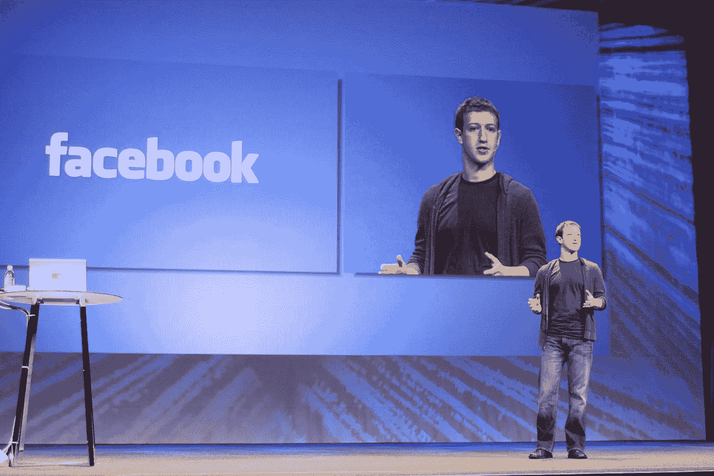
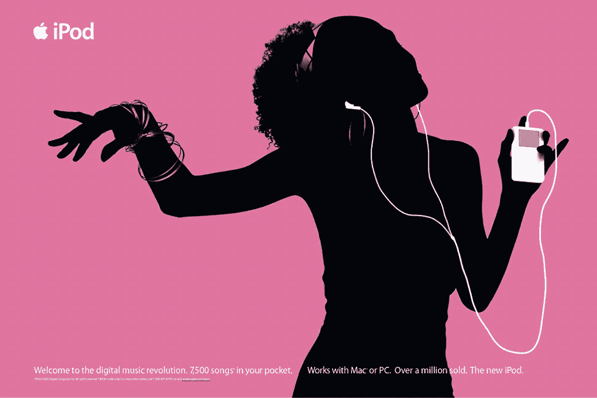

# 脸书电视广告策略的改变

> 原文：<https://medium.com/hackernoon/a-change-in-facebooks-tv-advertising-strategy-72ba0fbe2e90>

## 脸书将通过脸书广告提供 Roku 和 Apple TV 植入服务，开始测试

几个月前，我在 Recode 上偶然发现了[这篇文章。基本上，它描述了脸书通过在 Roku 和 Apple Tv 等“连接设备”上提供广告，在其“电视”自助广告平台(](https://www.recode.net/2016/11/4/13512982/facebook-tv-ads-apple-tv-roku)[脸书](https://www.facebook.com/business/products/ads))上提供视频广告的意图。

直到今天，除了 2016 年年底……**之外，新闻一直对这场运动的任何进展保持沉默。**

好的，在 4 月 20 日晚上 9:50 左右，我想我刚刚见证了脸书的下一步——这个视频广告策略的概念证明。

这可能是脸书第一次通过脸书平台在 Roku 上投放广告的“概念验证”(通过 Hulu 向我投放)。

据我从 YouTube 或相关新闻报道中了解到的情况，我要描述的并不是任何之前记录在案的脸书广告活动的一部分。

这是一个以 Facebook Messenger 为特色的广告。(可能是脸书 Live，这两个产品之间的界限一直在变得模糊——仅从一次现场观看来看，我无法明确地告诉你这是哪一个产品，因为脸书过去曾为 [Messenger](https://www.youtube.com/watch?v=8m7IMRQEkVY) 和 [Live](https://techcrunch.com/gallery/facebook-live-ads/) 分别举办过活动)。

它的特色是一群种族差异很大/模棱两可的人去极端的地方(一个例子是行为艺术展览？不知道你多久去看一次行为艺术，但是好吧…)，但是它们仍然是“真实生活”的体验——这种体验是可取的，也是可能的。

(与一些奢侈品牌如何瞄准一种感觉，或投射一种对大多数人来说“无法实现”的形象相反。这是他们获得独家品牌智慧的方式)。

我要说的是行为艺术。“艺术家”们穿着一些看起来很像*[的西装在我刚刚看到的艺术博物馆里表演。这些场景背后有一个明亮的饱和背景，有点像苹果的广告。](http://www.telfair.org/nickcave/)*

**

*总之，这个广告相当长(我认为至少有 60 秒，如果不是 90 秒的话，相比之下，传统电视上的广告只有 10 秒或 30 秒)，不同种族的人使用该产品(FB messenger)进行交流，同时做令人满意的事情——但每天都可以做到，如参加行为艺术活动——以及与他们的祖母视频聊天。*

*这真的引起了我的注意，因为对我来说，看到像脸书这样的大公司使用我已经鼓吹了一段时间的策略来部署广告资金是很有趣的。*

***我注意到的:***

## *# 1——演员们说法语*

*当我在这个广告中谈论他们的[风格场景](https://en.wikipedia.org/wiki/Genre_art)时，我注意到演员们在脸书的“广告文案”播音员下面说话。起初我以为他们是在用某种类型的[胡言乱语](https://www.youtube.com/watch?v=Vt4Dfa4fOEY)来做一个 ***尖锐*** 的陈述。*

*但后来我意识到，他们对语言的选择可能预示着脸书对千禧一代所持态度的更大信念。*

*第二次世界大战后，美国被描述为正在经历一场“文化变革”——特别是在轰炸日本后，我们不再向外部世界(主要是欧洲)寻求任何类型的标准。包括不再向欧洲寻求政治、道德或文化方向。*

*可以说，二战期间对日本的后氢弹轰炸标志着美国例外论投射的一个新时期。*

*或者至少，[一个艺术运动是这么说的。](http://www.telfair.org/complexuncertainties/)*

*我的建议是，脸书认为这种信念在千禧一代的态度中意义重大。*

*看，脸书的核心人口从一开始就是千禧一代。*

*我认为这是脸书最了解的市场，谁是最懂技术的人，谁最有可能使用**脸书的几个平台**(包括 [Instagram](https://techcrunch.com/2012/04/09/facebook-to-acquire-instagram-for-1-billion/) 和 [WhatsApp](http://money.cnn.com/2014/02/19/technology/social/facebook-whatsapp/) )，谁因为他们的文化水平可能会接触到许多利用脸书[像素广告技术](https://www.facebook.com/business/a/facebook-pixel)的网站，其他使用 cookies 进行跟踪的网站， 或者，脸书**在**上拥有最完整的个人资料，因为他们集中使用了脸书其他几个收购的平台(请注意，他们现在有*特权访问*的信息，这些数据很可能已经进入了脸书的广告网络)。*

*所以我认为，脸书选择法语作为对话的脚本语言，而不是另一种可能在美国更受欢迎的语言(但对英语广告叙事来说并不显眼)，如西班牙语，这一事实说明了脸书对千禧一代态度的看法。*

*也许我们的父母作为一个整体不会像我们的国家在过去历史上那样继续期待欧洲的一些理想(我会说[这种态度在 20 世纪左右发生了变化，](http://www.litcharts.com/lit/the-great-gatsby/themes/class-old-money-new-money-no-money)或[20 世纪 20 年代](http://www.123helpme.com/roaring-twenties-and-the-great-gatsby-view.asp?id=157614))——但作为一代人的整体，千禧一代可能会有一点不同的感觉。*

*或者，最低限度地说，也许千禧一代集体来说并不认同今天“远离欧洲”的当前方向和表现形式。*

*也许脸书打算在国际上展示这个广告，如果是这样的话，脸书选择法语而不是更广泛使用的语言，如西班牙语，甚至德语，只会稍微更有意义。法语只是世界上第 18 大常用语言，，尽管它在国外可能比在美国更受欢迎，我仍然觉得语言选择来自脸书的主动选择——而不是被动选择。*

*无论哪种方式，从这个广告的长度、广告中描述的类型场景的“艺术”电影风格、演员的数量、在广告中说*的演员的数量[来判断，事实上，有人甚至费心选择法语作为对话的语言(没有演员对话，英语被降低到听不见的音量，仅仅是耳语或](http://www.npr.org/sections/money/2017/03/29/521950337/episode-650-the-genius-behind-get-out)[查理·布朗式的“胡言乱语”](https://www.youtube.com/watch?v=ss2hULhXf04)，利用更发达的无意义语言，如[世界语【等)或者像我之前说的，西班牙语在美国和世界范围内被广泛使用？)—这个广告很贵。](https://en.wikipedia.org/wiki/Native_Esperanto_speakers)**

**事实上，脸书花了这么多时间来制作这个广告，并选择了这样的语言，我认为这很能说明千禧一代的整体态度。**

## **# 2——我说过它很长吗？**

**我今年 21 岁，最近(在过去几年里)迷上了营销的“老派”——文案、直邮、电话营销，甚至是“在电视上看到的”,当时 30 分钟的电视广告还是新鲜事物。**

**我读过关于 1800 号码何时成为新号码的书，，它不再仅仅是用于电话性爱的 1900 号码，我对此感到非常兴奋。**

**我真的很有兴趣采纳这些想法，并在今天的数字营销中使用它们的技术，这就是我的热情所在。**

**当我这么说的时候，有一些人立刻兴奋起来！**

**你们看到了从像 Cesari Direct 和 GKIC 这样建立百万甚至十亿美元公司的技术中学习的价值。**

**说实话，祝福你。**

**因为对于你们中的每一个人，都有另外 10 个人被他们的目光所掩盖。**

**他们不理解，也不想理解，心理学(延伸到经济学，[我已经了解到](https://www.youtube.com/watch?v=e7KN9fkmVbw))在他们的每一个顾客购买**或不购买的决定中所扮演的角色。****

**有时这些人让我觉得学习 20 年代、40 年代、50 年代、60 年代和 90 年代的所有这些技术是浪费时间…**

**但是像谷歌这样的大公司进入了市场。**

**几乎没有人知道这一点，但谷歌实际上 ***花了相当多的时间和精力*** [制作了一个 1 小时的纪录片](https://www.youtube.com/watch?v=cvDoGt1tJy8) **专门关于我书呆子出去的营销。****

**我知道这不是什么大预算数百万美元的交易，[从附带的网站](http://www.projectrebrief.com/documentary/#page=film)很明显，这是一些谷歌员工的项目。**

**(我们能谈谈那个网站吗？呃。糟糕的设计原则。我的意思是很明显是几年前制作的，并且没有预算来更新，但是网站本身绝对是一个不同时代的遗迹……网页设计标准。**

**但是事实上，他们甚至费心去追踪和空运所有这些旧时代的广告主管——我确信谷歌在这部纪录片的制作上投入了至少数万美元。**

**每当我强调讲故事的重要性，或者用目标人物的语言和故事来制作信息的重要性时，有人的目光就会变得呆滞——至少我可以微笑着,因为我知道像谷歌这样的大公司，现在显然还有脸书，正在探索长篇故事和激光聚焦信息。同样的想法，我拼命想捍卫！**

**我非常讨厌广告中的“真理”，即越短越好。**

**缺乏深度是营销人员毁掉一切的主要原因。**

**回到脸书的 Roku spot，我看到了很多我在谷歌纪录片中听到的相同想法。或者在我的“旧”营销书籍中。**

**我看到很多钱被用来创造千禧一代的顾客形象。**

**千禧一代代表什么？从出生开始，多样性的信息就通过我们的父母、像 T2 公立学校这样的机构以及西方文化灌输给我们。这种趋势开始于[稍早于我们的父辈](https://cdn.someecards.com/posts/supes-HrMwLC.jpg)，尽管他们可能并不总是归因于此。**

**我看到一个几乎 2 分钟的广告，从开始到结束，滴在对目标市场心理至关重要的图像中。**

**我看到一个广告，它理解在平台上很好地展示自己的重要性。了解尊重原生平台**与更高转化率相关的公司。****

**用错误的长宽比显示视频广告，你是在往垃圾堆里扔钱。(边上的黑条带你**体验**)。**

**我看到一家拥有大量千禧一代数据的公司，他们发现接触目标市场的最佳方式(他们越来越多地[切断联系](https://www.usatoday.com/story/tech/talkingtech/2017/03/08/cutting-cord-could-cost-much-cable/98894132/))是通过 **Roku** 和**苹果电视。****

**我看到一家与未来接触的公司，并且明白有线电视提供商(甚至互联网服务提供商)的日子屈指可数了。**

**数字显示，有线电视的衰落大约从 2017 年[开始](https://nocable.org/learn/cable-tv-cord-cutting-statistics)，从现在起 10 年后(华尔街 3-5 年)，历史书会这么说。**

**对于一些人来说，远离大众媒体的转变，通过电视和传统媒体缺乏更多的大众“共享文化体验”，会引起焦虑。**

**我肯定地认为，不喜欢这种转变的人的焦虑可能会与千禧一代发生冲突——对他们来说，这是正常的生活事实，不会引起任何痛苦。**

**我认为，从现在起 5 到 10 年后，这种文化冲突将以我们许多人都知道的方式达到高潮，届时，网飞、Hulu、潜在的亚马逊以及点播流媒体领域任何未来的成功竞争者将在收入上超过传统有线电视提供商。**

**直到他们也被下一代的首选媒介(VR？)，以此类推……**

**尤其是当最常使用这些新服务的一代人成年后，在职业生涯中上升，并有能力在这些服务上维持自己的账户(而不是他们现在最有可能做的事情，与他人共享一个账户)。**

**在某一点上，互联网服务提供商将被迫*实际上*应对流媒体视频给他们老化的基础设施带来的越来越大的压力，[因为寻求联邦干预似乎不会奏效。](https://www.wired.com/2016/09/build-internet-fast-lanes/)**

**今天我没有脸书广告的图片给你看，但是我会在 YouTube 上更新这篇文章，因为我相信很快就会有了。**

**事实上，有**而不是**关于这个广告的 YouTube 视频让我认为这是一个**非常早期的**测试，脸书试图在 Roku 上部署广告*(也可能在电视上应用)，通过*到*他们自己的广告网络。***

*我相信你已经注意到了脸书(以及其他老牌网络公司)向“跨界”广告转型的趋势——有时在电视或其他传统媒体上购买广告位。*

*还记得不久前，脸书自己的许多商业广告都围绕着[“脸书之家”，或者创造某种脸书“操作系统”](https://www.youtube.com/watch?v=rrlJiKFJSQY)，它的功能似乎与 Messenger 非常相似……也许他们仍然记得那个冒险？*

*无论如何，脸书对尝试在第三方渠道讲述他们的产品并不陌生。*

*可以说，自 2016 年底以来，他们已经有几个月没有表现出战略上的变化了，所以最近一系列的 Roku 广告测试**可能代表了脸书内部广告方向的发展。***

*但我也认为有趣的是，他们正在把自己作为一种试验品，尽他们的能力来部署广告，以这种方式讲述故事，根据他们的数据瞄准用户(谁比他们最了解的市场，他们的核心更适合测试它？)，部署在这些新的第三方渠道上。*

*脸书已经开发了[脸书蓝图](https://www.facebook.com/blueprint)，这是一个培训企业如何使用脸书广告的枢纽——显然是希望他们自己也能转变成脸书广告平台的用户。*

*所以在看到这些 Roku 的广告时，我不禁想知道我是否看到了“幕后”,就像在迪士尼看到的脸书自己的内部流程。*

*也许这是脸书 ***内部螺母和螺栓自己内部*** 测试过程的产物？*

*我们今天无法知道，但如果你在 2017 年 4 月 20 日之后在脸书蓝图模块中看到 Messenger(或潜在的脸书直播)在 Roku 上广告的案例研究——记得我告诉过你！；)*

# *如果你喜欢阅读，请点击❤按钮来传播这个消息！如果你觉得这篇文章有价值，请在脸书或 Twitter 上分享:)*

## *^如果你想每周都收到精彩的商业和营销内容，请将你的电子邮件添加到这个表格中:)*

******

> *[黑客中午](http://bit.ly/Hackernoon)是黑客如何开始他们的下午。我们是阿妹家庭的一员。我们现在[接受投稿](http://bit.ly/hackernoonsubmission)并乐意[讨论广告&赞助](mailto:partners@amipublications.com)机会。*
> 
> *如果你喜欢这个故事，我们推荐你阅读我们的[最新科技故事](http://bit.ly/hackernoonlatestt)和[趋势科技故事](https://hackernoon.com/trending)。直到下一次，不要把世界的现实想当然！*

**