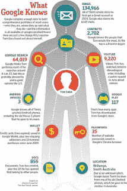
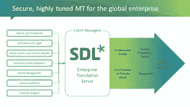
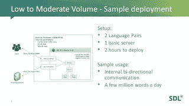
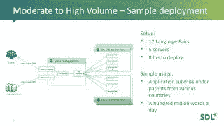
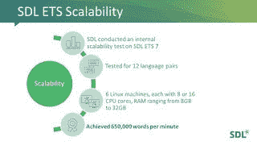

# 仔细看看 SDL 最近发布的机器翻译技术

> 原文：<https://medium.com/hackernoon/a-closer-look-at-sdls-recent-machine-translation-technology-announcements-1ea673d6c437>

SDL [最近宣布](http://www.sdl.com/about/news-media/press/2017/sdl-brings-nmt-to-its-secure-ets.html)他们的机器翻译产品 SDL 企业翻译服务器(ETS)的一些新举措。与大多数新闻稿一样，新闻稿本身没有多少具体细节，我最初的印象是，除了提到他们也在做 Neural MT 之外，这里真的没有太多新闻。因此，我联系了我在 SDL 的联系人，询问他们是否愿意与我分享更多关于这个博客的信息，以满足对这个公告的真实含义感到好奇的读者群。我最初提出的问题都是关于 NMT 的，但是我对 SDL ETS 了解得越多，就越觉得它值得更多的关注。SDL 团队非常合作，与我分享了有趣的材料，因此让我在这篇文章中更清楚地描述了这次发布背后的实质，(我认为企业购买者尤其应该注意到这一点)，我总结如下。新闻稿主要关注两件事:

1.  SDL ETS 7.4 的更新，“监管行业的安全机器翻译(MT)平台”，*(虽然我不确定为什么它不适用于任何大型全球企业，尤其是那些依赖于与电子商务等客户进行更积极对话的企业*)，
2.  神经机器翻译(NMT)技术在这个安全和私有的机器翻译平台上的可用性。

SDL ETS 平台是内部 MT 产品的演变，该产品已在政府环境中使用超过 15 年，并已广泛用于国家安全和情报机构，特别是在北约国家集团。**鉴于国家安全工作的性质，产品必须坚如磐石，并且尽可能不需要支持，因为反恐分析师不倾向于或不允许向 MT 供应商寻求技术支持。**你们中的一些人曾经使用过来自其他供应商的笨重的、几乎可以工作的 MT-onsite 软件，对这种使用情况准备不足，他们可能会体会到这种长期体验的价值。

正如我们最近所看到的，意志坚定的黑客可以闯入政府和企业的网络，并且经常这样做。这个[图形和交互式可视化](http://www.informationisbeautiful.net/visualizations/worlds-biggest-data-breaches-hacks/)很能说明黑客成功的频率，以及据称是私人数据的大型数据集被意外暴露的频率。因此，可以理解的是，当新的 SDL 管理层调查大型全球企业的优先事项时，他们发现“数据安全和数据隐私”是多个行业的许多高管关注的主要问题。

在一个机器翻译是全球资源的世界里，每天有[5000 亿个单词](https://kv-emptypages.blogspot.com/2017/01/the-driving-forces-behind-mt-technology.html)在各种公共机器翻译门户网站上被翻译，数据安全和隐私是一个负责任的执行官和任何严肃的公司治理计划必须关注的问题。虽然公共机器翻译平台确实使机器翻译无处不在，但他们通常也保留对我们的数据运行机器学习算法的权利，以尝试从我们的使用中提取有用的模式，并继续改善他们的服务。如今，机器翻译越来越多地用于翻译大量的客户和企业通信，大多数负责任的高管可能不愿意与公共机器翻译服务共享其客户和企业内部全球通信的隐私细节，因为这可能会危及隐私。

如果你认为你对机器翻译的使用没有被监控或监视，至少在机器学习的层面上，你也许应该[看看下面的图](https://www.wsj.com/articles/SB10001424127887324170004578635812623154242#project%3DGOOGLE0731%26articleTabs%3Darticle)。这个链接提供了他们收集的内容的摘要。

认为这些机器翻译服务是“免费”的想法是天真的，对于公共机器翻译服务试图利用他们从广泛使用的机器翻译服务中学到的东西，我们并不感到惊讶。**从观察用户行为中获得的理解不仅有助于改进机器翻译技术，还为提高广告收入提供了基础，因为机器翻译服务提供商拥有世界不同地区人们翻译和搜索内容的详细指标。**

为了使最初的 ETS 平台适应全球企业市场的不同需求，SDL 不得不添加一些国家安全信息分类应用程序不需要的特性和功能，在这些应用程序中，MT 总是一种嵌入式组件服务，在更大的信息分析场景中与分类和文本分析等其他嵌入式组件交互。新增的主要增强功能面向更广泛的企业市场，在这种市场中，MT 可以作为一种附加的企业 IT 服务，用于许多不同类型的应用程序，MT 服务需要直接和嵌入式访问。新功能包括以下内容:

*   重新设计的和**直观界面**，改善产品安装、管理以及持续运营和管理的用户体验，以应对不断变化的需求。由于 GUI 是基于 web 的，因此不需要在单个用户机器上进行安装。用户和管理员可以通过网络图形用户界面轻松使用 SDL ETS。
*   新的基于浏览器的用户界面包括快速翻译、浏览翻译、主机管理和用户管理等功能
*   可扩展的体系结构适应低和高翻译吞吐量需求。添加了一个**负载平衡器**，用于自动分发客户端请求，管理可用的 MT 资源，以高效的方式促进吞吐量和翻译服务同步。
*   各种安装自动化最大限度地缩短了部署时间。SDL ETS 可以快速部署，无需手动安装任何额外的第三方软件组件。SDL ETS 服务会在系统重启时自动重启，因为它们会自动**安装为 Windows 和 Linux 的操作系统服务**。*(这与市场上大多数基于 Moses 的解决方案形成对比。)*
*   用户角色和认证
*   支持用户通过基于权限的登录进行访问和/或使用 LDAP 对公司的中央活动目录进行身份验证。
*   借助**集中式** **主机管理**，扩展和管理 SDL ETS 部署变得非常容易。管理员不再需要访问单独的 ETS 服务器和修改配置文件。设置可以通过 SDL ETS Web GUI 的主机管理模块完成，包括为特定应用程序加载自定义词典等内容。
*   包括最先进的神经机器翻译技术，为最高质量的机器翻译输出提供领先的技术
*   高度优化的机器翻译引擎反映了机器翻译开发人员与 SDL 人工翻译服务的多年合作，以及持续的专家语言反馈，这是更高质量基础翻译背后的驱动力
*   通过 MS-Office 插件和用于与其他应用程序和工作流集成的丰富的 REST API 实现轻松访问
*   增强的语言检测能力
*   支持自动检测超过 80 种语言和 150 种文字。

根据我对其他内部机器翻译系统的经验和观察，我认为可以公平地说，SDL ETS 的功能是翻译行业将工业级机器翻译能力提升到现代企业 it 标准和需求的重要一步。用# American buffon-speak 的话来说，我们甚至可以说它非常棒，非常好。

根据我从谈话中收集到的信息，以下是我脑海中浮现的一系列与众不同的特征。请注意，这些最新更新大多与改进的 UX、SDL ETS 优雅的简洁性以及从企业客户的角度对不断变化的需求和要求进行持续管理的便利性有关。

*   **更具可扩展性和弹性，更易于客户管理，无需从 MT 供应商处召集技术专家**
*   **与机器翻译服务交互的不同企业应用程序易于管理和持续管理和维护**
*   由 SDL 专有的 PB-SMT 和 NMT 技术提供支持
*   体系结构的效率—相同工作量需要更少的服务器

除了 NMT 在脸书、谷歌和微软的努力，我们今天在翻译行业听到的大多数 NMT 计划都是基于围绕 Torch 和 Theano 框架构建的开源解决方案。虽然使用开源允许机器翻译从业者快速入门，但这也意味着他们必须服从框架的黑盒性质。很少有人能够深入源代码，从根本上改变框架的逻辑和机制，而不会潜在地破坏或动摇基本系统。从业者能够开发的 NMT 系统的好坏取决于他们使用的数据，或者他们修改开源代码库的能力。

与此形成对比的是，SDL NMT 核心引擎由 SDL 100%自主开发，这为 NMT 框架的基本逻辑和数据处理流程提供了更大的灵活性和深层控制。这种更深入的控制还允许开发者在处理 NMT 挑战时有更多的选择，如有限的词汇、性能/速度，以及随着市场和深度学习技术的发展而改变机器学习策略和技术，例如从递归神经网络(RNN)切换到卷积神经网络(CNN)深度学习策略，正如[脸书刚刚做的](https://code.facebook.com/posts/1978007565818999/a-novel-approach-to-neural-machine-translation/)。

根据我有限的理解，我的感觉是，拥有你的 NMT 代码库很可能**提供比开源替代方案更强大的控制选项，因为问题领域可以在更基础的层次上处理，在** **很好理解的源代码中，** **而不是使用变通方法来处理开源黑盒组件的有问题的输出**。拥有和理解代码库也有可能导致代码库的长期完整性和稳定性。这也可能是为什么三巨头选择开发他们自己的代码库，而不是使用开源组件和基础。SDL 系统架构反映了 15 年以上的数据驱动机器翻译经验，旨在对机器学习技术的新兴变化做出快速反应，如从目前每个人都在使用的 RNN +注意力方法到 CNN 的可能变化。

在我与 SDL 技术团队成员的交谈中，我发现他们在解决几个不同的 NMT 问题方面有更强的能力:

*   **词汇** — SDL 在许多不同的使用场景中有多种策略来处理这个问题——既包括源数据领域已知的情况，也包括未知的情况，开发人员希望最大限度地减少未知单词的出现。
*   神经喋喋不休——NMT 系统经常产生奇怪的输出，SDL 开发者称之为神经喋喋不休。一个这样的场景是当输出产生相同的短语，神秘地重复多次。SDL 增加了启发法来开发纠正策略，以减少和消除这种和其他错误的发生。这是一个开源 NMT 系统无法轻易解决的领域，需要添加预处理和后处理序列来管理。
*   **速度/性能**问题可以得到更好的管理，因为代码库被拥有和理解，所以如果需要，甚至可以对解码器进行更改。SDL 正在一系列 GPU(廉价、中端&高级)上测试和优化 NMT 性能，以确保他们的客户群拥有充分理解和充分测试的部署选项。
*   **深度学习创新的快速产品化:**拥有代码库也意味着 SDL 可以轻松地从当前的深度学习方法(RNN)转变为新的深度学习方法，如(CNN)，这可能被证明对许多需要更好生产性能的应用来说更有前途和效率。这种灵活性和适应性只能来自对 NMT 系统基本原理的深刻理解和控制。

NMT **定制和适配选项**目前正在探索中，并针对广为人知的 PB-SMT 系统进行基准测试。初步结果提供了对特定数据组合和修剪策略的深刻见解，从而产生最佳的定制 NMT 系统输出。 **SDL 构建数以千计的定制系统的长期经验对于推动高级定制 NMT 解决方案的发展具有不可估量的价值。**用于调查这一点的研究方法遵循最佳实践(即，它们是谨慎和保守的，不像[Google](https://kv-emptypages.blogspot.com/2016/09/the-google-neural-machine-translation.html)的夸张声明)，我们应该预计所有生产 NMT 系统都将明显优于大多数其他替代方案。虽然我不能随意分享基准比较的细节，但我可以说，在对全球企业特别重要的语言组合方面，改进是显著的，而且特别有前途。SDL 团队在公开宣称生产率和质量提高时也特别小心*(与市场上的一些 MT 厂商不同)*，并从内部和客户测试中收集多个验证点，以验证非常有希望的初步结果。

我预计他们也将开始*(或者可能已经开始*)探索将他们[极具竞争力的自适应机器翻译能力](https://kv-emptypages.blogspot.com/2017/01/a-closer-look-at-sdls-adaptive-mt.html)与高质量的 NMT 引擎联系起来。我期待着更多地了解他们在生产客户环境中的 NMT 经验。

祝我的美国朋友们 7 月 4 日快乐，这里有一首[不寻常的国歌](https://www.youtube.com/watch?v=RN3P1BS9T7Q)，可能更适合当前的领导层。

*原载于 2017 年 7 月 19 日*[*kv-emptypages.blogspot.com*](https://kv-emptypages.blogspot.com/2017/07/a-closer-look-at-sdls-new-mt.html)*。*