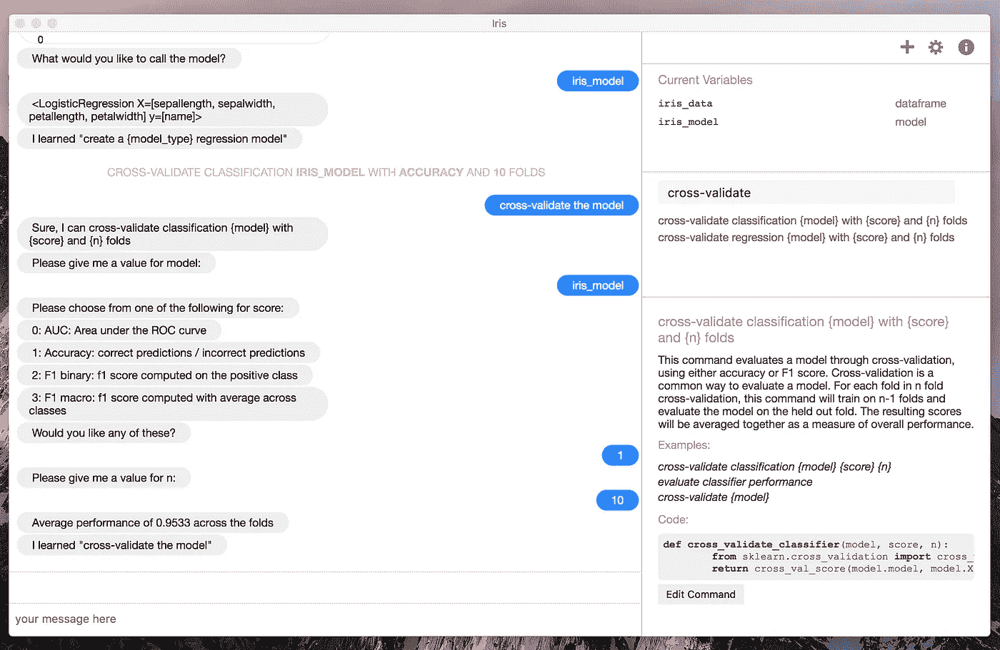
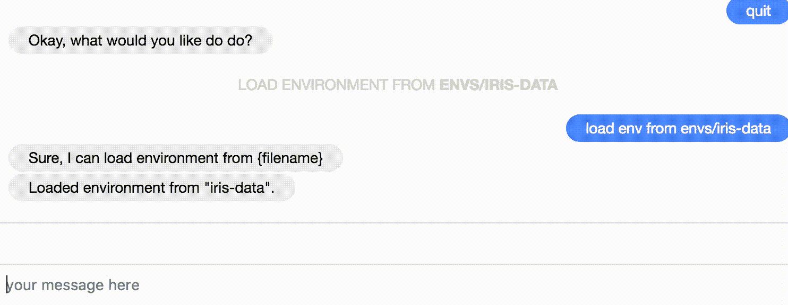
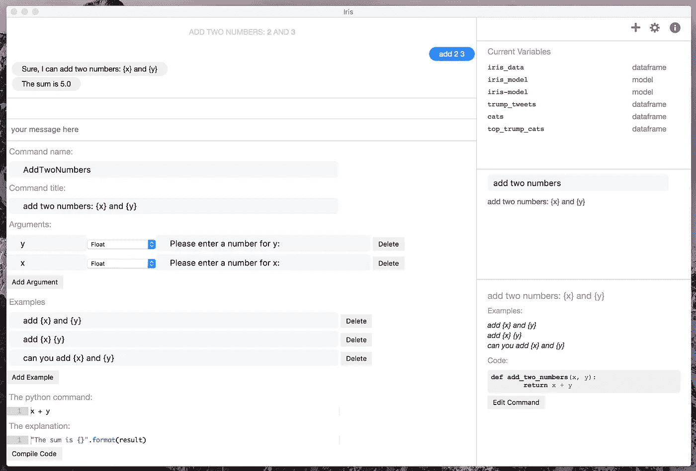

# 数据科学的对话代理

> 原文：<https://medium.com/hackernoon/a-conversational-agent-for-data-science-4ae300cdc220>

科幻小说长期以来一直在想象人类与机器对话的未来。但是对话界面的限制是什么？像 Siri 或 Cortana 这样的代理可以帮助我们完成简单的事情，如获取方向或安排约会，但有没有可能将这些代理应用于更复杂的目标？今天，我们在斯坦福大学的团队很兴奋地宣布我们通过 [Iris 探索的几个想法:数据科学任务的对话代理](https://github.com/Ejhfast/iris-agent)。

与大多数对话代理的目标领域相比，数据科学异常复杂，需要许多步骤和依赖来运行任何类型的有用分析。当通过分析和可视化与数据交互时，你不能简单地依赖一组硬编码的独立命令(想想 Siri 命令，如进行网络搜索或拨打电话)。相反，命令需要建立在相互支持的基础上。例如，当分析一些计量经济学数据时，你可能首先进行对数变换，*然后*进行统计测试。

Iris 通过受[语言学理论](https://en.wikipedia.org/wiki/Conversation_analysis)和[编程](https://hackernoon.com/tagged/programming)语言解释器启发的对话模型支持交互式命令组合。我们的方法允许我们利用一个简单的语言模型来实现复杂的工作流:例如，允许你与系统交谈，以建立一个基于词袋嵌入模型的分类器，或者通过词汇分析比较奥巴马和特朗普的就职演说。为了具体说明这一点，请考虑以下示例:

**Figure 1**: Here we use Iris to download some tweets and analyze them with Empath, a text analysis library. (Note: these GIFs are large and may be slow to load in some browsers)

在本文的其余部分，我们将探索 Iris 支持的特定交互，为什么这些交互很重要，以及开发人员如何通过对话式领域特定语言(DSL)来扩展系统。

## **基本功能:用户如何与 Iris 交互**

Iris 界面是脸书信使这样的聊天应用程序和 r studio T1 这样的开发环境的结合(图 2)。在左下方，用户向系统发出命令，这些命令会出现在上面的窗口中，同时还有系统的响应。在对话过程中创建的数据结构出现在右上角。右边栏有一个可折叠的面板，用于功能搜索和文档。

**Figure 2**: An overview of the Iris interface. Conversation and analysis occur in the left side window, while supporting metadata appear on the right.

我们在用户测试过程中了解到的一件事是，人们希望提前看到，在他们当前的输入查询下，将执行什么命令。Iris 在文本输入窗格上方显示提示，最左边的提示将在按 enter 键时执行(图 3)。这些提示允许用户在建议的命令不符合他们的期望时重新制定查询，从而减少系统错误。提示还向系统状态的其他元素发出信号，例如，用户输入参数是否解析正确或与所需类型匹配。

**Figure 3**: Hints allow for command search and query reformulation

一旦用户按下回车键执行命令，Iris 将自动从请求文本中提取任何参数。Iris 将通过一系列的澄清请求来解决用户遗留的争论。例如，如果您要求 Iris“取列的平均值”，Iris 可能会回答，“您希望我使用哪一列的数据？”一旦所有参数都解决了，Iris 将执行命令并在主窗口中显示其输出。

## 作为构建块的命令:命令排序

在处理数据时，很少会出现单个命令或函数就能完成您感兴趣的所有事情的情况。更常见的是，在编写一个简短的脚本时，你可以*将一系列命令*链接在一起。例如，首先您可以将一些文本数据转换为单词袋特征表示，然后您可以根据这些特征建立分类模型。在 Iris 中，系统中的任何命令都可以与任何其他命令组合(受类型约束)。这使得数据科学家可以使用 Iris 构建更复杂的工作流。

组合命令的一种直观方式是通过*排序*:执行一个命令，然后使用其结果作为其他命令的参数。这种组合风格类似于编写一个*命令式程序*，Iris 以三种主要方式支持它。首先，任何 Iris 命令的结果都可以通过代词“that”、“it”、“those”等在后续命令中引用。其次，Iris 实现了编程语言中所谓的*赋值*:在一个命名符号中存储一个值。例如，您可以要求 Iris“将结果保存为 *my_array* ”，一个名为 *my_array* 的新变量将出现在环境中，稍后可以在对话中引用它。最后，许多 Iris 命令会在执行过程中保存已命名的变量，这些变量同样会保存在环境中以备将来使用。

使用这些策略，数据科学家可以按顺序将命令链接在一起。例如，我们可能会创建一个逻辑回归模型，然后在交叉验证下对其进行评估(图 4):

**Figure 4:** Here we use Iris to build a classification model to predict flower type, then evaluate it under cross-validation.

## 作为构建块的命令:编写命令

虽然命令排序功能强大且直观，但这并不总是将命令组合在一起的最佳方式。想想人们是如何说话的，你会经常发现他们通过陈述的组合来表达意思。例如，如果有人问你，“方差是多少？”，而你回应，“不好意思，你说的是什么数据？”，那么他们可能会说，“我指的是第一列数据”。用编程术语来说，这个对话将组成一个计算方差的命令和另一个选择第一列数据的命令:

Iris 通过在解析一些顶级命令的参数时执行*任何其他命令*的能力来支持合成。这种风格的子对话可以嵌套在自身上，形成任意深度的对话(实际上，超过两层深度的交流会变得有些混乱)。例如，我们可以让 Iris 运行一个 t-test，并使用 log-transform 交互地组合它(图 5):

**Figure 5**: Here we compose a command to run a t-test, with a command to log-transform columns of data

像动态类型编程语言中的解释器一样，Iris 将检查合成命令是否返回参数所需的值类型(例如，取某些数据的平均值的命令可能期望合成命令返回数组值)。如果组合函数返回的类型不匹配，Iris 将拒绝该值，并要求用户进一步澄清。

## 用对话式启示扩展 Python 函数

用户贡献是任何编程生态系统的重要组成部分。Iris 的目标之一是允许专家用户扩展缺少功能的系统。出于这个原因，Iris 中的所有底层命令都被定义为 Python 函数，由一个[高级 DSL](https://github.com/Ejhfast/iris-agent/blob/master/backend/iris/state_machine/expression.py#L174) 转换成具有对话式启示的 Iris 命令。例如，下面是计算标准偏差的命令的实现:

**Figure 6**: An Iris command implementation that computes the standard deviation of an array of data. The logic of the command is simply a Python function, annotated with natural language and type annotations.

函数的核心逻辑封装在一个类中，该类定义元数据，如函数的标题(它在提示中的显示方式)、执行函数的示例用户请求、参数类型信息和描述性信息。DSL 使用这些元数据将类转换成用户可以对话式交互的自动机。

虽然这种 DSL 相对紧凑，但我们在用户测试中发现，即使是专家用户也更喜欢使用 GUI 来帮助创建命令。Iris 有一个命令编辑器，支持在环境中动态地创建和修改命令，可以保存更改以便跨会话保存。在实践中，我们还发现，直接在环境中编译和测试命令的能力会大大加快新功能的迭代和调试。

**Figure 7:** Iris includes an editor that allows users to create new commands and edit existing commands. Any modifications to command can then be immediately tested through conversation in the environment.

## 超越文本:使用混合模态界面

对话可能是创建和执行程序的有效方式，但是数据科学任务通常依赖于非文本的抽象。例如，研究人员经常通过电子表格或编写代码来检查和组织数据，以产生可视化输出，如图表或图形。Iris 支持这些模态作为其对话界面的补充。例如，当从数据帧中选择一列时，Iris 将在一个类似电子表格的视图中显示该数据帧，用户可以单击该列的标题来填充对话请求字段。

类似地，可视化数据是许多数据科学工作流的重要组成部分，Iris 通过 [vega-lite 库【d3.js 的高级包装器)支持这一点。每当 Iris 命令产生 vega-lite 模式作为输出时，例如散点图或条形图，它们将作为对话中的可视元素呈现。](https://vega.github.io/vega-lite/)

**Figure 8**: Iris integrates with vega-lite to produce data visualizations

## 发起一个开源社区

Iris 是一个研究项目，但它也是开源代码，随着开发的继续进展，我们希望其他人也能做出贡献。通过围绕这个项目建立一个社区，我们的目标是引导一个自然语言交互的开放数据集，这将允许我们推动对话代理可以支持的任务类型的边界。我们计划在今年夏天晚些时候为 OSX 推出一个桌面客户端，所以如果你有兴趣帮助我们调试一个测试版本，[请查看我们的 arXiv 论文](https://arxiv.org/abs/1707.05015) , [关注 Gihub 项目](https://github.com/Ejhfast/iris-agent)或者在 irisagent.com[的邮件列表上注册。](https://www.irisagent.com)

(这项工作是与斯坦福大学的陈彬彬、朱莉娅·门德尔松、乔恩·巴森和迈克尔·伯恩斯坦合作完成的。)