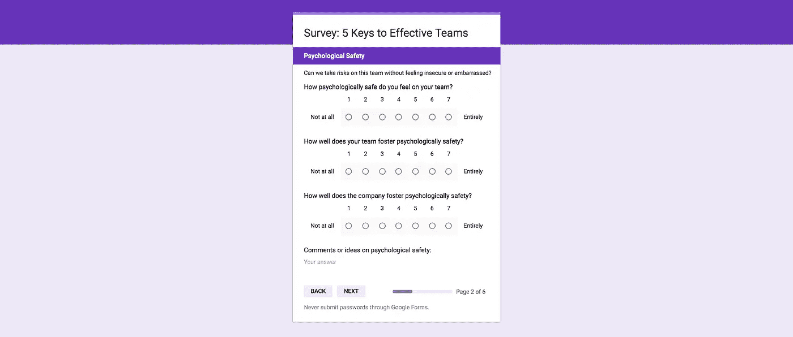

# 建立成功团队的现场指南:第 1 部分开始对话

> 原文：<https://medium.com/hackernoon/a-field-guide-to-building-successful-teams-part-1-starting-the-conversation-a8cac81cd02f>

Image courtesy of [Unsplash](https://unsplash.com/search/teamwork?photo=3BK_DyRVf90)

几年前，谷歌发布了对一项多年研究的非常有见地的评论，该研究旨在确定他们最有效团队背后的秘方。在他们的数据驱动方法陷入死胡同后，他们使用了一种观察方法，并发现了他们所谓的成功团队的 5 个关键**。**

*这些价值观引起了我们这些曾经参与过强大团队的人的共鸣，这些团队不仅富有成效，而且充满成就感和乐趣。大多数人都同意这些动态中有压倒性的真理。然而，让我感到奇怪的是，多年后，几乎没有公共资源可以用于可操作的方法来创造和培育这些动力。我们已经识别并观察到了它们，这无疑是有帮助的，但这仅仅是开始。*

*如果我们的任务是创造令人惊叹的[技术](https://hackernoon.com/tagged/technology)公司，我们需要像关注技术一样关注团队。要做到这一点，我们当然不应该试图在真空中创新。我们应该尽可能开源这些想法和策略，它们适用于几乎任何公司。我想我应该通过分享一些我用过或见过的实用工具来重新开始这个话题。因为这是一个巨大的话题，我把它分成六个部分。首先，我将谈谈如何在您的组织中开始对话。稍后，我将深入探讨每个单独的动态。我主要是根据我与工程团队的个人经验来处理这个问题的，但是我确信你会发现这些工具可以应用于任何涉及团队的工作领域。*

*如果你还不熟悉这些概念，我强烈建议你先阅读谷歌发布的[这篇文章。如果你有时间，《纽约时报》做了一篇](https://rework.withgoogle.com/blog/five-keys-to-a-successful-google-team/)[更深入的报道](https://www.nytimes.com/2016/02/28/magazine/what-google-learned-from-its-quest-to-build-the-perfect-team.html)，很值得一读。对于那些已经熟悉的人来说，这里是谷歌研究团队确定的 5 个关键的快速回顾:*

1.  ***心理安全:**我们能在这个团队里冒险而不感到不安全或尴尬吗？*
2.  *可靠性:我们能指望对方按时完成高质量的工作吗？*
3.  ***结构&清晰:**我们团队的目标、角色和执行计划是否清晰？*
4.  *含义:我们在做对我们每个人都很重要的事情吗？*
5.  ***影响:**我们是否从根本上相信我们正在做的工作很重要？*

*除了这五个关键之外，另一个重要发现是，拥有强烈的*心理安全感*是一个成功团队的先决条件。这是一种把关的动力，没有它，无论其他因素有多强，真正的有效性似乎都是不可能的。*

***阶段零::开始明确的对话&召集团队***

**

*Photo courtesy of [Unsplash](https://unsplash.com/search/group?photo=vpxeE7s-my4)*

*在深入研究每个动态之前，有必要指出一个最重要的事实。建立一个不可思议的组织是一项团队运动，事实上所有人都在甲板上。不要认为你可以独自完成这个过程，特别是如果你正在以一个成长中的初创公司的极快速度做这件事。考虑到这一点，你能做的最有效的事情就是**将整个组织纳入麾下**。*

*从向团队展示框架开始。不要简单地在 Slack 上发布文章或发送电子邮件，并希望奇迹会发生。实际上是将幻灯片放在一起，站在团队面前，向他们介绍细节，引导讨论并回答问题。一定要传达这对你有多重要，并询问团队的想法。展开广泛的对话，不要声称你知道所有的答案，你们将一起发现这个问题，并声明这将是公司将永远致力于解决的一件事，(因为你会的)。*

*这样做的最终目标是培养对持续改进的所有权。随着你公司的成长，无数的行为和流程会被创建、修改和删除。事实上，这大部分将完全发生在你的视线之外。然而，如果每个人在发展公司时都牢记这一试金石，你就更有可能建立健康的流程，对这些动态产生积极的强化作用。*

***第一阶段::入股***

*一旦每个人都真正明白了你的想法，你就要在每个人都觉得你所处的位置上承担责任。发送一份简单的匿名调查，对他们的团队和/或公司在培养这五种动力方面的表现进行排名。([这里有一个使用谷歌表单](https://goo.gl/forms/5tr9LlzC8drhx7e32)的例子，你可以随意复制它，并根据自己的需要进行定制)。*

**

*以下是关于调查结构的一些重要说明:*

*   *三个“层次”的问题，个人、团队、公司，可以为拥有多个团队的大型组织提供更好的洞察力。小公司可以简化，只问团队或个人。*
*   *较大的组织/团队可以询问每个人属于哪个团队。然而，我喜欢让高管们致力于“公司”层面的计划，经理们致力于“团队”精益计划，个人团队致力于“个人”计划的想法。这可以帮助这些不太明显的横向团队团结起来，从事与客户相关的工作之外的工作。*
*   *一定要包括一个自由形式的领域，再次征求意见和/或评论。请记住，不是每个人都愿意在公共论坛上畅所欲言，尤其是在整个公司都在场的情况下。*
*   *此时强调“结构*。*“你可能会从更有经验的人那里得到反馈，“我们遗漏了 x、y 和 z！”对于一个还没有找到合适产品市场的公司来说，许多流程和工具是非常*好的。同样的事情对于一个规模化经营的公司来说可能是不可或缺的。**
*   *是的，调查应该是匿名的。这可能有点可怕，因为你真的永远不知道人们会说什么，但这就是重点。你宁愿知道也不愿不知道？这是你用来建立心理安全的第一个工具，主要是关于信任。给人们一个被倾听的地方是做到这一点的有力工具。*
*   *有时，你可以根据写作风格或之前的对话，从个人那里挑选出反馈。除非他们来找你，否则不要试图直接回应他们。记住，你在为反馈创造一个安全的空间，不要背叛这种信任。*

*分享汇总数据，并对任何相关的评论和问题发表意见。在这一点上，确保你完全投入，并腾出时间开始采取行动。让反馈落到地板上会产生完全相反的效果。不要觉得有必要一次解决所有问题。这一切都是为了建立一种持续改进/进化的文化。*

*我很想在更大的生态系统中占有一席之地。[我针对你做了一个快速匿名调查。](https://goo.gl/forms/lgtsID45rTqgpgJP2)结果中肯定会有选择偏差，但如果数据中有任何有趣的东西，我会写下来分享结果。期待您的反馈和想法。*

*阅读 [**第二部分:心理安全**](/@drummel/a-field-guide-to-building-successful-teams-part-2-psychological-safety-93c4f1a30c82) **，**，在这里我讨论了创造促进心理安全的环境的工具。*

******

> *[黑客中午](http://bit.ly/Hackernoon)是黑客如何开始他们的下午。我们是 [@AMI](http://bit.ly/atAMIatAMI) 家庭的一员。我们现在[接受投稿](http://bit.ly/hackernoonsubmission)，并乐意[讨论广告&赞助](mailto:partners@amipublications.com)机会。*
> 
> *如果你喜欢这个故事，我们推荐你阅读我们的[最新科技故事](http://bit.ly/hackernoonlatestt)和[趋势科技故事](https://hackernoon.com/trending)。直到下一次，不要把世界的现实想当然！*

**