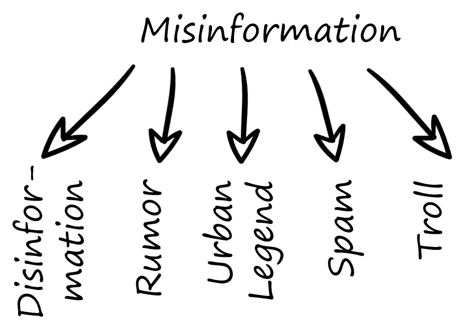

# 误传时代的词汇

> 原文：<https://medium.com/hackernoon/a-glossary-for-the-misinformation-age-da78f72c1151>

Misinformation terms of today have changed from rumour and urban legend to fake news and disinformation

互联网已经改变了我们消费信息的方式，但提供的内容的规模和多样性可能是压倒性的。有太多的空话，太多的技术术语和俚语“主义”，太多来自各方的错误信息。

为了有所帮助，我们为[误传](https://hackernoon.com/tagged/misinformation)时代整理了一个词汇表，这是一个定义的集合，我们希望它能给这个喧嚣、混乱和困惑的世界带来一些清晰。

**阴谋论**

~对事件的解释，旨在证明非法行为——通常由政府或强势行为者实施——是事件发生的原因。

阴谋论倾向于在事件发生一段时间后应用于事件，并在未来许多年内保持不变，例如，广泛持有的阴谋论认为 1969 年阿波罗登月是一场骗局。

**内容农场**

~一个组织，使用算法驱动的数据来创建文章、视频和其他形式的媒体，这些媒体专门设计为在网络搜索引擎上排名靠前。

通常情况下，内容农场会聘用一些员工，他们要么分析数据，找出哪些内容最有可能传播，要么花时间创建可以共享的病毒式内容。这样做的目的是最大限度地增加观看一条内容的眼球数量，目的是最大限度地增加广告收入或推广某些信息。

**造谣**

~故意传播的具有欺骗意图的信息。

这不同于错误信息，因为错误信息总是被有意地传播，而且经常是战略性地传播。英语单词是俄语*dezhinformatisiya*的翻译，来源于克格勃宣传部的名称。也有人声称，斯大林最初创造了这个术语，给它一个听起来像法语的名字，以便错误地声称它来自西方。这个术语现在在政治中被广泛使用，作为描述谎言和宣传的总称。

*“虽然信息是现代的氧气，但虚假信息是可以毒害几代人的一氧化碳。”(牛顿·李)*

**回音室**

~它的意思类似于声学回声室，声音在一个中空的外壳中回响。因此，它描述了一种情况，在这种情况下，信息、想法和信念通过在一个确定的系统范围内不断的交流和重复而得到加强和支持。

在一个回音室里，官方的报道是毫无疑问的，反对的观点被压制，因为一切都是为了支持独裁政权的中心观点。

Who knew fake news would actually gain traction

**假新闻**

~一种宣传或黄色新闻，故意向更广泛的群体传播虚构、虚假和误导的错误信息。它通常是出于诋毁或损害社区中的个人或团体的特定目的而产生的。

除了不公平地针对无辜的受害者，它还破坏了媒体的报道，这些报道希望正确地报道世界，而不是受到错误信息的破坏和歪曲。它依赖于获取[技术](https://hackernoon.com/tagged/technology)和 reach 的便利性。

*”“看，媒体是假的。媒体是——真的，这个词，我认为是我想到的最伟大的术语之一——是假的。”(唐纳德·J·特朗普)*

**滤泡**

~网络搜索导致一种自我强化的智能隔离状态，这种状态使算法开始根据用户的搜索历史、位置和互联网行为，知道用户希望显示什么信息。随着时间的推移，随着算法更加了解用户，过滤泡沫越来越大，这种情况越来越多。

这导致用户在互联网上只能看到自我强化的内容，随着时间的推移，他们看到的对立观点和争论越来越少。

**守门人**

~与互联网相关，用于描述一个有影响力的个人，他决定一个庞大的用户群体是否有权访问通过大众媒体(如社交网络)传播的给定消息。

**骗局**

~一个故意设计成看起来像真相的谎言。

这与判断或观察中的错误大相径庭，因为恶作剧的目的是误导。

**互联网偏见**

~理解互联网允许任何事情的写作和出版，而不需要任何专业知识、资格或引用。互联网的偏见是没有过滤器，因此，任何东西都可以作为“事实”发布。

虽然在图书馆找到的书通常已经被评论和编辑过，但是互联网资源没有同样的过滤器。互联网允许作家写任何东西，无需同行评审、资格或备份文档。

**误传**

~任何被传播的虚假的东西。它可以是已知为假的，也可以是未知为假的。

这可能包括谣言到假信息到故意宣传到无意的错误。尽管虚假信息是基于传播者的意图，但虚假信息可能不是出于欺骗的目的而产生和传播的，虚假信息被用作一种武器，有目的地传播，而且通常是战略性地传播。

具有讽刺意味的是，互联网的这一惊人发明让信息收集变得比以往任何时候都容易，但这个平台也帮助传播错误信息(will.i.am)

Minion parodies are golden

**恶搞**

~旨在通过讽刺或讽刺性模仿来取笑原创作品、个人或组织的作品。也常被称为恶搞、漫画或笑话。

不是一种虚假信息，因为在场的每一个人——从观众到参与的演员——都清楚，这场表演是一个笑话，因此不是真的。

**后真相**

~与一段时间或一系列环境有关，在这段时间或一系列环境中，客观事实被认为对公众舆论和未来结果的影响小于情感和个人信念。

它的字面翻译意思是“在真相被知晓之后”，但人们认为这个术语的最新含义可以理解为真相变得无关紧要。它被牛津词典评选为 2016 年度词汇。

"*不叫后真相。有一个更简单的词:谎言。”(乔纳森·弗里兰)*

**宣传**

~主要用于影响受众的信息，使他们支持或反对某一信息，从而推进创造该信息和宣传的权力的议程。

它通常与政府和统治力量准备的材料有关，但所有政党，从活动团体到公司和媒体也制作宣传材料。这个术语已经与一种操纵的方法紧密联系在一起，以一种阴谋和不光彩的方式对信息的读者施加影响。

*“现代宣传的目的不仅仅是误导或推动议程。这是耗尽你的批判性思维，湮灭真理。”(加里·卡斯帕罗夫)*

**讽刺**

~经常是幽默文学或舞台艺术的创作或表演，目的是嘲笑个人、公司、政府或社会阶层。

虽然经常幽默或讽刺，其目的往往是建设性的社会批评。如今，它可以包括模因、评论、电视节目和媒体，如歌词。不是一种虚假信息，因为在场的每一个人——从观众到参与的演员——都清楚，这场表演是一个笑话，因此不是真的。

If only these trolls were as nice and fun as the little troll dolls from childhood

**巨魔**

~网络俚语，指网络角色，通常是虚假的，纯粹是为了在网上散布不和、引发争论而存在，主要是在新闻组、论坛、聊天室或博客上。

**病毒式传播**

~图像、视频或信息在互联网用户之间快速广泛传播的有效性。

**黄色新闻**

~这是一种新闻类型，很少或不提供合法或经过充分研究的新闻，采用引人注目的点击诱饵标题，唯一目的是销售更多报纸和/或广告空间。这个词被用作贬义词，谴责任何以不专业或不道德的方式对待新闻的新闻业。

推动这一议程的技术可能包括夸大事件、恐吓、散布丑闻或哗众取宠。这个词在美国最常用，但在英国它的对等词是小报新闻。

“我们都知道黄色新闻不是一周前或一个月前才出现的，只要新闻业存在，黄色新闻就可能一直伴随着我们。”(埃罗尔·莫里斯)