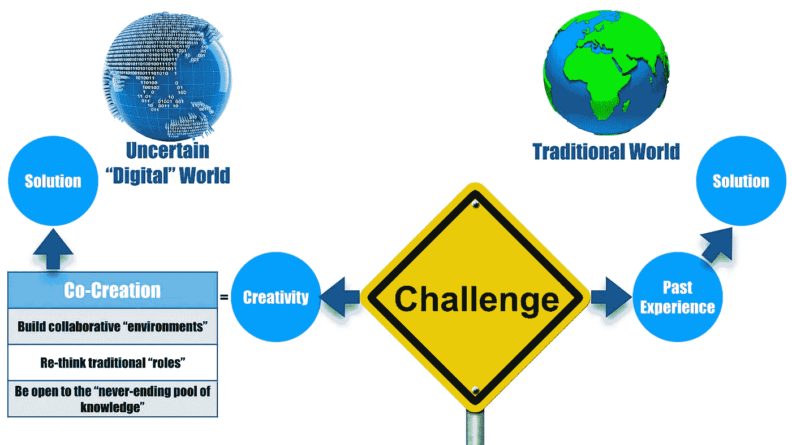

# 应对未来的指南

> 原文：<https://medium.com/hackernoon/a-guide-for-dealing-with-our-future-177cc115b749>

## 如何在不确定的世界中提高创造力和选择

上周，我在丹麦谈论颠覆性的新技术和未来技术对商业、政府和教育的影响。

与会者有一个明确的共识，即数字时代令人兴奋，但也极其令人生畏。

每个人似乎都同意，这一挑战的很大一部分是技术变革的速度和将新技术融入现有工作模式的持续压力。

我可以在自己的生活中看到这一点；“人工智能”、“物联网”和“区块链技术”越来越多地出现在工作场所的对话中。

当然，我们总是不得不应对新技术的挑战，但当前创新和发现的速度意味着现在的情况不同了。我们面临前所未有的问题，并对未知的未来挑战感到焦虑。

 [## 本年度最重大的科学发现(迄今为止)

### 2017 年将我们带入了一个科幻未来，从人体细胞再生到器官生长，再到…

futurism.com](https://futurism.com/the-most-significant-scientific-discoveries-of-the-year-so-far/) 

> 那么，我们应该为未来做些什么准备呢？

嗯，首先，我们需要更好地理解*颠覆性技术如何影响我们的决策，并制定策略，让我们更好地为不确定世界的新现实做好准备。*

# 来自一个“经验”的世界。。。

我们生活在一个快速变化的世界中，在这个世界中，“经验”——被理解为过去积累的实践智慧——不再能像过去那样提供指导。对于个人*和*组织(企业、大学和政府)来说都是如此。

让我解释一下。

想象你在工作中面临一个问题。它可以是任何东西，但是让我们假设你被要求与另一个组织谈判某种协议。

对这项任务的标准反应是寻找过去的类似情况，并问:

> 上次我们是如何处理类似情况的？

您可以从挖掘贵组织以前签订的协议开始，这些协议将为谈判/起草新协议的任务提供基础。

而且，如果没有“过去的经验”，你总是可以“谷歌一下”找到其他人的经验。

> **解决问题和制定决策依赖于将现有模板应用于任何“新”情况。**

积累的经验是重要的机构资源，为处理任何新任务提供指导。经验是一个组织的“文化”中的一个关键要素——如果你愿意，可以称之为机构记忆——而这种经验的质量或丰富程度是决定一个组织成功与否的一个关键因素。

能够最好地积累和利用经验的组织获得了最大的成功机会。

> 但是，在一个没有“最后一次”可以提供这种指导的世界里会发生什么呢？
> 
> 在这个世界上，没有相关的先前协议放在某个地方的文件柜里，可以拿出来为下一个协议提供基础，我们该怎么办？
> 
> 或者说，如果谷歌没有给你一个明确准确的答案呢？

我们生活在一个“过去的经验”不如以前有价值或相关的世界里。在一个唯一确定的是明天将与今天不同的世界里，我们不能再依靠过去的固定模板来指导我们对未来的决定。

> 在数字时代，什么会取代经验成为决策的主要依据？

# 。。。一个充满“创造力”的世界

我认为，现在人们更看重创造性地适应快速变化的现实的能力。

> **创造力正在取代“过去的经验”，成为个人或组织成功的关键决定因素。**

但是我们所说的创造力是什么意思呢？那么，如何最好地实现这种创造力呢？

为了帮助我们“更有创造力”，这里有**三个策略**，我们需要理解并采纳。

至关重要的是，新技术的扩散使得这些策略变得更加容易。

> 在一个不确定的世界里，“技术”正在取代“经验”。

With special thanks to Lori Bumgarner ([https://medium.com/@panash/this-sentence-along-with-the-following-sentence-students-must-be-forced-to-work-in-teams-and-e00c27ca9d2f](/@panash/this-sentence-along-with-the-following-sentence-students-must-be-forced-to-work-in-teams-and-e00c27ca9d2f)) and Doug ([https://medium.com/@deerwood/may-i-add-a-sixth-issue-which-i-believe-students-should-study-ca4b48c164f9](/@deerwood/may-i-add-a-sixth-issue-which-i-believe-students-should-study-ca4b48c164f9))

## **#1 —构建协作“环境”**

当人们合作时，创造力最大。建立一个更加开放和包容的环境——无论是一个团队、一个组织，甚至是一个社会——促进更有可能具有创造性的合作关系。

传统上，社会和商业组织建立在封闭的等级制度上。在一个我们可以依赖过去经验的世界里，这是行得通的。最有经验的人(因此也是“有技能的”)往往在等级中处于较高的位置。但是在一个充满未知和不确定挑战的世界里，封闭的等级制度不再有效。

我们需要创造一个“最佳创意胜出”的环境，不受提出这个创意的人的年龄、性别或地位的影响。

## **# 2——重新思考传统的“角色”**

这意味着重新定义我们对个人在团队或组织中所扮演的不同角色的理解。

在这个新世界里，“老板”、“老师”、“领导”会越来越多地被“影响者”、“创造者”、“远见者”所取代。

这是一个“更扁平”的世界，在这个世界中，影响者、创造者和远见者是一个更谦虚的人物，他们寻求激励和推动他或她周围的人。今天的影响者明白，他们也在不断学习的旅程中，并没有所有的答案。

同样，员工-学生-公民是一个更有活力的“角色”,需要承担更多的责任，减少对传统权威的尊重。他们不仅消费信息，而且挑战、启发、激励并与创造者对话。

这样“共创”的机会就最大化了。

## **# 3——向“永无止境的知识宝库”开放**

新技术——社交媒体、即时通讯、Skype 等。—让与来自世界各地的人互动成为可能。你可以毫不费力地与从未谋面的人进行对话。

这些技术非常强大，当然也有自己的挑战。

 [## 这一代人会很好:为什么社交媒体不会毁了我们

### 当人们表示担心智能手机如何损害我们的年轻人时，我笑了。这种对…的焦虑

medium.com](/@garyvee/this-generation-will-be-fine-why-social-media-wont-ruin-us-de93d4afe5f8) 

但是，它们会带来令人惊讶的——通常是意想不到的——新的机遇、想法和突破。他们提供了试验和测试想法的机会。这些技术促进的即时反馈使得立即改变、发展和改进这些想法成为可能。

重要的是，现有的平台，如*媒体*及其出版物，提供了帮助你为未来做准备所需的永无止境的知识来源。

随着每个人都成为“共同创造者”和“合作者”，传统的“作者”和“读者”之间的界限变得模糊了。

这样的新平台在应对和解决未来的挑战方面将变得越来越重要。这对研究人员和科学家来说尤其重要。他们都应该立志成为“有影响力的人”。

 [## 为什么科学家应该有领导技能

### 科学在塑造我们的社会和经济中起着至关重要的作用。科学的影响可以继续增长，只要我们…

blogs.scientificamerican.com](https://blogs.scientificamerican.com/observations/why-scientists-should-have-leadership-skills/?wt.mc=SA_Twitter-Share) 

# 但是过去呢？

在丹麦的讨论中，人们清楚地认识到，对许多人来说,“执着于过去”是应对未来不确定挑战的一种有吸引力的策略。

我们可以选择淡化技术发展的程度，继续使用“旧世界经验”(例如，“基本”概念、模型和范式)的元素来理解和应对未来。

这似乎是一个安全的策略，这是有道理的，因为我们根本不知道明天会发生什么。许多政客似乎明白这一点，并利用这种说辞来获得声望。

 [## 特朗普指责亚马逊伤害零售商，扼杀就业机会

### 美国总统唐纳德·特朗普(Donald Trump)再次抨击电子商务巨头亚马逊(Amazon)，称该公司“正在做…

www.chicagotribune.com](http://www.chicagotribune.com/business/ct-trump-amazon-criticism-20170816-story.html) 

但历史表明，这不是一个可持续的或成功的战略。我们的文化已经接受了数字时代的“连接性”、“便利性”和“选择性”。

尽管有时会很困难，但已经没有回头路了。

*感谢您的阅读！请点击* ❤️ *或*👏*下面，还是留下评论吧。*

每周都有新的故事。因此，如果你关注我，你不会错过我关于数字时代如何改变我们生活和工作方式的最新见解。