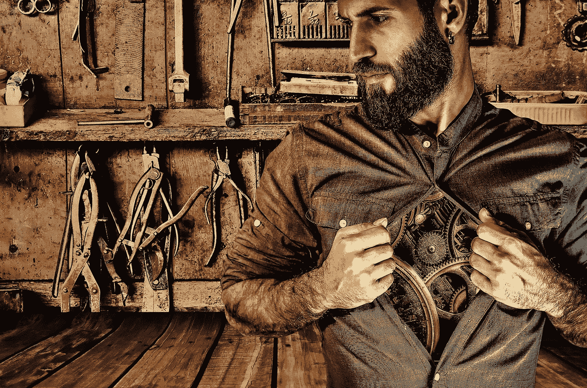

# 机器人崛起的历史和未来

> 原文：<https://medium.com/hackernoon/a-history-and-future-of-the-rise-of-the-robots-cce0fe222a71>

> 我们正走向工业革命的最终实现。

我们认为时间是理所当然的。不是那种“活得像是你在地球上的最后一天”的方式(尽管也可能是那种方式)。如果你戴着手表，看看它。它有秒针吗？为什么？以防你突然需要在奥林匹克短跑中充当计时员？它有分针吗？几乎可以肯定。从这个角度来看，时间对人类来说是一个相对较新的贡献。这不是技术问题。古人在解决紧迫问题时可不是傻瓜。中国人和维京人在 1000 多年前就发明了精确的指南针。古罗马的混凝土比我们自己的混凝土优越得多，在中国，他们在公元 132 年已经开发出一种惊人的精确有效的地震观测仪来探测遥远的地震！事实上，甚至精确的机械钟在公元 725 年就已经发明了，然而不知何故又过了一千年才流行起来。为什么？

我们认为时间是理所当然的，秒以每分钟 60 次点击、每小时 60 分钟、一天 24 小时等等的速度流逝。情况并非总是如此。即使当[技术](https://hackernoon.com/tagged/technology)可用于如此精确的时钟时，为什么它没有流行这么久，什么改变了？著名历史学家 E. P .汤普森以其开创性的著作《英国工人阶级的形成》改变了社会史领域，他也探讨了我们的时间观如何随着我们的工作方式而改变。时钟可能看起来像是一个相当平凡的关注对象，尤其是当我们许多人现在把我们的放在钱包和口袋里。这不仅仅是指钟表。我甚至不是*主要是*在谈论钟表。几十年来，人们一直在谈论自动化和人类劳动力的替代。最近它达到了一个新的高度。自动驾驶即将出现。唐纳德·特朗普(Donald Trump)让世界感到惊讶，最关键的是通过铁锈地带“工作穷人”和未充分就业者的选票，他们中的许多人直接或间接因机器人而失业。

我们的时间概念与我们的职业密不可分，我们的职业是更大系统中的组件、齿轮和工具，这个系统驱动我们的经济，满足我们的需求，实现我们的愿望。自从工业革命以来，我们已经有足够长的时间把我们的工作、事业和工作视为理所当然，因此看不到，在任何不可预见的灾难面前，这种安排的不可持续性。简而言之，过去的几百年是劳动人类历史上的反常现象。探索工作从人类转移到机器的过去、现在和未来是至关重要的，它如何影响我们的时间观，并一瞥我们的未来。

# 在机器出现之前

汤普森描述了一个工业革命前的世界，在这个世界里，工作主要是在他所谓的“以任务为导向”的时间里进行的。以任务为导向的时间观本质上是通过个人正在处理的任务的自然工作节奏来看待时间的。必须放羊，必须挤牛奶，必须做鞋，必须照看热煤，等等。他描述说，此时“工作”和“生活”之间的界限非常模糊。停下来想一想。为了找到理想的“工作/生活平衡”，或者防止工作“侵犯”我们的个人生活，我们已经洒了很多墨水，花了很多钱。汤普森将社会和劳动描述为“相互混合的——工作时间根据任务而延长或缩短——劳动和“打发时间”之间没有太大的冲突。”“他还指出，对于那些习惯于按时钟工作的人(也就是我们)，这种态度“似乎是浪费和缺乏活力的。”在我们当前的西方世界，这种对时间的定位几乎已经死亡，这似乎不是一个巨大的飞跃。我们是怎么从那里到这里的？

我不想把中世纪的农民生活浪漫化。然而，对我来说很有趣的是，我意识到即使是写这样一种对待时间的方式也很难不让人觉得似乎渴望一个“过去的”时代。事实是，我们对待时间的方式已经改变了。它随着工业化而改变。换句话说，前工业化“任务导向”时代的人，主要是农民或手工业者，对他们的时间有直接的所有权。他们主要负责完成整个项目，如制鞋、放羊或从零开始造马车。他们有技能和手工工具来承担完整的项目，并根据自己的需要安排他们的日常工作。鞋匠可以完全控制何时做鞋或不做鞋。他可能一天生产尽可能多的鞋子，或者他可能无限期地不生产鞋子，这取决于对商品、金钱或鞋子的需求。这种直接的所有权来自于鞋匠有知识和能力自己用原材料制作成品鞋，部分原因是他是工具的绝对主人。例如，他可能用刀片来切割皮革，但是刀片本身什么也做不了，所以它只是鞋匠自身的延伸。虽然这看起来很平常，但这是一个重要的区别。虽然他可能永远不会富裕，在更大的市场范围内，他可能甚至可能无法用他的补缀维持一个家庭，但在他的工作范围内，他是他的时代的绝对主人。为了更好地理解机器是如何悄悄进入的，我们将跟随这位皮匠经历一个非常漫长的一生，从工业化前到大部分后人类时代的未来劳动力。

# 介绍机器

随着技术机械化程度的提高，鞋匠发现自己与他的工具和时间有了不同的关系。工具不再仅仅是他自身和专业知识的惰性延伸，它们开始占用他的时间。例如，我们可以想象一个鞋匠最近获得的自动皮革切割机，它允许他简单地放入一块正方形的皮革，等待一段时间，然后取回新成型的皮革。以前，鞋匠可能要花 30 分钟来做这件事。现在机器可以在 30 秒内完成。此外，虽然他的旧手动刀片永远不会迫使他等待，但自动切割机可以。这种对工作时间控制权的放弃几乎肯定会被鞋匠视为将宝贵的时间归还给他。他现在能够更快地完成整个项目，并且仍然在很大程度上保留了对整个过程的直接控制。

哈佛大学前商业历史教授阿尔弗雷德·钱德勒为下一阶段提供了一些有价值的见解，并因此获得了普利策奖。钱德勒描述了工业革命中的新工具和机械是如何使大规模生产成为可能，以及如何分工的。从前，我们的鞋匠是制鞋工艺的大师，现在，机器能够以极快的速度完成太多的工作，鞋匠自己无法有效地使用它们。一台一分钟能切割 500 块皮革的机器，而鞋匠一小时只能用三块，这有什么用？为了应对这些新的能力，完整的制鞋过程开始细分和专业化。由于制造和运输技术的进步，我们鞋匠的全部工作现在已经被分散到分散在各地不同工厂的不同机器和工人身上。专业化必然要求协调，这对我们的鞋匠时间有着戏剧性的影响，因为我们看到他搬进了城市，并在其中一家工厂找到了工作。

# 使用机器

在这个阶段，人类和机器作为工具，在一个大型的、分布式的专业化生产过程中并肩工作。机器和人都不直接拥有自己的时间，而是必须服从协调的要求。一个分布广泛的鞋底制造商、皮革切割工、播种工、设计师和装配工网络现在被协调起来，完成以前由一个鞋匠完成的同一项目。然而，新系统现在能够以显著更高的一致性和产量做到这一点。为了协调工作，流程的每一部分都必须与其他独立的功能同步。鞋底必须按时制造、按时装运，以便它们可以按时在不同的地点与皮革鞋面结合，等等。如果自动切割机对补鞋匠不能工作的时间做了小的限制，那么现在时间表限制了他必须工作的时间。因此，正如汤普森所描述的，时钟被赋予分针，然后秒针，被完善和小型化，然后由公司发给他们的员工，让他们戴在手腕上。人类和机器在他们的新主人时间表下平等地劳动。

在我们这个时代，将时间体验为“压力”，然后哀叹或吹嘘这一切的“压力”是非常典型的。很多这是协调的代价，压力是真实的。如果任何工具、人或机器未能满足其预定的产出，那么该过程被中断，该工具将被修理或更换。在这一点上，人和工具在功能上几乎没有区别。换句话说，人类现在只是大型生产和分配过程中的半自主工具。对于项目中的工具来说，时间是至关重要的，因为任何人或机器如果一直不能按时完成任务，几乎肯定会被能按时完成任务的人取代。从而人类的工作完成了从面向任务到预定社会的转变。

# 现在

这是我们大多数人目前分娩的阶段。我们几乎都在一个过程中作为工具而努力，这个过程远远超出了我们自己的工作，并且需要与许多其他活动的部分进行协调。我说工具是因为工具执行任务，而不是项目。如果一个穿着就像我们的鞋匠一样的人形机器人走进他的车间，从头开始做鞋，就像我们的鞋匠所做的那样，他就不是制鞋过程中的工具，他作为他之前的鞋匠，就是制鞋过程。人类现在在更大的项目/任务中主要作为工具承担工作，并且在时间表下与机器并肩工作，几乎无处不在。我不是在哀叹时间安排。协调可以让美好的事情成为可能。然而，重要的是要理解服务于生产、分配和消费过程的极其复杂和交织的协调系统如何极大地影响了我们与时间的关系，以及对未来的影响。

未充分就业和在业穷人困境的核心是，没有任何迹象表明这种状况是稳定或可持续的。我们人类在很大程度上仍然参与到这个过程中，因为无论我们在做什么工作，我们仍然是最廉价的选择。更便宜是因为技术目前太贵或不存在，更便宜是因为工资总是可以降低。然而，随着技术的进步，人类越来越不如好的机器有效，也越来越昂贵。这不仅适用于在底层工作的人，也适用于他们上面的经理。

# 走向未来

随着机床变得越来越自动化，人工很容易受到影响，经理作为工具的地位得到加强，因为他们和所有其他人工工具一样容易被替换。管理，西方世界最大的职业之一，通过两个独立但同时的过程变得无关紧要。第一个过程是通过减少工作场所中需要他们管理的人员，通过自然减员间接发生的。另一个过程是直接发生的，通过越来越强大和有效的算法或技术管理器。想想优步。与我们不同的是，机器总是被描述为“愿意”去做他们被告知要做的事情，尽管在历史上通常不是这样。代码中可能有损坏的部分或错误，但是只要有能力，它们总是会按照要求执行。这与当今大多数管理培训有着显著的不同，管理培训主要可以被描述为“如何处理不服从、训练不足和缺乏动力的人的工具这一令人讨厌的问题，这些工具在你的过程中仍然是必不可少的。”

然而，大部分最初由机床取代的人类工具，在很大程度上还不是一种替代，而是向更面向服务的工作的转变。美国服务业占美国总就业人数的 78%以上，并且正在迅速增长，而生产部门的就业却一点也没有增长。混合隐喻，我们还没有真正被踢出工厂，(除了在某些地区，如锈带)，但只是被移动到输送线下的工作，机器迄今为止还没有做得很好。这也是不可持续的。这种转变主要是因为难以创造有效的服务提供技术，而且这种转变是暂时的，因为机器最终也可以被调制来提供这些服务。例如，想想客户服务呼叫中心。一旦你给来自你自己国家的人打电话并与之交谈，然后经常是和来自另一个国家的人交谈，现在越来越多的是，你可能会用对话的语言问你的问题，并让电话另一端的语音识别机器人回答，甚至没有一分钟的等待时间。

随着人工智能和机器学习的发展，特别是在理解和参与人类自然对话的能力方面，人类将在越来越多的行业系统中完全失去效用。例如，美国有 800 多万人受雇于卡车运输业。最近被优步收购的 Otto 已经在道路上测试自动驾驶卡车。特斯拉已经宣布了进军自动半卡车业务的计划。Peloton Technologies 开发了卡车运输软件，使这些卡车在高速公路上“连接”起来，节省了大量的时间和汽油。几乎所有人都认为，自动卡车运输被采用的速度预计会比消费车辆快得多，而消费车辆才出现几年。

# 未来

回到不太遥远的未来，我们的鞋匠在大约 50 年前失去了工厂的工作，但幸运的是，他在郊区的购物中心找到了一份在 Foot Keeper 卖鞋的工作。由于在基层工作表现出色，他被提升为主管，并最终成为商店经理。然而，Foot Keeper 正在逐步淘汰商店模式。你在网上浏览各种风格，挑选你最喜欢的。然后，你放下手机，对你的脚进行 3D 扫描，这些扫描被直接发送到充满 3D 打印机的 Foot Keeper 工厂，这些打印机根据独特的购物者的脚，在不到一分钟的时间内定制打印鞋子。然后，一台机器将鞋子打包，装上等待的亚马逊无人机，今天下午送货上门。(这一场景并不像看起来那么遥远。查 Carbon3D)。唉，我们的补鞋匠已经完全被排除在系统之外了。随着其他行业走向完全自动化，可能会有一段时间让他投身其中，但会持续多久呢？

没有理由相信随着机器劳动变得更有效率、更有效、更便宜，人类劳动会以某种方式占上风。不是机器在推动收购，而是公司所有者的利润最大化决策。一路跳到科幻领域，在完全自动化的情况下，分割任务的巨大过程可以归入一个伟大的主机器。想想 3D 打印机，即使它们目前还处于襁褓阶段，以及它们将过去分散在无数工厂的整个制造过程整合到一个小盒子里的非凡能力。这样的元系统不再是一个由相互依赖的任务组成的生态系统，而是一个由不同的、看似独立的、但内部却是单一工作机器的独特表现组成的白杨林。在最后一个宏大的无人的决议中，生产和分配过程再次被归入一个机器过程，在功能上与最初的补鞋匠几乎没有什么不同，但在产出上价值数百万个补鞋匠。

在仅仅几百年的时间里，我们正在完成一个循环。首先，鞋匠是制鞋过程的主人，为自己和邻居制鞋，并相应地安排他们的时间。那时，机器允许不熟练但准时的工厂工人使用机器为所有人制造鞋子。最终，机器变得如此之好，以至于它们可以在很大程度上自己制作鞋子，当出现问题或机器需要重新编码以学习新知识时，袖手旁观只需要几个人作为技术人员。即使是那些技术员职位也是临时的。工业中已经充斥着自动维修系统和机器。《连线》杂志 2016 年 5 月的封面甚至宣布了编码的终结，因为机器变得能够用越来越复杂的人工智能进行编码和重新编码。因此，我们所有的鞋匠、工厂工人、设计师、技术人员、服务提供商和经理都把过去的几百年当作更大过程中的必要工具，也许没有充分考虑长期轨迹。这一过程的高潮可能会超过我们许多人的一生，就像我们在环境管理中的愚蠢行为的潜在后果一样。目前，我们中的大多数人可能会发现自己在最初增加，但随后减少的服务工作数量中舒适地度过一生。随着更好、更便宜、更可靠的工具的出现，全球流程只能雇佣这么多的人，因此有充分的理由预计这种需求会减少。

这可能会给人以悲观甚至宿命论的印象。我不这么认为。这不是一个天启的故事，因为不像许多最好的科幻小说，我相信人类的创造力、独创性和基本的生存本能能够创造性地适应新的环境。当我们开始应对新的挑战和设计新的解决方案时，将会有变化和痛苦。在变化非常迅速的情况下，痛苦会特别剧烈，我们可能会措手不及，但变化也带来机会。还记得手表，分针的压力吗？还记得时间表的主人吗？我们在职业生涯和工作中花费了太多时间来评估和寻找生活的意义。被踢出工厂可能需要我们重新评估拥有“有意义的生活”意味着什么。我们可能需要少一点对时间的焦虑，少一点对工作和生活的划分，少一点对我们“自己为自己”得到的东西的占有欲。简而言之，我们需要做一些事情，一些给我们意义和目标的事情。我们需要找到新的方法来发挥创造力，为拨乱反正做出贡献，供养我们的家人，并为他人服务。现在开始探索这些可能是什么，并开始从立法和社会两方面做准备，以帮助那些不幸受雇于第一产业的人实现完全自动化，并将人类扔到路边，可能还为时不早。也许你可以从拥抱一个卡车司机开始。

如果你觉得这篇文章有帮助，请推荐这篇文章来支持长篇写作(和这个作者)。

> [黑客中午](http://bit.ly/Hackernoon)是黑客如何开始他们的下午。我们是 [@AMI](http://bit.ly/atAMIatAMI) 家庭的一员。我们现在[接受投稿](http://bit.ly/hackernoonsubmission)，并乐意[讨论广告&赞助](mailto:partners@amipublications.com)机会。
> 
> 如果你喜欢这个故事，我们推荐你阅读我们的[最新科技故事](http://bit.ly/hackernoonlatestt)和[趋势科技故事](https://hackernoon.com/trending)。直到下一次，不要把世界的现实想当然！

