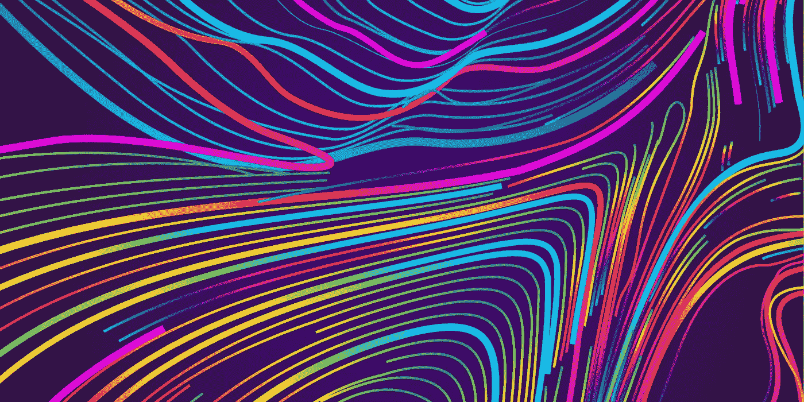
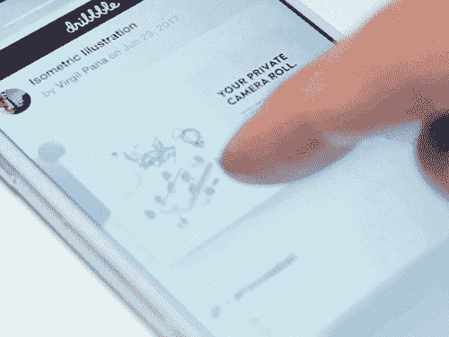
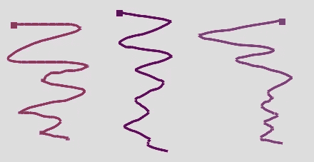

# 人工智能支持的手势识别作为移动输入方法

> 原文：<https://medium.com/hackernoon/a-new-approach-to-touch-based-mobile-interaction-ba47b14400b0>

自从触摸屏在手机中变得无处不在以来的十年里，我们通常仍然只使用几个手势的微小变化来与移动应用程序进行交互:点击、平移、缩放和旋转。

最近，我探索了一类未被充分利用的手势。我在应用程序中检测它们的方法比最先进的技术有几个重要的优势。

[Heart gesture concept](https://dribbble.com/shots/3645291-Dribbble-Like-Gesture) by Virgil Pana

这个想法最初是我在想象一个益智游戏时产生的，在这个游戏中，用户通过用简单的组件设计机器来解决物理挑战。有点像围攻，但 2D，移动和专注于解决物理难题，而不是中世纪的战争。

我认为游戏可以为不同的工具或组件提供不同的手势，而不是用按钮来切换工具，使小手机屏幕变得杂乱无章。例如:

*   弹簧的线圈形状或之字形
*   轮轴的小圆圈
*   抓取器或磁铁的 u 形

除了清理用户界面，这可以节省用户寻找按钮、导航子菜单和前后移动手指来操作的时间。

虽然平移和旋转手势可以使用基本的几何图形来识别，但像这样更复杂的手势是很棘手的。

# 天真地检测复杂的手势

尝试手工算法来识别你打算在应用程序中使用的每个手势是很有诱惑力的。对于像复选标记这样的东西，可以使用以下规则:

1.  触摸从左向右移动。
2.  触摸向下移动，然后向上移动。
3.  接触的终点比起点高。

事实上，iOS 官方教程[自定义手势识别器](https://developer.apple.com/library/content/documentation/EventHandling/Conceptual/EventHandlingiPhoneOS/ImplementingaCustomGestureRecognizer.html#//apple_ref/doc/uid/TP40009541-CH8-SW23)提出了这些规则。虽然它们看似描述了复选标记，但请考虑以下问题:

*   左撇子的书写者一般更喜欢从右向左划，所以大部分都是从右向左画一个勾号。
*   在笔画的底部，用户可以基本上停止移动他们的手指。如果他们的手指稍微向左移动，或者稍微向上然后向下移动，规则 1 或 2 就会失效。
*   许多不是复选标记的形状也满足这些规则。用户可以输入许多不同的手势，你需要能够可靠地区分它们。

而且这些只是简单的对勾。想象一下，当处理更复杂的手势时，可能会出现什么问题，可能会有多个笔画，所有这些都必须相互区分。

# 现有技术

移动设备上复杂手势识别的最新技术似乎是一种叫做 [$P](http://depts.washington.edu/madlab/proj/dollar/pdollar.html) 的算法。$P 是华盛顿大学研究人员开发的手势识别器“美元家族”中的最新成员。

$P 的主要优势在于，使其工作所需的所有代码都很简短。这使得编写新的实现变得容易，并且允许用户在运行时做出新的手势也变得容易。$P 还可以识别手势，无论其方向如何。

虽然$P 表现不错，但我认为它还不足以在真正的移动应用程序中依赖，原因有几个。第一，不是很准确。

Gestures misclassified by $P. Left: A T is misclassified as an exclamation mark because the top bar is shorter than expected. Center: N is misclassified as H because it’s more narrow than expected. Right: An x mark is misclassified as an asterisk (perhaps because the lines aren’t straight?)

上面的例子让$P 看起来比实际情况更糟，但我仍然不认为一个应用程序可以承受这样的错误。

可以通过给$P 更多的手势模板来提高它的准确性，但它不会像你将要看到的解决方案那样从这些模板中归纳出来。当你添加更多的模板时，算法的计算速度会变慢。

$P 的另一个限制是它不能提取高级特征，而高级特征有时是检测手势的唯一方式。

One type of gesture that $P cannot detect. Because $P checks the distances between points rather than extracting high-level features, it’s not able to recognize this pattern. Source: [University of Washington](http://depts.washington.edu/madlab/proj/dollar/limits/index.html)

# 我使用卷积神经网络的方法

检测复杂手势的一种稳健而灵活的方法是将检测问题作为机器学习问题。有许多方法可以做到这一点。我尝试了我能想到的最简单合理的方法:

1.  缩放和转换用户的手势以适合固定大小的框。
2.  将笔画转换为灰度图像。
3.  使用该图像作为输入到[卷积神经网络](https://ujjwalkarn.me/2016/08/11/intuitive-explanation-convnets/) (CNN)。

这就把问题转化成了一个图像分类问题，CNN 解决的非常好。

像任何机器学习算法一样，我的网络需要例子(手势)来学习。为了使数据尽可能真实，我编写了一个 iOS 应用程序，用于在最终使用网络的同一个触摸屏上输入和维护手势数据集。

Generating data for the neural network to learn from. No recognition happening yet.

虽然我将在下一篇文章中讨论实现的技术细节，但这里有一个总结:

*   上面显示的应用程序将原始触摸数据保存在一个文件中，并生成包含所有光栅化图像的第二个文件。
*   Python 脚本对栅格化数据进行洗牌，将其分为训练集和测试集，并将这些集转换为易于输入 Tensorflow 的格式。
*   使用 Tensorflow 设计和训练卷积神经网络。
*   为了在 iOS 上运行，我使用 Core ML 的 protobuf 规范(iOS 11 中的新功能)导出了一个 Core ML mlmodel 文件。关于支持 iOS 10，参见 [iOS 机器学习 API](http://machinethink.net/blog/machine-learning-apis/)。在 Android 上你可以使用官方的 [Tensorflow API](https://github.com/tensorflow/tensorflow/tree/master/tensorflow/examples/android/) 。

用这种方法，不管你在手势中用了多少笔画，从哪里开始或结束，也不管你的触摸速度在整个笔画中如何变化。只有形象才重要。

这丢弃了与用户手势相关联的定时信息。但是当打手势的用户心中有图像时，比如当他们画心形或勾号时，使用基于图像的方法是有意义的。

一个缺点是很难允许用户在运行时定义自己的手势，因为大多数移动机器学习框架只能评估，而不能训练神经网络。我认为这是一个罕见的用例。

# 结果

Gesture recognition by my convolutional neural network, at the end of each stroke

神经网络的表现之好让我目瞪口呆。在我的数据集中的 5233 幅图的 85%上训练它，在剩余的 15%(测试集)上产生 99.87%的准确度。这意味着它在 785 个测试集绘图中犯了 1 个错误。这些画中有很多非常难看，所以对我来说这似乎是个奇迹。

*注意:你不需要近 5233 张图纸来获得类似的精度。*当我第一次创建一个数据集时，我明显高估了我需要的绘图数量，花了一整天绘制了 11 个手势的 5011 个实例(每个大约 455 个)。

对每个手势拍摄 60 张图像，我发现该算法在剩余的未使用图像上仍能达到约 99.4%的准确率。我认为每个手势画 100 幅左右可能是个好数字，这取决于手势的复杂程度。

该网络对长度变化、比例变化和小旋转是鲁棒的。虽然它不是像$P 那样对所有旋转都不变，但有几种方法可以让 CNN 具有这种属性。最简单的方法是在训练时随机旋转手势，但是[还有更有效的技术](https://www.researchgate.net/publication/307870837_Learning_Rotation-Invariant_Convolutional_Neural_Networks_for_Object_Detection_in_VHR_Optical_Remote_Sensing_Images)。

就速度而言，该应用程序需要大约 4 毫秒来生成手势的图像，7 毫秒来评估(传统)苹果 A8 芯片上的神经网络。这并没有试图优化它。由于神经网络的性质，可以添加大量新的手势，而不需要增加网络的规模。

# 实际问题

显然，采用这些类型的手势更多的是一个 UI/UX 问题，而不是一个技术障碍；技术就在那里。我很高兴看到我是否能找到在我客户的应用程序中使用它们的方法。

这并不是说 UI/UX 问题是微不足道的。虽然我在这里提出了一些关于什么时候使用这样的手势有意义的想法，但是还需要更多的思考。如果你有自己的想法，请分享！

作为一个指南，如果满足以下一个或多个条件，在应用程序中使用类似的手势来执行操作可能是一个好主意:

*   你可以想出直观、简单的手势来配合每个动作，让用户容易记住并快速应用。
*   动作在屏幕上的特定位置执行(在游戏中很常见)。这些动作还可以具有相关联的方向、长度等。可以从同一个手势中提取出来。黑客攻击游戏可以用一个手指移动角色，另一个手指执行各种远程攻击，如法术。
*   为所有可能的操作制作按钮会使屏幕变得混乱，或者需要过多的导航到子菜单。

你还需要确保你有一个好的方法让用户学习和回顾他们可以做什么手势。

很难向盲人用户传达该做什么动作。为了帮助实现辅助功能，您可以使用子菜单来实现与手势相同的操作。

## 处理滚动视图

在滚动视图中使用复杂的手势可能会很棘手，因为它们会将用户触摸的任何移动都解释为滚动。

一个想法是有一个临时的“绘图模式”,当用户把大拇指的扁平部分放在屏幕上的任何地方时，这个模式就会激活。他们会有短暂的机会做出一些行动。平敲击的位置也可以与动作相关联地使用(例如，涂写以删除被敲击的项目)。

# 后续步骤

## 检测非手势

当前的实现非常善于区分我给它的 13 个符号——这正是它被训练要做的。但是这种设置并不容易决定用户画的手势是否是这些符号中的任何一个。

假设用户随机绘制，网络决定与他们的手势最接近的是代表删除的符号。我不希望这个应用程序真的删除一些东西。

我们可以通过添加一个表示无效手势的类来解决这个问题。在那堂课上，我们制作了各种各样的符号或图画，它们不是对勾、心形或任何其他符号。如果做得正确，只有当一个手势非常类似时，一个类才应该从神经网络获得高分。

## 其他改进

一个更复杂的神经网络也可能使用速度或加速度数据来检测基于运动的手势，这些手势会产生混乱的图像，如连续的圆周运动。该网络甚至可以与基于图像的网络相结合，方法是将它们的层连接到网络的末端。

一些像游戏这样的应用程序可能不仅需要确定用户做了一个手势，或者他们开始或结束的位置(这很容易获得)，还需要其他信息。例如，对于一个 V 形手势，我们可能想知道顶点的位置和 V 指向的方向。我有一些解决这个问题的想法，可能会很有趣。

如果这些文章很受欢迎，我可能会在将来详述它们。通过改进我在这里制作的工具，我认为在一个新的应用中采用这些想法的障碍可以变得非常小。设置完成后，添加一个新手势只需 20 分钟左右(输入 100 张图像，训练到 99.5%以上的准确率，然后导出模型)。

请继续关注第 2 部分，在那里我将深入讨论这个实现的更多技术细节。同时，[下面是源代码](https://github.com/mitochrome/complex-gestures-demo)。

我正在为我的自由职业寻找新客户。如果你知道谁在寻找 iOS 或 Android 开发者，请考虑[让他们来找我](https://www.mitochrome.com/contact)。非常感谢！:)