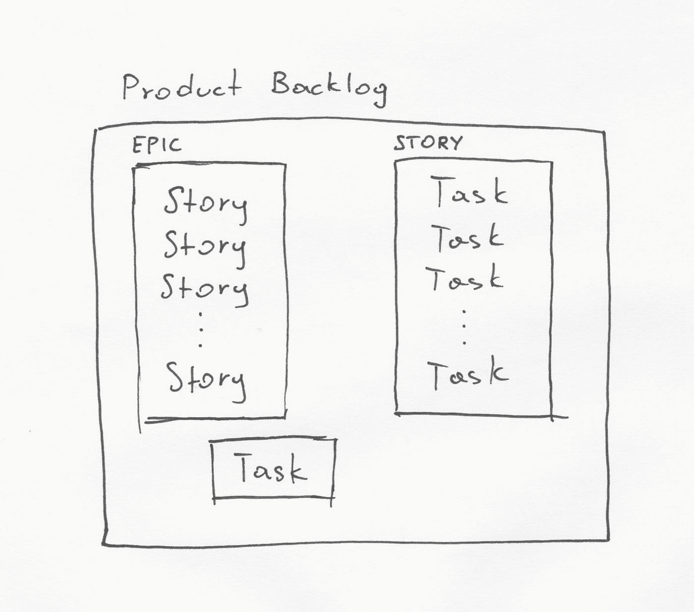
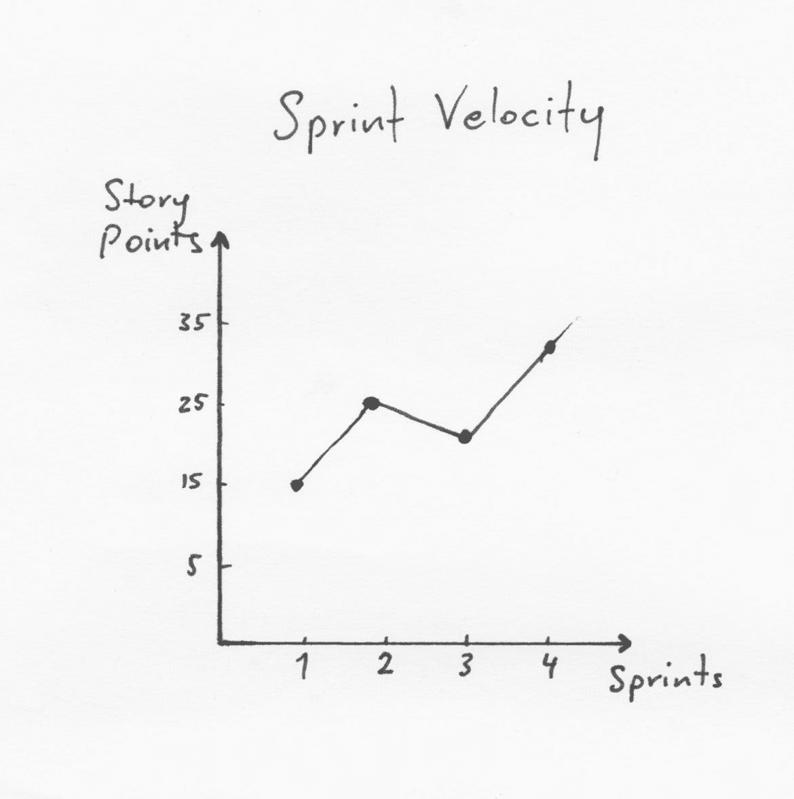

# 实用的 Scrum 概述

> 原文：<https://medium.com/hackernoon/a-practical-scrum-overview-f46810295e8b>

大约 7 年前，我第一次接触到了 Scrum 方法，这是一种 T2 式的敏捷方法。我刚刚在巴黎的一家新兴公司开始了一份新工作，担任移动技术主管。我打算开发一个 iOS 应用程序。在我职业生涯的那一点之前，我已经接触过几个松散地基于[瀑布](https://en.wikipedia.org/wiki/Waterfall_model)或[关键路径方法](https://en.wikipedia.org/wiki/Critical_path_method)的项目管理范例，所以开始使用 Scrum 的迭代性质和灵活性是全新的和令人耳目一新的。从那以后我再也没有回头。

这篇文章旨在描述希望采用 Scrum 的团队需要采取的步骤。许多书都是关于这个话题的。我最喜欢的两个是 [Scrum 和来自战壕的 XP](https://www.crisp.se/bocker-och-produkter/scrum-and-xp-from-the-trenches)和[Scrum——一本袖珍指南](https://www.amazon.com/Scrum-Pocket-Guide-Practice-Publishing/dp/9087537204)。也有很多在线资源，比如 [Scrum Guides](http://www.scrumguides.org/) ，深入探究 Scrum；分析每一步，并提供大量可能适合你的团队、产品或组织的用例。

到目前为止，我的经验让我相信 Scrum 可以应用于几乎任何情况，以及产品生命周期中的任何一点。当然，有一些方言需要熟悉。但是，所需要的只是一个有以前经验的人，或者一个有学习意愿的人。您可以从将基本步骤和角色应用到新项目或已经开始的项目开始。你会一路不断学习。

The Scrum Workflow

**Scrum 角色**

*产品所有者*

这个人负责整个产品。他们的主要职责是将他们的愿景传达给 Scrum 团队的其他成员，以便他们执行并构建一些有形的东西。他们通常必须对产品、用户、竞争和行业趋势有深入的了解。他们的背景可以是任何东西，但产品管理经验肯定是有利的。实际上，产品负责人通过在产品 backlog 中创建任务和故事来履行他们的职责，并在 sprint 规划会议之前对它们进行优先级排序。

*Scrum 大师*

这个角色在我心中占有特殊的位置。可能是因为我在好几个场合都扮演过那个角色。这个人负责帮助他们的团队成员实现他们的目标。顾名思义，Scrum 团队是自我管理的，Scrum master 与他们一起工作。除了为团队提供帮助以实现他们的目标之外，他们还负责在与产品负责人合作时消除阻碍问题。他们通常与客户、用户、利益相关者和合作者交流。他们还保护团队不受干扰，比如不在 sprint backlog 中的新任务被注入其中。

顺便提一下，我见过团队，通常是非常小的团队，在没有 Scrum master 的情况下运行他们的产品。不管你有什么理由，总有人要承担这些责任，因此可能会偏离他们的主要任务；但是如果你尝试了并且成功了，对你有好处！

*团队*

Scrum 团队是个人的集合，他们一起工作来交付被请求的和被承诺的产品增量。他们很小，在 5 到 7 个人之间。他们还负责将产品待办事项转化为冲刺任务；在适当的时候把它们分解成更小的任务。他们必须对每项任务进行评估并实施。换句话说，他们维护 sprint backlog。

**用户故事&任务**

故事包含多种类型的工作，而任务仅限于单一类型的工作。考虑将用户故事分解成任务。用户故事可以在产品 backlog 中找到，因为它们是由产品所有者创建的。这些通常以对最终用户有意义的方式表达。它们可以这样表达，例如:

作为用户我想 *<一些动作或者成就>* 为了< *一些原因>*

当它们以这种方式编写时，你会很快发现一个用户故事可以被 Scrum 团队分解成许多任务。例如，一个用户故事可能需要一个设计师和前端编码器。也许前端有一些网络需要后端的一些基础设施工作。这些任务可以由 Scrum 团队定义，并添加到 sprint backlog 中。

用户故事的集合可以被分组为一个史诗故事。单个的任务，比如 IDE 升级，不一定是组成用户故事的清单的一部分。

**你的产品积压**

产品 backlog 是用户故事和任务的集合。这是一个优先列表，每个项目的优先级由产品所有者决定。最重要或紧急的项目放在最上面。我喜欢 Scrum 的是它的迭代特性。产品 backlog 并不是所有需求的详尽列表。相反，它可以是你心中想要的产品特性的列表；可以重新审视，交错和修饰。产品 backlog 中的项目可以表示为用户故事或任务。

Tasks, Stories & Epics

**冲刺规划，估算&故事点**

一旦你的产品待办事项列表被所有优先的用户故事细化，Scrum 团队就可以开始 sprint 计划过程，他们会将产品待办事项列表中的用户故事转化为 sprint 计划任务。在这里，你是作为一个团队而不是个人来做评估的。

*冲刺持续时间*

在 sprint 规划会议开始时，你必须确保所有团队成员和产品负责人都出席。包括测试人员、设计人员、产品经理和开发人员。一旦每个人都聚集起来，团队必须决定冲刺的持续时间。这可能需要 1 周到 1 个月的时间。你可以选择完全跳过这个决策过程，因为你之前可能已经决定了一个标准的冲刺持续时间，例如 3 周。我不能高度推荐这一点，因为根据我的经验，标准的 sprint 长度给你的团队带来了巨大的流量，并且随着时间的推移，帮助单个团队成员对产品 backlog 项目给出精确和准确的估计。对于一个网络产品或移动应用程序，我最喜欢的时间长度是 2 或 3 周，我也很喜欢 4 周。任何高于或低于这两个数字的东西，看起来都像是一辈子或不切实际。如果你刚开始使用 Scrum 或者一个新产品，你可能想尝试几个持续时间，看看什么对你和你的团队更有效。

*产品积压*

与产品负责人一起检查产品待办事项中的每个用户故事或任务。对于每个项目，他们将提供细节和说明。他们应该提到他们认为可能需要更细致描述的陷阱。团队可能会尝试在某些项目的逻辑或流程中找出一些漏洞，这些漏洞将在会议的这一部分被及时填补。设计师也会加入他们自己的观点。产品经理将详细介绍并传达他们自己的期望。对所有项目重复上面的过程将帮助每个人理解当前 Sprint 的期望，并使任务创建和评估更加简化。如果你错过了什么，那也没什么。团队成员将有空。必须鼓励每个人尽可能多地向每个人提出与特定故事相关的问题。

*创建任务*

至此，您已经准备好为您的 sprint 创建任务了。您可以在您的产品 backlog 中浏览每个用户故事或需求。对于其中的每一项，你都可以用你觉得舒服的任何方式把它们分成更小的任务。您可以将它们分成传统的软件开发生命周期项目，例如文档、单元测试、设计和开发，并且对于其中的每一个项目，您都可以进一步将它们分开。

*故事点*

您已经开始创建任务，现在是时候评估完成每项任务所需的工作量了。这不是时间单位。一个故事点只代表一定量的努力。一个常见的，也是个人最喜欢的故事点值是斐波纳契数列，它是 1，2，3，5，8，13，21，34 等等。您可以选择 21 作为最大值，并尝试将较大的任务分成较小的任务。这取决于你正在开发的产品，但是对于一个网络产品来说，你几乎总能做到这一点。

Burn down chart: Remaing Work vs.Time

因为一个故事点并不代表一个时间值，它对每个 Scrum 团队成员来说意味着不同的事情。在 sprint 规划会议的评估阶段，Scrum 团队可以确定一个基本任务，这个任务对每个人都有相同的故事点价值；或者差不多够了。然后，每个团队成员可以浏览任务列表，并为他们自己的任务分配分数。Scrum 的新手将会发现，在几次冲刺之后，他们将会对自己的速度有一个很好的感觉。

**冲刺&速度**

冲刺是迭代的同义词。它是一个时间单位，包括总任务和用户故事实现的开始，以及产品增量实现的结束。产品增量可以定义为一个发布，它是可以交付给客户、一组用户或另一个团队的产品版本。冲刺是一种有时间限制的努力，意味着它被限制在一个确定的持续时间内。这些持续时间从一周到一两个月不等。从我自己的角度来看，2 到 3 周似乎是一个受欢迎的选择。sprint 在产品生命周期中的长度是固定的，尽管并不是没有听说过每个连续的 sprint 都有可变的迭代长度。我警告不要有动态的冲刺长度，这样随着时间的推移，你的团队速度可以被一致地测量。

速度是团队在迭代中完成的故事点的平均数量。这有助于我们理解我们团队的极限和我们每次冲刺的交付能力。

Work that can be completed in a sprint

如果您与多个团队合作，请避免比较团队速度。速度不是一种比较团队的方法，而是一种帮助他们改进时间和产品增量交付能力的方法。

我注意到，有几次我把 Scrum 介绍给一个组织，并试图说服他们采用它作为自己的选择方法时，人们一听到 sprint 这个词就会立刻眼前一亮。这个词用得非常积极，因为它代表了一种灵活的、速度驱动的方式来实现产品增量。作为提喻，这是启发我在我最早介绍它。

**搞定了？**

如果你已经决定和你的团队一起实现 Scrum，那么你就是在承诺，在 sprint 的最后，你将为你的用户或客户提供一个可交付的产品或产品增量。这意味着 sprint 待办清单中的任务和故事已经被设计、开发、测试并保证了质量。如果符合这些条件，则功能为*完成*。

一旦每个用户故事、它所包含的任务以及 sprint 待办清单中的每个任务都满足了这些接受标准，产品所有者就可以对它们进行审查，以评估它们是否满足标准。一旦他们接受了每个故事或任务，就完成了*。*

每个团队定义的*完成的*可以，甚至更好的是必须事先决定，但如果能交付给客户，最终还是*完成*。

**起来！站起来。**

也称为每日 scrum 会议或“Scrum”。我更喜欢用“站起来”这个短语。这些会议通常在每天的同一时间举行，最好在工作日开始时举行，所有团队成员都应出席。此会议可以在同一地点举行，也可以通过 skype 或 hangout 远程举行。这次会议的目的是确定团队为这一天所做的努力，以造福于每个人。

会议期间，每个人依次发言，并提到以下内容

*   他们昨天做了什么
*   他们今天会做什么
*   是否存在任何“阻止问题”

一个文明、快速、高效的团队会随着时间的推移在团队成员之间建立紧密而具体的关系。我们很容易把这次会议看作是目前进展情况的最新情况，从某种意义上说，它确实是这样。更深层次的方法是，将它视为每个 Scrum 团队成员对另一个团队成员所做的承诺，或者 sprint 进度。

通过让每个团队成员提及他们前一天和当天做了什么，为团队的利益描绘了一幅清晰的画面，展示了已经完成的工作和有待完成的工作。scrum 主管负责自己或者通过指派 scrum 团队成员来移除阻塞问题。实际上，每个团队成员都要轮流解决上述要点。对于一个 5-7 人的团队来说，这可能需要大约 15 分钟，但是如果事先有一些离题的闲聊，这可能需要更长的时间。我参与过的几个团队的一个惯例是，将这次会议的日程安排到很久以后。

**冲刺复习**

在每个 sprint 接近尾声时，如果可能的话，每个人都会参加一个回顾会议。这至少包括产品负责人和 Scrum 团队。每个团队成员轮流完成当前 sprint 中分配给他们的每项任务。这是一次非正式会议，通过描述或产品演示来交流进展和成就。可以出席评审会议的其他人可以是用户和客户。这个回顾是如何根据它的成功来评估 sprint 的。理想情况下，sprint backlog 中的所有项目都是*完成的*。每一个没有完成的项目都会被推到下一个 sprint 要完成的产品待办事项中。一个成功的 sprint 交付了一个产品增量。

**冲刺回顾**

Scrum master 将在 sprint 的最后组织这个会议。通常的嫌疑人可以出席。人们可以讨论什么是正确的，但最重要的是什么是错误的，以及可以采取什么措施，以便在下一次迭代中不会出现相同的问题。团队应该能够回答以下问题:

*   迭代过程中什么是正确的
*   迭代过程中哪里出错了
*   为了改进，可以做哪些不同的事情？

这种会议通常会产生一系列的建议、想法和新流程，这些将有助于团队的改进。对于一个团队来说，能够自我识别可能存在的问题并及时改进他们自己的过程以消除它们是值得的。

**入门**

你可以从 [trello](https://trello.com/b/6otslC4i/template-board-agile-with-trello) 查看这个模板。上面讨论的 Scrum 的每一个支柱都在代表你的产品的 trello 板上显示为一列。

**总之**

如果你决定采用 Scrum 方法，随着时间的推移，你会开始在你的产品中看到结果，最重要的是，你的团队。您的 sprints 将使您的项目迭代得更快并得到改进。您的用户将能够定期提供反馈、评论和意见，希望您能够快速将其反馈到您的产品中。您的团队成员将对自己的自我管理能力充满信心，快速发现问题，并变得更有效率。当然，您的客户会喜欢您发布的可预测性和频率。

谢谢你。

*并感谢*[*@ basha Chris*](http://twitter.com/BashaChris)*为本贴制作精美的手绘图。*

> [黑客中午](http://bit.ly/Hackernoon)是黑客如何开始他们的下午。我们是 [@AMI](http://bit.ly/atAMIatAMI) 家庭的一员。我们现在[接受投稿](http://bit.ly/hackernoonsubmission)并乐意[讨论广告&赞助](mailto:partners@amipublications.com)机会。
> 
> 如果你喜欢这个故事，我们推荐你阅读我们的[最新科技故事](http://bit.ly/hackernoonlatestt)和[趋势科技故事](https://hackernoon.com/trending)。直到下一次，不要把世界的现实想当然！

