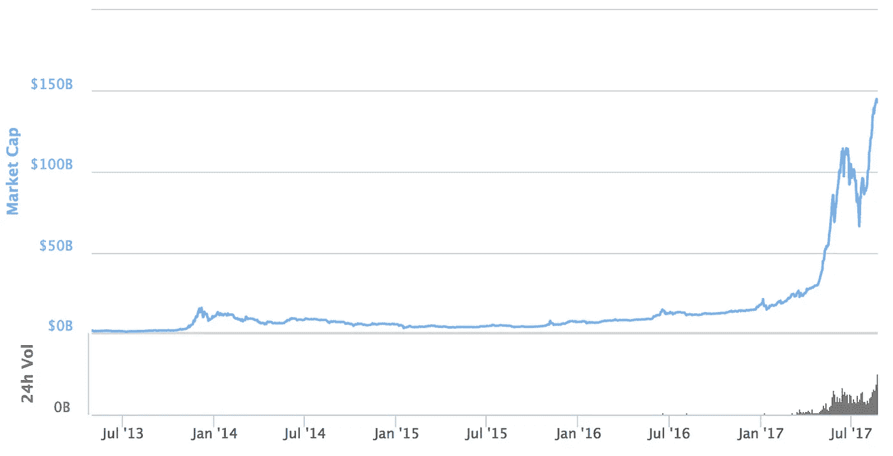

# 区块链、协议和代币销售入门

> 原文：<https://medium.com/hackernoon/a-primer-on-blockchains-protocols-and-token-sales-9ebe117b5759>

Total market cap & 24hr trading volume of all cryptocurrencies over the past 4+ years (via [CoinMarketCap](https://coinmarketcap.com/charts/))

区块链正在改变全球经济的基础，每个人都吓坏了。

固执己见的部落正在引发内战，并“分化”成新的部落。多个激烈的战斗同时发生(大多发生在社交媒体上)，而只有少数外部人士知道发生了什么。

就连被抛来抛去的术语也令人困惑；新技术的快速发展导致了行话共识的缺乏。什么是 ICO 与象征性销售和 TGE？硬币、代币、加密货币是一回事吗？到底什么是“协议”、“道”、“dApp”等等…

**尽管如此，越来越多的人意识到*有一种*方式可以安全、可靠、公开、不可逆地在全球范围内相互转移资产，而不需要中央机构。**

从买方/卖方交易中获利的市场公司(如优步、AirBnB、易贝、亚马逊等)尤其关注。

我们已经进入了这样一个世界，在这个世界中,“信任”正在走向不为任何个人、团体、公司或政府所拥有的分布式机器网络。这些网络拥有坚如磐石的数据完整性、零停机时间以及对任何参与者的财务激励。

这意味着巨大的影响。

我们与货币、信贷、合同、房地产、计算、通信、筹资以及你能想到的几乎任何其他东西打交道的方式都在发生变化。

它正在发生，而且发生得很快。

# 什么是区块链？

简而言之，区块链是存储在计算机网络上的一长串交易(即分布式分类账)。

举个例子，想象一下在一张纸上写字，世界上成千上万张纸神奇地显示出你写的内容。区块链就是这样。

这种分布式分类帐的特殊之处在于:

*   即使网络上的大量计算机瘫痪，它也能巧妙地建立状态共识(即事务)。
*   交易被组织为分类帐中数据块内的带有时间戳的行项目列表。
*   密码术确保过去的交易不能被删除或修改。
*   每个人都可以看到自链开始创建以来的每笔交易的历史。
*   人们在经济上被激励在网络中旋转计算机，这保证了网络的持续存在。

因此，数学保证了区块链的过去，金钱保证了区块链的未来。

# 什么是协议？

我们大多数人习惯于委托银行维护一个适当的分类账，并确保钱不会被“双重花费”但是对于区块链来说，这种信任存在于计算机网络和它们的密码安全**协议**(即管理规则、操作和网络节点间通信的软件)。

例如，今天的互联网运行在相对“薄”的协议层上，如 TCP/IP、SMTP、HTTP 和 HTTPS。这些协议为网络中的计算机建立了规则，以便它们能够有效地进行通信。

在这些协议之上，是一个相对“胖”的应用程序层，如谷歌、脸书、推特等..用来连接数据和人。使用这种设置，集中的组织拥有所有数据，用户需要在多个地方创建新帐户并输入信用卡信息(和其他敏感数据)。这很烦人，尤其是当我们的身份和支付信息被黑客攻击时。

**进入区块链**

区块链也是通过协议来操作和访问的，但是关键的区别在于，代替一些“瘦”协议，大量的利基协议(即“[胖协议](http://www.usv.com/blog/fat-protocols)”)正在被构建，这些协议将支持下一代应用。这种设置允许用户“拥有”他们的数据，并允许开发人员利用多种协议和区块链，为从支付和银行业务到医疗保健和电信的所有业务提供更强大、更安全、更廉价的解决方案。

# 人们如何在区块链上互相转移资产？

在功能上，为了创建交易，类似“钱包”的应用程序被用来在网络上创建“公共地址”(从“公共密钥”中导出)，该地址指示身份。一个对网络隐藏的相关“私钥”授予所有权。

重要的是，发送到区块链的每笔交易必须:

*   被送到公共场所
*   由私钥“签名”
*   包括由为网络供电的计算机收取的交易费(或者只是“烧掉”，取决于区块链是如何设置的)。

这一过程使分类账的大小无限增长，并适当地向机器操作员(即“矿工”)发出信号，表明交易值得处理。如果没有足够的交易费用，矿商就不会费心处理它(这有助于防止垃圾邮件和拒绝服务攻击)。

# 如果我的私钥丢失或被盗，会发生什么？

那么不幸的是你运气不好。从设计上来说，没有一个中央机构可以打电话来帮助你找回它。这就是为什么存储和保护私钥的各种离线解决方案最近变得流行的原因。

*(作为一个有趣的旁白:虽然承诺去中介化像银行这样的机构，讽刺的是，越来越多的加密世界的人把他们的部分或全部私人密钥存储在银行的保险箱里。)*

# 区块链能做什么？

区块链有*效用*去中介化中央当局&瓦解那些储存数据和囤积利润的公司。随着支付、文件存储、计算、借贷、身份、声誉等新协议的出现，市场创新的热潮已经开始:

*   比特币、莱特币、Ripple 等……记录金融交易(威胁传统的“法定”货币)。
*   Filecoin、Storj、Siacoin 等……启用文件存储(威胁云存储提供商)。
*   Steem、Golos、Leeroy 等……付钱让人制作和发现社交媒体内容(威胁 Twitter、脸书、Snapchat、Instagram 等……)。
*   [等等……](https://docs.google.com/spreadsheets/d/1hsRvJyqYh6N-w2-ZYZvz93dR1a-Pl6LMyYa09tfvfWo/edit#gid=0)

当然，这些只是区块链在每个市场的例子。还有大量的其他货币、文件存储协议和社交媒体平台也在崛起(更不用说其他垂直市场了！).

# 区块链能比这更复杂吗？

是的，他们可以。例如，像以太坊这样的区块链可以存储包含可执行代码的事务。这意味着现在可以在一个分散的网络上编写一个计算机程序，根据预先定义的合同条件移动资产。

换句话说，任何人现在都可以做一些事情，比如[立遗嘱](http://hack-igations.blogspot.com/2014/11/ethereum.html)在规定的时间间隔内分配金钱，[创建自己的数字令牌](https://www.ethereum.org/token)来代表某些东西(比如资产、部分资产或俱乐部会员资格)，或者[编写一系列规则来管理一家公司](https://www.ethereum.org/dao)(甚至是整个国家！).

总的来说，我的朋友康拉德( [@lisperati](https://twitter.com/lisperati) )最近给我写了以下重要观察:

> “使区块链不同于数据库(并使以太坊不同于“计算机”)的一个原因是，区块链本质上只不过是协议:任何人都可以编写自己的软件，将其连接到以太坊网络，只要遵循以太坊协议，它就会完全像以太坊一样处理交易。区块链是计算机软件的一种“协议化”

# 硬币是什么？

比特币、莱特币、Ripple 等加密货币..在区块链的交易中记录的仅表示数值变化的(例如“X 将 1.34 发送给 Y”)是“硬币”

# 什么是代币？

虽然经常听到“硬币”和“代币”互换使用，但这两个词有很大的不同。硬币是一种相对简单的代币，而代币可能——而且经常——比硬币复杂得多。

令牌是一个复杂的主题，因为并非所有令牌都是相同的。各种类型目前有不同的名称，但可以肯定的是:

*   **资产令牌**代表资产的所有权(例如，公司、风险投资基金、一件昂贵的艺术品等……)。BCAP 就是一个例子，它代表着区块链资本第三支基金的所有权。
*   **用法** **令牌**(又名“Use”、“Protocol”、“Intrinsic”或“Native”令牌)作为交易费用写入区块链。比特币就是这里最常见的例子。
*   工作令牌允许所有者贡献、管理和/或“工作”区块链。一个例子是 Maker (MKR)，它赋予所有者管理一个组织的能力，该组织管理基础硬币的稳定性(戴)。
*   **混合令牌**具有上述两个或多个属性。例如，Filecoin 将既是一个使用令牌(你需要它来使用系统)，也是一个工作令牌(你需要拥有一些来提供文件存储)。

并澄清关于代币和硬币的一些其他可能混淆的术语:

*   **ERC20 令牌**可以是任何符合关于如何访问信息、转移资产和触发事件的 [ERC20 令牌标准](https://theethereum.wiki/w/index.php/ERC20_Token_Standard)的令牌(通常在以太坊上创建)。这使得开发人员可以更容易地创建应用程序，如支持各种令牌的钱包。
*   **App coin** (或“App coin”)**是用于资助项目的代币的旧术语。当你阅读 6-12 个月前的文章时，你会经常看到这个术语。当你遇到这个术语时，就想想“token”**
*   ****Alt coin** (或“Alt coin”)是一个为自己的区块链提供能量的 appcoin。根据定义，除了比特币(如以太坊)之外，任何这样做的硬币都是替代硬币。**
*   ****元币**(或“元币”，或使用比特币时的“彩色硬币”)是一种建立在已经有基础硬币的区块链之上的代币。如今，人们只是使用术语*代币*，当项目所有者以自我描述的“初始硬币发行”的方式产生和出售代币时，这可能会令人困惑。**
*   **顺便说一下，加密货币是任何记录在区块链上的代币，可以作为货币在市场上交易。**

# **所有协议都是用相关令牌创建的吗？**

**不。让你更困惑(或启发)的是，协议可以用或不用相关的令牌来创建。**

**一个例子是在[发生的事情预示着](https://augur.net/):**

> **“Augur 将预测市场的魔力与分散网络的力量结合起来，创造了一个惊人准确的预测工具——以及获得真实货币交易利润的机会”**

**你应该通过他们的[白皮书](https://bravenewcoin.com/assets/Whitepapers/Augur-A-Decentralized-Open-Source-Platform-for-Prediction-Markets.pdf)了解更多关于 Augur 的信息，但对于我们这里的目的，重要的是要知道他们使用协议令牌(REP)运行他们的网络，这是一个*工作令牌*，允许所有者报告市场试图预测的事件的结果。REP 本身就是一个有[可交易市值](https://coinmarketcap.com/assets/augur/)的代币。**

**此外，Augur 利用另一个独立的协议(你也可以在他们的[白皮书](https://bravenewcoin.com/assets/Whitepapers/Augur-A-Decentralized-Open-Source-Platform-for-Prediction-Markets.pdf)中读到)来处理买家和卖家之间的令牌交易。根据设计，该协议与令牌无关。**

**因此，协议和令牌是非常开放和灵活的。**

# **什么是首次硬币发行(ICO)？**

**这个流行语——虽然听起来像首次公开募股(IPO)，但却很吸引人——是用词不当。如今，大多数“ico”被更准确地描述为代币销售或“代币生成事件”(TGEs)。**

**实际上，代币销售是筹资活动，可能发生在(1)公司推出之前，(2)产品正在制造中，或者(3)产品已经上市一段时间之后。如今大多数代币销售都是通过以太坊上的 ERC20 代币完成的。**

**过去和未来的代币销售清单可以在这里找到。**

**不久，我们将看到代币销售成为新公司和现有公司的默认融资机制。这将为投资者提供更具流动性的资产(即能够快速用代币购买或出售商品)。此外，除了他们筹集的资本，创始人还保留了他们所持代币的流动性。这实质上导致了双重筹款活动！**

**这是对现状的一个极其有力的改变。**

# **什么是 dApps？**

**讨论了区块链、协议和令牌之后，加密世界中技术堆栈的最后一层是面向消费者的平台和应用程序。术语“dApp”指的是“分散的应用程序”，长话短说，这意味着它建立在一个或多个分散的区块链、协议和令牌之上。**

**645+dapp 的庞大列表可以在[https://dapps.ethercasts.com](https://dapps.ethercasts.com)找到**

# **什么是智能合约？**

**智能合约(SCs)由以太坊背后的人所流行，它是包含在区块链上的交易中的可执行代码，根据一组条件(即“合约”)执行预定义的规则。因此，根据定义，SCs 是事务协议；它们根据编程指令在各方之间可靠地移动资产。**

**事实上，以智能合同形式写入以太坊区块链的新协议经常被创造出来。例如，嵌入代币的 SCs 定义代币购买者和生成者之间的“谁”、“什么”、“何处”和“何时”。如今许多代币销售都是交付尚未创建的代币的协议(例如 [Filecoin 最近的代币销售](http://filecoin.io/))；相关的 SC 被编程为一旦新令牌变得可用就适当地分发它们。**

# **道是什么？**

**Dao 是由智能契约管理的“分散的自治组织”。DAOs 不应与“The DAO”混淆，后者在 2016 年 5 月进行了一次象征性出售，以筹集约 1.5 亿美元，其中约 5000 万美元在几周后被黑客窃取。这导致了该组织的关闭和以太坊社区的一个分支，此前领导人决定回滚代码，并将钱还给受害者。**

**今天活跃的 DAO 的一个例子是[制造商](https://makerdao.com/)，如上所述，它授予 MKR 代币持有者管理基础货币(DAI)的权利。MKR 代币持有者的工作是最小化货币对国际货币基金组织储备资产特别提款权的价格波动。你可以通过阅读他们的白皮书[在这里](https://github.com/makerdao/docs/blob/master/Dai.md)深入了解和戴。**

**总的来说，Dao 的未来可能是在自主组织中，例如，使用编程规则进行操作的全球无人驾驶汽车车队。他们可以不归中央政府所有，而是自己拥有自己，用利润来扩充车队，自己开车去修理店，支付服务费等等…**

**所以，是的，优步& Lyft，做好被一个或多个机器人、人工智能驱动的 Dao 破坏的准备。**

**作者注:提前感谢对本文的任何/所有反馈、更正和评论。总的来说，这是一个思考新协议和用分散式基础设施解决有趣问题的绝佳时机。 [*订阅我的简讯*](http://wclittle.us5.list-manage.com/subscribe?u=e0dcd463a855cae724998d8f5&id=030549b371) *当我写更多关于区块链、协议、代币销售、创业以及偶尔的健康基础科学&健身话题时，我会让你知道。特别感谢* [*安德鲁*](https://www.linkedin.com/in/andrewcronk/)*[*戴夫*](https://www.linkedin.com/in/redsquirrel/)*[*迈克*](https://www.linkedin.com/in/wilkersonmike/)*[*托尼*](https://www.linkedin.com/in/tony-little-nd-4068273/)*[*JC*](https://www.linkedin.com/in/jchiatt/)*[*谢伊*最后但同样重要的是，记得在下面评论，点击鼓掌按钮，和/或与朋友分享这篇入门文章，如果你觉得它有帮助的话。谢谢！](https://www.linkedin.com/in/shayhowe/)*******