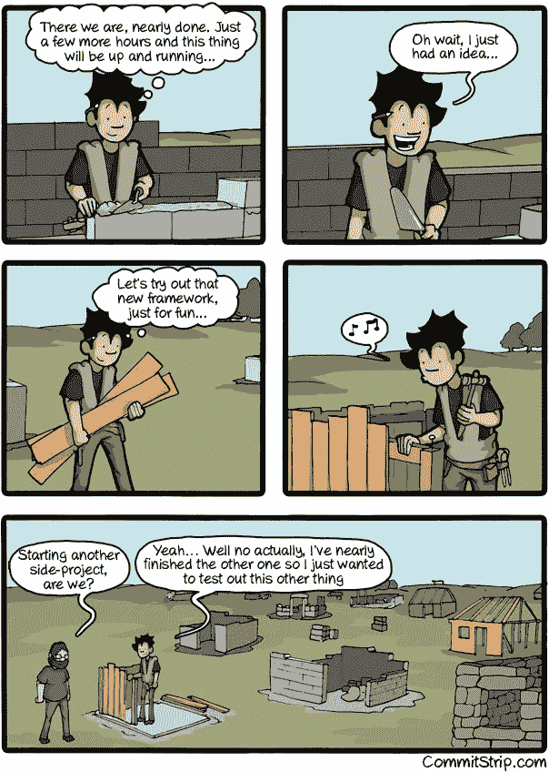

# 帮助你挑选下一步工作的最佳辅助项目的快速指南

> 原文：<https://medium.com/hackernoon/a-quick-guide-to-help-you-picking-up-the-best-side-project-to-work-next-30e284e2b2f7>

我非常支持兼职项目，我花了大量的空闲时间在这些项目上。原因如下:

1.  你有机会尝试现代/有趣的技术，而这些往往是你在日常工作中无法做到的。
2.  你可以改变端到端的产品工作。意义，从构思，到部署，到营销。你将获得日常工作中通常委托给其他团队的事情的第一手经验。
3.  这有助于建立网上形象，而且肯定不会对你的简历、职业、人脉和职业发展造成任何伤害。
4.  取决于你决定做什么，这就像买一张彩票，如果你赢了，你将能够获得被动收入。

通常，当我想学习新技术时，我会建造一些真实的东西，因为弄脏你的手是确保你做对的唯一方法。你需要那些“啊哈！”仅仅通过阅读/观看教程你不会拥有的时刻。大多数人都会开发待办事项应用。我的第一条建议是:不要。**如果你要把你超级宝贵的时间花在某件事情上，确保至少花在那些最不可能给别人增加价值的事情上。做点有用的东西。**

然而…

> 苦涩的事实是:毋庸置疑，大部分旁支项目都会“失败”。大多数甚至没有达到第一个版本，而那些达到了的，通常最终会成为废弃的软件。波涛之下，GitHub 是一片墓地。

就连因[成为 ProducHunt 最多产的制作人之一而闻名的](https://www.indiehackers.com/podcast/025-mubashar-iqbal-ph-maker-of-the-year)[Mubashar Iqbal](https://twitter.com/mubashariqbal)也不能幸免。

这篇文章将帮助你选择一个最大化你不被统计的机会。

## 建造一些能解决你现有问题的东西

我是科特兰·艾伦(Courtland Allen)的 T2(indie hacker)的粉丝，我阅读了大部分创始人访谈，并收听了每一个播客。*大多数成功的故事都是关于那些自己解决了一个难题的人*，或者那些在某个特定行业工作多年的人，他们有足够的第一手经验知道他们可以做得更好。对于兼职项目，我强烈推荐第一个:**做一些能解决你的痛苦的事情**。出于几个原因:

1.  你可能已经在网上进行了广泛的搜索，但没有找到任何可以解决这个问题的方法，而这正是你想要的。
2.  你已经有客户了:你。让你成为一个日常用户，会让你更容易发现你的产品的缺陷和可以改进的地方。
3.  世界之大足以让我们有理由相信，如果你真的能够提供比替代品更好地解决你的特定问题的东西，会有更多的人对你正在做的事情感兴趣。

## 做一些简约的东西。我是说，真的。

相信我:如果你是一个有经验的开发者，你很可能会**高估你自己的能力**。感觉自己一个人比在组织里更有效率是很正常的，这在一定程度上是真的。对于一个 200 小时的项目，是的，你一个人会更有效率，因为:

1.  你不必花几个小时在毫无结果的会议上。
2.  你不需要说服任何人相信你自己的观点。
3.  你的代码将超级一致，并严格遵循所有的代码惯例:你的。
4.  你必须写更少的文档和测试，因为你知道，所有的开发者都知道 100%的代码。我是说，你。

真正的问题在于，当你认为你，孤独的狼，或者你的 2 到 3 个同事，在你的业余时间，将能够建立一些东西，在现实中，将需要一个全职团队。再次，**真的很容易高估自己的能力**。交付一个真正的软件项目是一个艰苦的挑战，不管它表面上看起来有多简单。我失败了多次，直到我意识到，我只会船舶的东西，如果我保持最低限度。想想看，例如，交付一个什么都不做的 *SaaS 项目有多难*:你还得考虑认证、授权、用户管理、电子邮件确认、构建、部署…

此外，理想的策略是寻找可以从微小开始但仍有改进空间的东西。这里的挑战是，越来越难找到简单的想法，仍然没有近乎完美的竞争对手。正如我提到的，我尽量不去做我认为没有机会给别人增加价值的事情。但是相信我，在这个广阔的世界上还有很多事情要做。

## 建立一些你在 3 年后仍会感兴趣的东西，并致力于维护它。

令人惊讶的是，今天很容易找到世界上最好的想法，明天就放弃它去做下一件大事(加入酒精以获得额外的效果)。在开始做某件事之前，一定要三思而后行。请帮你自己这个忙。

例如，如果你正在建立一个图书馆，**它绝对保证你会放弃它**，除非你或你工作的公司从长远来看确实会用到它。相信我:**不要构建和开源你不会用的库**。你将不可避免地失去兴趣，并给社区中所有相信你会继续维护它的人带来巨大的麻烦。库比应用程序更需要维护，特别是因为依赖关系。如果您库依赖于 React，您必须更新它才能继续使用 React 16、17 等等。再次强调，在开始某件事并将其公之于众之前，要三思而后行。你必须承诺。

## 不要构建社区/社交驱动的应用。如果你正在构建一个网络或移动应用程序，构建尽可能简单的工具或游戏。

[脸书](https://techcrunch.com/2017/10/16/facebook-acquires-anonymous-teen-compliment-app-tbh-will-let-it-run/)最近斥资数百万收购了 **tbh** ，这证明尽管面临来自 [FAANG](http://www.investopedia.com/terms/f/faang-stocks.asp) 的激烈竞争，小公司仍有可能创新并发布社交应用。酷吗？当然，但是不要做它。原因很简单:就社交应用而言，与让它流行起来的努力相比，应用本身的开发只是沧海一粟。想象一下，例如，建立一个市场来帮助寻找附近的专业人士，如 [ThumbStack](https://www.thumbtack.com/) 。在应用程序完成后，现在你和你的团队需要绝地级别的营销技巧和大量资金来让它流行起来，因为在应用程序流行之前，你没有足够的专业人士来注册，而在它获得大量专业人士之前，它不会变得任何流行。TL；大卫:超出你的能力范围。不要这样做。

建立人们可以独自享受的最简单的工具或游戏。如果在制作应用的整个过程中，你最终建立了你认为人们会感兴趣的库，考虑在 GitHub 上开源它们。

## 传播消息

在你发布你的副业项目后，你要做的是:

1.  如果它是一个网络/移动应用程序，发布到 [ProductHunt](https://www.producthunt.com/) 上。
2.  在可能感兴趣的子 reddits 上发布。
3.  如果你有一个微小的变化[黑客新闻](https://news.ycombinator.com/)会感兴趣，张贴它像*“展示 HN:看看我做的这个很酷的东西。你怎么看？”*。对于 [IndieHackers 论坛](https://www.indiehackers.com/forum)也是如此，但是从*展示 IH:*开始。
4.  发微博和写博客:你做了什么；你在整个过程中获得的经验；你学到了什么；你本可以做得更好/不同的地方；Stats(人们喜欢 stats)；你对未来的计划。如果你失败了，也写下来。

## 收场白

努力工作；一夜成名是童话；不断倾听你的用户；从一个 MVP 开始，致力于逐步改进，为自己节省时间去做一些你不会去做的事情。

我祝你好运。黑客快乐！❤

想了解更多关于我的信息，请访问 https://aboutdevs.com/andrerpena