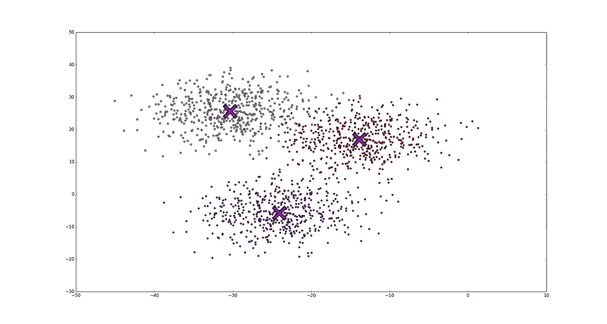
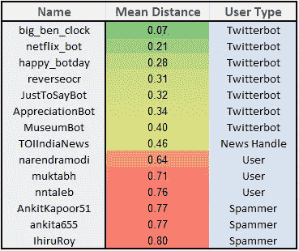

# 使用人工智能识别推特机器人的快速指南

> 原文：<https://medium.com/hackernoon/a-quick-guide-to-identify-twitterbots-using-ai-c3dc3a7b817f>

在我们上一篇[博文](https://blog.karna.ai/using-ai-to-combat-the-menace-of-fake-accounts-on-social-media-8af96bc71842)中，我们讨论了如何识别 Twitter 上的“虚假账户”或“潜在垃圾邮件制造者”。重要的是过滤掉这些信息，以获得最可靠和准确的见解。许多公司和个人已经将这个游戏向前推进，并使用 Twitterbots 机器人来自动化和加速内容交付。一项[研究](https://arxiv.org/pdf/1703.03107.pdf)估计 twitter 上活跃的机器人数量可能高达用户总数的 15%。

最初，推特机器人是为了减少人类的努力。以[网飞 Bot](https://twitter.com/netflix_bot\) 为例。每当网飞上增加新的节目或电影时，它都会发推特。

Netflix Bot in action.

也有一些非同寻常的。例如，有人创造了一个非常智能的大本钟在线版本，正如下面的推文所示，它标志着每个小时的过去。既然人类在网上花费的时间越来越多，我们的纪念碑也开始在网上出现只是时间问题:)。

> BONG BONG BONG BONG BONG BONG BONG BONG BONG
> 
> —大本([@ Big _ Ben _ clock](http://twitter.com/big_ben_clock))<a href = "[https://Twitter . com/Big _ Ben _ clock/status/864058030408822784？ref _ src = tw src % 5 etfw](https://twitter.com/big_ben_clock/status/864058030408822784?ref_src=twsrc%5Etfw)">2017 年 5 月 15 日</a></block quote>
> 

但是，有一大群推特机器人在平台上发布大量恶意和垃圾内容。我相信你也可以在你的关注者列表中找到一些。根据维基百科，机器人在 2016 年美国总统大选中扮演了一个角色。

**推特机器人在美国总统选举中的作用**

> Twitter 机器人的一个子集被编程来完成社交任务，在美国 2016 年总统选举中发挥了重要作用。研究估计，在最后一场辩论中，亲特朗普的机器人为每个亲克林顿的自动账户生成了四条推文，在相关标签上的推文数量是亲克林顿机器人的 7:1。欺骗性的 twitter 机器人愚弄了候选人和竞选团队成员，让他们转发与煽动性理想相关的被盗用的言论和账户。
> –[维基百科](https://en.wikipedia.org/wiki/Twitterbot#Impact)

推特机器人和垃圾邮件发送者试图通过不断宣传假新闻和观点来掩盖其他用户的观点。鉴于不需要人类的努力，机器人可以不知疲倦地持续发布关于某个主题的微博，并帮助它成为趋势。对于政治分析师、市场研究员或任何其他寻求使用社交媒体进行深入分析的人来说，识别和过滤掉这些机器人以获得真正公正的意见非常重要。

# 假设

我们在社交媒体上识别机器人的人工智能驱动方法背后的想法是基于这一假设:“机器人发出的推文与非常狭窄的主题/背景相关，而人类的推文则更加多样化”。

# 我们是怎么做到的？

为了使用这种方法来自动识别机器人，我们抓取了大量 Twitter 账户样本发布的最新推文。对于每个帐户，我们将推文文本转换为向量，并通过检查这些推文的平均距离度量来计算相似性。我们确保了账户样本的多样性。

如果一个句柄发布关于相同话题和主题的推文，由于语义相似性，推文(单独的数据点)将紧密地位于超空间中。这些紧密包装的相似推文形成一个集群。我们可以通过计算任意两个数据点之间的余弦距离来量化相似性。

A representation of clusters

下表显示了分析结果。这里，平均距离是各个数据点之间所有余弦距离的平均值。平均距离越小，推文越相似。显然，你可以从表中推断出这一点。前面提到的大本钟机器人在被选中的机器人中平均距离最低，因为它的帖子只包含单词“BONG”。

Mean Distance Table

我们还选择了一些“垃圾邮件发送者”的账户，以突出机器人和垃圾邮件发送者之间的区别。垃圾邮件发送者有时会发布多个主题，但机器人通常会发布一个特定的主题*(我们做了类似的分析来检测垃圾邮件发送者的帐户。你可以在这里查看***)*。因此，它们的平均距离远远大于机器人的距离。请注意，[*toindiannews*](https://twitter.com/TOIIndiaNews)*(领先的印度新闻出版商)*的平均距离更接近机器人的平均距离。通常，这样的句柄遵循一个标准化的结构来发布新闻。因此它具有相对较小的平均距离。*

# *机器人对现实世界的影响*

*我列举了几个推特机器人很有影响力的例子，以及为什么识别它们很重要。*

*   *社交媒体上的粉丝数量被认为是衡量名人受欢迎程度的指标。*但真的是这样吗？如前所述，大约 15%的 Twitter 用户可能是机器人。因此，追随者的数量并不能作为受欢迎程度的具体衡量标准。在 2012 年美国总统选举期间，据[报道](https://www.forbes.com/sites/kashmirhill/2012/08/09/the-invasion-of-the-twitter-bots/)巴拉克奥巴马的 29.9%的追随者可能是机器人/假的，而米特罗姆尼的这一数字约为 21.9%。移除机器人和垃圾邮件发送者后的关注者数量可以作为更好的流行度指标。**
*   *推特机器人表示，在 2016 年美国总统选举期间，他们通过发推特和转发大量支持特朗普的内容来影响选民的意见。如前所述，**支持特朗普的机器人为每个支持克林顿的自动账户生成了四条推文，在最后一场辩论中，支持克林顿的机器人在相关标签上的推文数量为 7:1。**这些机器人分享的一些内容是虚假和欺骗性的。因此，清楚地识别这些机器人以从真实的人那里获得观点和意见变得非常重要。*
*   *最近结束的法国总统选举也见证了机器人的参与。就在选举前，网上发布了大量与埃马纽埃尔·马克龙有关的 9 GB 机密竞选文件。推特机器人在选举前的几个小时里一直在发布这个话题，并帮助这个话题成为热门话题。尽管如此，这似乎对结果没有什么影响，因为马克龙轻松获胜(我们使用人工智能正确预测了这一点)。*
*   *假设一个品牌雇佣了一个营销代理来进行宣传活动。然而，要判断该活动的有效性，重要的是要了解该活动的病毒传播是否是由于垃圾邮件发送者/机器人的推动。在这种情况下，它可能会对品牌产生负面影响，品牌将陷入追随者数量增加的误区。这些机器人不是真正的顾客。因此，对品牌来说，这是一种两头都吃亏的事情。*

*这些是机器人影响观众观点的几个值得注意的地方。尽管机器人本应在社交媒体中扮演更好的角色，但现在在 Twitter 上主要被视为垃圾邮件。社交媒体平台正在不断优化，以对抗这种威胁。像任何其他技术一样，如果合乎道德地使用，机器人可以在许多方面帮助你。它可以在客户支持、市场营销和一般业务发展方面为您提供帮助。有趣的时代就在前方，因为未来为机器智能时代打开了大门。智能人工智能算法可以帮助我们逐步淘汰社交媒体平台上的垃圾邮件、机器人和虚假内容。*

*上述研究由 ParallelDots Inc. [的市场研究部门](https://www.paralleldots.com/) [Karna AI](http://karna.ai/) 进行，parallel dots AI API 是 ParallelDots Inc .提供的深度学习支持的 web 服务，可以理解大量非结构化文本和视觉内容，为您的产品提供支持。您可以查看我们的一些[文本分析 API](https://www.paralleldots.com/text-analysis-apis)，并通过填写此处的表格[联系我们，或者在 apis@paralleldots.com 给我们写信](https://www.paralleldots.com/contact-us)*