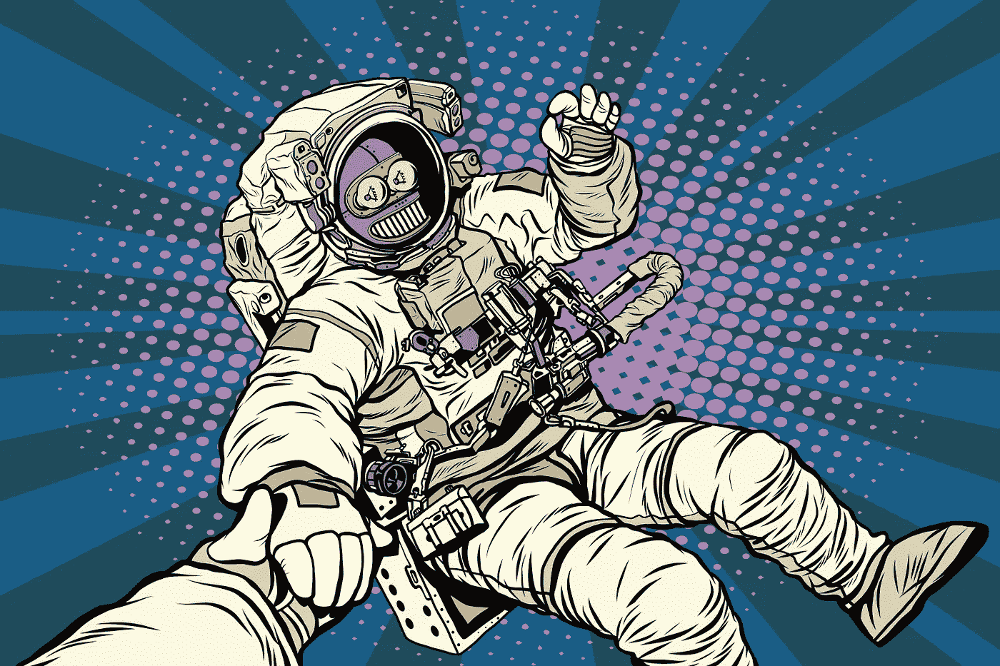
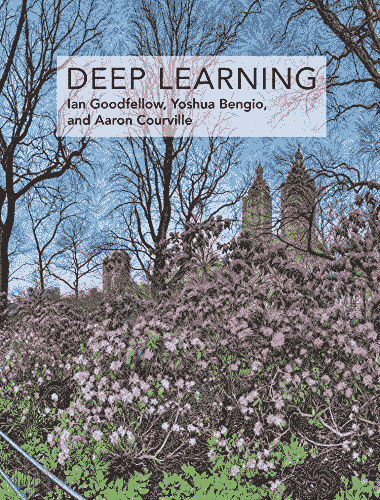
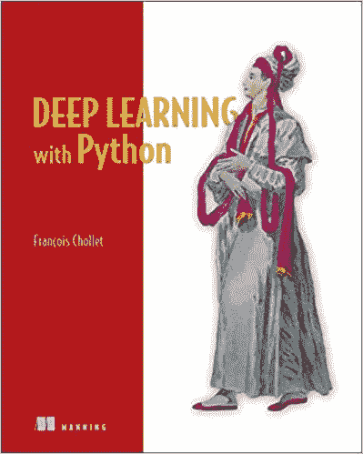
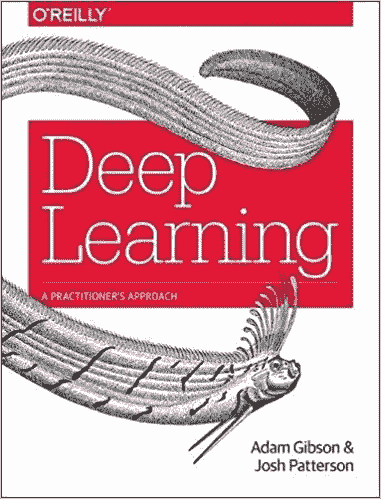

# 最新深度学习书籍综述

> 原文：<https://medium.com/hackernoon/a-roundup-review-of-the-latest-deep-learning-books-6e5df4b0f3d3>

多年来，没有人想阅读人工智能。这是一个研究的死水，解决玩具的问题，同时在现实世界的挑战中崩溃和燃烧。

但随后出现了一连串看似一夜之间的突破:

图像识别；自动驾驶汽车；阿尔法行动。

在大规模并行芯片和大数据集的推动下，上世纪八九十年代首次出现的旧算法突然开始发挥作用。

现在，研究人员正在竞相填补你书架上的空白。在过去的一年里，他们敲打着键盘，以手指所能承载的最快速度写作，希望以一本精彩的书击败对方进入市场，满足对深度学习知识日益增长的渴望。

第一批书已经上架了。今年夏天和明年初会有更多的人来。我有机会通读了他们的一些早期草稿，我非常兴奋地看到他们中的一些终于上线了。

因此，让我们深入了解一下最好和最差的书籍，开始学习人工智能或推进你对这门艺术的初步理解。

# 平衡动作

我的父亲总是说“平衡在所有事情中是最好的。”

我以这些话为生。

好吧，你猜对了，我偶尔会在周末或者在拉斯维加斯忽略他们。

也就是说，它们反映了我的学习风格。我喜欢理论和实践的平衡。用清晰的语言告诉我一个想法背后的背景，然后让我用实际例子进行实验。

但是不要给我太多理论。学的时候想把手弄脏。如果一本书过于抽象，或者在没有上下文的情况下给我一堆例子，我会很快失去兴趣。

也就是说，尊重你自己的学习方式。知道自己怎么学最好。如果你喜欢一本有一页又一页详细理论的书，那就假装你正在用逆向过滤器阅读我的评论。去买所有我讨厌的书，忽略我喜欢的书！

但是如果你是那种喜欢平衡教学风格的人，那么这就是你的清单。

跑，不要走，到亚马逊，一键点击这些深度学习的奇迹。

# **竞争者**

我们的第一个挑战者是**伊恩·古德菲勒的** [**深度学习**](http://amzn.to/2q4UHRl) 。没有这位谷歌大脑和开放人工智能研究明星的工作，任何名单都不会完整。已经有一些人认为它是深度学习的圣经，是唯一一部将几十年的研究汇集在一部宏伟巨著中的书。

但是除非你有很好的数学背景，否则这绝对不是开始的地方。这只会让你沮丧。

它不仅充满了一页又一页的 [mego](http://www.urbandictionary.com/define.php?term=mego) 诱导方程，它还写在灰尘干燥，教科书散文。虽然你不得不尊重 Goodfellow 的聪明才智和他尽可能多的塞在两个封面之间的愿望，但这并不完全有利于引人入胜的阅读。

原因很简单。知道一件事和教它是不同的。我怀疑这本书会在明年第一次在大学报名参加深度学习课程的许多有抱负的学生手中结束。

这将迫使他们中的许多人退出。

如果你想在多年的学习后掌握深度学习，这本书可能适合你。世界上没有比这更全面的指南了。这本书已经假定了很多领域知识。但是，如果你刚刚开始或第一次作为一名专业程序员来到 AI，这本密集的教科书会让你有所期待。

接下来有 [**用 Scikit-Learn 动手学习，还有 Tensorflow**](http://amzn.to/2pb1vjk) 火热出炉！虽然这本书也充满了方程，但它仍然具有难以置信的可读性。事实上，这是彻头彻尾的惊人。我怎么推荐都不为过。 [**学习 AI if You Suck at Math 文章系列**](https://hackernoon.com/learning-ai-if-you-suck-at-math-8bdfb4b79037) 深陷本书债务，尤其是[关于用卷积神经网络进行图像识别的第五篇](https://hackernoon.com/learning-ai-if-you-suck-at-math-p5-deep-learning-and-convolutional-neural-nets-in-plain-english-cda79679bbe3#.xjah79lsd)和[关于自然语言处理的第七篇](https://hackernoon.com/learning-ai-if-you-suck-at-math-p7-the-magic-of-natural-language-processing-f3819a689386)。作者 Aurélien Géron 有一种方法可以让普通读者理解复杂的主题，我试图以自己的风格来反映这一点。

在我看来，这无疑是解释精美的例子和可行的代码之间最完美的平衡。我在网上的 Safari 书籍上看过它的早期草稿。即使有许多部分没有完成，网站把一些方程的部分变成了难以理解的混乱，它仍然是一个了不起的读物，真正提高了我的理解水平。

最终发布的版本比最初的草稿有了很大的改进。像所有好的改写一样，它使整本书更好。想法和例子更清晰，更好地解释。它也以一种更自然的流程组织起来，以足够的清晰度和足够的深度将主题带向实验，并在第二次重读时回过头来学习更多。你可能会发现自己第一次跳过了大部分方程，只是为了回去更仔细地研究它们。

排名第三的是 Keras 创作者 Francois Chollet 用 Python **深度学习的[。这是那种不能很快出版的书。立即预订这一个。我通过曼宁出版社的 MEAP 项目，也就是曼宁早期访问，阅读了前三章。虽然仅凭三章就给出我的最佳推荐似乎为时过早，但我毫无保留地这么做了。有那么好。](http://amzn.to/2pUOScO)**

正如 Chollet 在 Keras 中用代码简化复杂概念的诀窍一样，他在写作中也采用了同样引人入胜、可读性极强的风格。这本书让人们很容易理解人工智能和深度学习最具挑战性的方面。在我读这本书之前，我对张量一无所知，但他帮助我冲破迷雾，看清了它们的本质:代表数字的桶。正如你所料，这本书也有一些优秀的例子，考虑到 [Chollet 的 Github](https://github.com/fchollet/keras/tree/master/examples) 充满了 Github 上一些最分叉的 AI 代码。

我只能看着这本书越来越好，越来越接近发布。现在就抓住支持他。如果你能得到一份关于 MEAP 的拷贝，也这样做。你甚至可以通过向他本人提供反馈来以真正的开源风格改进这本书！

[**《深度学习:实践者的方法》**](http://amzn.to/2oWAuPT) 是我们榜单上的第四本书。它主要关注 java 框架 [DL4J](https://deeplearning4j.org/) 。虽然如此多的人工智能研究是在 Python 中完成的，但随着越来越多的企业采用机器学习，我们很可能会看到大量工作转移到 Java。Java 仍然是大公司的头号语言。它是可移植的，可重复使用的，并且有一群受过传统训练的程序员，他们比其他任何人都了解它。

这本书的另一位作者乔什·帕特森将在 5 月的第一周红帽峰会(Red Hat Summit)上为我介绍 T2 的人工智能。我有机会通读了这本书的印刷版本，它非常棒。需要说明的是，这是第一次学习者关于深度学习的书。如果您已经有了一些背景知识，并且只想了解 Java 上的 DL，那么您可以跳到下面的示例。但如果你有一点或没有 DL 经验，并且有很强的 Java 基础，这是一本你会从头到尾读一遍的书。第四章:深度学习的主要架构是一个特别突出的例子。它提供了一个很棒的关键架构集合，可以帮助您解决当前的实际问题。

尽管从任何角度来说我都不是一名 Java 程序员，但我已经和我的一些同事分享过这种语言，他们生活和呼吸着这种语言，并且热爱这种语言。我发现，作为对 DL 的介绍，这本书的示例和整体组织接近完美。预计将在夏末发布。

上一篇我们有 [**TensorFlow 机器学习烹饪书**](http://amzn.to/2pr66P1) 。这本书有一点拼写错误，包括在代码中，但总的来说，它在自然语言处理等各种主题上提供了许多不错的例子。

也就是说，我不会考虑单独购买这本书。

像任何一本烹饪书一样，它把很多更深层次的解释留给了其他的书，并且几乎专门关注代码。如果你还不知道卷积神经网络的来龙去脉，你将很难搞清楚很多概念，而且它们都没有被公开。如果你想买这本书后，你读了其他人和实验与他们的所有例子，这一个可以帮助你与额外的实践和练习。不要从它开始。

# **这就是**

今后还会有更多的书问世，现在也已经有更多的书出版了，但我还没有机会去看。在接下来的几个月里，如果我有时间回顾一下其他领域，我还会再进行一次综述。但就目前而言，你不能在一些绝佳的选择上犯错。

那你还在等什么？

开始吧。

深度学习的力量现在掌握在你的手中！

############################################

**如果你喜欢这个教程，如果你能把它推荐给其他人，我会很乐意效劳。之后，请随时电邮文章小康给朋友！非常感谢。**

###########################################

关于我:我是一名作家、工程师和连续创业者。在过去的二十年中，我涉及了从 Linux 到虚拟化和容器的广泛技术。

*你可以看看我的最新小说，* [***一部史诗般的中国科幻内战传奇***](http://amzn.to/2gAg249) *在这部小说中，中国摆脱了共产主义的枷锁，成为世界上第一个直接民主国家，运行着一个高度先进的、人工智能的去中心化应用平台，没有领导人。*

## [加入我的读者群，你可以免费得到一本我的第一部小说《蝎子游戏》。读者称之为“神经癌的第一次严重竞争”和“黑色侦探会见约翰尼记忆术。”](http://meuploads.com/join-my-readers-group/)

## 最后，你可以[加入我的私人脸书小组，Nanopunk Posthuman 刺客](https://www.facebook.com/groups/1736763229929363/)，在这里我们讨论所有的科技、科幻、幻想等等。

############################################

我偶尔会从我文章中的链接赚钱，但我只推荐我拥有、使用和喜欢的东西。在此查看我的[完整保单](http://meuploads.com/disclosure/)。

############################################

感谢阅读！

> [黑客中午](http://bit.ly/Hackernoon)是黑客如何开始他们的下午。我们是 T21 家庭的一员。我们现在[接受投稿](http://bit.ly/hackernoonsubmission)并乐意[讨论广告&赞助](mailto:partners@amipublications.com)机会。
> 
> 如果你喜欢这个故事，我们推荐你阅读我们的[最新科技故事](http://bit.ly/hackernoonlatestt)和[趋势科技故事](https://hackernoon.com/trending)。直到下一次，不要把世界的现实想当然！

