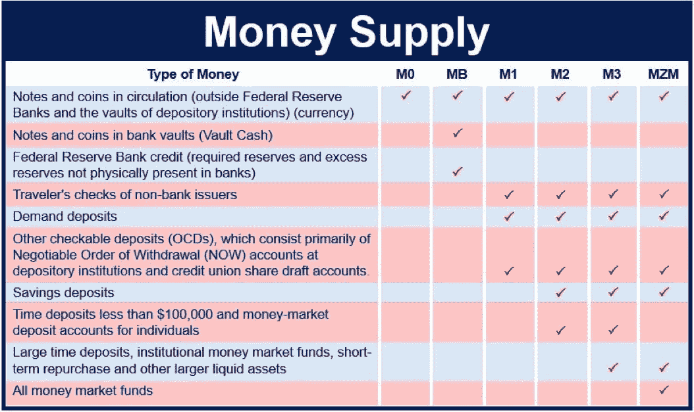
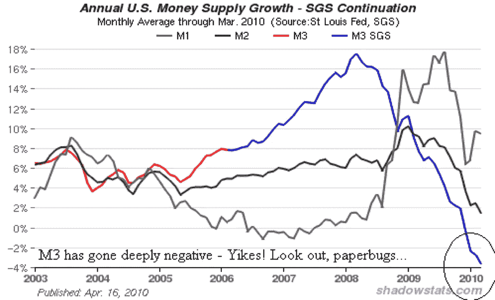

# 价值互联网的愿景

> 原文：<https://medium.com/hackernoon/a-vision-of-the-internet-of-value-ad187abf5826>

# **1。关于金钱的误解**

钱是什么？每个人似乎都认为他们知道钱是什么。钱就是我手里的美钞。金钱是黄金。钱是我银行账户或者比特币钱包里的数字。

虽然这些答案看起来不错，但我认为这些关于钱是什么的概念充其量是片面的，最糟糕的是将我们的注意力从钱的真正意义上转移开。当我们认为钱是一种东西时，这些概念问题就出现了。这类似于用牛顿物理学来解释宇宙学。结果将是不全面的和误导性的，因为他们通过错误的过滤器看待问题。

货币是标准商品的观点起源于亚当·斯密设想的假设的易货经济。他提出了一个模型，从人们进行实物交换开始，然后自然地将一种共同分享的商品发展成为历史上的价值衡量标准，如黄金和白银。这种理解也支撑了经济科学的基础，即假设随着时间的推移，最合适的商品自然会被选为“货币”。

如果我们遵循这种思路，我们就会倾向于根据商品特征来判断和比较不同形式的货币，这是一种误导，损害了我们对经济运行方式的理解。货币不应该被理解为一种东西或一种商品，而是一种记录价值的技术。换句话说，货币是一个社会用来记录谁拥有什么的常用技术。在这种理解下，我们应该比较不同货币体系的技术特征，以及它们如何在指定的功能上为社会服务。

# **2。将货币理解为一种技术**

想象一下，在现代经济中，当你向朋友汇款时，可能会使用网上银行服务或 PayPal 或 Apple Pay 等数字钱包，会发生什么情况。移动的不是“东西”，不是商品，而是某处数据库中一些数字的重新排列。数据库、银行服务和你账户中的数字都是现代货币技术的一部分，其价值已经得到认可。货币技术已经发展了几千年，它永远不仅仅是一种普通的商品或货币。

***一)这是雅浦群岛的货币【1】***

中间有洞的圆形石头在雅浦岛被用作货币。根据形状和大小，每块石头在岛上都有一定的价值。因为这块石头又大又重，所以很少被移动，但是这块石头的所有权会被标记出来，并在相关各方同意的情况下进行变更。在某些情况下，即使石头不见了，石头的价值和所有权仍然得到岛上人民的维护和承认。

***b)这些是来自美联储【2】***的度量

上面的图片展示了货币的现代定义，以及货币作为一种技术如何在美国这样的现代经济中发挥作用。M0、M1、M2 和 M3 的名称对应于不同的总体货币供应量、人们采用的不同货币媒介以及他们与金融机构互动的方式。纸币和硬币中的货币被称为 M0；这仅占货币供应总量的一小部分，也仅占现代社会中人们相互支付和传送的总价值的一小部分。图表 2 显示了一段时间内不同水平的总体货币供应量的增长，但它们并没有同步变化。2008 年经济崩溃时，由于美联储的扩张性货币政策，M1 仍在扩张。然而，私营部门正在收缩，因此 M3 的增长也在收缩。

这两个图表有助于说明需要更准确地理解货币作为一种技术来记录其在社会中的实际价值。作为一项基础技术，它随着社会的发展而发展，随着经济的增长而发展。历史上诞生了多个机构来支持特定的技术，并为该技术的顺利运行创建基础设施。就其技术层面而言，“货币”包括所有这些机构和基础设施，以及在货币技术中经常用作价值单位的货币。

# **3。互联网的到来**

与 30 年前相比，人们更容易相互联系。计算能力现在更便宜，也更强大。如今，一部智能手机的计算能力是 30 年前价值 1600 万美元的超级计算机的数倍。计算技术现在更加开放，API 和接口使得编程和自动化更加容易。电信、交通、媒体和零售等行业见证了重大的破坏——而民主和民族国家等其他重要的社会制度仍在等待转型。有人可能会说，这只是因为互联网还没有足够深入地渗透到他们的基本运作中。

在互联网时代，我们也见证了货币技术领域的新发明——如果互联网是人类历史上最重要的发明之一，那么这些创新可能是货币历史上最重要的一些。它始于八年前比特币的发明，这是为互联网时代发明新事物而进行的长期斗争和合作的成果。40 年前互联网的发明改变了人类历史的进程。今天的世界在 40 年前是不可辨认的；40 年后的世界也将因互联网的演进和加密货币的传播而发生不可识别的变化。

即使是现在，加密货币已经可以比其他类型的货币做得更好。世界上的每一个人都可以开一个“银行账户”,并从公共的区块链账户如比特币或以太坊账户中收款。数百万美元可以瞬间以最低的成本、安全且不可信的方式汇往海外，这意味着不需要“可信的”第三方来跟踪账户的借贷。应用程序可以建立在公共区块链分类账之上，以自动和无许可的方式运行，因此不同于传统的银行系统。比特币、以太坊等基于区块链的加密货币是全球性的、不可变的、去中心化的公共账本；因此，它们有望成为人类历史上发明的最佳货币技术

# **4。比较不同的货币技术**

本节对不同的货币技术进行了比较:作为现代政府支持的“法定货币”(仅由政府法令赋予价值)代表的美元，以及作为区块链货币代表的黄金和比特币。加号(+)表示作者对货币技术在比较中的相对优势的判断，而下面的讨论将更详细地讨论各自货币技术的相对优势和劣势。主要的比较对象是美元和比特币，因为一个代表当前的体系，另一个代表未来的可能。

***a)透明性/匿名性:*** 在早些年甚至现在，关于比特币的主要误解一直是，由于其匿名性，它大多是犯罪分子和洗钱者的工具。但现实恰恰相反；比特币公共账本有可能成为有史以来最透明的货币系统。自 genesis block 以来的每笔交易都可以被跟踪和审计，使完整的分类账类似于公共图书馆中的数字图书，每天 24 小时向世界上任何人开放。正是其彻底的透明性，使其成为公共财政的完美记录，而不是适合于非法活动的记录。丝绸之路，Mt. Gox 和 BTC-E 的半身像是明显的例子，对于执法部门来说，处理比特币区块链比以前想象的要容易得多。

同时，通过使用公钥和私钥加密技术，可以充分地维护个人隐私。如果你与需要个人身份证明的中央交易所没有联系，你的身份可以在比特币区块链账本中保持私密，这与普通公民无法获得公共财政细节的法定货币系统形成对比。世界各地如此普遍的腐败、贪污和其他滥用公共财政的行为可以通过使用透明公共账本(如比特币和以太坊所使用的账本)得到有效遏制。

***b)效率:*** 美元的法定货币体系由多年的基础设施建设支撑，耗资数十亿美元。Visa、MasterCard 和 Western Union 等金融机构的主要公用事业——以及零售银行基础设施的很大一部分——致力于转移这些资金。换句话说，这些网络重新排列记录的值。如果这个系统中的参与者共享并使用像比特币这样的公共账本，这种重组将会更有效率。

尽管一些人意识到比特币工作验证算法的电力成本，但与现代金融体系中的同等维护成本相比，这一成本仍相对较小。其他进一步降低电力成本的尖端解决方案正在开发中，例如 proof-of-stage。 [ 3]当一个新的解决方案被证明是安全的时，整个网络的成本可以进一步降低，甚至比它的法定货币对应物更有效。

其他效率问题涉及可伸缩性和交易成本，值得更长时间和更详细的讨论。但正如计算能力在互联网时代呈指数级增长一样，区块链货币应该比几百年前为世界发明的法定货币更容易扩展。权衡是使用更容易获得的计算能力，而不是更习惯的人类劳动。[【4】](#_ftn2)

***c)安全/伪造风险:*** 如果一本公共账本成为人们价值的终极记录，安全问题至关重要。这些新货币技术有两方面的安全性。首先是价值记录本身的安全性，其次是围绕价值记录的生态系统的安全性，以及利用价值记录来衡量自身价值的个人的安全性。

首先，区块链作为一个不变的、全球性的、去中心化的公共账本是尽可能安全的——因为“51%攻击”(控制区块链大部分计算能力的组织对其发动的攻击)的可能性已经被避免了。在比特币的八年历史中，从未出现过核心协议安全性被攻破的情况。转向利益相关证明可能会进一步提高原始记录的安全门槛，达到可以被视为与互联网本身一样安全的程度。

围绕比特币和以太坊的安全问题主要涉及它们的生态系统和区块链周围的基础设施。集中式交换机是多次黑客攻击的主机，历史表明这一层的漏洞非常高。个人钱包的 UX 和安全问题也尚未解决，对主流用户采用加密货币构成了严重障碍。与法定货币系统相比，安全性和用户友好性可能是加密货币的两个最大缺点。

***d)可访问性/全球范围:*** 如果你能访问互联网，你就能访问公共账本，比如比特币的和以太坊的，开个账户，即时收到钱。这是加密货币对全球 20 亿无银行账户人群的承诺。法定货币制度与民族国家一起诞生，因此必然被限制在发行货币的民族国家的边界内。与此同时，加密货币可以真正全球化，可以到达任何有互联网接入的地方。加密货币的全球可获得性是前所未有的，这种可获得性是实现全球金融包容性和金融机会彻底均等的第一步。当它充分发挥潜力时，价值互联网将能够更好地改变基本的人类制度。

***e)去中心化/信任依赖:*** 虽然比特币经常被誉为无信任系统，但实际情况是比特币正在使用一种不同的信任系统:对其网络机制和数学的信任。但围绕加密货币的生态系统仍然需要对私营企业的老式信任，如集中交易所和集中钱包提供商。权力下放问题是多方面的，在其他地方会有更深入的讨论。[【5】](#_ftn1)加密货币目前能够做的是制衡民族国家滥用其法定货币印刷能力的能力——在一些国家，这个问题不如在其他国家严重。

***f)可编程性:*** 每个软件工程师都可以下载完整的比特币和以太坊代码库，并从今天开始调整它们，许多人正在这么做。相比之下，在法定货币系统中，人们必须要求每一家银行的 API，这一要求不太可能得到批准。不断修补公共账簿的开放系统所积累的经验和能力，将很快远远超过几十年来投入法定货币严密保护系统的工作。

此外，机器对机器支付、VR 和 AR 资产转移以及自主去中心化系统等前沿技术可以更容易地源自加密货币的开放公共总账系统，而不是法定货币系统。随着互联网越来越深入地渗透到社会结构中，互联网创造的价值比例越来越大，价值互联网将变得更加强大，其主干基于公共区块链和加密货币。

***g)可接受性:*** 时至今日，可接受性恐怕是加密货币最大的软肋。这种不被接受的情况正在发生，因为一种新的货币技术是人类机构可能发生的最根本的转变之一，它需要时间和耐心才能发挥作用。货币银行系统不适合加密货币，因为其系统基于具有多年积累经验的私有专有数据库，而不是具有可访问性、透明性和可编程性等根本属性的开放公共分类账。改变很难，忘记你所学的更难。所以有些人不会改变；有些人甚至会试图阻止变革。但是，随着加密货币的思想份额和使用的增长，以及价值互联网的基础设施变得更适合主流用户，价值互联网的未来可能会在某个时候到来。

# **5。构建价值互联网的基础设施**

这将如何发生？区块链会取代法定货币系统，或者和法定货币系统一起作为主要的货币技术存在吗？

有两个角度来考虑即将到来的变化。第一个是技术方面，当新技术被置于旧的基础设施中时会出现问题，然后旧的基础设施会逐渐改变以适应新技术。第二个是社会方面，这将是相当深远的，因为货币是所有社会参与者使用的技术。在考虑这一方面时，我们必须问，我们希望 40 年后看到什么样的未来？这将是一个和我们现在的世界相似的世界吗？一个地方利益严重分裂的世界，武断的规则和人为的边界阻止人们实现他们的真正潜力？或者，我们是否希望看到一个通用货币体系可能带来的未来，在这个体系中，规则是基于市场力量和数学的；权力分散、去中心化；知识、经济独立和机会对任何人、任何地方都是可以获得的？

在消费者方面，加密货币需要更加用户友好和更加安全，其基础设施需要比现在更好地发展。最后一个要素是所有其他要素的关键，它正在显示出进步的迹象，交易所、支付处理器、私人链数据库和钱包提供商等基础设施正在快速建设、成熟并变得越来越好。

在某个时候，加密货币将会容易且安全地使用，以至于主流用户甚至不会注意到它们和法定货币之间的区别。第一辆汽车作为交通工具比马差得多，第一台计算机在计算方面比人差得多。这是技术进步的本质，它表明区块链货币的改进将在需要时到来——由于价值互联网的重要性日益增加，这些改进将是需要的。

到目前为止，这个新系统还没有准备好，尽管许多人正在奠定基础:工程师们正在编写软件并建设其未来的基础设施，作家和记者们正在学习并撰写更多关于其挑战和机遇的文章，立法者们正在试图理解其含义。

即使在这些早期阶段，关于价值互联网有一件事是清楚的——每个人都可以发挥作用。

# **6。结论**

在本文中，我主张更好和更准确地理解货币，以及为什么区块链和加密货币可以成为人类历史上最好的货币技术，并在与法定货币技术的比较中展示我的推理。虽然加密货币目前在安全性、可扩展性和可接受性方面落后，但彻底的透明性、全球可访问性、效率和最重要的可编程性的结合表明，价值互联网的未来可能会基于公共区块链和加密货币。

我目前在 [tomocoin.io](https://www.tomocoin.io/) 工作，致力于构建价值互联网的未来

**参考文献**

[1]—[https://en.wikipedia.org/wiki/Rai_stones](https://en.wikipedia.org/wiki/Rai_stones)

[2]—[http://www . business insider . com/the-myth-of-the-explosing-us-money-supply-2011-3](http://www.businessinsider.com/the-myth-of-the-exploding-us-money-supply-2011-3)

[3]—[https://medium . com/@ VitalikButerin/a-proof-of-stage-design-philosophy-506585978 d51](/@VitalikButerin/a-proof-of-stake-design-philosophy-506585978d51)

[4]—[http://un enumerated . blogspot . com/2017/02/money-区块链-and-social-scalability . html](http://unenumerated.blogspot.com/2017/02/money-blockchains-and-social-scalability.html)

[5]—[https://news . 21 . co/quantization-decentralization-e 39 db 233 c 28 e](https://news.21.co/quantifying-decentralization-e39db233c28e)

[6]—[https://www.youtube.com/watch?v=5ca70mCCf2M](https://www.youtube.com/watch?v=5ca70mCCf2M)