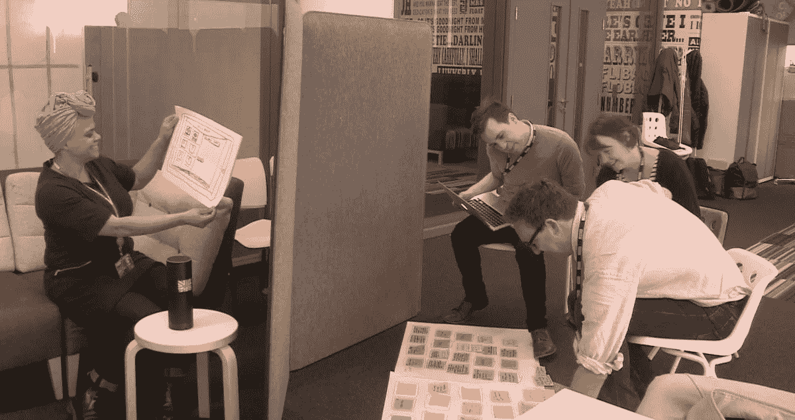

# 对话界面作者指南

> 原文：<https://medium.com/hackernoon/a-writers-guide-to-conversational-interfaces-9d95358974e9>

对我来说，对话界面和使用它们的设备/应用程序是开发中为数不多的突破性技术之一。

为什么？因为直到现在，许多界面让我们以一种违反直觉的方式与周围的人互动。对话是一种更舒适的交互方式，尽管有时效率更低——对话式用户界面(Cui)允许我们这样做。

今年，我参加了大约六次聊天机器人和语音助手的活动和会议，一遍又一遍地听到*优秀写作*的重要性。听起来像是热情进取的作家的大好机会！在这篇文章中，我将为那些对涉足这个领域感兴趣的人概述一些最佳实践。

这篇文章的灵感来自于[安德里亚·穆托尼](https://www.youtube.com/watch?v=QYocaoZJNzw)的一次演讲，并加入了一些其他想法。我打算将这些想法融入到我自己的项目想法中，包括一个与文档交互的机器人。我将在几周后就这个话题发表演讲，并希望能继续关注这篇文章。

# 为人民而设计

“把你的用户放在第一位”在技术领域并不是一个新的说法，但对于 CUIs 来说，它甚至更加重要。在进一步发展之前，*将你的想法原型化*。CUIs 的伟大之处在于，它实际上包括与人对话(不包括面部表情),因此，从理论上讲，它比“传统的”用户界面要稍微容易一些。

英国广播公司 R & D

听这些对话，观察当人们试图完成任务时他们说了什么。这也将帮助你知道你使用 case 是否对 CUI 有意义，因为有很多是没有意义的。CUIs 的目标是用更简单的东西来代替传统的 UI 路径，比如问一个问题。在很多情况下，智能手机上的网络和移动应用程序有一些复杂的过程，而以前这些过程是比较简单的。机票预订就是一个经典的例子。将现代数据密集型应用程序的强大功能与提问这一更简单的用户界面结合起来，是一个惊人的组合。

# 为耳朵写作

对许多作家来说，这涉及到忘掉很多你已经知道的东西。我们磨练了我们的键盘技能来写出最好的单词，但是我们都知道并且承认说的单词是一种不同的形式。我们用 CUIs 说的话可能不是最聪明的表达方式，但对媒介来说是最自然有效的。

耳朵和眼睛也有根本的区别。

眼睛期待一致性，耳朵期待多样性。每次听起来都一样的对话是尴尬和令人沮丧的。想想那些你和一台老机器或一个无用的人互动的时候，他们一遍又一遍地重复着同一个短语。在你的崔写作中，你需要注入多样性和不同的方式来表达和识别相同的意思。找到完美的句子已经不够了——你需要六个完美的句子。这些差异也可以使用用户和会话上下文进行变化。

# 让互动变得清晰

作为人类，我们每天都会根据收到的信息做出数百种假设。但是这些可能是有语境和文化偏见的，别人并不总是清楚。当设计一个 CUI 的时候，尽可能清楚的告诉用户什么时候应该进行交互。不要把互动隐藏在假设中——直接提问，保持对话简短。

# 明智地使用信息

如果你和一个人交谈，而他们反复忘记或忽略你已经提供的信息，这是一次令人沮丧的经历。这更适用于 Cui，计算机不会忘记我们告诉它们的，所以确保你使用这些信息。例如，您可以使用它来跳过流程中不必要的步骤，因为您已经有了这些信息。或者您可以根据收到的信息更改步骤。

# 保持简短

在网络写作领域，这并不是一个新的说法。我们习惯于网络世界短暂的注意力持续时间，习惯于修改我们的写作，以尽可能高效地传达一个观点。Cui 的情况更是如此。人类用耳朵的注意力持续时间更短，所以保持信息简洁，不要听起来生硬或粗鲁。

# 学习和适应

Cui 还处于早期阶段，还没有人是专家，无论是使用还是创造 Cui。商业 Cui 大多使用云基础设施，这也意味着你可以收集反馈，快速学习和发布补丁。云平台不直接提供调试或日志作为其核心产品的一部分，但你可以利用现有的工具来存储和分析日志，以了解人们想说什么，比如对问题的回答。

# 更多要说的…

随着我对这个主题了解的深入，我会在以后的文章中再次讨论这篇文章的内容，但同时，我也很想听听你自己的想法和下面的对话。

*最初发表于*[*【dzone.com】*](https://dzone.com/articles/a-writers-guide-to-conversational-interfaces)*。*