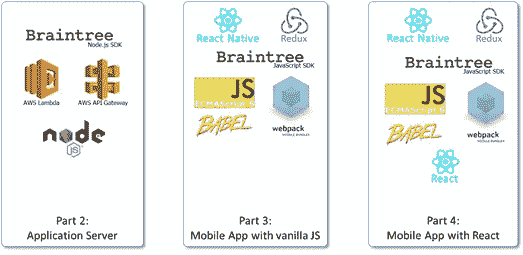

# 在 React 本地应用程序中接受支付(第 1 部分)

> 原文：<https://medium.com/hackernoon/accepting-payments-in-a-react-native-app-part-1-9cb09a271f59>

## 将 Braintree 支付集成到 React 本地应用程序中

## 背景

最近，我需要在一个本地应用程序中集成一个支付平台。幸运的是，有许多用户友好的支付提供商可用于移动应用程序。我决定选择[的 Braintree](https://www.braintreepayments.com/) ，因为它内置了[的 Paypal](https://hackernoon.com/tagged/paypal) 集成。然而，我相信本文中介绍的技术可以应用到与其他支付提供商的合作中。

不仅有几个支付提供商，还有多个与 React 本地应用程序一起工作的支付库。谷歌快速搜索显示，有几个是专门针对布伦特里的。然而，由于我的应用程序与 [Expo、](https://expo.io)的集成，我需要一个排除本机代码的解决方案，不幸的是，所有当前的(在本文发表时)跨平台解决方案都需要一些本机代码。

这意味着我需要创造我自己的…

That feeling you get when you can’t find what you need in npm.

因此，在这一系列的文章中，我将创建一个只有 JavaScript(没有本地代码)的 Braintree 支付组件，并以 NPM 包的形式发布该组件。为了保证每篇文章都是“一口大小”，文章的划分如下:

1.  [项目介绍](/@reginald.johnson/accepting-payments-in-a-react-native-app-part-1-9cb09a271f59)。这一部分听起来可能不多，但它很好地解释了所有东西是如何组合在一起的。
2.  [使用亚马逊网络服务的应用服务器](/@reginald.johnson/accepting-payments-in-a-react-native-app-part-2-b8927487ea9c)。这一部分解释了如何以安全的方式与 Braintree 的服务器进行交互。
3.  [使用 Vanilla-JavaScript 的初始版本](/react-native-training/accepting-payments-in-a-react-native-app-part-3-c22828ecab13)讨论构建一个可以接收付款的应用程序。
4.  [基于 React 组件的版本](/@reginald.johnson/accepting-payments-in-a-react-native-app-part-4-cb4f7c02c193)是关于将 React 放入 React 本地应用中。

The three different code based portions of this series

我的目标是，写这些文章将迫使我提高对所列主题的了解，记录我的发现以供将来参考，并帮助有相同需求的其他人。

## 应用

我预计这个系列将具有超越 React Native 的适用性。例如，我将讨论使用 AWS Lambda 的服务器集成(它本身对 node.js 具有适用性)。此外，React Native (RN)是 React 的核心，React 本身是建立在 HTML 和 JavaScript 之上的，所以不要让我对 RN 的关注影响了你。在这个过程中还会有一些 webpack 和 CSS。最后，我见过的所有支付系统都有一个基于令牌的认证和授权系统，与第三方认证系统极其相似。

底线是不要让我用的锤子分散你建造狗屋的注意力。技术是重要的部分，不一定是工具。

## 设计

我将在这里简要介绍该项目的预期设计。然而，每篇文章都将有一个与特定阶段相关的更深入的设计讨论。

总体而言，该项目将实现以下目标:

1.  向用户呈现要“购买”的项目。
2.  用户将这些商品放入购物车。
3.  用户开始购买流程，以便他们可以支付这些项目。
4.  用户输入他们的支付信息。
5.  布伦特里处理付款。
6.  用户看到基于购买状态的反馈。

现在，让我们稍微分解一下这些步骤。

1.  在这种情况下，不需要真正的商店；我不是在写一篇关于建设电子商务网站的文章。我可以把物品信息放在一个对象数组中。然后我可以在 UI 中将这些对象显示为存储项目。
2.  最简单的实现是点击一个项目，该项目触发一个事件，该事件又将该项目添加到一个表示购物车的对象中。不妨同时更新购物车的总价格。
3.  对我来说听起来像是按下按钮结账。
4.  好吧！事情变得有点复杂了。幸运的是，Braintree 提供了一个可以放入网页的 UI 元素。不幸的是，使用 React Native vice 只是让整个网页与原生应用程序的交互变得更有趣一点。不过不用担心，这就是我写这些文章的原因。
5.  Braintree 很好地描述了支付开发过程。他们的文档提供了整个过程的概述，以及对 T2 客户端和 T4 服务器的职责和交互的描述。Braintree 还提供了一个沙盒供您在学习如何使用时进行实验。
6.  在 Braintree 支付过程完成后，向用户显示一条消息就足够了。

## 履行

同样，更多的细节将在后续文章中介绍，但是从高层次上讲，我知道我需要一个应用服务器来执行服务器功能。我将使用 AWS Lambda 函数和 AWS API 网关来实现这一功能。此外，您现在可能已经知道，我打算使用 React Native 来构建一个与用户和应用服务器交互的移动客户端。

## 结论

暂时就这样了。希望这篇文章已经描述了我打算做什么，我打算如何做，以及我为什么这样做。我希望在本系列的其余文章中，您能继续关注我。