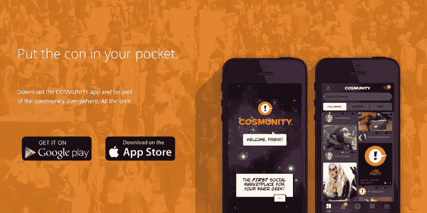
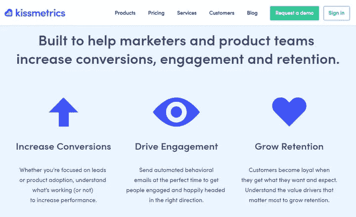
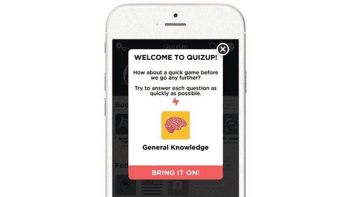
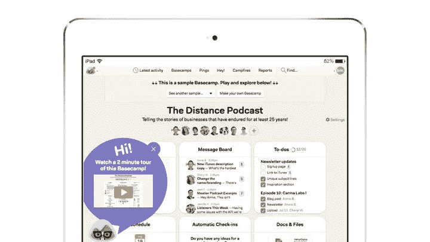
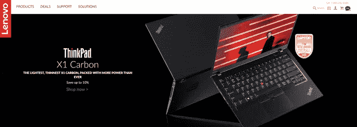
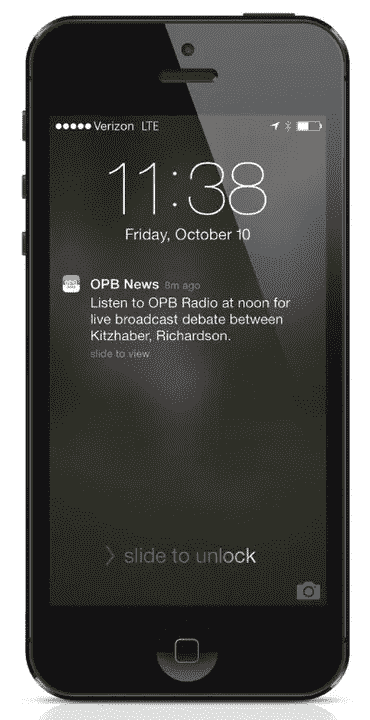
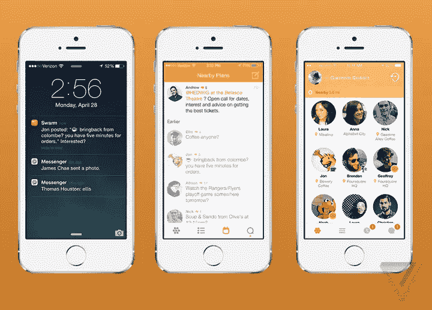
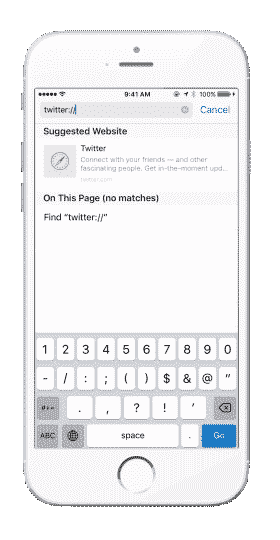
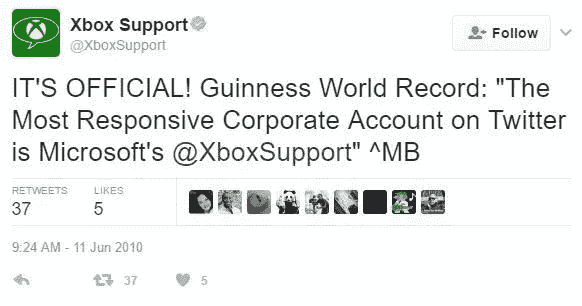
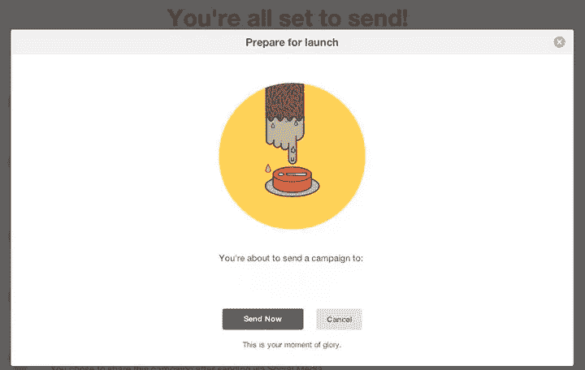

# 提高应用用户参与度的可行策略

> 原文：<https://medium.com/hackernoon/actionable-strategies-to-increase-app-user-engagement-b8c90d6e9df7>

仅仅爱你的顾客就够了吗？这是一个详尽的用户参与策略吗？—显然不是。事实上，用户是任何业务或应用程序的生命线，无论你是拥有一个市场、销售业务服务、提供教练项目还是分销消费品。如果你不能获得忠诚的顾客，你就会失败。

大多数创业公司将更多的注意力放在线索生成和用户获取上，但他们错过了关键点。第一批顾客会一直和你在一起，因为他们会被激励并定期更新。你对待用户的方式很重要。你给他们提供终极体验了吗？

[Verint](http://info.verint.com/LP=2418) 对来自九个国家的 18000 多名受访者进行了调查，**89%的受访者表示良好的服务让他们**对品牌产生更积极的感觉**。**

*[Image source: Verint]*

你的生意怎么样？您将如何从终极用户体验中受益？—消费者可以通过积极的评论、在社交媒体上的讨论或与朋友、亲戚或同事分享积极的体验，为您的营销战略做出贡献，并为您吸引新用户。

*[Image source: Verint]*

平均来说，你只有八秒钟的时间来创造一个好的第一印象，从而把第一次用户变成忠实的顾客。噱头和好吃的东西很难穿透应用商店的所有噪音。相反，你真正需要的是一个强大的用户参与策略。这些不是小把戏，它们需要合理的方法和努力。然而，如果你投入时间，它们会起作用的。

# 让我们一起探索可行的用户参与策略:

## 第一印象是成功的一半

大多数企业主从字面上理解“第一印象”，尽管在这个短语下面隐藏着丰富的概念和多个阶段。你说的“第一次互动”是什么意思？app store 列表的访问？应用程序下载？首次登录？我们能把所有这些行为称为第一印象的要素吗？——显然是的。

我们从应用程序之外的元素开始:**应用程序商店列表**或**登陆页面**。花点时间想想人们为什么会给你的产品一个机会是很重要的。你解决什么问题？—关注优势，而不是特性。别忘了展示你的应用。

现在我们进入下一个阶段— **入职**。大多数公司误解了这一步，并开始教人们如何使用他们的解决方案。然而，除了指南和教程，你可以专注于教育人们你的应用程序的优势。图解价值主张可以成为一个很好的选择。

*[Image source: Kissmetrics]*

一旦初始握手完成，你需要确保轻松的**应用下载**，友好的**欢迎**，以及流畅的**直接交互**。

作为长时间教程的替代品，一些公司鼓励首次消费者立即开始使用应用程序。例如，QuizUp 的一封欢迎信附带了一个行动号召，让用户尝试一个快速游戏。该公司通过这种方式教育用户，并解释这款应用是怎么回事。

*[Image source: QuizUp]*

[**Basecamp**](https://basecamp.com/) 为新人提供互动指南和视频教程。通过这种方式，它突出了最重要的功能，并解释了如何使用这些功能。

*[Image source: Appboy]*

## 缓慢而稳定的人很难赢得比赛

激烈的竞争提高了门槛，现代用户比以往任何时候都更加苛刻。你可以按一下按钮叫出租车。网上零售商提供当天送货服务。通过推特订购披萨。因此，当用户下载一个应用程序时，他们会默认它非常快。

CA Technologies [的研究](https://www.ca.com/content/dam/rewrite/files/app-economy-quiz/survey-new/assets/app-economy-research-and-infographic.pdf)显示，大约 68%的用户认为应用程序加载时间少于 6 秒是可以接受的。而超过一半的被调查者要求加载时间少于三秒。

*[Image source: CA Technologies]*

对于初创公司来说，这样的统计数据意味着，如果品牌不符合他们的期望，绝大多数用户很容易就会离开。如今，仅仅推出一大堆功能有限的应用程序已经不够了。应用程序必须快速引入解决问题的选项，突出对用户的好处，并在整个体验中直观地工作。

## 社交化，病毒化

社交媒体是巨大的。全球有超过 27.9 亿活跃的社交媒体用户。

*[Image source: Hootsuite]*

你仅仅是把脸书和 LinkedIn 上的人联系起来吗？开始将社交媒体视为有用的工具，而不仅仅是一个平台。它不仅能让你拓展人脉，还能发现问题，发现用户需求，明确市场需求。

例如， [**联想**](http://www3.lenovo.com/us/en/) 是最早赋予社交媒体[新](https://www.forbes.com/sites/forbesinsights/2015/01/29/6-strategies-to-drive-customer-engagement-in-2015/#7e595bf6325c)含义的公司之一。通过检查社交平台(在线讨论、帖子等)生成的数据。)，该公司比对手更早发现了有前景的消费趋势。因此，联想被认为是一个创新者，而它的客户也获得了相关和有用的产品。

*[Image source: Lenovo]*

## 推送通知

*“一切新的东西实际上都是被遗忘的旧东西”* —这就是如何定义**产品内消息**或**推送通知**的。由于具有高度可定制性，它们有助于获得最佳转化率，优于电子邮件。长时间保持沉默的 app 可以很快被遗忘，最后被删除。然而，一些公司走得太远，开始向他们的客户发送垃圾邮件。

想想相关的推送通知来维持移动用户的参与度。俄勒冈州公共广播 (OPB)应用程序使用推送消息来鼓励听众收听。

*[Image source: Urban Airship]*

在发出这个通知后，该公司声称收听特定广播的听众增加了 483%。

在线发布平台 [**媒介**](https://medium.com/m/app) 通知用户关于你的网络内的新帖子或排名前五的帖子。 [**12 分钟运动员**](https://www.12minuteathlete.com/workout-reminders/) 允许用户设置鼓励性的锻炼提醒。 [**Swarm**](https://www.swarmapp.com/) 定期发送行为触发、统计和建议。

*[Image source: The Verge]*

## 通过深度链接走得更远

深度链接可推动用户参与，并让您更好地控制营销和入职流程。它使通知更加强大，尤其是当你需要把用户带到应用程序中的一个特定位置时。通过深层链接，您可以确定哪些营销活动最成功，或者定义进一步的步骤，使您的应用程序更易于访问。像**谷歌**和**苹果**这样的领先品牌继续投资于这种深度链接，那么你为什么要忽视它呢？

*[Image source: Branch Metrics]*

此外，深度链接可以帮助你扩大用户群。在这些情况下，当应用程序没有安装在用户的设备上时，公司会应用**延迟**和**上下文深度链接**。通过这种方式，用户首先可以从 App Store 或 Play Store 下载你的应用，然后在第一次启动时被带到特定的“延期”内容。上下文以及延期深度链接确保更好的用户体验，从而将首次用户转化为忠诚的客户。

*[Image source: Branch Metrics]*

## 交流是双向的

与用户沟通是增加或保持应用参与度的最简单方法之一。有些公司错过了这一步，从而让用户直接在 App Store 页面写下不满意的评价。为了避免这种情况，请让用户能够方便地访问您的知识库(FAQ)以及如何与您联系的选项。收到请求后，发送带有标准周转时间的已读通知。

越来越多的公司使用社交媒体，确保了更高的用户满意度。根据 J. D. Power [的调查](http://www.jdpower.com/press-releases/2013-social-media-benchmark-study)，**67%的**消费者已经使用过某个品牌的**社交媒体页面进行客户服务**(来自 23000 名受访者)。而 Twitter 上的客户服务互动在过去两年里增加了 250%的****。 [**环球网**](http://www.go-globe.com/blog/social-media-customer-service/) 预测，到 2020 年，90%的公司将使用社交媒体为客户服务，所以也许是时候开始了？****

********

*****[Image source: Twitter]*****

## ****游戏化的超级力量****

****游戏化不会把你的应用程序变成一个游戏，但是它会把你的应用程序的用户体验转变成一种吸引人的娱乐活动。总的想法很简单:70%的心理学，20%的策略，10%的使用过的工具。****

****不知道如何增加用户参与度？大多数人喜欢竞争，喜欢超越，喜欢赢，喜欢有所回报。可以向用户提供各种具有挑战性的任务，比如解锁新功能、获得徽章、完成个人资料等等。****

********

*****[Image source: Foursquare]*****

****不要忘了通过任务给他们打气。你可能已经注意到了这样一些激励人心的话，比如“你就快成功了！”或*“哇，你刚刚完成了 100%的个人资料！”*，没了吧？—这只是一个用我们的大脑玩游戏的简单例子。****

********

*****[Image source: Mailchimp]*****

## ****抓住每一个小机会****

****好消息是提高用户参与度的能力是无限的，但是不要忘记测量用户参与度。最常见的方法是使用各种分析工具，如 Google Analytics、Localytics、GameAnalytics、MixPanel 等。客户参与度指标可以包括总访问次数、总下载次数和推送通知统计。****

****尝试 A/B 测试，制作相关内容，发起主题活动，倾听客户意见，并考虑其他机会。这里的关键概念是，用户参与不是最终目的地，而是一个旅程。你很难找到一个品牌可以展示一个完美的成熟的用户参与策略。但是这些方法的实施不仅可以帮助你激励你的用户，还可以建立一个强大的品牌并在市场中茁壮成长。****

****你已经尝试过哪些客户参与策略？****