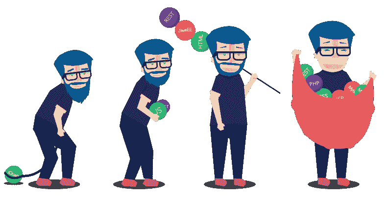
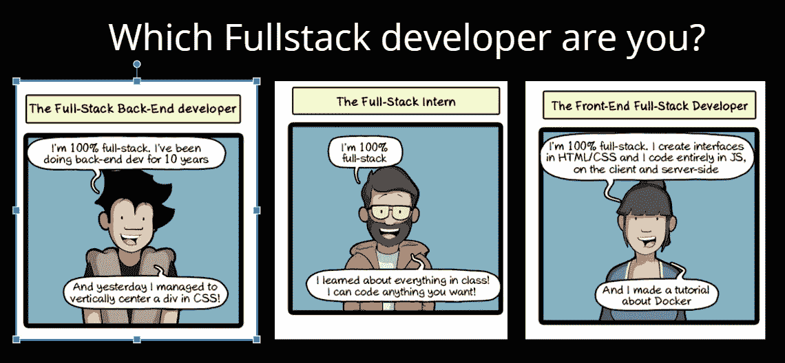
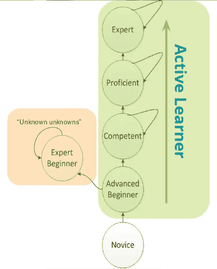

# 主动学习者——开发人员如何保持学习

> 原文：<https://medium.com/hackernoon/active-learner-how-developers-keep-learning-1309b91f1ae6>

几周前，我在一年一度的 Geektime 开发者大会上做了一次演讲。我决定写一篇关于这个话题的文章。你可以在这里找到[的幻灯片](https://speakerdeck.com/dennisnerush/active-learner-how-developers-keep-learning)，在这里找到[的演讲视频](https://www.youtube.com/watch?v=3GrNFnKNy-I)。2018 年，我在一年一度的[阿姆斯特丹 Codemotion 开发者大会](https://www.youtube.com/watch?v=tKoTO8A-vVY)上再次做了这个演讲。

# 专业初学者

成为一名开发人员是一个漫长的旅程。它在你学会编码并开始你的第一份工作后就开始了。这个旅程有不同的阶段。初级、高级和专家是开发人员可能经历的阶段的一部分。今天我想谈谈另一个阶段。这是一个非常棘手的阶段，很难发现。

你可能知道那些总是充满信心的开发人员，他们可以描述他们正在构建的产品和它所解决的问题，他们可以解释他们的架构，他们知道他们的技术栈的优势。他们可以谈论他们的工具、框架和基础设施——他们每天都在使用它们。他们喜欢它们。

**但是**他们不知道**他们是怎么工作的**。他们不知道内部结构和这些工具是如何制造的，或者在什么情况下他们**不应该**使用它们，这些工具的缺点。他们绝对相信没有比他们所知道的更好的了。他们的工具对他们和其他人来说都是银弹。

这些开发者都是“[专家初学者](http://www.daedtech.com/how-developers-stop-learning-rise-of-the-expert-beginner/)”。他们认为他们是专家，然而，他们仍然只是初学者。

另一方面，还有另一种类型的开发商。

那些能够解决任何问题的人，总是知道事情是如何运作的，框架是如何构建的，以及为什么。他们知道什么是行业内的热门和潮流，为什么它被认为这么好，为什么我们公司**不应该**使用它。

这就是我们想要雇佣的开发人员，他们是我们公司和团队的一部分。这样的开发人员不是专业的初学者，也不一定是真正的专家。但是他们知道他们知道什么，最重要的是，他们不知道什么。他们有朝一日会成为真正的专家。为了走上这条道路，他们不能仅仅依靠他们的工作教给他们的东西和“开箱即用”的解决方案，他们必须主动学习。

他们是“**主动学习者”**。

# 为什么会这样？

要理解这一点，我们首先需要了解一个人是如何学习新技能的？

这是技能习得的基本模式。它基本上是说，为了成为专家，我们必须经历漫长的道路和不同的阶段。在每个阶段，我们都做得更好。我们通过理解有一个比我们目前所知的更大的图景来做到这一点，我们愿意在抓住这个图景的旅程中继续前进，并变得越来越好。

我想把重点放在高级初学者阶段，因为这里任何人都可以打破两种方式中的一种:他们可以进入胜任阶段，并开始掌握大局和他们在其中的位置，或者他们可以**【毕业】**到专家初学者阶段，假设他们已经毕业到专家。专家初学者是一个非常危险的地方，因为他们认为他们已经成为专家，因此他们不会努力提高自己或意识到有一个比他们知道的更大的画面。

# 为什么有些开发商这样做，而其他人不这样做？

## 不断变化的**工艺**堆栈

我们的世界在不断变化，每年都有新的技术、框架和工具出现。“酷”的做法是发现热门的东西，并尽快使用它们。

这使得成为一名真正的专家非常困难，因为每一年都会发生变化。这使得开发人员不断地切换技术，而无法深入了解并获得相应的经验水平。

## 全栈！=专家

第二个原因是一些开发人员错误地认为他们是全栈开发人员就意味着他们是必要的专家。免责声明——有些全栈开发人员绝对是专家，我不是在谈论他们。

我说的是那些已经完成了 React 和 Node 教程，构建了一个 todo 应用程序，只需点击一下就可以部署到 Heroku，因此认为自己是 **fullstack** 开发者的人。他们看到了立竿见影的效果，却对“魔法”及其发生的方式一无所知？它将如何扩展？那个平台有什么劣势？他们什么时候应该使用，什么时候不应该使用？

## 永远不要离开他们的舒适区

另一个原因是一些开发者长期停留在同一个生态系统中。琐碎的路径是当某人舒适地坐在同一个团队多年，开发相同的功能，修复相同的错误，一遍又一遍，基本上没有学到任何新东西。不那么琐碎的路径是当某人改变他的工作场所，移动到不同的公司，但实际上仍然在相同的生态系统，相同的职位，相同的责任和相同的工具。再说一次，没有学到任何新东西。

> **“10 年**经验或**同年**经验 10 **次”**

有人可能有很多年的经验，但实际上他只是一遍又一遍地重复同样的把戏。我见过很多这样的开发人员的简历，他们在这个行业已经工作了 6 年甚至 9 年，但是当和他们交谈时，你感觉不到所有的经历，就像和一个成熟但仍然是初级的开发人员交谈一样。

## 被动学习

最后一件事是，专家初学者只学习他们每天接触到的东西，技术和他们每天面临的挑战使他们学习和成长，但这是有限度的。有更多的解决方案和选择。专业初学者根本意识不到它们。

当你试图与他们交谈，挑战他们，问他们问题时，你通常会听到这样的话:

你听不到的是深度。对事物如何运作及其原因的深刻理解。

这是专业初学者和主动学习者的核心区别。积极的学习者不一定什么都知道。他们意识到更大的图景，他们确实意识到没有什么是“有效的”,也没有什么灵丹妙药，任何事情都有利弊。他们使用“视情况而定”的答案，他们希望深入了解、学习和理解。

# 怎样才能成为“主动学习者”？

主动学习者不是一个阶段。这是一种心态，一种精神状态，因此，任何人只要接受自己还没有成为真正的专家这一事实，并且认识到有比自己所知更广阔的前景，就能成为一名积极的学习者。

这里有 4 个基本工具，可以帮助任何积极的学习者实现他的目标

## #1 阅读

为了积极地开始学习，阅读是你能做的第一件事。也是最容易的。互联网上充斥着大量关于任何话题的书籍、博客、视频和播客。它就在那里等着你。

阅读你所知道的，强化你的知识，深入挖掘，真正理解事物如何运作的内在。也看看你不知道的，不要再相信魔法和黑盒了。谷歌一下，了解它是如何工作的，它有什么好处，不要想当然。在我们忙碌的日子里，找时间阅读是不容易的。我推荐像 [Pocket](https://getpocket.com) 这样的应用程序，用于保存你希望以后阅读的内容， [Feedly](https://feedly.com/i/welcome) 作为 RSS 阅读器，用于随时更新你感兴趣的博客， [Trello](https://trello.com/) 用于简单地拥有一个包含你希望深入挖掘的所有术语和主题的公告板。

## **#2 离开你的舒适区**

为了真正提高，我们需要经历我们不知道的事情和不是一切都为我们准备好的地方，我们需要离开我们完美的地方，改变我们的环境，有时甚至在一个完全不同的地方重新开始。没有什么比一遍又一遍地做我们知道的事情更容易的了。

软件开发不是你所知道的框架或者语言，软件开发是讲原则的，[固](http://blog.gauffin.org/2012/05/solid-principles-with-real-world-examples/)，[干](http://deviq.com/don-t-repeat-yourself/)，[亲](http://enterprisecraftsmanship.com/2015/06/15/kiss-revisited/)，自动化……这些原则是跨平台的。尝试不熟悉的东西，使用其他工具和框架。不是因为他们很酷，而是想了解他们如何解决你面临的同样的问题。远离一切都为你准备好的地方，一切都“刚刚好”。

> 试着自己创造魔法和黑盒

在任何语言、平台或工具中——你都会意识到原则是相同的。一次又一次地重新发现它会加深你对它们重要性的理解，它会驱使你把它们应用到任何缺少它们的地方。

## #3 分享你的知识——写作

写一些东西并不容易。你不能分享半真半假的事情，也不能表现出浅薄的理解。写任何话题都会让你深刻理解。你将能够讲述一个关于它的故事，提出一个论点，并向他人解释为什么它如此伟大。这是一块肌肉，你不仅可以在写作中使用，还可以在任何需要表达观点的场合使用。你每次写字都会让这块肌肉变得更好。这是我决定开博客的原因之一。写不同的主题迫使我在与世界分享它们之前学习更多并真正理解它们。

## #4 **课余活动**

工作中的被动学习有一面玻璃墙。还有其他方法可以增加我们的经验。积极的学习者利用课外活动来学习他们的工作无法提供的东西。

去 [meetups](https://www.meetup.com/Sears-Israel-Engineering-Culture/) ，见见和你使用相同工具或尝试解决相同问题的其他人，看看他们是如何做的，并向他们学习。

尝试为开源做贡献，浏览一些你喜欢的开源项目，帮助他们，解决一个问题或者增加一个特性。为开源做贡献将会提升你的技能。

真的，只要打开一台笔记本电脑，写下你想要的和你热爱的任何东西。

每次你开发一些你认为是魔法或黑盒的东西，你都会使你的技能更强，你的理解更深。你会知道什么时候该用，什么时候不该用。

# 还有一点

然而，这还不够。这些只是可以引导你走向目的地的工具。首先，你需要知道你要去哪里，你需要知道你想成为什么，你想获得什么技能，你想提高哪些技能，为什么。

如果你**不愿**决定这些事情，你可能会发现自己在阅读同样的文章，参加无数的聚会，但最终却什么也没做。

我们都是忙碌的人，我们没有时间闲荡，因此我们需要一个计划，要有效率并专注于我们每个人为了成长真正需要的东西。

你需要对自己有一个愿景，一个计划，一个路线图和目标。

> 为了真正进化、成长和提高自己，你需要把自己当成一个项目

和你在工作中做的一样，有一个愿景，提前计划你的目标，然后决定你想读什么，你想写什么，参加什么聚会，避免什么聚会。一路走来，看看哪些方法对你有用。你可以在这里阅读更多关于我是如何做的:

https://medium . com/Dennis-ner ush/the-project-of-your-life-f 05833 fefd 49

当然，这不是一次性的事情。你需要不断地做下去，一次又一次。这是一条漫长的道路，但值得一试。

祝您好运

我要感谢[妮莎·拉巴](https://twitter.com/rabashani)、[内塔内尔·列夫](https://twitter.com/lnetanel)和[奥姆里·菲玛](/@thegreymatter)帮助我创作和准备这次演讲，并审阅这篇文章。