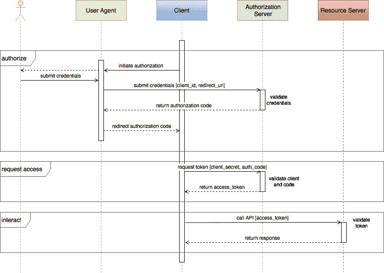
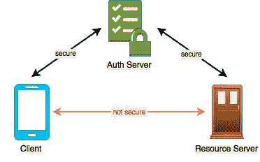
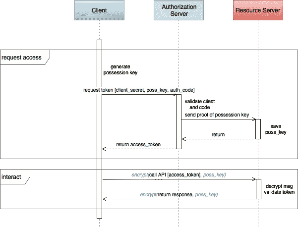
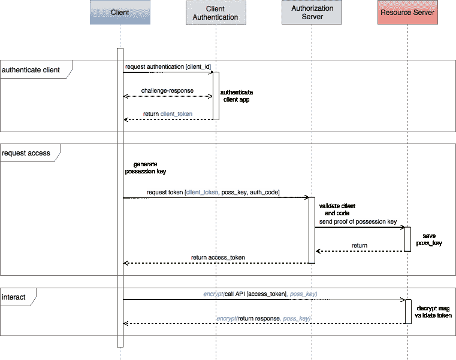
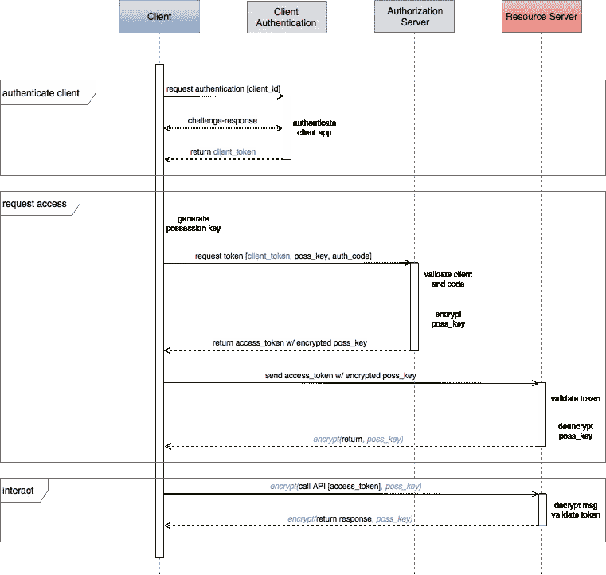

# 将 OAuth2 应用于物联网(IoT) API 安全

> 原文：<https://medium.com/hackernoon/adapting-oauth2-for-internet-of-things-iot-api-security-59044d2472d>

[推文](https://twitter.com/share)

2016 年 10 月 21 日星期五，[多波分布式拒绝服务(DDoS)攻击](https://en.wikipedia.org/wiki/2016_Dyn_cyberattack)关闭了美国和欧洲的主要互联网服务。攻击僵尸网络的军队主要由感染了 [Mirai 未来组合恶意软件](https://www.incapsula.com/blog/malware-analysis-mirai-ddos-botnet.html)的打印机、IP 摄像头、住宅网关和婴儿监视器组成。Mirai 未来组合的目标是物联网设备，尽管每个单独的物联网设备都不是非常强大，但这些设备加在一起会造成重大损害。对于许多主流互联网用户来说，对强大物联网安全性的需求变得非常明显。

在过去的几年里， [OAuth2 开放授权标准](https://oauth.net/2/)已经在网络上流行起来。谷歌、脸书、微软和 Twitter 等公司使其用户能够安全地委托客户端访问服务器资源，而无需与这些客户端共享其用户凭据。部分由于这一成功， [OAuth2 正被用于帮助安全访问物联网设备](http://nordicapis.com/why-oauth-2-0-is-vital-to-iot-security/)。

物联网使用案例包括连接到不同功能设备的人机客户端。一种情况可能涉及用户[使用移动电话](https://www.viper.com/smartstart/)定位、解锁和启动他的汽车，而另一种情况可能涉及跟踪和优化[香蕉从哥斯达黎加采摘到德国交付的成熟和运输过程](https://tools.ietf.org/html/rfc7744)。

许多物联网设备的能力有限。它们可能靠电池运行。它们可能具有有限的存储或计算能力。它们可能不支持完整的 HTTP 堆栈，或者可能不总是连接到通信信道。

在设备和网络受限的情况下，在物联网设备中实现[类似 RESTful 的 API 是一个挑战。除此之外，我们还迫切需要成功的物联网安全标准，并且必须构建经过实战检验且可互操作的标准，如 OAuth2，以便在广泛的物联网架构和场景中成功运行。](http://nordicapis.com/the-state-of-iot-information-design-why-every-iot-device-needs-an-api/)

# 基本的 OAuth2 授权授权流

在 [Mobile API Security](https://hackernoon.com/mobile-api-security-techniques-fc1f577840ab) 中描述的授权流是 OAuth 在 web 上实现的最常见的起点:

授权是一个两步过程。在第一步中，客户端委托给用户代理。对于 web 和移动应用程序，用户代理通常是客户端的浏览器。由于许多物联网设备没有合适的用户界面，OAuth 可能会委托设备外的用户代理。通过用户代理，资源所有者批准客户端并向身份验证服务器提供凭据。服务器返回一个授权码，该授权码被重定向回客户端。在第二步中，客户端对自己进行身份验证，并将授权代码返回给授权服务器，如果满意，授权服务器将返回一个访问令牌，通常是一个 [JSON WebToken (JWT)](https://jwt.io/) 。

任何拥有访问令牌的人都可以使用它来访问授权的资源，因此保证这个令牌的安全是很重要的。出于这个原因，OAuth2 命令 [TLS](https://en.wikipedia.org/wiki/Transport_Layer_Security) 保证通信信道的安全。

物联网设备可能不具备支持常规授权许可协议的所有功能，但这是一个很好的起点。诸如 [Google Weave](https://developers.google.com/weave/guides/device-dev/api-keys) 和 [IBM BlueMix](https://www.ibm.com/developerworks/security/library/iot-trs-secure-iot-solutions1/) 等方法已经开始在其物联网环境中使用 OAuth2 协议。IETF 有一个针对受限环境(ACE)的认证和授权工作组(T11)，该工作组使用 OAUth2 作为其构建块之一，

下面是两个有代表性的物联网场景，展示了用于使 OAuth2 协议适应受限物联网环境的一些修改..

# 遥控门锁

第一个场景是 [RFC7744](https://tools.ietf.org/html/rfc7744) 中详述的场景的变体:

艾丽丝和鲍勃邀请艾丽丝的父母过来吃晚饭，但是遇到交通堵塞，不能及时到达；而爱丽丝的父母正在乘地铁，会准时到达。爱丽丝打电话给她的父母，并提出让他们远程进入，这样他们就可以在等待时感到舒适。然后，Alice 设置允许他们开门和关闭警报的临时权限。她希望这些许可只在晚上有效，因为她不喜欢她的父母能够在他们认为合适的时候进入房子。

我们将增加一些假设。首先，我们假设 Alice 的母亲将使用她的手机作为客户端来开门。我们还将假设门锁作为资源服务器，不能使用 TLS 来保护其通信。因为在授权服务器和门锁之间有一个众所周知的关系，然而我们将假设门锁是预先提供的，以确保其仅与授权服务器的通信。不能假定的是，爱丽丝母亲的电话和门锁之间的通信是安全的。

在这种情况下，客户机和资源服务器之间的路径是不安全的，因此通过这个通道发送的任何访问令牌都可能被窃取。必须对正常的 OAuth2 流进行修改，以通过替代方式动态保护通道。

流程像往常一样开始，Alice 的母亲使用手机上的门锁应用程序，向授权服务器提交她的凭证。授权服务器使用 Alice 的临时许可，向她妈妈的电话返回授权码。

为了确保手机与门锁通道的安全，客户端应用程序会生成一个随机密钥值，稍后将使用该值来证明拥有访问令牌。应用程序将其客户端 id、密码、授权码和拥有密钥发送回授权服务器。

授权服务器向客户端应用返回访问令牌，并使用其预先提供的安全通道向门锁发送占有钥匙。因此，爱丽丝母亲的客户端应用程序和门锁共享一个秘密，poss 密钥，它们可以使用该密钥对应用程序和门锁之间的所有后续通信进行签名和/或加密。这样，在不知道共享密钥的情况下，无法使用访问令牌。取决于策略，在门被解锁之后，可以丢弃拥有密钥以防止访问令牌的重复使用

# 并非所有的秘密都被认为是平等的

在请求访问令牌时，门锁应用程序发送带有两个秘密的授权码，即客户端秘密和所有权密钥。占有密钥是动态生成的，可以保存在内存中，并且相对唯一和短暂，因此可以认为是相当安全的。客户端密码是应用程序中的一个静态值，不能认为是非常安全的。如果攻击者对这个值进行逆向工程，就可以构建一个看起来很真实的假应用程序，它拥有一个有效的客户端秘密，对于 OAuth2 授权流来说是完全真实的。在应用商店中有大量的这些应用程序导致[恶作剧，如果爱丽丝的母亲被骗使用了假冒的应用程序，它可以生成一个占有密钥，获取访问令牌，并保护门锁通道供自己恶意使用。](https://www.approov.io/blog/theres-a-fake-app-for-that.html)

更安全的解决方案是从应用程序中删除客户端机密，并将其转移到远程证明服务。该服务可以动态验证应用的真实性，使用一组随机的高覆盖率挑战来检测任何应用替换、篡改或签名重放。如果响应满足质询，则身份验证服务返回一个身份验证的、有时间限制的客户端完整性令牌，该令牌由现在已删除的客户端机密签名。资源服务器可以验证完整性令牌，它也知道客户端秘密。证明服务和资源服务器共享客户机机密，但它不再存储在客户机中。这类服务的一个例子是[approv](https://approov.io/)(完全披露，来自我的公司 [CriticalBlue](https://www.criticalblue.com/) )。

在此流程中，授权中介检查授权服务的证明服务客户端完整性令牌。我们将在后面详述这种模式。

动态证明服务，如[approv](https://www.approov.io/)，为未经篡改的应用程序提供了极其可靠的积极认证。该服务是动态的，在授权授予流程的两个阶段以及授权操作期间频繁地对应用程序进行身份验证。因此，每个授权的 API 调用都是由授权用户的可信应用程序进行的。

# 个人医疗设备

在第二个场景中，Alice 有一个个人医疗设备来监控某些健康参数。该设备是低功耗的，使用安全性非常有限的老式蓝牙与爱丽丝的手机进行通信。

这个场景与前一个场景的主要区别在于，医疗设备(本例中的资源服务器)无法与授权服务器通信。虽然它们不能通信，但是在授权服务器和医疗设备之间仍然存在众所周知的关系，因此我们可以在它们之间预先提供一个或多个公钥-私钥对。我们仍然不能假设爱丽丝的手机和她的医疗设备之间的安全通信。

流程的开始与门锁场景相同。客户端应用向授权服务器认证，并且授权服务器返回授权码。客户端应用生成拥有密钥，并且将客户端 id、秘密、授权码和拥有密钥发送回授权服务器。

然而，这一次，授权服务器使用一个预先提供的密钥对来加密占有密钥，并将其作为确认声明添加到访问令牌声明中。访问令牌由同一个或第二个密钥对签名。当医疗设备接收到访问码时，它验证签名，检查声明，并解密密钥。如果一切正常，该设备将使用现在共享的所有权密钥来保护与手机应用程序的通信。

与前面的场景一样，访问代码授权仍然在电话应用程序中使用不太安全的静态秘密，并且与之前一样，应该使用相同的证明服务升级来强化这一点。

# 结论

在设备和网络功能变化如此之大的使用场景中，构建一套可以根据需要混合和匹配的一致的安全协议非常重要。OAuth2 授权流是一个很好的起点。许多供应商正在从 OAuth2 扩展以达到他们的安全目标， [IETF ACE 工作组](https://datatracker.ietf.org/wg/ace/about/)正在开发覆盖广泛物联网用例的开放标准。

通过强化最薄弱的环节来提高安全性总是很重要的，因此通过用证明服务取代静态机密来加强客户端真实性在几乎所有物联网用例中都是有用的。

2016 年 10 月的 Mirai 未来组合袭击向我们发出了严厉的警告。就涵盖广泛物联网使用案例的一套标准安全配置文件达成共识，是加强物联网资源之间互操作安全性的关键下一步。

感谢阅读！如果你能推荐这篇文章(点击❤按钮)，让其他人也能找到，我将不胜感激。

*最初发表于*[*approv . io*](https://approov.io)*。*

> [黑客中午](http://bit.ly/Hackernoon)是黑客如何开始他们的下午。我们是 [@AMI](http://bit.ly/atAMIatAMI) 家庭的一员。我们现在[接受投稿](http://bit.ly/hackernoonsubmission)，并乐意[讨论广告&赞助](mailto:partners@amipublications.com)机会。
> 
> 如果你喜欢这个故事，我们推荐你阅读我们的[最新科技故事](http://bit.ly/hackernoonlatestt)和[趋势科技故事](https://hackernoon.com/trending)。直到下一次，不要把世界的现实想当然！

