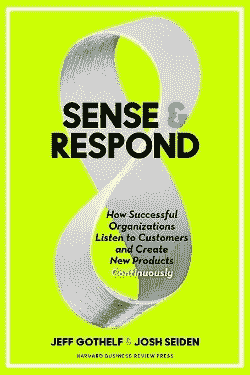

# 敏捷没有大脑

> 原文：<https://medium.com/hackernoon/agile-doesnt-have-a-brain-51c2835a838>

这篇文章最初是发布给我的时事通讯订阅者的(他们现在有 1 万人)。如果你想通过电子邮件 [*获得这些更新，请在这里*](http://eepurl.com/bGYODD) *注册。*

如果你从未去过纽约的 Stormking 艺术中心，下次你在附近时一定要去看看。巨大的雕塑和装置散布在广阔的场地上，其规模、范围和创造力令人震惊。就像这个三条腿的佛陀。

当敏捷宣言在 2001 年被构思时，它被设计来改变团队进行软件开发的方式。这并不是对部署的软件太少的反应。这是对部署错误软件的反应。或者根本没有部署软件。但是在大规模采用的过程中发生了一些事情。公司“雇佣”敏捷的原因变了。早期采用者在寻找更好的方法来满足软件的商业赞助商的需求。他们寻求更紧密的合作、利益相关者的更多参与以及更短的反馈循环，以确保他们所构建的东西符合公司的期望。

15 年过去了，敏捷已经成为大多数公司事实上的工作方式——至少对他们的软件团队来说是这样。然而，他们选择这种工作方式的原因已经发生了巨大的变化。他们没有寻找更好的方法来满足业务需求，而是寻找更快的方法。我们用结果换取速度。团队被鼓励尽可能多的出货。路线图都写好了。做出了承诺，产品变得臃肿，却不清楚这些新功能是否被使用、被需要或增加了客户价值。

*我们的产品最终看起来就像这把吉他。事实上，你可以想象这是吉他的微软 Word 版本。这把吉他上 95%的“功能”对 95%的人来说都是无用的。我们如何知道我们运送的东西实际上增加了价值？*

敏捷，正如它目前在大多数公司中实现的那样，已经变成了一个“愚蠢”的过程。它没有大脑。原本打算通知后续步骤的反馈循环已经变成了检查点，以确保我们已经完成了两周前商定的内容。这一发展有许多后果。这个月我想关注的是优先级。如果目标是尽可能快地将特性发布出去，那么所有的特性都是平等的。组织衡量的“价值”是部署。区分优先级变得非常困难(我每周都在我的客户身上看到这种情况)，因为最重要的是部署无 bug 代码。没有人会问一个特性是否比另一个提供更多的价值。只要速度计数上升，管理层就很高兴。

相反，敏捷团队需要通过关注客户价值，在他们的敏捷过程上投入更多的精力。那是什么意思？意思是:

*   通过定期与客户面谈，了解他们想通过您的系统实现什么目标
*   通过分析他们在您系统中的行为，了解是什么阻碍了他们的成功
*   使用这些信息来确定功能的优先级
*   建立定期反馈循环(定量和定性),确认我们的想法确实增加了价值
*   让正确的解决方案从系统的使用中浮现出来——不要试图准确预测每个交互将如何得到最好的服务。客户对早期特性的使用为这些特性的未来迭代提供了信息。
*   当事实与你的计划不一致时，利用这种工作方式的灵活性来改变路线(即重新确定优先顺序)

这场对话的内容远非一篇短文所能涵盖。我很想听听你在工作中做了什么来建立更好的优先化实践，并在你的敏捷过程中投入更多的精力。

— — — — — — — — — — — — — — — — — — — — — — — — — — — — — — —

**图书新闻**

精益 UX 第二版[发货！它在亚马逊的几个类别都很受欢迎。推荐你去看看。](http://bit.ly/LeanUX2)[Sense&response](https://www.amazon.com/Sense-Respond-Successful-Organizations-Continuously/dp/1633691888/ref=asap_bc?ie=UTF8)是我们对李·UX 的后续报道，针对那些希望建立公司和团队、支持我们在书中倡导的方法的领导者。现在可以预订[。如果你最终读了这两本书或其中之一，我们将非常感谢你在亚马逊上的评论。](https://www.amazon.com/Sense-Respond-Successful-Organizations-Continuously/dp/1633691888/ref=asap_bc?ie=UTF8)

— — — — — — — — — — — — — — — — — — — — — — — — — — — — — — —

**即将举办的研讨会:**

[纽约市——2017 年 2 月 7 日至 8 日 Jeff Patton 举办的为期两天的认证 Scrum 产品负责人课程](https://www.eventbrite.com/e/smart-scrum-product-ownership-new-york-city-2017-tickets-28364555148)。9 月份，我们把这个课程卖完了。我们计划明年二月在纽约再开一次。现在出售早鸟票。我们已经卖完了 40%。

— — — — — — — — — — — — — — — — — — — — — — — — — — — — — — —

*一如既往，如果您希望我直接与贵公司合作培训、辅导或研讨会，* [*不要犹豫，请联系*](mailto:jeff@gothelf.co?Training%20inquiry) *。*

> [黑客中午](http://bit.ly/Hackernoon)是黑客如何开始他们的下午。我们是 [@AMI](http://bit.ly/atAMIatAMI) 家庭的一员。我们现在[接受投稿](http://bit.ly/hackernoonsubmission)，并乐意[讨论广告&赞助](mailto:partners@amipublications.com)机会。
> 
> 如果你喜欢这个故事，我们推荐你阅读我们的[最新科技故事](http://bit.ly/hackernoonlatestt)和[趋势科技故事](https://hackernoon.com/trending)。直到下一次，不要把世界的现实想当然！

