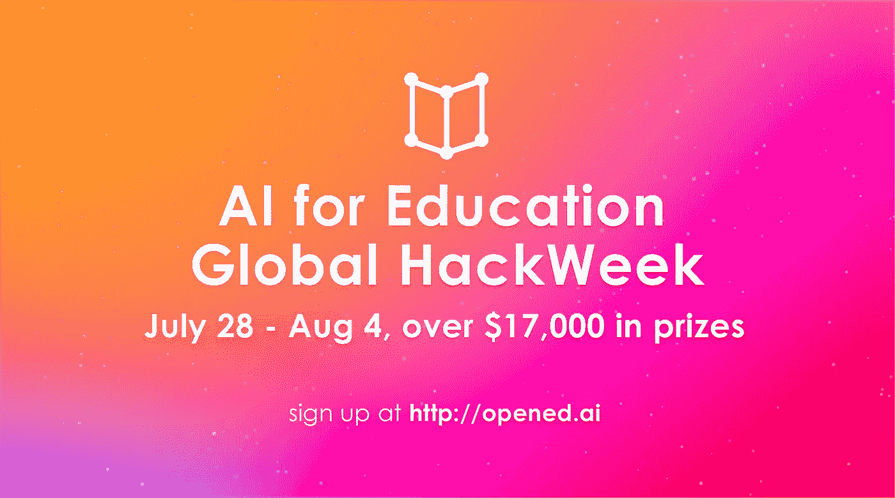

# AI for Education 全球黑客周:7 月 28 日至 8 月 4 日，奖金超过 17，000 美元！

> 原文：<https://medium.com/hackernoon/ai-for-education-global-hackweek-17k-in-prizes-july-28-aug4-c9155c5f6bdf>

***TL；DR:*** [*开幕，ai*](http://opened.ai) *在全球 AI for Education hack week(7 月 28 日—8 月 4 日)期间，为解决教育问题的开源人工智能项目的每位参与者颁发高达 17K 美元的奖金和超过 15k 美元的云积分。评委包括来自哈佛大学的计算机科学教师和来自世界各地的 NLP 专家(例如，Keras 的创造者 Franç ois Chollet)，该活动得到了 omid yar*[*Network*](https://hackernoon.com/tagged/network)*(赞助大奖 6K 美元)、IBM、谷歌开发者团体、亚马逊网络服务和数字海洋的慷慨支持。来自麻省理工学院、哈佛大学、牛津大学、剑桥大学、印度理工学院和世界各地的科技公司的 850 多名学生和专业人士已经注册参加。你可以在任何地方免费参与。黑客明天(7 月 28 日星期五)开始，* ***报名*** [***现在***](http://opened.ai/signup.html) ***。***

六个月前，我和 Nikhila 作为哈佛的学生相遇，因为对教育的共同兴趣和对深度学习和自然语言处理的最新进展如何解决教育效率低下的共同兴趣。我们开始合作专注于教育的人工智能项目，如 [SochoBot](https://www.youtube.com/watch?v=azzLNPU17Go) (一个能够实时理解和 Q & A 的辅导机器人)，以及 [LingoLens](https://www.youtube.com/watch?v=k7MUh0ZtCrc) (一个语言学习应用程序，它使用深度图像字幕，用你正在尝试学习的语言向你描述你的世界的图像)。

在这些项目中，我们发现由[Denny Britz](https://medium.com/u/85005d8f5c2d?source=post_page-----c9155c5f6bdf--------------------------------)([WildML.com](http://www.wildml.com))和 [Andrej Karpathy](https://medium.com/u/ac9d9a35533e?source=post_page-----c9155c5f6bdf--------------------------------) 等创建的开源代码、预先训练的模型、数据集和教程具有巨大的价值。我们认为，鉴于 ML 通常要求的陡峭的学习曲线，以及该领域在学术/研究孤岛中快速前进的步伐，ML 社区将*继续*从弥合学习和信息差距的开放源代码倡议中获得巨大利益。

出于这个原因，我和尼基拉正在建设[open . AI](http://opened.ai)，这是一家致力于开发和推广开源教育人工智能的非盈利机构，我很高兴地宣布 open . AI 的成立活动:面向教育的**人工智能全球黑客周**，将于 7 月 28 日至 8 月 4 日举行。

在这个全球黑客周期间，我们很高兴通过亚马逊、IBM Watson、谷歌开发团队和数字海洋的慷慨支持，为所有参与者提供免费的计算资源。**谷歌、IBM 专题在线研讨会**；**我们的赞助商提供的 1.7 万美元奖金；**和**来自哈佛 CS 的专家评委**以及全球 ML 社区的成员。(更多详细信息请参阅下面的常见问题解答)

# 我在黑客周可以解决哪些问题？

选择您希望使用人工智能解决的教育中的任何低效、问题或用例，包括但不限于:

*   内容和交付的个性化
*   智能、适应性评估
*   即时问答
*   文本摘要和机器理解
*   学生学习风格的聚类和分类
*   问题意图的聚类和分类
*   从文本生成问题
*   语言评分(自动评分)

# 在黑客周期间，我可以创建和提交什么？

1.  **可用产品:**网络应用、移动应用、聊天机器人、Alexa 技能等。
2.  **数据集:**从公共来源收集对未来教育领域人工智能工作有用的数据，并与文档一起发布
3.  **教程** / **操作指南文章**针对您过去做过或现在正在做的人工智能教育工作

所有代码、数据、教程将在 [GitHub](https://github.com/opened-ai) 上的 HackWeek 结束时开源，获奖项目将在 OpenEd.ai 的网站和各种媒体渠道进行推广。

# 能拿什么奖？

1.  **奥米迪亚网络赞助的 6000 美元大奖**
2.  **由亚马逊网络服务赞助的 5000 美元 AWS 积分**
3.  **$3，000 美元**由 IBM 赞助
4.  **$3，000 的谷歌云积分**由谷歌开发团队赞助

# 谁在评判？

**亚历山大·拉什**:哈佛大学 CS 教授；哈佛 NLP 的负责人。脸书；神经机器翻译、文本摘要、自然语言处理方面的专家

**丹尼·布里兹**:前谷歌大脑；斯坦福 ML/CS；经营 ML 博客[WildML.com](http://wildml.com)；强化学习、深度学习专家

**Fran ois Chollet:**广泛使用的 Python 深度学习库 [Keras.io](https://keras.io/) 的创建者；AI &谷歌深度学习研究员；Kaggle 全球排名 17

**乔尔·泰特劳特:**研究总监@ [语法上](https://www.grammarly.com/)。前 NLP @雅虎实验室。作文/语言评分专家。举办 [NLP 教育](http://www.cs.rochester.edu/~tetreaul/bea12.html)研讨会。

IBM Research 的专家也将加入这个小组。

# 我将获得哪些资源？

1.  **每位参与者 1200 美元的 IBM Watson/Bluemix 积分**，有效期为 6 个月。一个月 200 美元。
2.  **每位参与者 300 美元的谷歌云平台积分**
3.  **$100 AWS 信用点**GPU 培训/托管的每位参与者
4.  **$50** **数字海洋信用点**每位参与者用于托管

此外，OpenEd.ai 还提供了一系列资源来帮助你开始你的项目。在行业专家的帮助下，我们已经搜索了网络，以创建和管理每个轨道的教育特定资源，包括[机器学习](https://hackernoon.com/tagged/machine-learning)模型的代码(许多带有预先训练的检查点)、相关概念的教程和清理过的数据集(其中一些是我们专门为 HackWeek 收集的)。

在 http://opened.ai/resources.html 的[可以看到这份名单的预览。完整的资源列表将在 7 月 28 日星期五黑客攻击期开始时发布。](http://opened.ai/resources.html)

# 我必须在哪里参加？

世界上任何地方的任何人都可以参加。

从**7 月 28 日至 30 日，**在 IIT 德里大学校园(位于德里)有一个可选的现场活动。从 7 月 31 日到 8 月 4 日，每个人都远程工作。

提交将于 8 月 4 日 IST 时间下午 5 点截止，获奖者名单将于 8 月 10 日星期四公布。

# 这是一个很棒的想法——作为合作伙伴，我该如何参与？

在 OpenEd.ai，我们很高兴能创建一个关注开源、人工智能和教育的社区。如果您想以任何方式做出贡献，作为支持者、评委、顾问或赞助商，请通过[电子邮件](mailto:team@opened.ai)联系我们，或在 Twitter @OpenEdAI 上找到我们。

# 在黑客周之前或期间，我可以在哪里提问？

我们在 OpenEd.ai 社区 slack 中创建了一个黑客周频道，供您在黑客马拉松之前或期间提出任何问题。

在你注册了黑客周之后，请邀请你自己参加在[http://bit.ly/openedaislack](http://bit.ly/openedaislack)的社区 Slack 讨论。我们期待您的回复。

# 为什么开源人工智能用于教育？

1.  人工智能有能力让教育对所有人来说更容易获得，更实惠，更高质量，更高效。
2.  人工智能已经并将继续从开源计划以及思想、知识和数据的共享中受益匪浅。

在过去的几年里，人工智能的研究和应用青睐于高度资本化的行业，将“人工智能教育”这一公认的出于经济和技术原因的艰难追求降级为科技博客头条和炒作的领域。

OpenEd.ai 和首届“AI for Education”黑客周的使命是重新关注计算机科学界在这一领域可以取得的显著成就，并激励聪明人将宣传转化为成果。

我们希望你能加入我们。