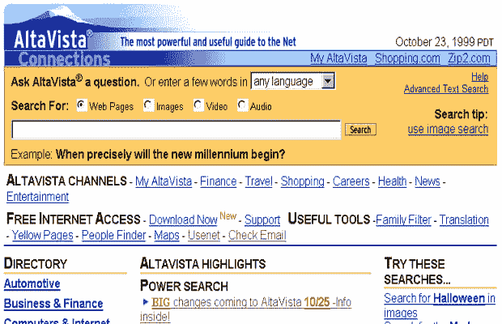

# 人工智能、人性和产品设计的未来

> 原文：<https://medium.com/hackernoon/ai-humanity-and-the-future-of-product-design-4dc566be372e>

Picture by aytuguluturk

## **人工智能**

埃隆·马斯克(Elon Musk)一直在敲着众所周知的“[我们需要害怕人工智能](http://money.cnn.com/2017/09/04/technology/culture/elon-musk-ai-world-war/index.html)”的鼓，与人工智能社区的其他杰出成员一起。甚至普京[最近也提到了这个](https://www.wired.com/story/for-superpowers-artificial-intelligence-fuels-new-global-arms-race/)。我很大程度上同意他们的观点，但不是好莱坞式的。典型的好莱坞末日场景是:

> 1.人工智能获得了类似人类的能力
> 
> 2.出于某种原因，它是一个人形机器人或某种拟人的形式。天网是个例外
> 
> 3.AI 认为人类是宇宙的负担，他们都必须死。根据电影的不同，这可能是对过去人类对待人工智能的报复——就像《太空堡垒卡拉狄加》中的赛昂人
> 
> 4.故事的主人公拯救了世界，人类安全了，世界又变得伟大了，或者世界陷入了一个反乌托邦式的人工智能统治的未来，在那里人类只是凡人，可以被牺牲或者被剥削为资源

这种叙述无助于社区对增加人工智能能力的追求，倾向于建立人工通用智能(AGI)。AGI 不会出现在试图用简陋的武器杀死人类的人形机器人身上！皮尤！随着我们越来越多地在产品和日常生活中采用人工智能技术，人工智能的出现和影响将更加微妙和普遍。

> *'* [*一工作就没人再叫它 AI 了*](https://cacm.acm.org/blogs/blog-cacm/138907-john-mccarthy/fulltext) *'*
> 
> ——人工智能的先驱之一约翰·麦卡锡

网飞推荐、谷歌广告、脸书新闻、iPhone 电池优化、算法交易、你的优步应用程序中的动态定价，或者当你寻找航班时——人工智能无处不在，但我们没有注意到它。即使我们注意到了，我们也认为这是自然的。

尼克·博斯特罗姆(Nick Bostrom)在他的书《超级智能》(Superintelligence)中为人工智能构成的生存威胁提供了一个精彩的案例。一个常见的说法是——“AGI 似乎很遥远，为什么我们现在就应该开始考虑它？”。斯图尔特·罗素对此有很好的回应。假设 AGI 在 50 年后。现在想象一下，我们从某个外星文明那里得到一条信息。

> *‘地球人’。我们将在 50 年后拜访你。'做好准备'*

想象一下这样的声明会引起多大的混乱。相比之下，我们似乎对 AGI 构成的生存威胁持放任态度。我们不知道我们需要多长时间来建立制衡机制，以应对 AGI 带来的生存威胁。可能是 5 年。或者 100 年。我们现在应该担心这个。

## **人性**

与此同时，人类需要弄清楚如何保持相关性。对于埃隆·马斯克来说,“登月”这个词已经是老生常谈，而他的最新项目 Neuralink 将它带到了[的另一个高度](https://waitbutwhy.com/2017/04/neuralink.html)。这是开始研究构建大脑界面的一种尝试，这样我们就可以用机器增强人类的能力。这是漫长的技术发现和采用周期中合乎逻辑的下一步。这从发现火开始。从那时起，人类一直在寻求使用外部/人工方法来增强人类的能力。

Neuralink 暗示了人类和人工智能在类似机器人的场景中融合的未来。虽然这看起来很可怕，但在某种程度上，我们已经是电子人了。今天的普通人有能力在瞬间获取信息。仅仅 30 年前，只有人民中最有权力的人才拥有这种超能力。

> 杰拉尔德·福特:“我说，迪克，这是什么 DARPA？你能帮我查一下吗？”
> 
> 迪克·切尼:“是的，先生”

## **一天天进化**

我们正在拥抱技术，并将其更深入地融入我们的日常生活。我们选择开发、采用和构建的技术遵循[文化进化](http://www.oxfordbibliographies.com/view/document/obo-9780199766567/obo-9780199766567-0038.xml)的规则，并受提供反馈机制的环境——资本主义“自由市场”的支配。人工智能是下一个大规模采用的领域，而且已经开始了。这对产品管理、设计和开发有着有趣的影响。

为了更好地理解这一点，让我们看看软件开发在过去的 20 年中是如何变化的。这是 90 年代中期的一个典型的 web 应用程序。

花一分钟时间来了解一下 1995 年被认为是设计的大量信息。

要建造这样的东西，需要做的事情如下。

> 1.编写业务逻辑
> 
> 2.将任何需要存储在数据库中
> 
> 3.构建用户界面。通常意味着手写 HTML
> 
> 4.基于业务逻辑规则连接 UI 来做不同的事情
> 
> 5.查找具有公共 IP 的服务器
> 
> 6.部署应用程序
> 
> 7.部署数据库

单一的应用程序演变成了将问题分解成抽象概念。模型-视图-控制器(MVC)架构就是这样一种方法。

> 1.模型—应用程序的数据模型
> 
> 2.控制器—基于编码的业务逻辑控制视图
> 
> 3.查看—根据控制器的指令呈现 HTML
> 
> 4.服务器—托管应用程序/数据库
> 
> 5.开发环境、源代码控制和部署

扩展性和可靠性挑战迫使人们重新思考 web 应用背后的基础设施。首先出现了主从数据库。然后是负载平衡器。垂直数据库扩展。横向数据库扩展。云！服务器的自动配置和扩展(AWS)。面向服务的架构(还记得吗？).微服务。现在:无服务器应用。

软件行业大规模采用敏捷开发方法推动了缩短迭代时间、开发周期和支持实验的需求。这导致整个行业弄清楚如何快速部署、版本化和试验应用程序。自动化测试。自动化部署。持续集成。实验框架。通过 SDK 和 API 等抽象将非核心活动外包给开发框架、分析、崩溃报告、客户外展(如支持聊天、推送通知、发送电子邮件、A/B 测试、分阶段推出)等。

> 这些抽象的创造者和推动者获得了最大的价值。

这些技术的发展使得这个行业能够在更高的抽象层次上工作。这样做的结果是能够在迄今取得的进展的基础上再接再厉，从而取得更快的进展。这最终成为一个幂律，进步是指数级的。这个概念被雷·库兹韦尔的[加速回报定律](http://www.kurzweilai.net/the-law-of-accelerating-returns)巧妙地捕捉到了。

## **我们将搭建一个平台！**

“搭建平台”又开始流行了。问题是，没有一家平台公司是成功的，因为他们从第一天起就决定建立一个平台。他们都是先造了一个很棒的产品。打造这个伟大的产品让他们成功构建了一个伟大的平台并占领了市场。在成为游戏开发者服务平台之前，Unity 解决了为游戏渲染 3D 场景的问题。亚马逊建立了一个大规模可扩展的电子商务网站，它需要一个内部版本的 AWS 才能成功。AWS 是亚马逊在进军 Amazon.com 时经历的多年内部斗争和痛苦的顶点。脸书是一个伟大的广告平台，因为他们建立了一个引人注目的产品，用户想要使用。谷歌也一样。

这导致了整个行业向抽象链的上游移动。知道如何操作 HTML 和构建 CSS 的人在 90 年代是一个有价值的开发者。这现在很容易做到。总的来说，行业看重的是工程团队打造产品，为用户解决实际问题，为公司创造价值的能力。并以一种可持续的、长久的方式做到这一点。

这就是产品设计师和产品经理的用武之地。

## **产品抽象**

对于产品设计师和产品经理来说，我们正处于抽象构建过程的开始。正如软件工程/web 开发的部分被抽象出来、自动化和平台化一样，同样的事情也发生在产品设计师和产品经理身上。

现在。回到 AI。我们现在有——产品设计+由不断增加的抽象驱动的产品管理+不断增加的人工智能能力。抽象阶梯上的下一个逻辑步骤是将 ML/AI 整合到产品设计和管理中。随着人工智能和机器学习技术变得越来越商品化，产品经理可用的能力将会增加。我们如何选择将这些技术与人类创造力相结合，将决定产品设计的未来。

**人类的消费+创意+ AI 是相通的。**

> 1.人类消费驱动着技术市场。这遵循了文化进化的框架(反馈机制，迭代，最好的生存和建立)
> 
> 2.产品是为人类消费而制造的。抽象水平的提高不会孤立地发生。他们服务于市场的需求
> 
> 3.未来是融合人类的创造力和人工智能能力，制造更好的产品供人类消费

这里的一个基本假设是，人类消费决定市场力量，因为人类消费是我们在其中运作的经济。

## **迭代未来**

当让人工智能控制产品的某些方面有意义时，它就会发生，因为市场力量将朝着那个方向发展。人类的参与和价值将继续转变。我们需要适应并不断把自己放在人类能够攀登抽象阶梯的地方，以保持相关性。幸运的是，产品管理和设计社区将持续学习和迭代作为一种生活方式。我毫不怀疑我们将继续保持相关性。

我向一个刚满 21 岁的人解释说，AI/ML 领域现在感觉就像 90 年代初的互联网领域。有很多公司——大公司和初创公司，都在尝试，我们不知道谁会赢。我们甚至不知道胜利是什么样子。一个亚马逊或谷歌的等价物将会从某个地方出现，可能是我们最意想不到的地方。我对我的伪智力评估颇为得意，直到我遇到了一个茫然的凝视。这个人出生于 1996 年，根本不知道我在说什么！

未来会很棒。我们只是看到了人工智能对产品设计影响的开始。内容推荐、动态定价、针对性促销。这个世界正朝着为用户提供随机性的方向发展，希望给用户一种个人的、偶然的体验。谁知道这会走向何方。

这就是为什么 Prashast，Indradeep 和我开始[产品 ML](http://www.productml.com/) 的原因。我们希望与人工智能和人工智能结合，在产品设计中塑造人类创造力的未来。

更多关于机器学习和产品体验的文章:

*   [*如何利用机器学习建立动态花园*](/towards-data-science/how-to-build-a-dynamic-garden-using-machine-learning-d589468f7c04)
*   [*喔喔喔！ML 现在知道什么好玩了？*](/dynamic-game-difficulty/whoa-whoa-ml-knows-whats-fun-now-95b219b9ff3b)
*   [*面向核心产品体验的机器学习*](/dynamic-game-difficulty/machine-learning-for-core-product-experience-970ce4352e0f)
*   [机器学习:防止意外后果](https://hackernoon.com/machine-learning-preventing-unintended-consequences-d568207796ce)

在 [*产品 ML*](http://www.productml.com) ，我们相信未来所有的产品都将是动态的。我们正在建立一个平台，重新定义产品管理和用户体验，从使用机器学习的游戏中的动态难度开始。