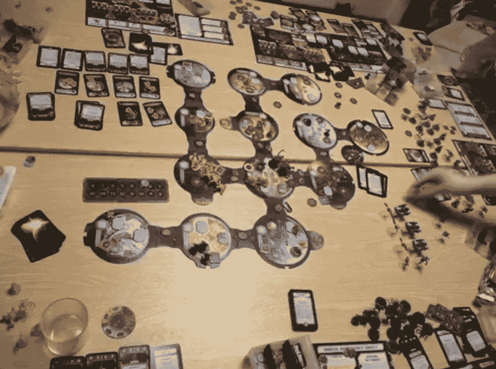

# 人工智能最大的未解决问题:用符号表示双向链接模式

> 原文：<https://medium.com/hackernoon/ais-biggest-unresolved-issue-linking-patterns-in-a-bidirectional-way-with-symbolic-68bbccf6885c>

> 认知和神经系统博士学位|物理学硕士学位。[原载](https://www.quora.com/What-is-the-biggest-unresolved-problem-for-AI/answer/Yohan-John)于 [Quora](http://quora.com?ref=hackernoon) 。

我认为理解人工智能缺失的所有东西的最佳方式是描述一个单一的例子，它将人类通常认为理所当然的各种认知能力融合在一起。当代的人工智能和机器学习(ML)方法可以孤立地解决每个能力(质量程度不同)，但整合这些能力仍然是一个难以实现的目标。

想象一下，你和你的朋友刚刚购买了一个新的桌面游戏**——一个复杂的游戏，有一个精心制作的棋盘，各种各样的棋子，一副副纸牌和复杂的规则。还没有人知道如何玩这个游戏，所以你拿出了说明书。最终你开始玩。你们中的一些人可能会犯一些错误，但是在几个回合之后，每个人都在同一页上，并且至少能够尝试赢得游戏。**

Image source: [StarCraft: The Board Game — Brood War Expansion](https://boardgamegeek.com/image/413351/starcraft-board-game-brood-war-expansion)

在学习如何玩这个游戏的过程中会发生什么？

1.  **语言解析:**阅读规则书的玩家要把符号变成口语。听到规则被大声朗读的玩家必须分析口语。
2.  **模式识别:**玩家要把正在朗读的单词和游戏中的物体联系起来。“十二面骰子”和“红色士兵”必须基于语言线索来识别。如果说明书有插图，这些插图必须与现实世界中的物体相匹配。在游戏中，玩家必须识别棋子和卡片的排列，以及事件的关键顺序。优秀的玩家还学会识别彼此游戏中的模式，有效地创建其他人精神状态的模型。
3.  **运动控制:**玩家必须能够将棋子和卡片移动到棋盘上正确的位置。
4.  规则遵循和规则推理:玩家必须理解规则，并检查它们是否被正确应用。在学习了基本规则之后，优秀的玩家还应该能够发现帮助他们获胜的更高层次的规则或倾向。这种推论与模仿他人思维的能力密切相关。(这在心理学上被称为[心理理论](https://en.wikipedia.org/wiki/Theory_of_mind)。)
5.  **社交礼仪:**球员是朋友，即使有些球员犯了错误或扰乱了比赛进程，他们也要友好相待。(当然我们知道这并不总是发生。)
6.  **处理中断:**如果门铃响了，披萨来了，玩家必须能够脱离游戏，处理送货员，然后回到游戏，记住像轮到谁这样的事情。

在所有这些子问题上，至少已经有了一些进展，但是当前 AI/ML 的爆炸主要是模式识别进步的结果。在某些特定领域，人工模式识别现在胜过人类。但是也有各种各样连模式识别都失败的情况。人工智能方法识别物体和序列的能力还没有人类模式识别那么强大。

人类有能力创造各种各样的不变表示。例如，在存在遮挡和高度可变的照明情况下，可以从各种视角识别视觉模式。我们的听觉模式识别能力可能更令人印象深刻。在有噪声以及速度、音高、音色和节奏发生巨大变化的情况下，也能识别音乐短语*。

毫无疑问，人工智能将在这个领域稳步提高，但我们不知道这种提高是否会伴随着在新的环境中概括先前学习的表达的能力。

没有一个现存的人工智能游戏玩家能够解析类似“这个游戏就像卡坦的定居者，但是在太空中”这样的句子。语言解析可能是人工智能最困难的方面。人类可以使用语言获取新信息和新技能，部分原因是因为我们拥有大量关于世界的背景知识。此外，我们可以以非常灵活和依赖于上下文的方式应用这些背景知识，因此我们对什么是相关的和什么是不相关的有很好的感觉。

对旧知识的概括和再利用是一种更广泛能力的方面:**多种技能的整合**。这可能是因为我们目前的方法与生物智能的相似度还不足以让大规模集成变得容易。

一种众所周知的集成挑战叫做[符号接地问题](https://en.wikipedia.org/wiki/Symbol_grounding_problem)。这是符号(如数学符号或语言中的单词)如何与感知现象相关联的问题——景象、声音、纹理等等**。

粗略地说，人工方法有两种:**象征性**，和**亚象征性**。符号方法被用在“经典的”或“传统的”人工智能中。它们对于基于确定性规则的情况非常有用，比如下棋(但是我们通常必须提前编写规则)。当人类提前做好符号基础时，符号处理就能很好地工作。它不擅长直接处理光、声音、纹理和压力形式的“原始”输入。

在另一个极端，我们有子符号方法，如神经网络(深度学习网络是其中的一种)。这些方法适用于原始输入的数字化版本，如像素、声音文件等。子符号方法对于许多形式的模式识别和分类来说都是很棒的，但是我们没有可靠的方法从类别标签到以基于规则的方式操作的符号。

因此，总而言之，理解人工智能问题的规模的关键需要理解智能不仅仅是模式识别。所需要的是用符号表示以双向方式链接模式的能力，这样语言和基于规则的思考可以发生在与真实世界实时交互的[具体化代理](https://en.wikipedia.org/wiki/Embodied_cognition)中。

> **延伸阅读**
> 
> *有关不变表示概念的更多信息，请参见以下内容:
> 
> [Yohan John 的回答计算神经科学中有哪些最重要的问题可能会极大地影响我们对大脑及其功能的认知？我们有办法解决这样的问题吗？](https://www.quora.com/What-are-some-of-the-most-important-problems-in-computational-neuroscience-that-might-drastically-affect-our-perception-of-the-brain-and-its-functioning-Do-we-have-an-idea-of-how-to-attack-such-problems/answer/Yohan-John)
> 
> 我写的这篇文章涵盖了不变性的一般概念，也称为对称性:
> 
> 科学:对对称性的探索
> 
> **有关符号基础概念的更多信息，请参见以下答案:
> 
> 约翰的回答关于认知和符号化，根植性是意义的必要条件吗？
> 
> 作者[约翰](https://www.quora.com/profile/Yohan-John)，认知和神经系统博士|物理学硕士。[原载](https://www.quora.com/What-is-the-biggest-unresolved-problem-for-AI/answer/Yohan-John)于 [Quora](http://quora.com?ref=hackernoon) 上。
> 
> 更多来自 Quora[的趋势科技答案，请访问](https://medium.com/u/3853f85f7d5e?source=post_page-----68bbccf6885c--------------------------------)[HackerNoon.com/quora](https://hackernoon.com/quora/home)。