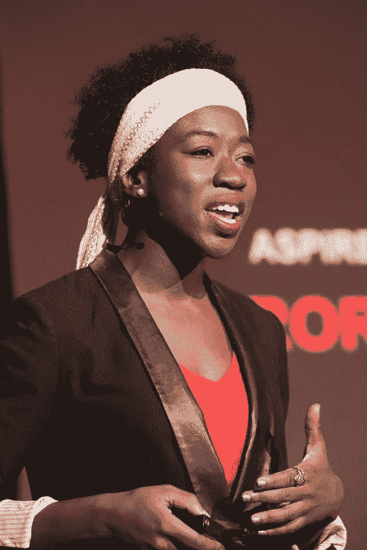

# 算法不是种族歧视。你的皮肤太黑了。

> 原文：<https://medium.com/hackernoon/algorithms-arent-racist-your-skin-is-just-too-dark-4ed31a7304b8>

最近，我一直在媒体上讨论对更具包容性的[人工智能](https://hackernoon.com/tagged/artificial-intelligence)和更具代表性的数据集的需求。相关的[标题](http://www.bbc.com/news/technology-39533308)和[评论](https://www.theguardian.com/technology/2017/may/28/joy-buolamwini-when-algorithms-are-racist-facial-recognition-bias)以多种方式框定了对话，有时掩盖了主要信息:

> 人工智能的兴起使人们有必要仔细关注无意中的偏见，这种偏见可能会使各种各样的人的歧视性做法和排斥性经历永久化。

尽管如此，有效的评论者提出了 1。)默认相机设置不能正确曝光[深色皮肤](https://hackernoon.com/tagged/dark-skin)和 2。)算法不是有意开发成种族主义的，值得进一步讨论。为了解决这些问题和其他与人工智能偏见相关的问题，我开始了 Illuminate 系列。Illuminate 系列的目标是拓宽关于人工智能及其对日常生活的影响的公共话语。请让我知道您是否愿意通过提交问题、发表客座博文、领导讨论组、创建教育演示或以其他方式参与。

## **阐明第 1 部分——摄像机、对比度和编码凝视。**

自从分享了我的演示面部识别失败的 [TED 演讲](https://www.ted.com/talks/joy_buolamwini_how_i_m_fighting_bias_in_algorithms)后，我被问到这个秘密问题的变体:

> 你的脸没有被发现的原因难道不是因为你的肤色太黑而缺乏对比度吗？

这是一个重要的问题。在计算机视觉领域，照明不足是一个主要挑战。理想情况下，您希望创建光照不变的系统，并且可以在许多光照条件下很好地工作。这就是训练数据可以发挥作用的地方。*应对照明挑战的一种方式*是通过在各种照明条件下对一组不同的图像训练面部检测系统。

当然，在某些情况下，我们达到了可见光谱的极限。(红外探测系统也有)。我在这里的重点不是极端情况，而是日常情况。TED 演讲中的演示展示了一个真实的办公环境。我的脸对人眼来说是可见的，就像我的演示伙伴的脸一样，但是人眼和处理其输入的视觉皮层远比一个不起眼的网络摄像头高级。尽管如此，即使使用网络摄像头，你也可以在演示中看到，我的搭档的脸没有曝光过度到让人难以理解，我的脸也没有曝光不足到导致明显的信息丢失。

虽然与我的演示例子不太相关，但也有曝光过度或曝光不足的极端失败案例，当然还有图像中完全没有光线的情况。然而，相机并不像看起来那样中立。

## 相机是客观的吗？

数码相机的默认设置受彩色胶片历史的影响，它本身暴露了对较亮皮肤的优化。这个 VOX 视频提供了一个丰富的概述，介绍了相机技术如何随着浅色皮肤的出现而发展。https://www.vox.com/2015/9/18/9348821/photography-race-bias

Defaults are not neutral

我很高兴地得知，巧克力和家具公司的投诉，他们希望自己的产品得到更好的表现，从而改善了早期摄影中较暗色调的表现。在数字时代，LDK 系列是由菲利普斯开发的。相机明确地用两个芯片处理肤色变化——一个处理较暗的色调，另一个处理较亮的色调。奥普拉·温弗瑞秀使用 LDK 系列进行拍摄，因为人们意识到需要更好地暴露深色皮肤。

> 考虑到包容性，我们可以制造更好的传感器技术以及更好的训练数据和算法。

我们必须记住，默认设置不是中性的。它们反映了编码的目光，那些有机会开发技术的人的偏好。有时这些偏好可能是排斥性的。

## **排斥开销**

不少观察者建议，我应该简单地确保使用额外的照明，而不是指出故障。沉默不是答案。让更多的灯来增加已经照明的房间的照明是一个权宜之计。建议深色皮肤的人保持额外的光线来更好地照亮自己没有抓住要点。

> 我们应该改变自己去适应技术还是做出适合我们的技术？

谁需要采取额外的步骤来让技术发挥作用？默认设置是为谁优化的？

算法正义联盟的目标之一是强调人工智能的问题，以便我们可以开始寻找解决方案。我们提供可操作的评论，同时致力于研究，以制造更具包容性的人工智能。在谈论我的经历时，其他人也被鼓励分享他们的故事。寂静被打破了。越来越多的人意识到我们可以在机器中植入偏见。随着我们开始收集更多的报告，这仅仅是个开始。

我们在 AJL 收到的一份野外偏见报告分享了下面的故事。

> “我的一个朋友在一家大型科技公司工作，遇到了使用面部识别的电话会议系统无法识别的问题。
> 
> 虽然该公司有一些专门针对她深色皮肤的部门，但如果她要出席，她必须确保专门预订这些房间。这限制了她在这些房间可用时展示和分享信息的能力。"

这位员工正在处理当我们没有考虑或测试技术来解释我们的差异时可能产生的排斥开销。

## **全方位包容心态**

质疑相机是如何渲染不同肤色的，可以帮助我们思考改善计算机视觉的方法。我们也要记住，利害攸关的不仅仅是面部分析技术。AJL 的工作不仅仅是计算机视觉中的面部检测或人口统计偏见。我用面具的例子来直观地展示自动化系统是如何无意中导致排他性体验的。

我知道，作为技术人员，一旦我们发现哪里出现了问题*和*致力于解决问题，我们就能做得更好。我们还可以通过询问和倾听人们对我们创造的技术的真实体验来更好地获得反馈。我们可以建立更好的系统来解释人类的多样性。让我们不要害怕指出我们的失败。我们可以承认物理和结构性挑战，质疑我们对违约的假设，并向前迈进，创造更具包容性的技术。

## **行动步骤:分享你的故事**

你的声音很重要。为包容大声疾呼是走向改变的第一步。我花了五年时间鼓起勇气分享我的真相。尽管我很害怕，但我很高兴我这样做了。反应非常热烈。我目睹了那么多想成为创造美好未来的一份子的人。我的收件箱里塞满了来自其他人的信息，这些人在听到我的故事之前一直以为自己是孤独的。如果你有故事要分享，请考虑提交给 AJL。

在[http://fight.ajlunited.org](http://fight.ajlunited.org)照亮偏见，对抗编码凝视

《照亮》系列接下来应该解决什么问题？请在下面的评论中分享你的建议。

> Joy Buolamwini 是一名代码为的[诗人，他的使命是通过计算来表达同情。她写道](http://www.poetofcode.com)[编码](/@Joy.Buolamwini/incoding-in-the-beginning-4e2a5c51a45d)和[创造学习经验](http://www.code4rights.org)发展社会影响技术。在推特上找到她 [@jovialjoy](http://www.twitter.com/jovialjoy) 和 [@ajlunited](http://www.twitter.com/ajlunited) 在 [LinkedIn](https://www.linkedin.com/in/buolamwini) 或[脸书](http://facebook.com/ajlunited)上联系。

> [黑客中午](http://bit.ly/Hackernoon)是黑客如何开始他们的下午。我们是阿妹家庭的一员。我们现在[接受投稿](http://bit.ly/hackernoonsubmission)并乐意[讨论广告&赞助](mailto:partners@amipublications.com)的机会。
> 
> 如果你喜欢这个故事，我们推荐你阅读我们的[最新科技故事](http://bit.ly/hackernoonlatestt)和[趋势科技故事](https://hackernoon.com/trending)。直到下一次，不要把世界的现实想当然！

