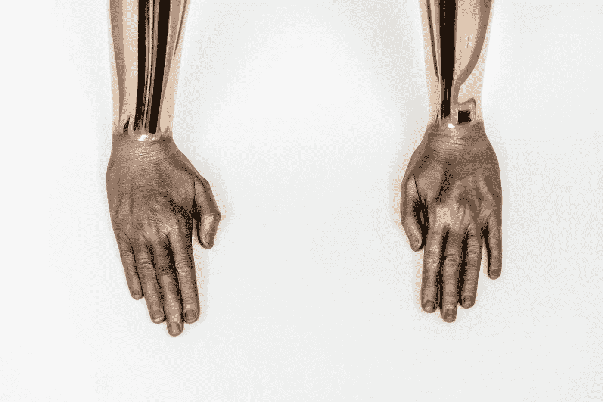

# AlphaGo &强化学习；人类帮助机器人；优步& Lyft 加剧拥堵++ EV136

> 原文：<https://medium.com/hackernoon/alphago-reinforcement-learning-humans-help-robots-uber-lyft-add-to-congestion-ev136-94d027ac2622>

> **我写了一篇 tech 最喜欢的时事通讯，** [**指数视图**](http://bit.ly/2xZ79pv) **。以下是本周一期的节选。**
> 
> 如果你喜欢，就订阅吧！

DeepMind 再次让我大吃一惊。他们发布了 AlphaGoZero (AGZ)，这是一种新的围棋方法

> 完全依靠自我游戏强化学习，从随机游戏开始，没有任何监督或人类数据的使用。第二，它只使用棋盘上的黑白棋子作为输入特征。第三，它使用单一的神经网络，而不是单独的政策和价值网络。最后，它使用一个更简单的树搜索，依靠这个单一的神经网络来评估位置和样本移动。

总之，这是一个单一的神经网络，没有经过任何训练数据的训练。(你应该还记得 alpha go[的前几个版本是在数以百万计的人类游戏中训练出来的。)结果令人印象深刻。不到三个小时，AGZ 就弹得和人类初学者一样好了。自己下了几天，就成了世界上最好的围棋手。](https://hackernoon.com/tagged/alphago)

此外，AGZ 仅使用谷歌的四个张量处理单元实现了这一点，这是一个专用于这些类型的神经网络的芯片。最初的 AlphaGo 需要 176 个 GPU(一个不太优化的[技术](https://hackernoon.com/tagged/technical)架构)。AlphaGo 被实例化三天后，AGZ 正在鞭打它的硅臀。DeepMind 的博文[读起来很清晰](https://deepmind.com/blog/alphago-zero-learning-scratch/)。

🤔[华盛顿大学教授](https://twitter.com/pmddomingos/status/921212368452849669)[佩德罗·多明戈斯](https://medium.com/u/a4b28d28e02?source=post_page-----94d027ac2622--------------------------------)的一次观察:

> AlphaGo Zero 很棒，但是打住:自玩是 ML 最古老的思想之一，人类掌握围棋所花的时间远不到 500 万场。

老实说，要成为世界上最好的东西，3 天是相当快的时间。就计算机的资源而言，玩 500 万局围棋并不昂贵，但对人类来说，这可能会令人望而却步。

黑暗工厂:[机器人和人类如何在工厂里协同工作](https://www.newyorker.com/magazine/2017/10/23/welcoming-our-new-robot-overlords)。Sheelah Kolhatkar 的这篇令人惊叹的文章提供了对自动化工作场所及其驱动力的一瞥。对于工人:

> 自动化带来了越来越大的效率，尽管在某一点上，效率提高的逻辑会赶上他们，而他们将不再见证这一点。有一天，工厂可能会陷入黑暗。与此同时，[他们]享受着工作量较少的工作带来的好处。

希拉的作品是多维的，所以一定要读。但是有一个方面听起来很不吉利，那就是蒂姆·奥莱利 [所描述的](https://www.ft.com/content/f5989bf2-b427-11e7-8007-554f9eaa90ba):

> 一种经济理论的束缚，认为工资和工作条件完全受制于不可避免的供求规律，不承认我们创造的规则和激励机制，这些规则和激励机制无情地将生产率提高的好处以较低价格的形式分配给资本所有者和消费者，而是规定人类工人是一种需要消除的成本。

与此相关， *Nature* 有一个关于未来工作的[特别节目](https://www.nature.com/news/the-shape-of-work-to-come-1.22839)包括暗示帮助员工不断提高技能所需的持续培训可能来自 MOOCs。这很遗憾，因为 MOOC 的发起人之一，Udacity 的大人物 Clarissa Shen 已经宣布他们“死了”。

## **其他新闻…**

1.  Tezos 是一种受到无政府资本主义者喜爱的加密货币，因为它被认为是自治的启示。今年早些时候，在一次混乱的 ICO 中筹集了超过 2 . 3 亿美元，其创始人已经退出，威胁到整个项目。安娜·艾瑞拉出色地剖析了这个故事。 (Tezos 的期货[已经跌了 75%](https://cointelegraph.com/news/tezos-team-spat-sends-futures-price-diving-75-as-investors-panic) 。(阅读这篇文章可以获得对 Tezos 的简单介绍。)
2.  一项有趣的新研究称，优步和 Lyft 可能会加剧城市交通拥堵，同时让人们远离公共交通。躲避优步普锐斯车队的伦敦人不会感到惊讶，尽管还需要更多的研究。这项研究还发现，与 Zipcar 等以前的共享模式相比，打车服务吸引了更多的城市人口。瑞银估计，到 2035 年[使用 robotaxis 的费用将是拥有一辆汽车的一半](https://qz.com/1093268/ubs-robotaxis-will-cost-half-what-owning-a-car-does-in-the-future/)，但今天的拼车服务无法与拥有一辆汽车竞争。(h/t 雷利·布伦南。)我的数学告诉我，用一辆优步替换我的第一辆车不划算，但优步肯定替换了第二辆车(现在我没有了)。)
3.  诺亚·尤瓦尔·赫拉利[呼吁为后工作时代的经济和政治体系创造新的模式](https://www.nature.com/news/reboot-for-the-ai-revolution-1.22826)，警告我们没有多少时间了:

> 信息技术和生物技术的合并给 21 世纪带来的挑战可以说比蒸汽机、铁路、电力和化石燃料带来的挑战更大。鉴于我们现代文明的巨大破坏力，我们无法承受更多的失败模式、世界大战和血腥革命。这次我们必须做得更好。

4.这是一篇冗长但有价值的评论，讲述了作为一个民主国家的公民意味着什么:

> 相反，民主要求将人民视为公民——也就是说，视为能够做出深思熟虑的决定和采取道德行动的成年人，而不是需要被操纵的儿童。将人们视为公民的一种方式是赋予他们参与政治进程的有意义的机会，而不仅仅是每隔几年就会出现为领导人投票的人。