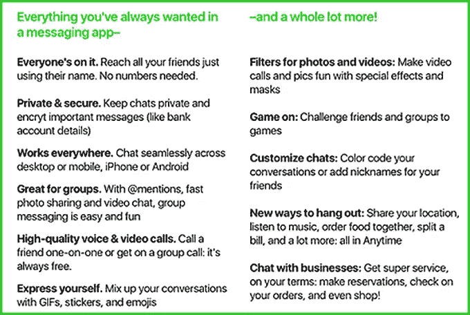
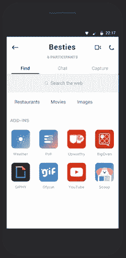

# 随时亚马逊，可以吗？(2)——好的、坏的和丑的

> 原文：<https://medium.com/hackernoon/amazon-anytime-can-that-work-2-the-good-the-bad-and-the-ugly-bbd4ac2b512f>

## 亚马逊可能会推出一款通讯应用，在脸书的领域展开竞争。但是它有机会吗？

[根据最近的消息](https://techcrunch.com/2017/07/14/amazon-messaging-app-anytime/)，亚马逊正在开发一款名为“Anytime”的应用，该应用将与脸书的 WhatsApp 或 Messenger 在社交通讯领域展开竞争。

这是一个(简短)系列帖子的第二部分，介绍了 Anytime 的几个方面:

*   [亚马逊为什么要这么做？](/@jorge.serna/amazon-anytime-can-that-work-1-why-2c8a77a8387a)
*   [什么看起来有趣，什么是坏主意？](/@jorge.serna/amazon-anytime-can-that-work-2-the-good-the-bad-and-the-ugly-bbd4ac2b512f)(继续阅读！这篇文章就是关于*那个*！)
*   [亚马逊还应该考虑什么？](https://hackernoon.com/amazon-anytime-can-that-work-3-what-else-to-do-16cd11cdc2a0)

# 什么时候都可以？

有关 Anytime 功能的可用信息来自以下列表:

(source TechCrunch)

在这种描述水平下，很难进行真正的产品评估，因为我们真的不知道客户将如何访问这些功能，交互将如何，或者体验将带来什么限制或差异。该列表仍然涵盖了其他应用程序的已知功能，同时添加了几个与市场上可用的不同或至少看起来有趣的东西。

让我们来看看，但要注意的是，分析将是 100%纯粹的猜测。

# 好人

所以看着这个列表，我可以看到提供一个新的消息应用程序有意义的事情:

*   它确实**涵盖了当今消息应用程序的基本要求。很明显，你可以发短信，也可以打语音和视频电话，还可以通过 gif 或表情符号将更多的创意应用到内容分享中(今天，如果没有这些，你甚至无法想象一款消息应用！)，以及用于图像和视频的过滤器。用户可以分享他们的位置(尽管它没有说这是当前位置，允许在一定时期内实时跟踪位置，或者不断分享，如 [Snap Maps](https://support.snapchat.com/en-US/article/find-friends-map) )。甚至@提及和聊天定制都有。当然，用一个合适的 UX 来理解这一切将是至关重要的，但是让我们假设 Amazon Anytime 在那里会做得很好。**
*   **多器。**亚马逊坚持认为你可以在多种设备上使用他们的产品，包括移动设备和桌面设备(奇怪的是，他们首先提到了桌面设备*……)。事实上，最初的图片还显示了智能手表图标，这表明他们正在认真对待这一方面。这遵循了 Telegram 采取的方法，并摆脱了 WhatsApp 中的[电流限制。它认为亚马逊已经意识到并准备迎接智能手机解体的趋势，我在](https://hackernoon.com/i-s-multidevice-the-achilles-heel-for-whatsapp-1ac91c3edf07)之前已经发布了这一趋势，这是有意义的，因为他们正在通过他们的 Echo line 开拓联网设备的扩张。事实上，列表中没有提到这一点，但为什么他们不应该为 Echo 提供 Anytime？我将在本系列的下一篇也是最后一篇文章[中谈到这一点。](https://hackernoon.com/amazon-anytime-can-that-work-3-what-else-to-do-16cd11cdc2a0)*
*   ***群组的实时通信**。正文明确提到支持群组通话和群组视频。事实上，它做了两次:一次是在谈论群聊时，另一次是在描述高质量的通话体验时。这是一种越来越受欢迎的交流模式，[在 Facebook Messenger](https://newsroom.fb.com/news/2016/12/introducing-group-video-chat-in-messenger/) 等其他应用程序中也可以使用，但这也创造了新的体验，如 [HouseParty 提供的体验，它不是基于“呼叫”，而是基于推送呈现](https://blog.prototypr.io/the-big-thing-about-houseparty-is-not-video-58f749e6c271)。亚马逊会遵循什么途径？该描述指出了一些类似于脸书 Messenger 所做的事情，因为它将群组视频放在之前的文本聊天的上下文中，但那里没有真实的信息。取决于他们如何设计，这可能是成功的区别，也可能只是一个繁忙产品中的另一个功能。让我们暂时假定亚马逊是无辜的。*

**

*Skype Add-ins may be similar to the group activities planned for Anytime*

*   ***团体活动。**点餐还是分摊账单？听起来很有趣。它无疑走上了使消息传递成为平台的道路，这与下一个特性很好地结合在一起:与业务交互。同样，问题是他们如何在聊天中加入各种各样的功能。我目前的猜测是，他们将遵循一种类似于苹果的 [iMessage 应用程序或 Skype 在其最新版本](https://developer.apple.com/imessage/)中包含的[插件的模式。它们将允许开发人员创建提供这种活动(账单分摊、投票、点餐……)的小应用程序，用户可以将它们添加到对话中。以前这种模式的经验](https://dev.skype.com/addins)[并不十分成功](https://thenextweb.com/apple/2017/03/22/sorry-apple-but-the-imessage-app-store-sucks/#.tnw_2nQUUCvH)，但也许亚马逊已经从[开发者那里学到了一些为 Alexa](https://www.wired.com/2017/02/amazon-alexa-hits-10000-skills-plenty-room-grow/) 构建技能的东西，可以以不同的方式推动这种模式。*
*   ***和商家聊天。当然，他们把最好的留到了最后。[本系列的前一篇文章是关于为什么亚马逊的真正目标是作为一个电子商务渠道](https://hackernoon.com/amazon-anytime-can-that-work-1-why-2c8a77a8387a)(*甚至是购物！*”)，所以这当然是产品中的一个核心特性。同样，问题是这将如何构建，以及将向用户提供什么样的体验。对于任何新的亚马逊订单，你会在收件箱中获得一个新的对话条目，以便你可以检查订单状态，并询问具体问题或向卖家退货的指导吗？你能在不同的对话中通过点击提及品牌来与他们聊天吗？你会为你的公用事业供应商提供一个讨论账单的渠道吗？你会以不请自来的聊天形式得到产品的广告吗？(*他们最好不要！*)虽然这将是对新产品的重要关注，但更重要的是要认识到——从用户的角度来看——与企业聊天只是一个次要用例。Amazon Anytime 是一个消息应用程序，可以和你的朋友聊天，你也可以和商家聊天。因此，虽然亚马逊对这最后一个方面最感兴趣，但要让这种商业模式可行，其余的体验都需要很好。***

# *坏事*

*虽然到目前为止讨论的所有事情都有意义(有待观察它们是如何执行的)，但其中一些事情听起来很奇怪。*

*   *首先让我们看看**安全性**——用户可以加密“*重要消息*”意味着什么(尽管有拼写错误)。在我看来，这指向了一种“默认不安全”的方法，在这种方法中，对话不会提供完整的端到端加密，而只允许激活安全模式或对特定消息进行模糊处理。特别是“银行账户细节”的提法听起来太具体了，一下子就把亚马逊对[电子商务](https://hackernoon.com/tagged/ecommerce)的渴望与对话的其余部分不安全的感觉联系了起来。这让我想起了[谷歌的 Allo 和谷歌助手](https://techcrunch.com/2016/05/18/googles-allo-wont-include-end-to-end-encryption-by-default/)的做法，这显示了亚马逊方面与 Anytime 和 Alexa 的 1:1 关系。它还与群体活动功能有关，这可能需要与一些云服务共享对话的元素，以提供预期的价值，如从对话中建议搭车的地点或目的地。这也让人想起了最近关于亚马逊在某些情况下向开发者提供用户来自 Alexa 的音频的新闻，这可能是技术发展和预期表现所需要的，但加强了关于便利性与隐私的持续辩论。亚马逊将不得不提供更多信息，说明他们将如何在隐私保证方面对待用户的对话，以及这将需要什么，但鉴于消息传递的主要竞争者[已经将隐私作为他们推动](https://faq.whatsapp.com/en/general/28030015)的主要价值观之一，这最初看起来像是“坏”栏的一个方面。*
*   ****“大家都在上面”？*真的吗？**功能列表上的第一个声明是所有声明中最不清晰的，也是[给我不好感觉的一个](https://www.youtube.com/watch?v=tsXEToflqGs)。一方面，亚马逊如何期望让 **everyone** 上？通信应用在其成长阶段有一个大问题，因为为了有用，通信双方需要下载应用并注册，这意味着在早期(当没有人知道应用的存在，所以没有下载它)，这些应用是非常无用的。为了克服这一点，增长技术需要从早期用户那里获得帮助，他们会通过文本或电子邮件邀请他们的朋友(这是真正通用的机制，允许你联系到每个人)，让他们下载并注册。这就是社交图谱不断增长的方式，在某种程度上，“每个人都在上面”变得更加现实(见欧洲和拉丁美洲的 WhatsApp)。这种通过电子邮件或短信寻找用户的方式实际上是利用了一个预先存在的社交图谱:你手机里的通讯录。通过让用户使用他们的电话号码(可以通过短信发送)或电子邮件地址(可以通过电子邮件发送)来识别，他们还提供了一种方法来识别那些电话或电子邮件注册在用户地址簿中的联系人的潜在匹配。相反，亚马逊说了一些不同的话:“*这里没有数字*”，“T12 只是用他们的名字”。他们是否计划围绕 Skype 或 Twitter 等昵称建立自己的社交网络？这种按名称搜索的方法听起来可能更简单，但实际上当您面对 jserna1977 或 joeT_43 这样的名称时要困难得多，并且提供的图形增长比利用电话中的地址簿慢得多。也许我对此理解过多，这只是一种营销语言方法，说明它确实使用用户的地址簿，所以他们不需要为电话号码而烦恼(因为他们已经在那里，按姓名索引)…但该服务实际上将在幕后使用电话号码。即使是这样，“每个人都在上面”可能是一个愿望，但肯定是误导(截至今天，没有人在上面！)，并制造了一种通用通信工具的假象，这是一种几乎不可能的说法。这很糟糕。*

# *丑陋的*

*丑陋的部分是“坏”列表中的一个项目比“好”列表中的所有项目都重要。*

*社交通讯应用，尤其是消息类应用，不是基于功能的数量，而是基于参与社交图的大小。有时一个(伟大的)功能可以推动这一点，这是 SnapChat 最初增长的基础，现在正在推动其他产品，如 HouseParty。但是，一个功能的集合，其中大部分似乎在其他地方都可以获得，不会在任何地方取得成功。*

****为什么用户会从现有的消息应用程序转向使用亚马逊的 Anytime？*** 如果他们已经通过十个其他应用程序与朋友交谈，为什么还要下载并注册与他们交谈？挂钩是什么？*

*是的，在“随时愿望清单”中，有很多事情 WhatsApp 现在没有做。事实上[我过去已经讨论过，WhatsApp 应该考虑做一些事情来避免被干扰](https://hackernoon.com/three-strategic-paths-for-whatsapp-d91ab5c498e4)，特别是[群组实时](/@jorge.serna/facebook-and-the-attack-of-the-clones-f82f6979ee13)和[多设备支持](https://hackernoon.com/i-s-multidevice-the-achilles-heel-for-whatsapp-1ac91c3edf07)。但也有其他应用程序在做这些事情，虽然它们获得了一些牵引力，但它们并没有取代功利主义的对话，或者至少在数量上没有使它们成为对商业交易更具吸引力的渠道。*

*这是关键的对话。如果我们认为[亚马逊的真正目标是让企业使用 Anytime 与客户互动(并在此过程中向亚马逊付款)](https://hackernoon.com/amazon-anytime-can-that-work-1-why-2c8a77a8387a)我们需要看看企业对什么感兴趣。他们想要的是能够接触到他们的客户，并且他们的潜在客户能够接触到他们。因此，一旦他们在平台中拥有数百万受众，任何时间都将开始变得有价值，并且[只要 Facebook Messenger 和 WhatsApp 拥有 12 亿多参与用户](https://techcrunch.com/2017/06/27/facebook-2-billion-users/)，亚马逊的 Messenger 计划就不会成为企业的首选。*

*这里有很多悬而未决的问题，比如亚马逊将为这些企业提供什么样的工具，以及它们与 WhatsApp 尚未提供的工具相比如何(有很多值得猜测)。亚马逊的平台可能会更有吸引力，这可能有助于他们在受众减少的情况下聚集业务动力，但最终的基本指标将是特定业务市场的客户数量在亚马逊 Anytime 与其他竞争渠道的对比。*

*我看不出在一系列功能中有什么特别的差异化优势会显著地驱使用户使用 Amazon un。最重要的是，如果亚马逊找到了神话般的增长“银弹”，他们仍然有风险让脸书在他们的产品中快速克隆同样的功能来抵消它。*

# *钥匙*

*总而言之，在这一领域，对亚马逊至关重要的一点是，他们必须创造:*

*   *对客户来说有足够的差异化和价值的东西，他们愿意随时用新的对话取代他们目前在 WhatsApp 或脸书的对话*
*   *而且**这种差异化应该以某种方式构建，不能是** [**简单的复制添加到 WhatsApp 或者/和 Facebook Messenger(和/甚至 Instagram！)**](https://blog.prototypr.io/facebook-and-the-attack-of-the-clones-f82f6979ee13) **。***

*对于第二点，最好的方法应该是利用亚马逊拥有的一些资产，而这些资产是脸书无法轻易获得的。*

*也许亚马逊市场中的工具和关系将使供应商更容易创建消息传递渠道，而不是鼓励他们自己的买家随时使用他们的支持和通信。也许亚马逊 Prime Video 上的节目将随时创建内容频道，允许与节目本身实时互动，这将使它对观众有足够的吸引力。也许 Anytime 在 Echo 设备系列的经验将有助于推动增长，然后继续吸引用户。*

*现在下结论还为时过早，但是如果没有一些亚马逊可以控制的增长催化剂，在一个成功的社交通讯产品所需的网络中，以实现亚马逊商业目标所需的规模建立资本几乎是不可能的。*

**但这如何符合他们的 Alexa 通信服务战略？此外，亚马逊可以尝试一些不同的方式来保护自己免受聊天中的电子商务风险吗？这就是我将在本系列* *的下一篇(也是最后一篇)文章中谈到的内容。**

**你也可以阅读本系列* *中的* [*之前的帖子，其中我看了亚马逊瞄准消息传递领域的关键原因。*](https://hackernoon.com/amazon-anytime-can-that-work-1-why-2c8a77a8387a)*