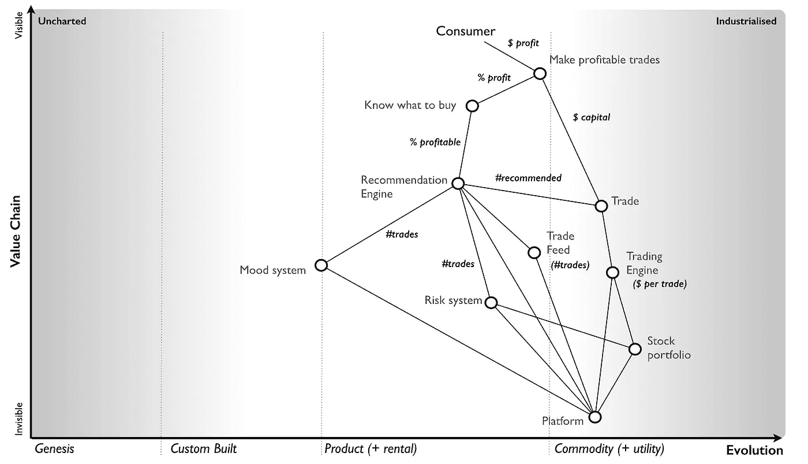
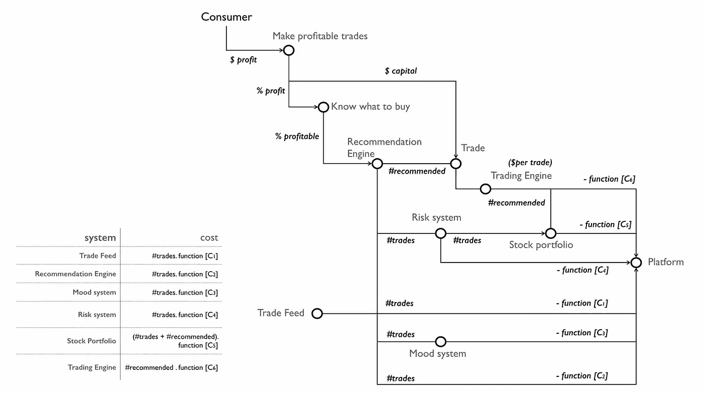
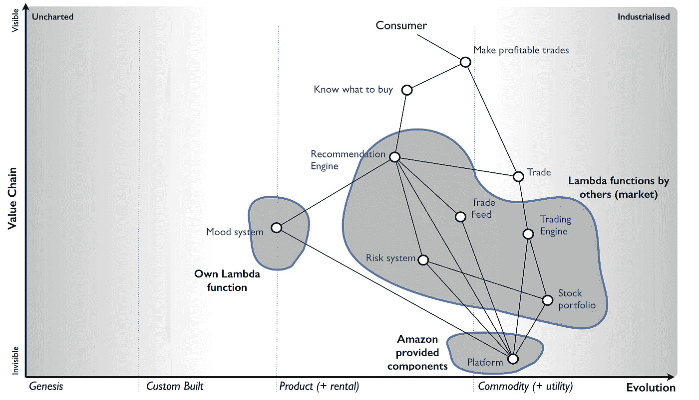
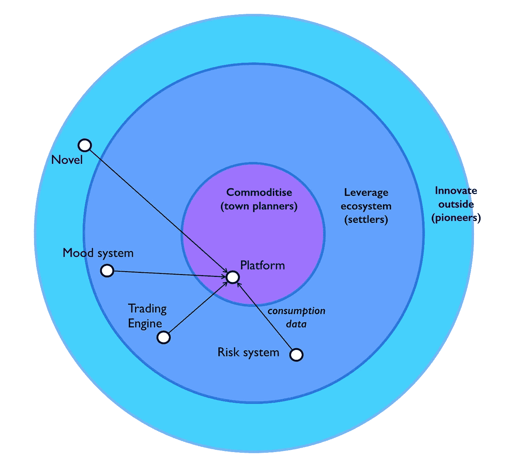
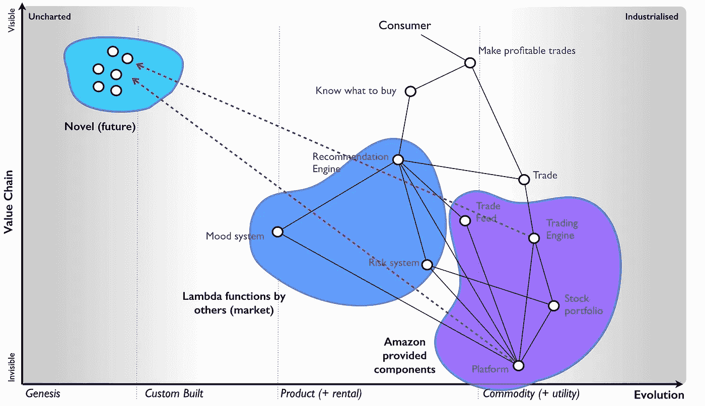

# 亚马逊正在吞噬软件(软件正在吞噬世界)

> 原文：<https://medium.com/hackernoon/amazon-is-eating-the-software-which-is-eating-the-world-738888fb9e82>

继续我关于无服务器的大惊小怪的帖子，我想我应该重复一下马克·安德森的名言，并解释一种可能的未来场景，即你所有的软件都属于亚马逊。对于我将要讨论的内容，有一些反作用，但这些会使这篇文章太长，老实说，我很满足于看着软件巨头的高管像无头鸡一样四处扑腾，而他们的行业却消失了。它不会在一夜之间发生，这个过程将需要大约 10-15 年，但当人们意识到它正在发生时(如果它发生了)，那就太晚了。这是一种被称为间断均衡的经济变化，但……这太专业了，让我们简单点。

我将用一张地图来解释将要发生的事情。我很快为一个交易系统做了一个，没有任何基础。然而，这是一个起点。现在，我假设我们将在 AWS Lambda 中构建这个交易系统，这意味着地图的所有软件组件(交易引擎、股票组合、风险系统、推荐引擎和情绪系统)都是根据 Lambda 中的函数(可能会调用许多其他函数)构建的。关于你为什么会想这么做，去读一下关于[对无服务器](https://hackernoon.com/why-the-fuss-about-serverless-4370b1596da0#)大惊小怪的帖子。

好的，我们的客户在上面的地图中想要进行有利可图的交易(我告诉过你我在五分钟内就做好了，当然，你可以做一个更好的地图)。做有利可图的交易要求我们能够交易，并且知道什么交易会有利可图(你想得美！)

现在，我们成功的*秘密*是，让我们与众不同的系统是我们的推荐引擎。它接受交易，用一个神奇的情绪系统来决定什么是值得的，并用我们的风险系统来描述。在你进入*“情绪系统，听起来像胡言乱语”*之前，让我提醒你——这是一个例子。

无论如何，回到 2005 年我们有 Zimki(最早的无服务器功能计费环境)的时候，我确实在一天左右的时间里建立了一个情绪系统。它从 flickr 和其他来源搜集信息，为这个世界创造一种氛围。这很愚蠢，是我邪恶计划的一部分，包括一只电子猴子和概念艺术…我们不要去那里。

所以，我们有了假设的交易系统，我也在其中添加了一些指标。我现在要把这张图变成一个流程图，并添加指标。从下面开始，交易提要创建交易列表，并由交易数量(#)控制。交易馈送是一个 Lambda 函数，因此它是有成本的。每笔交易都要经过风险、情绪和最终推荐系统——每笔交易都会产生自己的功能成本。推荐系统提供影响交易引擎和股票投资组合系统的推荐交易列表(推荐数量)。

是的，这是一个非常基本的设置。你可以对地图/流程图争论不休。当然，在大多数银行，几乎每个组成部分都被视为相对新颖的东西，就好像没有其他银行管理风险、交易、提供建议等。事实上，根据经验，他们通常有大量的定制系统在做同样的事情，即一家银行通常有数百个定制的风险管理系统。但让我们假设我们在为一家相对理智的银行工作。

从上面可以看出，我们有每个系统的成本，例如交易馈送= #交易 x 交易馈送 lambda 函数的平均成本。大多数银行不知道他们组织内的单个职能部门的成本，他们没有明确的方法来计算成本，但让我们忽略这一点(以及重复和偏差，即定制什么是商品)。我们是理智的，记住！

现在让我们假设 AWS 推出了某种形式的 Lambda 市场，也就是说，你可以创建一个 Lambda 函数，将其添加到 API 网关，并通过市场销售它。PS 我想你会发现他们已经做到了——Amazon API gateway 与 API marketplace 集成，Lambda 与 API gateway 集成。我还没有机会参加比赛，但是很快就会清楚了。

所以，你正在考虑建立上面的交易系统，你注意到其他人正在提供一个 API，它提供了一个风险系统(或者它的组件)。嗯，我可以用它来代替写它。暗示咬牙切齿。

你可能会从安全部门得到一份备忘录，内容是关于使用他们无法检查的第三方代码的危险，以及颂扬开源的好处。备忘录可能会以 pdf 格式通过 office 365 邮件发送，不带一丝讽刺。他们的意思是他们不信任消息来源。回溯到 2006 年，各种适用于 AWS EC2 的“我不会将它用于生产”。事实是，可信来源会随着时间的推移而出现。对于初创公司，你会更有冒险精神，这也是为什么你最终可能会拥有其他公司。

很有可能你的大量交易系统(如果你花了超过五分钟的时间在上面)会被第三方以 Lambda 函数的形式提供。我在地图上画了这个。除了将它们缝合在一起，你可能还会构建出真正不同的东西，比如情绪系统。

当然，你的开发团队中的一些人不会喜欢构建情绪系统和组合来自第三方的组件服务(尽管有很多关于微服务的讨论)。他们会辩称，在制造交易引擎方面，他们可以做得更好。功能计费的美妙之处在于你可以说——“证明它！”。你知道每个函数调用的成本。顺便说一句，如果他们能做得更好，那么你可能想在市场上出售，并确保你给他们足够的报酬，使他们不会离开。

在实践中，人们总是说我们可以做得更好，因为没有人能真正衡量它。大多数没有每项功能的成本，或者他们认为他们的功能是免费的，因为它运行在他们自己的硬件上(另外，硬件不是真正免费的，电力、构建成本、安装平台等也不是免费的)。

任何围绕这些功能的亚马逊市场都将是一个双因素市场(消费者和供应商)，并将产生强大的网络效应。越多的公司开始使用这些功能，越多的提供者会希望构建功能，这将吸引越多的消费者。很快，你将不再为一家编写第 30 个消费者身份验证服务(与分散在各处的其他 29 个服务一起)并复制和粘贴相同的代码或至少你认为是相同的代码的公司工作，而是在未来使用来自市场的服务。该市场是您的服务仓库！

如果你的印象是，在云计算出现之前，公司浪费了大量的硬件，而服务器却无所事事(10%的负载等)，那就等到你揭开软件开发的盖子吧。问任何一个软件工程师，他们都会给你找到单个组织中大量重复的例子。总之，做好准备，在任何一家规模相当的公司，重复 100 次以上都是“好”的一天。哦，在任何商界人士开始抨击软件工程师之前……不要让我开始谈论完全缺乏战略、对前景的糟糕理解、基于直觉的领导力以及模仿 HBR(哈佛商业评论)的最新趋势。

软件开发的未来将是从市场上消费大量的 Lambda 函数，并与一些新功能缝合在一起。浪费将会减少，偏见(即定制已经制作好的东西)将会开始消失，我们会得到所有其他好的“金融发展”的东西[上一篇文章提到的](https://hackernoon.com/why-the-fuss-about-serverless-4370b1596da0#)。万岁！

然而，我们几乎还没有开始。这变得有趣多了。

为了解释为什么，我必须向你介绍一个古老的最爱(十年前的生态系统模型),叫做创新——利用——商品化。这种模式相当简单，你从新奇的东西开始(这就是为什么你需要先驱)，随着它的发展，你利用任何发现的模式来生产有用的产品或图书馆程序(为此你需要一种不同的文化，一群定居者)，最终事情将变得更加工业化(这需要关注商品化和一种称为城镇规划的不同文化)。

然而，创世生进化，进化生创世。您更加进化的组件支持在它们之上快速开发新的东西。子系统越进化，发展新事物的速度越快。我在下面的地图中展示了这一点。

这是大约 30 种常见的经济模式之一，所以如果有人一直嘲笑你是软件工程师，请他们说出五种以上，并礼貌地提醒他们，IT 和业务不是不同的东西。无论如何，你可以在一个公司内玩这个游戏，使用三种不同的文化(被称为态度)并模仿进化。这是非常有用的，不仅鼓励新的发展，而且鼓励效率，同时不造成两个派别的战争和其他一系列问题。然而，它有一个严重的局限性，那就是你的公司只有有限的几个人。

你想做的，是让世界上的其他人充当你的先锋。这实际上很简单，你提供工业化的组件作为公共 API。这最好用一个更循环的形式来解释，使用交易系统。

你的城镇规划者提供了一个实用的编码平台。你的组织(即你的生态系统)之外的一大群其他人和公司开始使用这个来构建各种各样的东西。你提供了一个市场，使他们中的一些人能够向其他人出售风险系统/交易引擎和各种功能。在这个完整的生态系统中，也会有人创造真正新颖的东西。

现在，所有东西都在消费你的平台，所以你也可以从各个角度获得实时消费信息。正如我上面提到的，你有一个双因素市场，所有这些良好的网络效应导致生态系统快速增长。生态系统越大，你获得的规模经济就越大，新的东西就越多(比如其他人的首创)，你从它的使用中获得的消费数据就越多。

诀窍是，你使用消费数据来发现有趣的模式(即，你自己的定居者利用所有消费数据来找到消费者真正想要的东西)，并使用这些数据来建立新的工业化组件。这些组件使整个系统更具吸引力。

通过利用消费数据，你为生态系统提供了它想要的东西，你获得了越来越大的规模效率，而你的整个生态系统也充当了你的免费研发部门，或者用我的语言来说就是*“未来传感引擎”*。你提供的工业化组件越多，你的地位越高(EC2、S3、Lambda 等)，你吸引的人就越多。双因素市场和 ILC 的双重打击——这是一个杀手！

因此，当我看着我的交易系统时，随着时间的推移，不仅越来越多的组件将由 AWS 市场提供，而且如果 AWS 正在玩 ILC 游戏，那么许多功能将成为 AWS 本身提供的工业化组件。市场将只是未来潜在的 AWS 组件，在此基础上，所有令人兴奋的新奇事物(通过消费数据直接向 AWS 发出预警)只是未来的市场机会。我在下面的地图中展示了一个例子。

就速度、效率和灵活性而言，消费者(即那些试图构建产品的人)将受益匪浅。亚马逊自身将继续在效率、以客户为中心和明显创新方面加速发展，生态系统的规模也将继续快速增长，尽管他们偶尔会咬牙切齿地咀嚼软件行业的一些东西。毫无疑问，你可以使用这种模式来咀嚼整个软件行业(或称之为软件行业的偏见的复制混乱),并推动人们提供通过市场销售的组件或构建真正新颖的东西。

现在，大多数高管，尤其是软件行业的高管，会像他们在 2006/07 年对待云一样，对这个想法表现出惯常的惰性。这永远不会发生！软件不是这样工作的！这是关系生意！保安！前期投资！我们的商业模式是成功的！

祝你好运。

有很多方法可以应对这种情况(有一种方法涉及 cloud foundry，假设它在堆栈中向上移动，其他人也玩得很好)，有一些利基可以利用，但我不想破坏我自己的乐趣，这将是非常有趣的。此外，我还打了一个老赌(2012 年)，赌亚马逊会成为第一家市值 1 万亿美元的公司，就像 T2 的一杯茶一样。

无论如何，结果是…欢迎来到未来十年左右的游戏。这将使 IaaS 看起来像小鱼苗，但不要担心，有更大的游戏来了。AWS 会赢吗？也许吧。但是请放心，你将会在这个空间中为你的生命而战。然而，正如我在开始时所说的那样——大多数公司会忽略它，直到战斗几乎结束。到那时，拉里可能会跳出来，声称甲骨文将拥有它。不会的。

如果你不知道什么是地图——[从第一章](https://medium.com/wardleymaps)开始，可以[我建议读一些战略基础](/@swardley/how-to-master-strategy-as-simply-as-i-can-d15627f00326)。

— —

*本帖作为知识共享* [***提供，署名共享 4.0 国际***](http://creativecommons.org/licenses/by-sa/4.0/)**由原作者 Simon Wardley 为* [*前沿论坛*](https://leadingedgeforum.com/) *研究员。**

**最初发表于*[*blog.gardeviance.org*](http://blog.gardeviance.org/2016/11/amazon-is-eating-software-which-is.html)*。**

******

> *[黑客中午](http://bit.ly/Hackernoon)是黑客如何开始他们的下午。我们是 [@AMI](http://bit.ly/atAMIatAMI) 家庭的一员。我们现在[接受投稿](http://bit.ly/hackernoonsubmission)并乐意[讨论广告&赞助](mailto:partners@amipublications.com)机会。*
> 
> *如果你喜欢这个故事，我们推荐你阅读我们的[最新科技故事](http://bit.ly/hackernoonlatestt)和[趋势科技故事](https://hackernoon.com/trending)。直到下一次，不要把世界的现实想当然！*

**