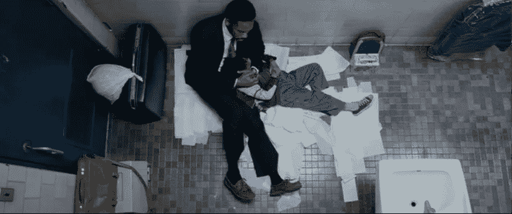
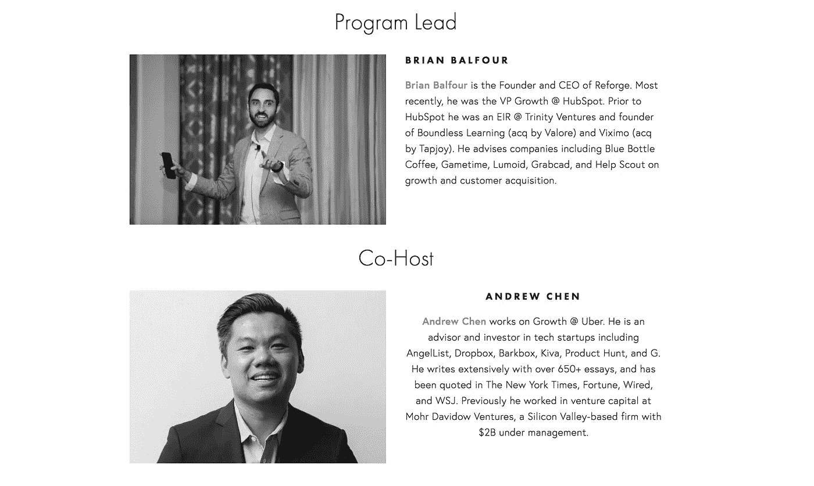

# 探索我如何学习成长

> 原文：<https://medium.com/hackernoon/an-exploration-of-how-i-learned-growth-marketing-9aae65a392d>

朋友们，在某个时间点，你会重新评估你的职业生涯，并尝试制定策略，如何进入职业生涯的下一个阶段。

无论这个策略是围绕着一个完整的职业转变，发展你的技能，还是回到学校，每一个都会带来许多挑战——对我来说，它最终是所有三个策略的结合。

这是一个关于我如何从一份 12 美元/小时的工作过渡到创业创始人再到成长型营销人员的故事，以及我在这个过程中学到了什么。这将特别有助于任何想进入成长的人。

# **1。职业转变**

大学毕业后，我感到非常有动力，但同时也有一点权利——我天真地以为我会在一家我非常钦佩的公司找到一份高薪工作。现实让我变得卑微，我最终得到了一份每小时 12 美元的工作，而且是在一家我从未听说过的公司。

尽管我和一些很棒的人一起工作过，也经历过发人深省的挑战，但在那里工作了近一年后，我意识到我对自己的职业生涯有些粗心。整整一年，我没有试图去理解是什么让我兴奋，如何发展我的技能；我只是出现在我的工作岗位上，没有什么灵感。我渴望找到一些有创意的东西来投入其中。

在浏览脸书时，我看到我的一些朋友以制作网站为乐，有些人甚至以此为生。很快，我就把这看作是一个机会，让我努力工作，满足渴望重新学习的渴望。我和我的朋友布莱恩和理查德一起创建了一个名为 Beepyo 的网站，这是一个面向大学生的物品分享平台。布莱恩和我最终辞去了工作，意识到认真对待这件事需要我们全神贯注。

最终，它失败了(见 [**3 个错误验证了我的想法**](/@arjunpatel_37657/3-mistakes-i-made-when-validating-my-idea-640c626672eb) )，但我学会了如何在 3 个月内将 0 个人扩大到数千人——这是我之前从未做过的事情。这是营销，产品开发，与使用产品的人交谈——增长营销的基础。我并没有因为失败而失望，相反，我欣喜若狂地发现了自己职业生涯更深层次的目标和方向。

沉迷于学习更多关于软件产品发布和扩展的过程。我知道这将是我成长营销之旅的开始。我知道如果我想在这个领域更上一层楼，我必须提高技术水平。

**经验教训:*****1。*** ***尝试新事物，以行动为导向。我当时不知道建立一个网站需要什么，但还是决定尝试一下。不要计划你的下一步，开始吧。***

***2。*** ***冒一次险，会有回报的。如果我们决定保住工作，让 Beepyo 做兼职，我们可能还在建设这个网站。即使失败了，我们也提高了个人技能，改变了我们的整个职业轨迹。***

# **2。发展我的技能**

在 Beepyo 之后，我买了 10 多个 Udemy 课程(有一个黑色星期五大减价😉)，参加了一个在线数字营销课程，并开始了一个应用我所学知识的小项目。

Brian Balfour 有一篇非常棒的[文章](https://brianbalfour.com/essays/customer-acquisition)讲述了如何开始一个客户获取专家的职业生涯，重点是你应该如何把自己塑造成一个“T”。本文将成为专家的途径分为三层:基础层、营销层和渠道层。

[**Shape Yourself Like A “T”**](https://brianbalfour.com/essays/customer-acquisition) **by Brian Balfour**

 *****营销层*** 强调你通常会在营销中的每个渠道使用的学习科目，如 SQL、A/B 测试、漏斗指标、Photoshop 等。

***渠道层*** 让你走上一条道路，迫使你专注于成为一个或两个渠道的专家。在一个特定的渠道变得伟大需要时间，差不多一两年，所以你必须对你想磨练的东西有战略眼光。**

我采用了这种“把自己塑造成一个 T”的方法，并把它牢记在心，它获得了巨大的回报。从获得咨询工作到与行业专家一起从事令人惊叹的项目；这个“T”进一步提高了我成为一名完全成长营销人员的技能。

**吸取的教训:**
***1。*** ***探索一条道路并遵循它。*** 有时候，当我们学习新的东西时，我们不会优先考虑我们应该学习的东西。当我们意识到我们学到的技能不适用于我们的工作时，这种情况最终会令人沮丧。

# **3 .返校**

好吧好吧，从获得工商管理硕士的意义上来说，我并没有真的回到学校，但我确实参加了一个名为[重组](http://reforge.com)的项目，这就像是一所为成熟的成长营销者开设的贸易学校。Reforge 项目由 Hubspot 的前营销副总裁 Brian Balfour 和陈楚翔优步的增长总监主持。价格很高，但绝对物有所值！

再造是 7 周的时间，它帮我完成了两件事:

*1。了解成长，不是在战术层面，而是在深入的框架层面。*

通过教我如何将策略形式化为增长引擎，Reforge 彻底改变了我对增长的看法。从学习建模、获取/保留循环、从组织内部构建成长团队等等；这个项目大大扩展了我的知识深度。

我第一次对顶级成长专家如何应对挑战有了深入的了解，现在我有了在公司抓住机遇的知识。
T30*2。与科技行业的成长型专业人士建立关系。* 
我接触过的大多数职业学校类型的项目都有一种倾向，那就是吸引对这个行业真正陌生的人，并希望在他们的职业生涯中有一个彻底的转变。线下教室比线上教室做得更好的一件事是创建一个强大的社区。当你遇到的人在他们的职业生涯中处于完全不同的水平时，与其他同学联系就变得很困难。

然而，Reforge 有效地创建了一个积极参与的同行网络；成长专家，我可以自信地向他们寻求建议并提出想法。

通过这个项目，我的技能和人际网络都得到了更专业的提升，我知道这将使我的整个职业生涯受益。

**经验教训:**
***1。找一个专业同行的社区。对我来说，结识众多致力于解决类似问题的成长型专业人士非常重要，因为我知道，持有片面的观点不会让我接触到新的想法。
***2。向顶尖的 1%专业人士学习。接触你所在行业的顶尖人物，阅读他们的材料，提出问题，甚至可能一起喝杯咖啡。对于所有那些想在职业生涯中做出改变的人，要知道一切都不会太晚。******