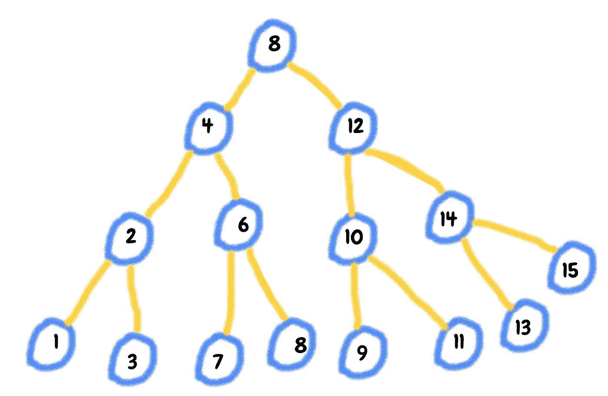

# 另一个关于互斥体的故事…但是是分布式的

> 原文：<https://medium.com/hackernoon/another-story-about-mutexes-but-distributed-8b4a8e46d7a1>

我之前[写过关于编写分散式 IP/](/@bparli/writing-goavail-a-cloud-monitoring-and-fast-dns-failover-agent-7c59254a5c45) [TCP](https://hackernoon.com/tagged/tcp) 端点监控和 DNS 故障转移代理的动机，我称之为 Goavail。总之，该项目是一个轻量级监控代理集群，可以部署到远程和不同的位置，以便执行特定端点(如 AWS EIP)的 IP 或最近添加的 TCP 监控。当我们决定我们应该有一些分层的可用性监控和故障转移时，这就派上了用场，如果我们的一个入口代理出现问题，一个 AWS 区域关闭或被分区。该服务在失败测试中总是表现良好，但幸运的是，在计划外的生产失败情况下，我们从不需要它。

尽管项目很成功，但在实现中仍有一些地方让我感到困扰，主要是在实际的故障检测和故障转移触发过程中。为了理解其中的原因，我们需要深入了解一些机制。

代理由实际的端点健康检查和后台 HTTP 服务组成，后者用于将故障检测结果传达给集群的其余部分。如果某个端点变得不可用，代理将计算连续失败的次数，直到达到某个预先配置的阈值。此时，代理将通知其集群对等方，它认为端点已经失败。它还将检查自己是否已经接收到一些预先配置数量的对等通知。一旦代理从其对等方收到足够多的协议，它将通过调用 DNS 服务提供商的 REST API 来触发 DNS 故障转移(通过相同的方法，代理还可以通过检测从失败到活动的状态变化来使端点重新联机)。代码中有几个点可以触发 DNS 故障转移，但是，实际的 DNS 服务提供者和故障转移逻辑在它自己的包中的接口后面。

```
package dns//Provider interface for DNS service provider interfacetype Provider interface {
 AddIP(ipAddress string, dryRun bool) error
 RemoveIP(ipAddress string, dryRun bool) error
 GetAddrs() []string
}
```

在接口调用包中，只有一个函数(名为“updateDNSRec”)调用接口方法，本质上充当整个包的入口点。

```
package checks// bunch of stufffunc updateDNSRec(ipAddress string, dryRun bool, op int) error {
 var err errorif op == ADD {
  err = Master.DNS.AddIP(ipAddress, dryRun)
 } else if op == REMOVE {
  err = Master.DNS.RemoveIP(ipAddress, dryRun)
 } return err
}
```

在 Goavail 项目的 DNS 包中，一个[测试和设置](https://en.wikipedia.org/wiki/Test-and-set)模式用于更新 A 记录。例如，下面是在 Goavail DNSpackage 中从 Cloudflare 域中删除 A 记录的测试和设置序列。

```
dnsRec, err := api.DNSRecords(zoneID, *params)
 if err != nil {
  return err
 }log.Infoln(dnsRec)if len(dnsRec) == 0 {
  log.Infoln("DNS Record already removed")
  return nil
 }
 if dryRun {
  log.Infoln("Dry Run is True.  Would have updated DNS for address " + ipAddress)
 } else {
  err = api.DeleteDNSRecord(zoneID, dnsRec[0].ID)
  if err != nil {
   return err
  }
 }
```

因此，在一个失败的场景中，我们有一堆分布式进程，它们可能几乎同时运行这部分代码。这不一定是不正确的，因为 DNS 服务提供商(上例中的 Cloudflare)将连续处理这些 API 请求。如果代理试图删除已经被删除的记录，也不会发生什么可怕的事情。尽管如此，它还是给人留下了不好的印象。

为了理解其中的原因，请注意 DNS 服务提供者实际上充当了这个场景中所有正在运行的进程之间的“共享数据”。当然，如果这发生在相同的地址空间或相同的机器上，这就是竞争条件的定义。这样想的话，上面的测试和设置代码将代表临界区。


同样，不一定不正确，因为 DNS 服务提供商将按顺序处理请求。但是它仍然有许多需要改进的地方，因为多个进程正在同时尝试更新数据(即 DNS 记录),一些 Goavail 代理进程肯定会返回并记录错误。尽管有这些实现上的缺点，我仍然希望有多个进程来验证 A 记录是否处于正确的状态。如果尝试更新受监控域的第一个进程出现问题，将会有其他进程在必要时重试。通过这种方式，我可以相当确定故障转移已经发生。

理想情况下，代理都将依次进入临界区(代码的测试和设置部分)。如果第一个进程由于一些额外的错误或失败而未能更新记录，则下一个进程将测试记录是否处于正确的状态(即，存在或移除)并采取适当的行动。一旦其中一个代理成功完成更新，其余的代理将简单地进行测试，验证记录是否处于正确的状态，然后返回。但是，如何在分布式流程中实施临界区呢？

# 分布式互斥

有了这样的问题框架，不久我就遇到了分布式互斥算法类。常规的互斥已经可以很快变得令人毛骨悚然；分布式互斥体肯定会是一次疯狂之旅。

依赖于一些免费数据存储的分布式锁(例如， [redis](https://redis.io/topics/distlock) ， [etcd](https://coreos.com/etcd/docs/latest/dev-guide/api_concurrency_reference_v3.html) )是一种流行的解决方案。然而，这些并不适合我的场景，因为在我的用例中，代理应该是轻量级的，并且是广泛分布的。也就是说，可能通过 WAN，在不受信任的网络上，并且覆盖一段距离，这将使读取和写回某些数据存储更加复杂(更多的延迟差异)。由于这些原因，我更喜欢自包含的实现，而不是依赖于中央数据存储的东西。

对于独立分布式互斥算法的一个很好的调查，包括我选择实现的那个，这个[文档](https://www.cs.uic.edu/~ajayk/Chapter9.pdf)是一个极好的资源。我最终选择了 Agarwal-El Abbadi 基于法定人数的算法，主要是因为基于法定人数的算法的效率和可伸缩性。



Sample Tree of 15 Nodes

该算法从逻辑上将系统中的所有节点组织成二叉树开始。树仲裁被认为是从根到叶的路径。因此[8，4，2，1]和[8，4，6，8]是上述示例集群中的两个树定额。通过这种方式，我们可以看到锁请求比简单的广播方法更有效。在最好的情况下，像 3 这样的叶节点请求锁，并且只需要向它的树法定成员 2、4 和 8 发送消息。向上一级，节点 2 只需要从节点 1、3、4 和 8 请求锁。随着我们在树的每一级向上移动，消息的复杂性也在增加。

在节点故障的情况下，算法在降级状态下运行；它用两条可能的路径代替故障节点，这两条路径从节点的两个子节点开始，到叶节点结束。因此，对于上面的集群，如果节点 12 发生故障，它将在其树定额([8，12，10，9]，[8，12，10，11]，[8，12，14，13]，[8，12，13，15])中被从子节点 10 和 14 开始并在叶节点处结束的两条可能路径所替代。当节点 12 失效时，可以形成以下更新的树定额:[8，14，13，10，9]，[8，14，13，10，11]，[8，10，9，14，13]和[8，10，9，13，15]。

因此，锁定过程的步骤如下:

1.  请求节点向其树定额中的所有对等节点广播锁定请求消息
2.  仲裁中的每个节点将传入的请求存储在一个请求队列中，按请求时间戳排序
3.  一个节点发送一个回复消息，表明它同意锁定，只发送给位于其请求队列头部的请求(队列头部的请求是具有最低时间戳的请求)
4.  请求节点收集特定超时窗口内的所有回复响应
5.  来自本地节点定额中的所有对等体的回复响应是期望的，并且是授予锁所必需的
6.  如果发送到仲裁中某些节点的消息失败，请求节点将计算树中的替换路径，并根据算法导出替代节点。然后，它向替代节点发送锁定请求
7.  为了释放锁，请求节点向其树定额中的所有节点发送放弃消息。在接收到放弃消息时，每个节点从其请求队列的头部移除锁定请求。

该算法没有指定超时时间，也没有指定在持有锁的节点失败(或者进程由于各种原因暂停太久)的情况下应该做什么。因此，该算法补充了一个验证消息类型。现在，每次处理一个节点的请求队列时，队列头持有锁的节点都会被发送一条 Validate 消息。如果此消息失败，则该节点被视为失败。该请求被从队列的头部移除，并且队列中的下一个请求被发送锁定回复消息。或者，如果返回的 Validate 消息指示节点不再持有锁，则从队列的头部删除该节点，并向队列中的下一个请求发送锁回复。这样，超时只存在于收集对锁请求的回复时，而不存在于持有锁时。

消息可能无序到达，或者分布式节点之间的时间可能不完全同步。该算法按如下方式处理这些情况:

1.  如果节点无序地接收到请求消息(根据队列头部的消息和新请求消息的时间戳),则向队列头部发送查询消息。
2.  当一个节点收到一个查询消息时，如果它已经被完全授予了锁，它就阻塞查询。如果它的锁请求没有被完全许可，它返回一个让步消息。
3.  当发送查询消息的节点接收到一个让步时，它将挂起的请求(代表它发送查询消息)放在队列的最前面，并向“合法的”请求者发送一个回复消息。否则，发送查询消息的节点被阻塞，直到已经获得的锁被释放
4.  如果在超时窗口内没有授予锁，则节点放弃它已经累积的任何锁回复

这篇论文概述了树法定人数算法的正确性和消息开销，但是，在我看来，它掩盖了几个警告:1)它提到了树法定人数的大小从`log n`(叶节点)到`(n+1)/2`。然而，虽然根的孩子将看到消息复杂度为`(n+1)/2`，但根实际上将看到复杂度为 n，因为它是所有树定额的成员。这实际上可以通过部署节点来解决，使得根的存在只是为了提供一致性(即，不实际请求锁)。也许在实现中也有解决这个问题的方法，但是这可以在客户端代码和/或部署中解决。2)另一个警告很快被提及，但它是一个相当大的缺点。如果一个叶节点失败，就没有可能的替代，因为根据定义，没有子节点。因此，包含故障叶的整个树仲裁将处于故障状态。(例如，如果节点 11 失败，节点 8、12 和 10 将无法成功获得锁)。

理想情况下，集群应该比这更有弹性。为了解决第二个问题和更多问题，该算法还补充了以下逻辑；如果替代是不可能的(根据算法):

*   退回到简单的方法，将锁定请求广播到集群中所有剩余的节点
*   如果达到法定人数(至少`(n+1)/2`用回复消息响应),则锁被认为被授予。要求至少`(n+1)/2`回复会迫使树的另一端做出响应，这样我们就可以确保不会有两个节点同时出现在临界区。

# 重新访问 Goavail 监控代理

有了高效、轻量级、容错的分布式互斥体的力量，我现在可以执行在 Goavail 中让我烦恼的关键部分了。因为我已经有了一个进入 DNS 服务提供者接口的入口点，所以实施互斥的地方(尽可能不复杂)是显而易见的:

```
func updateDNSRec(ipAddress string, dryRun bool, op int) error {
 var err errorif Gm.Clustered {
  log.Debugln("Acquiring distributed lock")
  **if err = Gm.Dmutex.Lock(); err != nil {
   return errors.New("Error acquiring distributed lock: " + err.Error())
  } else {
   log.Debugln("Acquired distributed lock: ", time.Now())
  }**
 }if op == ADD {
  err = Master.DNS.AddIP(ipAddress, dryRun)
 } else if op == REMOVE {
  err = Master.DNS.RemoveIP(ipAddress, dryRun)
 }if Gm.Clustered {
  log.Debugln("Releasing distributed lock")
  // if we get to this point don't return an error 
  // unless the  actual DNS update call above throws an error. 
  // But still log the Unlock() error 
  **if errUnlock := Gm.Dmutex.UnLock(); errUnlock != nil {
   log.Errorln(errUnlock)
  } else {
   log.Debugln("Released distributed lock: ", time.Now())
  }**
 }
 return err
}
```

现在，Goavail 代理需要获取分布式锁，然后才能对 DNS 记录执行测试和设置。Goavail DNS 故障转移代理的更新代码是[这里是](https://github.com/bparli/goavail)，分布式互斥包[这里是](https://github.com/bparli/dmutex)。

**更新**:我更新了分布式互斥包，作为 Agarwal-El Abbadi 树法定数算法的更纯粹的实现以及补充。本文还更新了关于算法实现的更多细节。