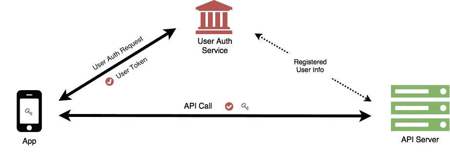
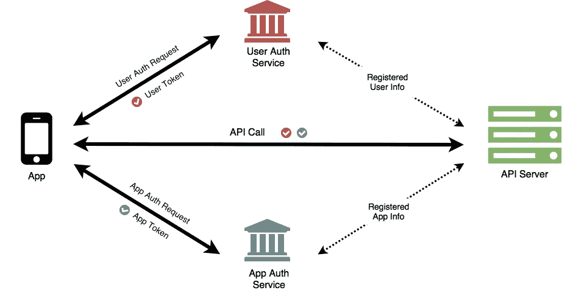

# API 保护需要用户和应用程序身份验证

> 原文：<https://medium.com/hackernoon/api-protection-requires-both-user-and-app-authentication-8a8101ed3f23>

作为一个 API 提供者，你向那些你信任的人开放你的 restful 后端，希望做一些有用的事情，获得利润，或者两者兼而有之。你在注册和认证用户时非常小心，你可能会识别他们打电话的应用程序，但这足以保护访问和你的收入流免受恶意行为者的影响吗？

# 谁在使用你的 API？

你想知道谁在使用你的应用程序，所以你需要某种形式的[用户认证和授权](https://hackernoon.com/mobile-api-security-techniques-fc1f577840ab)。如果您的客户端应用程序与 API 后端紧密耦合，那么您可能知道并正在验证客户端的最终用户。如果客户端是调用您的 API 的第三方应用程序，那么用户可能是作为该应用程序最终用户的中介的应用程序所有者。例如，你可以提供一个自行车共享 API，一个独立的本地交通应用程序代表本地通勤者预订你的自行车。

在这两种情况下，使用诸如 [OIDC](http://openid.net/connect/) 和 [OAuth2](https://oauth.net/2/) 之类的协议，您可以直接或通过身份服务认证用户的身份，并通过[签名的访问令牌](https://jwt.io/)授权访问您的 API。

此外，为了识别和授权用户，您将需要识别哪个应用程序正在调用您的 API，以便您可以监控 API 使用情况，并可能在每个应用程序的基础上实施 API 使用策略。

通常，您会让应用程序开发人员向您注册应用程序，您会给他分配一个 API 密钥，作为唯一的应用程序标识符。API 密钥存储在应用程序中，并在每次 API 调用时传递。

# 授权应用使用

随着您的 API 越来越受欢迎，您开始看到越来越多的没有 API 键的 API 调用。API 调用已经提供了有效的用户访问令牌，所以您已经让它们通过了，但是用户开始抱怨了。

大量用户要求进行计费审计。他们声称你对他们没有调用的 API 函数收费。此外，一些用户抱怨你的服务很慢。您的后端成本正在增加，并且您注意到另一个趋势，即一些用户正在进行昂贵的搜索调用，这对您的后端造成了负担，但那些通过货币化 API 调用(如全额购买)的用户的百分比正在大幅下降。

你很不情愿地得出结论，你受到了攻击。因此，您决定开始丢弃缺少或无法识别的 API 键的 API 调用，并加强速率限制和行为分析控制，希望不会拒绝太多有效用户进行有效的 API 调用。

事情得到了短暂的改善，但是没有密码的密钥就像要求没有密码的用户名一样。这不太安全，所以您决定也添加一个 API 秘密。您可能需要在每个调用中都传递密钥和秘密，或者您可能发送密钥，但是[使用秘密来签署每个 API 调用](http://docs.aws.amazon.com/general/latest/gr/signing_aws_api_requests.html)。

无论哪种方式，API 密钥和秘密都必须保密。所以你要求每个应用开发者通过[混淆](https://en.wikipedia.org/wiki/Obfuscation_(software))或其他[应用加固技术](https://en.wikipedia.org/wiki/Hardening_(computing))将密钥和秘密隐藏在他们的应用中。您还要求他们使用 [HTTPS/TLS](https://en.wikipedia.org/wiki/Transport_Layer_Security) ，并要求他们[将其应用程序绑定到您服务器的证书](https://www.owasp.org/index.php/Certificate_and_Public_Key_Pinning)。

不幸的是，你的 API 安全现在依赖于，不是你，而是每个应用开发者，你真的能接受吗？

# 认证应用使用

为了重新获得对 API 安全性的控制，您必须从应用程序中获取这个秘密，并确保它永远不会直接暴露在您的 API 调用中。

因此，你从 OIDC/OAuth2 用户认证流程中获得了一些灵感，并将他们的一些策略应用于应用程序认证。不是在每个应用程序中嵌入一个静态秘密，而是定期挑战应用程序以确保它是真实的。一旦通过验证，就向它颁发一个应用程序授权令牌，这个令牌可以在每次 API 调用时传递。像用户访问令牌一样，应用授权令牌具有有限的生命周期，并且使用不在应用中也不通过 API 调用发送的秘密进行签名和验证。

您之前要求应用程序开发人员在开发之初注册他的应用程序。现在，您需要他在每个应用程序发布时对其进行注册，这样您就可以提取应用程序的“DNA ”,用于身份验证。尽管每个应用程序仍然获得一个 API 密钥用于识别，但是您保留了 API 秘密，并且重新控制了 API 安全性。

# 收入和声誉保护

现在，每个 API 调用都携带一个可验证的应用程序授权令牌。使用这种是/否身份验证模型，您可以充分利用应用程序身份，而不必担心错误地拒绝有效的 API 调用。您可以使用安全应用程序身份来:

*   通过应用程序和用户实施访问控制
*   对应用和/或用户的 API 调用进行测量和收费
*   上限 API 调用率和每日或每月限额
*   为每个应用程序提供不同的定价和服务协议

例如，对于您的自行车共享应用程序，您可能会根据不同的应用程序提供商的数量向他们提供不同的租赁价格，或者您可能会根据实时需求向不同的提供商提供不同的自行车库存。

通过认证而不仅仅是识别你的应用，你的流量质量得到了提高。通过应对攻击，您的流量变得更加可预测，因此您的后端成本得到了控制，用户不再抱怨响应时间缓慢，您也不会因为未经授权的 API 使用而损失收入。

不再依赖应用程序开发人员来实现 API 保护，您可以专注于发展您的 API 安全性，以应对不断到来的下一系列挑战。

感谢阅读！如果你能推荐这篇文章(点击❤按钮)，让其他人也能找到，我将不胜感激。