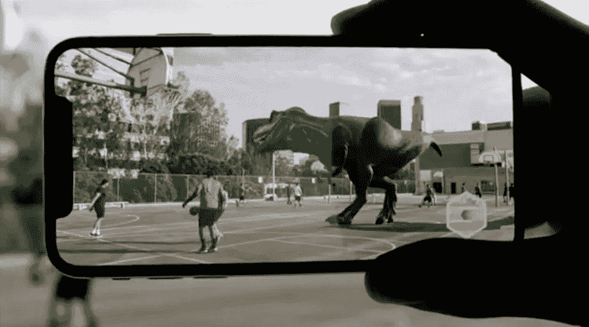

# 苹果公司的最新技术公告，增强现实和事后反思

> 原文：<https://medium.com/hackernoon/apples-latest-tech-announcement-augmented-reality-and-afterthoughts-6b76ae597ace>

又到了一年中的这个时候，所有的现代 nerdome 聚集在一起，急切地期待着苹果公司的最新公告。新 iPhone 会是什么样子？它将为我们呈现哪些新的功能和创新？但最重要的是，这将在多大程度上丰富我们的生活，在多大程度上减少我们的银行账户。

在过去的几年里，新 iPhones 和移动技术的发布有些令人失望。它们充满了同样的虚张声势，总是伴随着苹果公司的公告，“这是我们有史以来最好的[在此插入]东西”，但当你超越抛光的外表时，你会意识到这些改进和进步相对较小，只是装饰性的，最近则以表情符号为中心。

然而，通过今天的第一部分，我一直在焦虑，希望这种趋势将会结束。距离最初的 iPhone 发布已经过去 10 年了，在这几年里，几乎每部手机都变成了 iPhone。

Android 用户和讨厌苹果的人可能会对最后一句话有异议，但这是真的。还记得我们有翻盖手机、滑盖手机和 qwerty 手机的时候吗？十亿种不同的设计、风格和功能？现在，我们有了不同版本的类似 iPhone 的界面，操作系统选项略有不同，屏幕和边框大小也各不相同。

撇开咆哮不谈，对于它的 10 周年纪念，人们对最新的 iPhone 发布寄予了很大的期望，有很多谣言集中在增强现实上，特别是因为今年早些时候的 ARKit 发布。增强现实与互联网在同一年(1968 年)被发明，但只是在今年才进入消费者的意识，Snapchat、[脸书](https://hackernoon.com/tagged/facebook)、[谷歌](https://hackernoon.com/tagged/google)和微软都坚定地把他们的信念和金钱放在这项“未来”技术上。难怪苹果也会参与进来，iPhone 10(或 iPhone X)注定是一次飞跃，将改变我们与彼此、数字信息和周围世界的互动方式。就像十年前第一代 iPhone 带来的变化一样。

这些增强现实的传言也不是无中生有，三年前苹果收购了当时处理增强现实的最重要的公司 Metaio。Metaio 碰巧也拥有大量专利，包括让增强现实更容易的硬件专利，以及对移动设备资源消耗较少的专利。苹果在过去一年左右的时间里还雇佣了相当多的增强现实专家，并抢购了所有可能的增强现实专利。包括 AR 眼镜。虽然看起来所有这些都得到了很好的利用，但苹果今天围绕 AR 发布的公告真的感觉更像是一种事后想法，而不是他们想要展示的创新。

# 苹果的 AR 公告及其意义

因此，在今天苹果发布的声明后面，有一个 iPhone 8/8 plus 和 X 将能够处理的新功能列表，以及一个关于我为什么认为它们对增强现实的未来很重要的小小解释。

怀着完全透明的想法，我已经在增强现实领域工作了四年多，并创建了我的 AR 公司 Happy Goon，这家公司制作增强现实贺卡，这些贺卡栩栩如生。这意味着这里呈现的一些观点可能会偏向于我们在某些方面对增强现实的应用，而不是增强现实有可能包含的无限广阔的可能性。

## 增加了处理器能力和 GPU

新的 iPhone 8/8 plus 将拥有大幅增加的处理器能力和 GPU，这对 AR 来说是个好消息，因为这两者都允许更丰富、更动态的体验……尤其是 3D 体验。iPhone X 在处理能力上更进了一步，所以这方面也是好事不断。

## 2 个摄像头(各种深度传感器)

对于 8/8 plus，有 2 个后置摄像头，有助于分析深度(如人像模式)。这对于 AR 来说很有用，因为众所周知，计算机很难判断一个东西是很大很远还是很近但很小。这与谷歌的 Tango 认证设备传感器相去甚远，但它**是**的东西。

## 面部跟踪和真实深度相机系统

iPhone X 上的面部追踪看起来棒极了。作为消费者，由于 snapchat，我们真的习惯了面部滤镜和效果，但苹果展示的不仅仅是 2D 或 3D 模型或一些放在面部并跟踪面部的时髦效果。他们的短片展示了一个面具，实际上是在克雷格·费德里吉的脸上绘制了**。对我来说，这很容易成为他们所有 AR 演示的亮点，但它确实让我想知道它是否会有新奇之外的应用。**

我不确定我是否厌倦了这里，因为我的脑袋已经牢牢地插入增强现实世界超过四年了，但我并不觉得苹果的演示给人留下太多印象。比如表情符号面部追踪，两年前我遇到一家公司在做同样的事情。iPhone X 的深度系统和面部跟踪能力使这种体验得到了惊人的改善，肯定会使 AR 应用程序变得非常棒，但它确实缺乏令人惊叹的因素。这并不新鲜…至少对我来说是这样。

Jony Ive and the Animoji feature of the iPhone X

# 我希望看到的

## 原生相机应用中的增强现实

这个功能将是巨大的。当前增强现实的一个主要问题是，需要创建一个单独的应用程序来传播体验。如果你没有一个大型的资源网络，这是非常困难的。此外，即使你能够让人们下载你的 AR 应用程序，也会导致一部手机(就像我目前的手机)上有 10 到 20 个以上的增强现实应用程序，所有这些应用程序都利用 iPhone 的摄像头来适应和增强摄像头看到的世界，同时需要单独打开才能看到每个应用程序。不是最好的用户体验。

如果苹果将增强现实体验构建到原生相机应用中，就像他们如何将应用功能构建到原生 messenger 应用中一样，这将意味着所有的增强现实体验都位于同一个空间。更好的是，相机应用是每个人几乎每天都在使用的应用，这意味着更多的参与。苹果将从本质上消除创造令人敬畏的增强现实体验的人和想要使用令人敬畏的增强现实体验的人之间的主要障碍之一。

## ARKit 功能的改进

ARKit 很棒，但仍然有限，特别是与苹果 3 年前购买 Metaio 时它所拥有的巨大功能相比，包括一个图形用户界面来构建相当复杂的 AR 体验。

毫无疑问，ARKit 能够确定什么是表面或地面，并几乎无缝地将数字对象放置在该空间中，这是一个了不起的进步，超过了 Metaio 当时的水平。但 AR 不仅仅是将 3D 模型放置在真实空间中。2D 和 3D 对象跟踪也很重要，因为我们与我们世界中的对象的交互远远多于我们世界中的空间。目前，使用 ARKit 进行物体或追踪器识别并不容易。

## 背面摄像头上也有深度传感器

我知道可能有一个原因，没有这个硬件的背面摄像头设置。也许是成本，也许是空间，也许是电池寿命……但如果苹果在背面摄像头上有更全面的深度传感器，它可以用来将 ARKit 的能力提高到一个令人难以置信的新水平。数字放置的东西可以与物体相互作用，并被它们所掩盖。想象一个数字机器人，或者外星人，或者口袋妖怪躲在一棵真实的生命树后面，顽皮地朝你走来。物理空间和数字体验之间的这种互动水平绝对是未来的 AR，需要广泛的硬件支持才能实现。

# 最后的想法

总的来说，我对今天苹果的声明感到失望。我曾期待一场大型的增强现实展示会让他们的竞争对手震惊不已。相反，我认为增强现实是他们脑海中的一个事后想法，需要说出来以显示他们跟上了潮流，但仅此而已。然而，我仍然对增强现实的未来感到兴奋，特别是苹果增强现实。我看了足够多的苹果公告，知道他们经常推迟新技术的发布，直到他们确定它有足够高的质量。毕竟，它们不是第一款触摸屏手机，但它们是定义触摸屏手机的*。*

此外，如果他们不能在增强现实技术或平台方面取得下一步进展，仍然会有一个蓬勃发展的创意社区，以及一些会这样做的大型科技公司。

为明年祈祷吧。