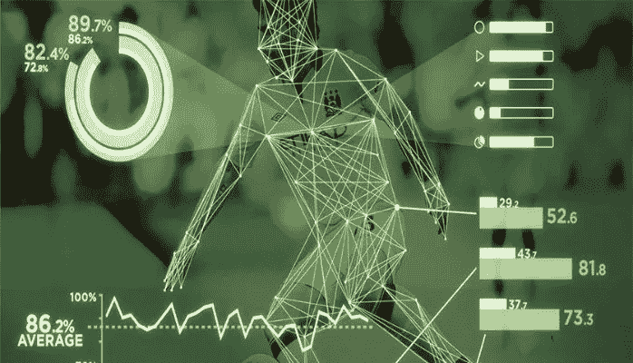

# 人工智能在利基和新兴领域的应用

> 原文：<https://medium.com/hackernoon/applications-of-ai-in-niche-and-emerging-areas-f3d57c9a9ab3>

不可否认，人工智能是近代的突破性技术。从帮助人类进行机械操作到使用认知智能执行更智能的任务，机器已经走过了漫长的道路。每天，我们都会遇到有趣的人工智能应用。

深度学习算法高效学习和预测的能力打开了可能性的大门。如今，人工智能也正在影响许多其他领域。在这篇博文中，我们将讨论 AI 的一些小众应用。让我们详细讨论这样的应用。

人工智能在自动驾驶汽车、图像处理(Prisma、Google Photos)和聊天机器人中的应用是你在日常生活中一定会经历或在互联网上听到很多的事情。然而，还有许多其他的利基领域，人工智能正在产生重大影响。这些利基应用领域在媒体上没有得到太多的关注，但它们在人工智能研究出版物中非常活跃。通过这篇文章，让我们探索这些利基领域，并对人工智能的应用有更深入和全面的了解。

## 天文学

天文学家以信号和图像的形式处理大量数据。对这些数据进行分析和分类是一项艰巨的任务。天文学家现在正在利用无监督机器学习的力量来自动化这项任务，这项任务以前是由数千名志愿者完成的。

亚历克斯·霍金是赫特福德郡大学的一名硕士生，他领导了这样一个系统的研究工作，他评论道:

> “关于我们的算法，重要的是我们没有告诉机器在图像中寻找什么，而是教它如何‘看’。”

人工智能正在帮助天文学家改善模糊和嘈杂的图像。研究人员还使用神经网络来增强现有的数据。这种机器学习算法的部署无疑减少了人类的努力，有时还比原始来源更好地增强了图像。 ***关于教机器看东西，亚历克斯·霍金是怎么说的？***

随着越来越多的天文学家转向先进的机器学习技术来分析天文数据，人工智能在天文学中的未来看起来更加光明。在这个广泛探索太空的时代，也许人工智能可以通过深入分析图像和信号来帮助识别一个可居住的星球。

## 建筑和规划

机器学习算法已被用于模拟最佳建筑布局，以最小化能耗。适应节能建筑实践很重要。机器学习驱动的能源[模型](http://www.engineering.nottingham.ac.uk/icccbe/proceedings/pdf/af178.pdf)可以通过结合对历史和当前数据的分析来提供最佳解决方案。

纽约曼哈顿的某些建筑已经在使用机器学习供电的能源建模进行建设。

谈到节能，人工智能正被部署在优化整个城市的电网。Grid4c 是为智能电网提供预测分析解决方案的公司之一。机器学习算法可以分析来自数百万智能电表的数据。将这些数据与消费者行为结合起来，可以为智能供电提供一个整体解决方案。该方法可以从用户行为和电器使用中学习。这将有助于供应商在粒度级别上了解峰值使用时间和停机时间。从而优化智能电网的整体供电。

## 农业中的人工智能

人工智能甚至正在进入最传统的垂直领域之一——农业。这个想法是用同样的资源生产更多的东西。这就是人工智能帮助农民的地方。人工智能研究正在探索农业的各个方面，最值得注意的领域是自动化智能灌溉和检测作物疾病。

智能机器学习算法正在帮助农民自动化和优化灌溉。它减少了水的浪费，优化了农作物的供水。人工智能驱动的系统可以分析土壤、天气和作物类型，以提供优化的供水。

Input and Output: Detecting bacterial disease using image processing in beans leaf.

一家基于应用程序的初创公司 [Plantix](http://plantix.net/) 正在帮助农民使用图像识别技术检测植物疾病。它利用众包图像数据的力量进行识别、预防和治疗。目前，它可以识别 60 种植物病害，准确率超过 90%。随着更多的众包数据进入应用程序，这两个数字应该都会增加。

## 体育分析

现在球员和教练都很重分析他们的表现。对竞争对手的分析是教练和经理处理的另一个重要领域。有大量数据可用于捕获、分析和预测性能。这就是机器学习在体育分析中崭露头角的地方。

大量的数据集，如健康、体力、速度、能力、技能、比赛日条件等，使机器学习算法成为理想的选择。这些算法可以帮助利益相关者预测他们的球员和竞争对手在个人层面的表现指标。这是通过从历史数据中学习并将其与游戏的实时分析结合起来实现的，而这仅仅通过人类的认知能力是不可能的。

冰山就是这样一家公司，它正在帮助冰球队利用人工智能分析数据。他们声称可以提供精确到 0.1 秒的实时洞察力和 500 名球员的统计数据。谁知道呢，在未来，人工智能可能会帮助我们预测比赛的结果。看看人工智能在分析和预测运动队/运动员的统计数据方面能走多远将是一件有趣的事情。

## 娱乐

2016 年 6 月 9 日，一部名为 [Sunspring](https://en.wikipedia.org/wiki/Sunspring) 的短片上映。这是本杰明写的一部电影，他是一个聪明的自动编剧。本杰明用一把[LSTM·RNN](https://en.wikipedia.org/wiki/Long_short-term_memory)进行训练。除了编剧，人工智能还被用于导演、摄影和电影制作的其他方面。例如，看看这部名为摩根的人工智能惊悚电影的预告片，[由 IBM 的沃森](http://www.wired.co.uk/article/ibm-watson-ai-film-trailer)创作。值得注意的是，AI 将完成预告片制作整个过程的时间从大约 30 天缩短到了 24 小时。

Morgan’s trailer: Created by IBM Watson

AI 在娱乐行业的应用不仅限于电影。艺术和音乐垂直行业也受到了人工智能的启发。0music ，是一张完全由西班牙马拉加大学计算机集群 Melomics109 创作的音乐专辑。

随着机器学习算法的计算和认知能力与日俱增，我们将看到人工智能在娱乐行业的更多干预。也许在未来几年，人工智能可以取代技术一般的音乐家或摄影师，但它仍然不是业内最佳艺术家的对手。毕竟，人工智能已经被证明无法在主观领域产生原创思想。

## 教育

教育数据挖掘是人工智能在教育领域的新兴应用之一。一般来说，学校选择单一的方法来教学生。这种方法有其缺点，因为不是每个学生都有相似的学习能力。此外，教师很难仔细评估每个学生的表现。

如今，算法可以在个人层面评估和分析学生的表现。学生可以通过视觉内容进行学习，并且可以跟踪每个活动，以分析单个学生的学习表现。Carnegie Learning 和 [Thinkster Math](https://hellothinkster.com/) Learning 就是这样两家在教育中使用高级分析的公司。

通过将学习带出教室的限制，先进的机器算法也可以使教育受益。人工智能可以帮助学习者进行自我指导、自我评估、团队合作等。此外，人工智能驱动的协作学习平台正在出现。[协作学习平台 Brainly](https://brainly.in/) 正在探索人工智能增强社会学习的能力。

## 保护海洋

人工智能机器人在检测污染水平和跟踪海洋温度和 pH 值变化方面比人类好得多。这些自主机器人可以从多个地理位置收集大量数据。对这些数据进行分析并做出预测。遏制生态系统中这种变化的行动计划可以更准确地执行。

人工智能在保护海洋方面的另一个重要应用是控制入侵的海洋动物。人工智能正在通过使用机器学习和计算机视觉来跟踪入侵物种并消除它们，从而帮助机器人变得更加精确、有效和稳定。值得注意的是，这样的行动已经在进行，以消除大西洋的狮子鱼和大堡礁的棘冠海星。入侵物种能够导致本地植物和动物灭绝，减少生物多样性，与本地生物争夺有限的资源，并改变栖息地。当狮子鱼从它们的原生地印度-太平洋地区扩展到大西洋时，由于缺少自然捕食者，它们繁荣昌盛。从而对当地大西洋物种造成伤害。

人工智能在以前从未探索过的领域有更多的新兴应用。医疗保健正在通过人工智能获得更好的诊断和预防解决方案。此外，物流行业正在关注使用智能机器人的全自动仓库。有很多行业可以利用人工智能的力量。

人们认为人工智能对工业的影响类似于 20 世纪初发明电时的影响。许多技术资深人士都说，机器智能将是未来最大的颠覆性力量，但我将留给你一条我们最喜欢的梦想家比尔·盖茨给年轻大学生的建议:

> 人工智能、能源和生物科学是很有前途的领域，你可以在这些领域产生巨大的影响。如果从今天开始，我会这么做。
> 
> **——微软创始人比尔·盖茨**

作为一个人工智能研究小组的成员，我经常遇到有才华的人致力于我们世界的利基和有趣的问题。如果你知道任何其他有趣的和小众的应用，请在下面自由评论，我将很乐意附加列表。

***注:*** *博客中使用的大部分图片的照片来源:**[*像素*](https://www.pexels.com/)*

> *我为一个应用人工智能研究小组工作。我们为现实世界的问题开发人工智能解决方案。*
> 
> *如果你喜欢读这篇文章，请鼓掌，分享或评论下面的进一步讨论。*