# 通过 AWS Lambda 应用发布-订阅和推拉消息传递模式

> 原文：<https://medium.com/hackernoon/applying-the-pub-sub-and-push-pull-messaging-patterns-with-aws-lambda-73d5ee346faa>

## AWS 为实现消息传递模式提供了丰富的选项，比如 pub-sub 和 push-pull with Lambda，让我们比较一下这些选项。


This image is completely unrelated but I just thought it’s a cool pattern.

# 发布订阅

`Publish-Subscribe`(通常简称为 pub-sub)是一种消息传递模式，发布者和订阅者通过中介代理(ZeroMQ、RabbitMQ、SNS 等)分离。).


From Wikipedia, [https://en.wikipedia.org/wiki/Publish%E2%80%93subscribe_pattern](https://en.wikipedia.org/wiki/Publish%E2%80%93subscribe_pattern)

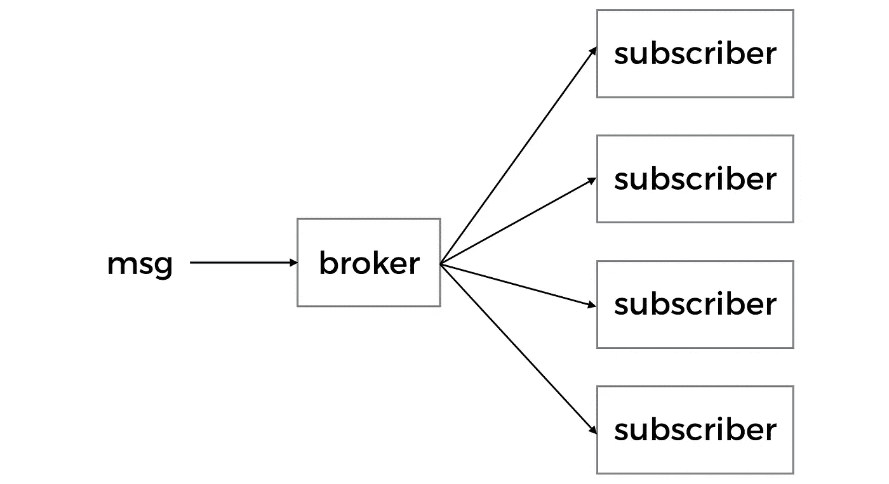

## 社交网络+拉姆达

在 AWS 生态系统中，代理角色的明显候选人是 SNS。

如果为函数指定了 DLQ，SNS 将在将消息发送到死信队列(DLQ)之前，尝试 3 次让函数处理消息。然而，根据 OpsGenie 的人员进行的[分析](https://engineering.opsgenie.com/aws-lambda-performance-series-part-2-an-analysis-on-async-lambda-fail-retry-behaviour-and-dead-b84620af406)，重试的次数可能多达 6 次。

[](https://engineering.opsgenie.com/aws-lambda-performance-series-part-2-an-analysis-on-async-lambda-fail-retry-behaviour-and-dead-b84620af406) [## AWS Lambda 性能系列—第 2 部分异步 Lambda 失败重试行为和死锁的分析…

### 在 OpsGenie，我们渴望体验使用 AWS Lambda 技术的无服务器架构。因为概念和…

engineering.opsgenie.com](https://engineering.opsgenie.com/aws-lambda-performance-series-part-2-an-analysis-on-async-lambda-fail-retry-behaviour-and-dead-b84620af406) 

另一件要考虑的事情是这个设置提供的并行度。对于每条消息，SNS 将创建一个新的函数调用。因此，如果你向社交网络发布 100 条消息，那么你可以同时执行 100 个订阅的 Lambda 函数。

**如果你在优化吞吐量的话，这很好**。

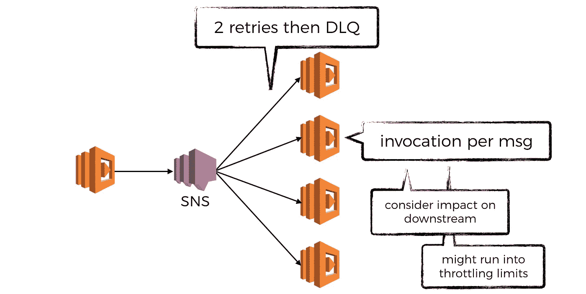

然而，我们经常受到下游依赖项所能处理的最大吞吐量的限制，比如数据库、S3、内部/外部服务等等。

如果吞吐量的突发很短，那么重试很有可能是足够的(重试之间也有随机的指数后退)，并且您不会错过任何消息。

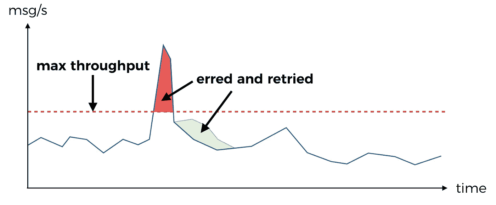

Erred messages are retried 2 times with exponential back off. If the burst is short-lived then the retry is likely to succeed, resulting in no message loss.

如果吞吐量的激增持续了很长一段时间，那么您可以用尽最大重试次数。在这一点上，您将不得不依靠 DLQ 和可能的人工干预来恢复第一次无法处理的消息。

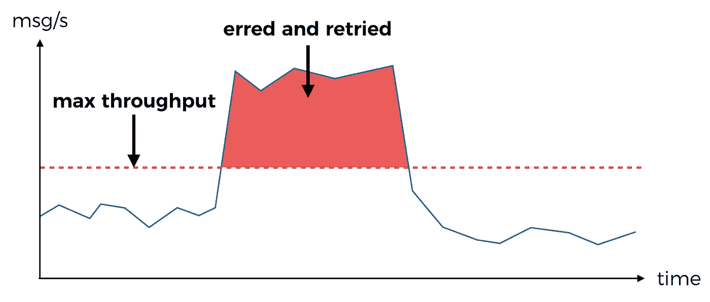

Erred messages are retried 2 times with exponential back off. But the burst in message rate overlaps with the retries, further exasperating the problem and eventually the max no. of retries are exhausted and erred messages have to be delivered to the DLQ instead (if one is specified).

类似地，如果下游依赖关系经历了中断，那么在中断期间接收和重试的所有消息必定会失败。

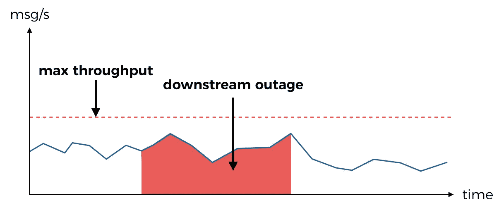

Any message received or retried during the downstream message will fail and be sent to the DLQ.

您还可以在一个区域中的并发执行数量上遇到 [Lambda 限制](http://docs.aws.amazon.com/lambda/latest/dg/limits.html)。由于这是一个帐户范围的限制，它还会影响依赖 AWS Lambda 的其他系统——API、事件处理、cron 作业等。

 [## AWSλ限值-AWSλ

### 描述 AWS Lambda 安全节流和限制。

docs.aws.amazon.com](http://docs.aws.amazon.com/lambda/latest/dg/limits.html) 

## Kinesis 流+λ

Kinesis 流在许多方面不同于 SNS:

*   Lambda 每秒钟向 Kinesis 查询记录多达 5 次，而 SNS 会向 Lambda 推送消息
*   批量接收记录(达到您指定的最大数量)，SNS 通过一条消息调用您的函数
*   如果您的函数返回一个错误或超时，那么您将继续接收同一批记录，直到您成功地处理它们或者数据在流中不再可用
*   并行度由流中碎片的数量决定，因为每个碎片有一个专用调用
*   Kinesis 流根据推送到流的记录数量收费；碎片时间，以及是否启用延长保留期

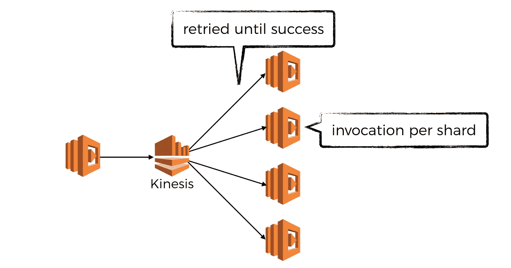

SNS 容易遭受暂时性问题——流量突发、下游中断等。另一方面，Kinesis 更好地处理了这些问题。

*   并行度受到碎片数量的限制，碎片数量可用于缓冲消息速率中的突发

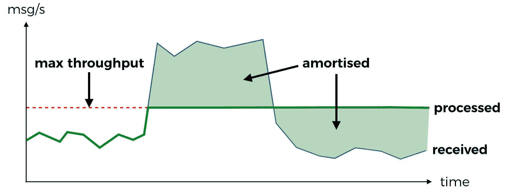

Bursts in message rate is amortised, as the max throughput is determined by no. of shards * max batch size * 5 reads per second. Which gives you two levers to adjust the max throughput with.

*   记录将被重试，直到成功，除非中断持续的时间超过您在流上的保留策略(默认为 24 小时)，否则您最终将能够处理记录

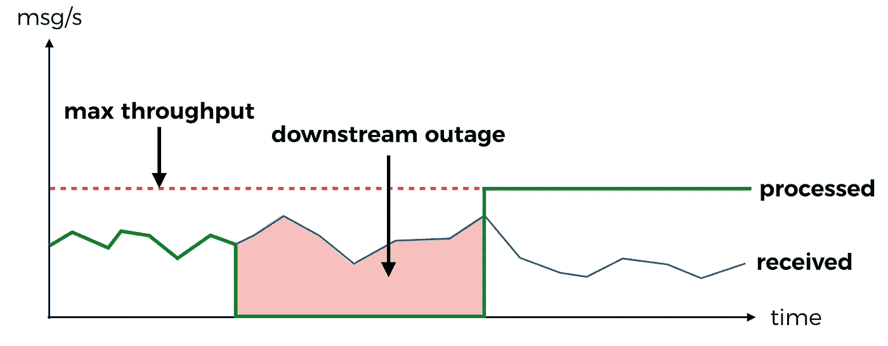

The impact of a downstream outage is absorbed by the retry-until-success invocation policy.

但是 Kinesis Streams 也不是没有自己的问题。事实上，根据我在 Lambda 中使用 Kinesis 流的经验，我发现了许多我们需要理解的警告，以便有效地使用它们。

你可以在这里阅读这些警告。

[](https://read.acloud.guru/aws-lambda-3-pro-tips-for-working-with-kinesis-streams-8f6182a03113) [## 将 AWS Lambda 与 Kinesis Streams 结合使用的 3 个专业技巧

### TL；DR:从我们的陷阱中吸取的教训包括考虑部分故障、使用死信队列和避免…

read.acloud.guru](https://read.acloud.guru/aws-lambda-3-pro-tips-for-working-with-kinesis-streams-8f6182a03113) 

还有几个操作注意事项需要考虑:

*   因为 Kinesis Streams(部分)是根据分片小时数收费的，所以一个休眠流的基线成本是每小时每分片 0.015 美元(每月每分片约 11 美元)
*   Kinesis 流也没有内置的自动扩展功能，因此根据利用率对其进行扩展也会产生额外的管理开销

你可以自己构建自动伸缩能力，我在之前的(失败的)启动中已经这么做了。虽然我不能分享代码，但你可以在这里[阅读我的方法和设计思路](https://read.acloud.guru/auto-scaling-kinesis-streams-with-aws-lambda-299f9a0512da)。

[](https://read.acloud.guru/auto-scaling-kinesis-streams-with-aws-lambda-299f9a0512da) [## 使用 AWS Lambda 自动缩放 Kinesis 流

### 使用 Lambda 函数创建自动缩放 Kinesis 流的经济高效的解决方案的方法

read.acloud.guru](https://read.acloud.guru/auto-scaling-kinesis-streams-with-aws-lambda-299f9a0512da) 

有趣的是，Kinesis Streams 并不是 AWS 上唯一可用的流选项，还有 DynamoDB 流。

## DynamoDB 流+ Lambda

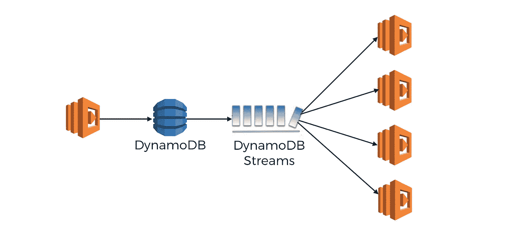

DynamoDB Streams can be used as a like-for-like replacement for Kinesis Streams.

总的来说，DynamoDB Streams + Lambda 的工作方式与 Kinesis Streams + Lambda 相同。在操作上，它确实有一些有趣的变化:

*   DynamoDB 流自动缩放碎片的数量
*   如果您使用 AWS Lambda 处理 DynamoDB 流，那么您不需要为 DynamoDB 流的读取付费(但是您仍然需要为 DynamoDB 表本身的读写容量单元付费)

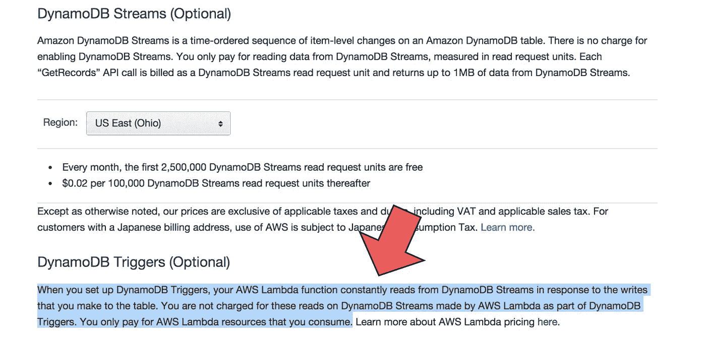

*   Kinesis Streams 提供了将数据保留期延长至 7 天的选项；DynamoDB Streams 不提供这样的选项


DynamoDB 流自动缩放碎片数量的事实可能是一把双刃剑。一方面，它消除了你管理和扩展流的需要(或者想出自制的[自动扩展解决方案](https://read.acloud.guru/auto-scaling-kinesis-streams-with-aws-lambda-299f9a0512da))；另一方面，它还会削弱您传递给下游系统的负载峰值的缓冲能力。

没有办法限制 DynamoDB 流可以扩展的碎片数量——这是您在实现自己的自动扩展解决方案时肯定会考虑的。

## 我应该使用 Kinesis 还是 DynamoDB 流？

我觉得最中肯的问题是`“what is your source of truth?”`

在 DynamoDB 中写入的一行是否符合您的系统状态？这在大多数围绕数据库构建的 N 层系统中都是如此，不管它是 RDBMS 还是 NoSQL。

在以事件为源的系统中，状态被建模为一系列事件(而不是快照),事实的来源很可能是 Kinesis 流——一旦事件被写入该流，它就被认为是系统状态的标准。

此外，还有其他关于成本、自动扩展等方面的考虑。

从开发的角度来看，DynamoDB Streams 也有一些限制和缺点:

*   每个流仅限于一个表中的事件
*   记录描述的是 DynamoDB 事件，而不是来自您的领域的事件，当我处理这些事件时，我总觉得这产生了一种不和谐的感觉

## 你的经纪人选择的成本影响

排除用于处理消息的 Lambda 调用的成本，下面是使用 SNS、Kinesis 流和 DynamoDB 流作为代理的一些成本预测。我假设吞吐量是一致的，每条消息的大小是 1KB。

**1 消息/秒的月费用**

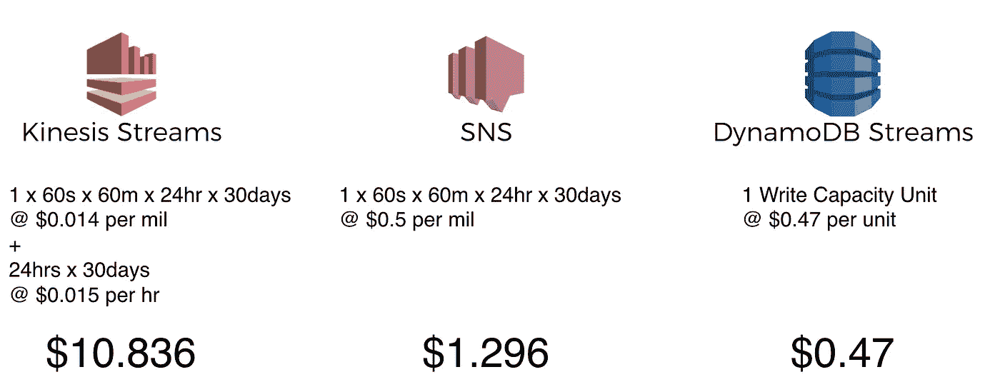

**每月 1000 条消息/秒的费用**

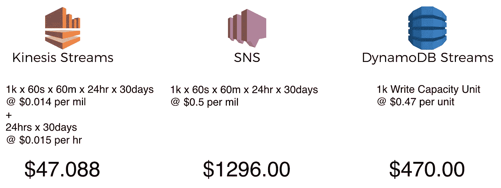

**不应轻信这些预测。**首先，关于完全一致的吞吐量和消息大小的假设是不现实的，即使没有达到限制，您也需要一些 Kinesis & DynamoDB 流的扩展空间。

也就是说，这些预测告诉我的是:

1.  你可以从每个碎片中获得很多东西
2.  虽然使用 Kinesis 流有一个基线成本，但与 SNS 和 DynamoDB 流相比，成本随着规模的增长要慢得多，因为每百万次请求的成本要低得多

## 堆积起来

虽然 SNS、Kinesis 和 DynamoDB 流是代理的基本选择，但是 Lambda 函数本身也可以充当代理，并将事件传播到其他服务。

这是 awslabs 的 [aws-lambda-fanout](https://github.com/awslabs/aws-lambda-fanout) 项目使用的方法。它允许您将事件从 Kinesis 和 DynamoDB 流传播到其他服务，这些服务不能直接订阅 3 个基本的代理选择，因为帐户/区域限制，或者它们不被支持。

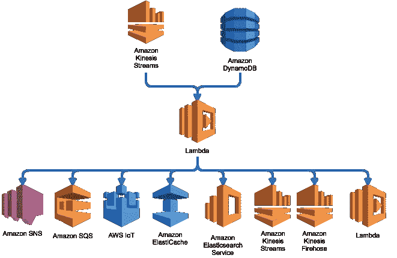

The aws-lambda-fanout project from awslabs propagates events from Kinesis and DynamoDB Streams to other services across multiple accounts and regions.

[](https://github.com/awslabs/aws-lambda-fanout) [## aw slab/AWS-lambda-扇出

### AWS-Lambda-fanout——一个样本 AWS Lambda 函数，它接受来自 Amazon Kinesis 流的消息，并传输…

github.com](https://github.com/awslabs/aws-lambda-fanout) 

虽然这是一个很好的想法，并且肯定满足了一些特定的需求，但是值得记住它引入的额外复杂性——处理部分故障、处理下游中断、错误配置等。

# 推挽式，也称为扇出/扇入

`push-pull`消息传递模式通常被称为扇出/扇入。

这实际上是两种不同的模式协同工作。**扇出**通常单独使用，消息以循环的方式传递给一群工人，每条消息只传递给一个工人。

这至少在两个不同方面是有用的:

1.  让一群工作人员来执行实际工作可以实现并行处理，并提高吞吐量
2.  如果每条消息代表一个昂贵的任务，而这个任务可以被分解成可以并行执行的更小的子任务


在第二种情况下，原始任务(比如说一个批处理任务)被**划分为许多子任务，您将需要**扇入**来收集单个工作人员的结果并将它们聚集在一起。**


## 使用 SNS 的扇出

如上所述，SNS 的每条消息调用策略非常适合这里，因为我们在扇出阶段优化了吞吐量和并行性。

在这里，一个`ventilator`函数会将昂贵的任务划分为子任务，并为每个子任务向 SNS 主题发布一条消息。

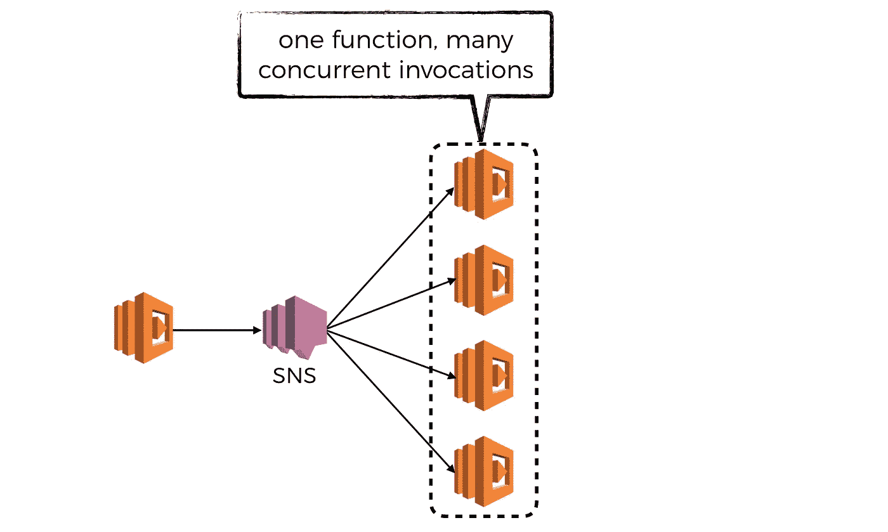

这基本上是我们在 Yubl(我工作的最后一家初创公司)实现时间线功能时采用的方法，它的工作方式与 Twitter 的时间线相同——当你发布一篇新帖子时，它会被分发到你的追随者的时间线；当你关注另一个用户时，他们的帖子会很快出现在你的时间轴上。


Yubl had a timeline feature which works the same way as Twitter’s timeline. When you publish a new post, the post will be distributed to the timeline of your followers.

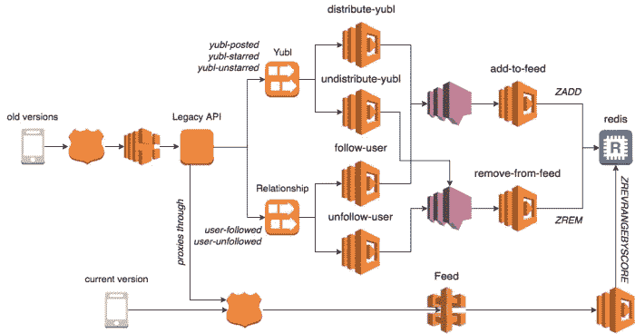

A real-world example of fan-out whereby a user’s new post is distributed to his followers. Since the user can have tens of thousands of followers the task is broken down into many subtasks — each subtask involves distributing the new post to 1k followers and can be performed in parallel.

## 和 SQS 一起散开

在 AWS Lambda 出现之前，这种类型的工作负载通常由 SQS 执行。不幸的是，SQS 不是 Lambda 支持的事件源之一，这使它在这里处于非常不利的地位。

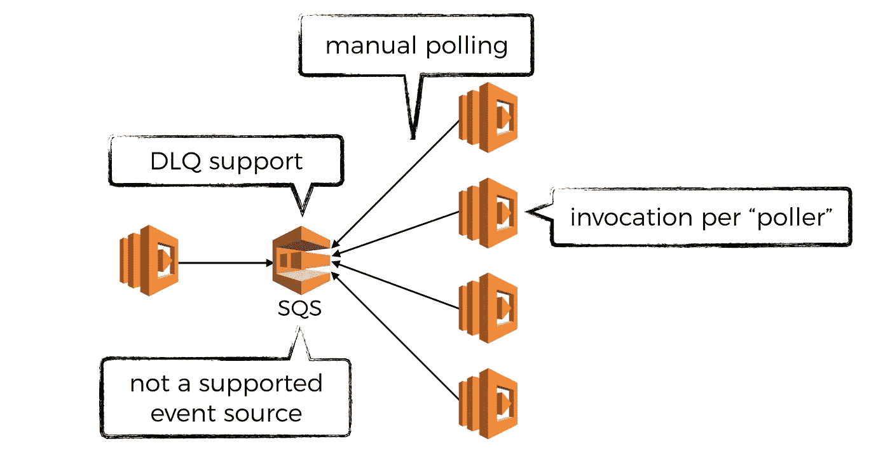 [## 支持的事件源- AWS Lambda

### 本主题列出了受支持的 AWS 服务，您可以将这些服务配置为 AWS Lambda 函数的事件源。你先请…

docs.aws.amazon.com](http://docs.aws.amazon.com/lambda/latest/dg/invoking-lambda-function.html) 

也就是说，SQS 本身仍然是分配任务的一个很好的选择，如果你的子任务需要超过 5 分钟(Lambda 的最大执行时间)才能完成，你可能仍然需要想办法让 SQS + Lambda 的设置工作起来。

让我解释一下我的意思。

首先，通过将 Lambda 函数写成递归函数，它有可能超过 5 分钟的执行时间限制。然而，最初的调用(由 SNS 触发)必须表明 SNS 消息是否被成功处理，但是该信息只有在递归结束时才可用！

有了 SQS，你就有了一个可以在递归过程中传递的消息句柄。递归调用然后可以使用句柄来:

*   延长消息的可见性超时时间，以便在我们仍在处理消息时，另一个 SQS 轮询器不会收到它
*   如果我们能够成功处理该邮件，请将其删除

不久前，我构建了一个使用递归 Lambda 函数处理 SQS 消息的架构原型。该架构允许根据 backlog 的大小(或者您选择缩放的任何 CloudWatch 指标)弹性地增加或减少轮询器的数量。

你可以在这里阅读全部内容[。](/theburningmonk-com/aws-lambda-use-recursive-function-to-process-sqs-messages-part-2-28b488993d8e)

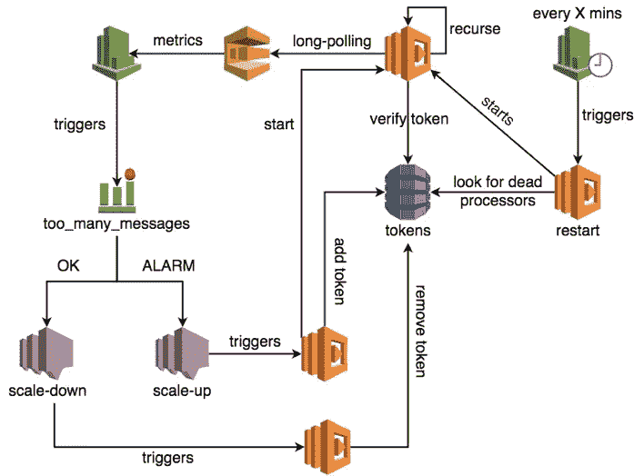[](http://theburningmonk.com/2016/09/aws-lambda-use-recursive-function-to-process-sqs-messages-part-2/) [## AWS Lambda——使用递归函数处理 SQS 消息(第 2 部分)

### 首先，很抱歉从第 1 部分开始花了几个月的时间来写这篇文章，自从加入 Yubl 以来，我一直非常忙…

theburningmonk.com](http://theburningmonk.com/2016/09/aws-lambda-use-recursive-function-to-process-sqs-messages-part-2/) 

我不相信它降低了常规使用的 SQS + Lambda 设置的门槛，更不用说为轮询 SQS 而 24/7 运行 Lambda 函数的额外成本了。然而，我确实知道一些公司(包括我的一个前雇主)正在生产中大规模使用这种架构，所以它可能工作得足够好。

无论如何，把它放在你的后口袋里，以防万一你需要让 AWS Lambda 和 SQS 一起工作。

## Kinesis 或者 DynamoDB 流呢？

就我个人而言，我不认为这些是很好的选择，因为并行度受到碎片数量的限制。虽然您可以增加碎片的数量，但这是获得额外并行性的一种非常昂贵的方式，特别是考虑到在 Kinesis 流中重新共享的工作方式——在分割现有碎片后，旧碎片仍然存在至少 24 小时(根据您的保留策略),您将继续为此付费。

因此，动态地调整碎片的数量来扩大和缩小您所追求的并行度会导致很多不必要的成本。

对于 DynamoDB 流，您甚至不能选择对流进行重散列——这是一个托管流，它会根据需要进行重散列。

## 扇入:从工人那里收集结果

当`ventilator`函数将原始任务划分为许多子任务时，它还可以为每个子任务包含两个标识符——一个用于顶层任务，一个用于子任务。当子任务完成时，您可以使用标识符来记录它们的结果。

例如，您可以使用 DynamoDB 表来存储这些结果。但是请记住，DynamoDB 的最大条目大小为 400KB，包括属性名。

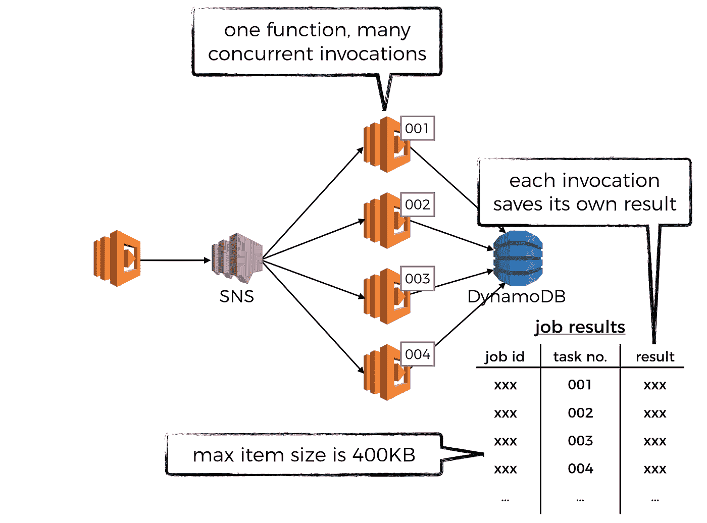

或者，您也可以考虑将结果存储在 S3 中，它的最大对象大小高达 5TB！例如，您可以按如下方式存储结果:

```
bucket/job_id/task_01.json
bucket/job_id/task_02.json
bucket/job_id/task_03.json
...
```

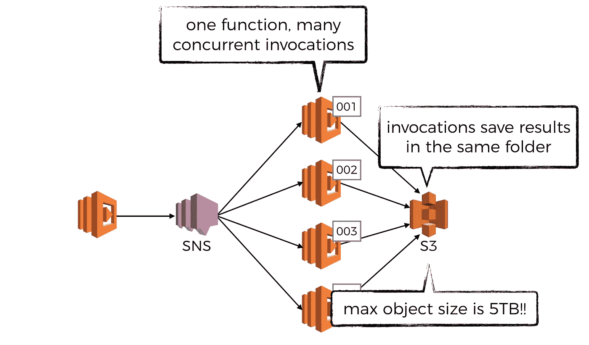

注意，在这两种情况下，我们都容易遇到热分区——针对同一个 DynamoDB 散列键或 S3 前缀的大量写入。

为了减轻这种负面影响，请确保对作业 ID 使用 GUID。

根据您需要对 S3 执行的写操作量，您可能需要调整这种方法。例如:

*   使用顶级文件夹对存储桶进行分区，并根据作业 ID 的哈希值将结果放入正确的文件夹中

```
bucket/01/job_id_001/task_01.json
bucket/01/job_id_001/task_02.json
bucket/01/job_id_001/task_03.json
...
```

*   在 S3 以容易散列但非结构化的方式存储结果，但也在 DynamoDB 表中记录对它们的引用

```
bucket/ffa7046a-105e-4a00-82e6-849cd36c303b.json
bucket/8fb59303-d379-44b0-8df6-7a479d58e387.json
bucket/ba6d48b6-bf63-46d1-8c15-10066a1ceaee.json
...
```


## 扇入:跟踪整体进度

当`ventilator`函数运行并将昂贵的任务分割成许多小的子任务时，它还应该记录子任务的总数。这样，它允许每次调用`worker`函数自动递减计数，直到它达到 0。

看到计数达到 0 的调用负责发出所有子任务都已完成的信号。它可以通过许多方式做到这一点，也许是通过向另一个 SNS 主题发布消息，这样`worker`功能就与聚合单个结果所需的任何 post 步骤相分离。

(等等，我们又回到了发布订阅模式了吗？)也许；-)

此时，将调用`sink`函数(或者在 map-reduce 作业的上下文中称为 reducer)。鉴于您可能有大量的结果要收集，将`sink`函数也写成递归函数可能是个好主意。

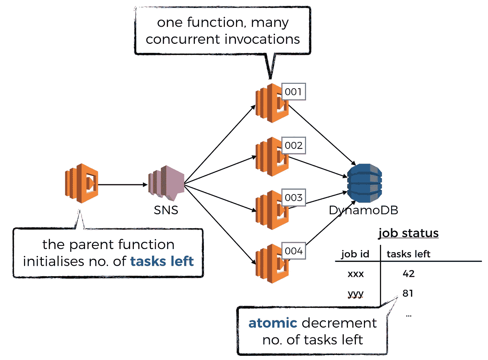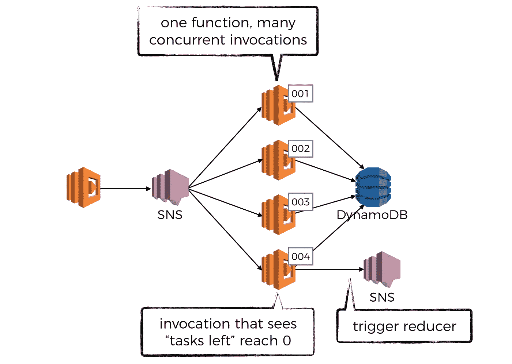

无论如何，这些只是我能想到的用 AWS Lambda 实现`pub-sub`和`push-poll`模式的一些方法。如果我错过了任何明显的选择，请在评论中告诉我。


嗨，我的名字是**崔琰**。我是一个 [**AWS 无服务器英雄**](https://aws.amazon.com/developer/community/heroes/yan-cui/) 和 [**量产无服务器**](https://bit.ly/production-ready-serverless) 的作者。我已经在 AWS 中运行了近 10 年的大规模生产工作负载，我是一名架构师或首席工程师，涉足从银行、电子商务、体育流媒体到移动游戏等多个行业。我目前是一名专注于 AWS 和无服务器的独立顾问。

你可以通过[邮箱](mailto:theburningmonk.com)、 [Twitter](https://twitter.com/theburningmonk) 和 [LinkedIn](https://www.linkedin.com/in/theburningmonk/) 联系我。

查看我的新课程，[**AWS 步骤功能完整指南**](https://theburningmonk.thinkific.com/courses/complete-guide-to-aws-step-functions) 。

在本课程中，我们将介绍有效使用 AWS Step Functions 服务所需了解的一切。包括基本概念、HTTP 和事件触发器、活动、设计模式和最佳实践。

在这里拿到你的副本。


来了解 AWS Lambda: CI/CD 的操作性**最佳实践**，本地测试&调试功能、日志记录、监控、分布式跟踪、canary 部署、配置管理、认证&授权、VPC、安全性、错误处理等等。

还可以用代码 **ytcui** 获得**票面价格 6 折**。

点击获取您的副本[。](https://bit.ly/production-ready-serverless)