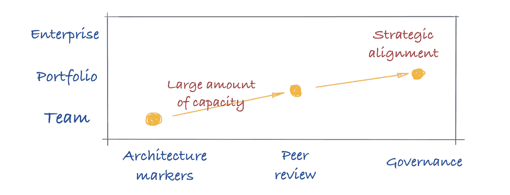

# 复杂组织中的架构和数字平台

> 原文：<https://medium.com/hackernoon/architecture-and-digital-platforms-in-complex-organisations-8216446069a1>

> “一座单独的建筑，其设计和建造的风格并不重要。真正重要的是社区。对生活有什么影响？”贝聿铭

## 我们面临的挑战

在数字时代建立企业在三个层面上令人兴奋。

社会和商业影响的机会从未如此之大，与目标感和意义感的联系从未如此重要。

我们的客户和员工对这些努力的结果的不耐烦的期望呈指数增长。

执行的挑战从未如此复杂，而全球支持和学习社区也从未如此之好。

正是我们业务平台的架构让我们能够抓住这些机会。

## 我们如何做影响生活的建筑？

> 我使用术语“架构”来指代一个业务平台，其中技术是一个关键的使能因素，但不是唯一的考虑因素。这可以被称为“企业架构”，但是我发现这个术语有我想避免的包袱。

有许多关于企业[架构](https://hackernoon.com/tagged/architecture)的技术规程和方法论的好书。已经建立了非常全面的框架，总体而言，行业内围绕这些框架有很高的一致性。不幸的是，需要做的事情范围如此之广，以至于不总是容易知道从哪里开始。我希望这些想法将帮助架构实践找到更快的方法来交付真正的业务影响。

提出的想法隐含地针对复杂的知识型组织，在这种组织中，设计战略联盟和执行这种联盟在人力和技术层面上都是复杂的。

## 我们为什么做建筑？

本质上，架构是关于策略执行的。大多数组织都在努力将他们的商业愿景转化为一个可执行的战略，这个战略将所有的部分联系起来，并以一种激进的方式响应客户的需求。

架构从根本上来说也是关于保护组织在 f *低*的情况下执行的能力。这是一个独立的主题，但一些关键要素是:

*   当必须做出如何执行的决策时，我们应该有足够的人和洞察力来自信地、毫不拖延地做出决策。这需要深思熟虑和持续的学习和计划；
*   我们需要偏向于行动，因为问题永远不会被完全理解，而且经常变化。通常，学习的唯一方法是尝试，并允许团队在面对不确定性时向前推进，如果他们错了，要勇于改变；
*   我们需要就标准化和整合的内容达成一致，以使组织的各个部分在标准化和整合的过程中获得授权而非约束；
*   在有利于短期流动的情况下，我们需要有信心偏离标准；在可能阻碍未来流动的情况下，我们需要有信心控制偏离；
*   当我们犯错时，我们需要诚实去适应，而不是执着于我们的想法。
*   在团队层面和组织层面的优化流程之间存在权衡。这需要判断力以及对愿景和目标的适当调整。

管理这种流动显然是关于平衡多种力量，这需要**商业洞察力、**判断力和**合法性**。*重要的是要认识到，对于几乎所有企业来说，最大化我们快速创造客户价值的能力是目标，而不是最小化成本*。如果我们成功了，简单和降低成本将是一个自然的结果。

建筑从根本上讲也是关于交流的。它是关于积极地倾听客户和其他涉众的关注，以及关于在组织的所有级别上为实现他们的目标而做出的架构决策的交流。

## 建筑中的优点

建筑不仅仅是技术上的考虑。这是一种使命感，一种根植于远见、诚实和行动偏好的工作方式。它的核心是发自内心地致力于帮助他人取得成功。

## 结果是一个平台

任何大型复杂业务都不可避免地演变为数字平台业务，要么作为一个平台的提供者(想想亚马逊)，要么作为其他平台的参与者。

理解我们如何从根本上重新配置我们的核心能力，使之成为一个响应客户需求的数字业务平台，是一个[工程](https://hackernoon.com/tagged/engineering)过程(从最广泛的意义上来说)。一个组织将采取的配置是由高层做出的战略决策，但是架构师在概述可能的艺术以及为这一过程贡献一个系统的工程学科方面扮演着重要的角色。

# 我们努力成为什么样的企业？

## 自由宪章

20 世纪 50 年代的南非是一个文化和政治发展令人眼花缭乱的时代。一方面，最原始的种族隔离制度正在实施。社会、政治和经济生活的每一个方面都是根据种族分类系统编纂的。你的种族决定了你住在哪里，你可以上的学校，你可以从事的工作，你可以结婚的人，你可以享受的服务和娱乐…

另一方面，在反种族隔离运动中出现了新一代领导人，他们对政治反对派采取了强有力的积极态度。这是纳尔逊·曼德拉、安东·伦比德、奥利弗·坦博和沃尔特·西苏鲁的一代。一代政治家、记者、音乐家、律师、学者和医生脱颖而出，塑造了这个国家接下来的 50 年，并在 1994 年迎来了民主。

在这场活动的漩涡中，1955 年，各种反种族隔离运动提议召开人民代表大会，为这个国家制定宪章。向全国人民发出了号召:

> "如果你能制定法律，你会怎么做？"
> 
> “你会如何着手让南非成为所有生活在南非的人的幸福之地？”

纳尔逊·曼德拉在他的自传中描述了当时的情景:

> “这个电话引起了人们的想象。建议来自体育和文化俱乐部、教会团体、纳税人协会、妇女组织、学校、工会分支机构。它们出现在餐巾纸上，从练习本上撕下来的纸上，在小纸片上，在我们自己的传单背面。看到普通人的建议往往远远领先于领导人的建议，令人感到羞愧。最常被提及的要求是一人一票。人们认识到，这个国家属于所有以它为家的人。”

成千上万的志愿者收集的意见被写进了《T4 自由宪章》，并于 1955 年 6 月 26 日在约翰内斯堡附近的克利普顿举行的人民代表大会上获得通过，有 3000 人参加。它所体现的崇高理想激励了一代人，并最终在南非的民主宪法中体现了这一崇高理想(40 年后)。

> “自由宪章抓住了人民的希望和梦想，成为解放斗争和国家未来的蓝图。”

《自由宪章》描绘了一幅蓝图，回答了这样一个问题:“我们希望成为什么样的国家？”

这是一个极端的例子，说明一个处于危机中的社会有能力团结大多数成员，制定一个决定其命运的蓝图。

《自由宪章》的经验教给了组织许多有用的见解。

*   建筑不是学术或象牙塔的努力，它需要大量的倾听；
*   它让组织中的广泛人群参与进来；了解客户需求和他们的实际挑战，并有热情将他们的努力转向共同目标的人；
*   它始于领导愿景/目的，而不是任何想法都可以自由发展；
*   它需要连贯、综合核心蓝图的技巧；不是每个人的想法都能被采纳；
*   如果有一种广泛的被倾听的感觉，合法性就更容易获得；

## 我们努力成为什么样的企业？

今天，并不是每个组织都有和自由宪章这个极端例子一样的机会。但是，在任何尺度上，这可以帮助我们理解建筑是什么。这是一项非常激动人心和鼓舞人心的努力。从根本上说，它有助于回答这样一个问题:“我们希望成为什么样的组织？”

大多数组织都以这样或那样的形式回答了这个问题，但是很少有人能够直接将这个问题解释为 Jeanne Ross 在“*Enterprise Architecture as Strategy*”中所说的“执行的基础”。

因此，作为建筑师，我们的首要目标是:

> 基于我们努力成为的组织的领导愿景，作为一项持续的活动，我们定义了业务平台的配置，这种方式可以很容易地转化为执行的基础和开发它的敏捷计划。

企业架构师常常过于关注技术或内部过程，以至于错过了这个重要的目标。从这个目标开始有助于快速地将架构工作集中在它们将真正产生影响的领域。

建筑需要强有力的可见的领导。它包括挑战现状和定义现状的假设。它令人振奋，充满活力；经常处理组织生命中关键的、决定性的时刻。

随着商业、社会和政治领域的快速变化，几乎所有组织都需要以某种方式应对这些问题。如果他们没有，那么他们可能对我们讨论的架构类型没有什么需求。为了全面探究这其中包含的一些承诺，Ross 在“作为战略的企业架构”中提供了一个系统的概要。

## 偏向行动

阿利斯泰尔·考克伯恩这样描述建筑:

> 解决一个我们并不完全理解的问题，这个问题在我们的内心不断变化

在努力实现我们的战略意图并揭示“我们努力成为的企业”的含义时，我们还需要放弃确定性，接受我们需要适应不断变化的环境，并理解这将引导我们偏向行动。我们真正知道某样东西有用的唯一方法是去尝试它。

# 作为设计的建筑

近年来，建筑受到了*设计思想*的强烈影响，现在不承认这笔债务是不可能做建筑的。

## 设计思维

设计思维深深植根于对人类问题的理解。

我们把大部分精力集中在理解问题上，而不会因为问题的表面陈述而很快满足。我们深挖支撑问题的假设和挑战的层次，直到我们找到正在发生的事情的真正见解。我们合作完成这项工作，并让组织外部的人参与进来。

我们创造性地思考解决方案，不拘泥于以前做过的事情。如果我们努力寻找候选的解决方案，这通常意味着我们还没有理解这个问题。

我们通过构建原型和实验，与客户一起快速测试解决方案。

我们使用数据来衡量我们所做的事情并做出决策。

我们关注目的和意义，而不是纯粹的财务价值。

## 作为设计的建筑

您的组织中可能已经有人在以这种方式工作了，并且像建筑一样，这是一种应该融入到组织各个层面的实践。

建筑可以通过明显的方式学习并参与*设计思维*，特别是在理解我们为客户解决的问题、引出创新的解决方案以及使用协作方法使这些变得有效方面。

# 构建架构活动

## 组织结构

架构功能应该在组织内集中还是联合？我认为答案是两者都有:架构需要深深嵌入到组织的每个部分，在那里创造客户价值，因为这吸引了利益相关者并促进了采用。与此同时，架构在以其结构经常妨碍的方式连接组织方面发挥着关键作用。关于标准化什么和整合什么的问题不能在组织的一个部门单独解决。

架构团队的关键角色是促进这个过程:确保架构完成；它正在被编织进组织结构中；它对嵌入的地方有影响，并以实现其战略的方式连接组织。它将努力集中在企业的目标上，同时承认它必须对组织中的创造性紧张做出反应。它也需要亲自参与工作，因为我们通过实践来学习。

作为一般规则，应该应用*辅助*原则:决策应该在负责处理问题的最低级别处理。这在实践中意味着什么需要判断，但它需要从愿景、信任、赋权和相互问责的意向开始

## 建筑活动

架构活动发生在组织的所有层面，从单个产品团队到企业层面。

我们将架构活动分为三个领域:创建架构标记/工件、同行评审和治理。

下面是在一个简单的框架中展示这两个维度的有用方法

虽然我们需要做出良好的决策，以保持组织自信地执行的能力，但我们也需要认识到，没有一个点可以解决所有的考虑。因为我们从来没有对问题有完整的理解，并且因为问题一直在变化，所以我们需要确信当前提出的架构是我们在某个时间点上的最佳视图，它明确地捕获了来自不确定性的内在风险，并且它以有目的和包容性的方式发展。

**建筑标志**

建筑实践的核心是产生建筑标记的日常活动。标记可以是团队讨论并内化的想法、白板图纸或迭代设计的蓝图。重要的一点是，这个活动要轰轰烈烈，持续不断。人工制品可能由全职的架构师来完成，或者他们可能由其他角色的人来完成，这些人是阐明架构的积极的一部分。应尽可能高效、清晰地捕捉建筑标记(例如 wikis)。

> 一个关键的目标是使下一步的努力

除非以客户需求(而不是技术)为基本方向，并且除非有代表性的利益相关者参与到这个过程中，否则这些活动不会有效。

**同行评议**

在产生架构标记的同时，自然会出现同行讨论，但是也存在一些半正式里程碑的空间，在这些里程碑中，提出的解决方案会在更广泛的同行社区中进行展示和讨论。

最终，提议的架构需要被很好地阐述，以至于它可以作为一个*故事*来讲述，从期望的业务结果开始，通过一个被认为是可实现的并且清楚地满足我们的目标的解决方案(模板经常阻碍而不是帮助这一点)。同行评审是检验这一目标实现的好方法。

> 建筑是讲故事

**正式治理**

治理过程应该主要关注于确保执行人员参与到架构过程中，并且对决策有意义地负责。

知道管理层的参与是治理过程的一部分也将确保涉众的观点从一开始就得到很好的代表。

在大型组织中，现代公司治理要求展示有效架构决策的证据，这提出了具体要求，以证明董事会对所做的重大决策有适当的监督。

这里的基本要素是确保高管领导架构*故事*并且关键决策得到良好的沟通。这不仅仅是在正式会议上实现的。

**将它们放在一起**

我们已经涵盖了架构活动的连续性:从深深植根于动态团队环境的标记的有力构建(在这种环境中，我们可以接触到大量聪明的人)，通过健康的同行评审文化，最后通过组织调整、买入和对一组推动组织实现其目标的决策的承诺来巩固。

架构实践的一个重要作用是协调所有这些并构建能力。

## 管理工作

尽可能多的架构工作应该嵌入到对结果负责的团队中。它应该在他们的 backlog 上进行管理，并且产品/投资组合所有者应该很好地理解完成工作的影响，以便以最大化流程的方式对其进行优先排序。我们必须避免由*大的预先设计*造成的浪费，这种浪费可以被分解，以便可以增量测试。另一方面，我们必须避免由于没有为关键决策做好准备而造成的浪费，这种浪费会导致团队等待这些决策的做出，或者构建的解决方案考虑不周，最终会阻碍战略的实施。

管理这种微妙的平衡，以*及时*和优秀的决策为目标，是产品/组合团队的责任。他们不应该认为这种责任属于一个单独的架构团队。

总会有不适合现有结构的企业范围的决策。对于这些，应该有一个特定的架构积压。这些在组织的不同层面都是需要的。

不言而喻，这是一个看板风格的过程，关注最有价值的活动，并根据交付的价值衡量我们自己。然而，在架构问题的情况下，这个过程的不确定性更加极端，因此比产品开发的其他方面更不适合严格的计划。同样，与做出糟糕决策(或根本不做决策)相关的延迟成本也很高。用洞察力和技巧管理这些力量最终定义了在特定组织中进行架构的最佳方式。

这些积压工作的可见性应该是自动化和面对面讨论的健康结合。

## 团队技能

我们需要什么样的团队来促进整个企业的架构实践？

我们需要从业者，他们促进并参与架构工作，向每个团队学习并帮助每个团队学习。

我们需要商业专家，他们了解我们作为一家企业在努力做什么，以及企业和行业是如何运作的(以及他们如何在一个被破坏的行业中运作)。

我们需要用户体验设计师，他们知道如何框定客户的问题，以及如何促进协作过程来真正理解这些问题。

我们需要工程师，他们知道如何构建解决方案，以及如何设计支持这些解决方案的技术平台。他们需要了解新兴技术以及如何应用这些技术。必要时，他们需要能够用原型测试想法。

我们需要了解数据建模、数据管理和数据工程的数据/信息架构师。

我们需要数据分析技能来为我们做出的决策带来衡量文化。

我们需要司机，他们确保工作得以完成，工作得以协作完成，并且我们平衡了许多其他角色中存在的对*思维*的偏见。

我们需要沟通者，他们收集和分享信息，并确保信息在整个组织中传播。

好的架构师应该能够胜任这些角色。在实践中，我们认识到核心架构团队可能是小型的、多样化的和多技能的，并且在解决具体问题时与组织中更广泛的虚拟团队密切合作，并且与组织外部联系以带来我们不具备的洞察力和技能。

# 建筑过程

这是一个我发现在复杂组织中有效的典型过程:

*   主要利益相关者请求特定问题的指导，并阐明目标。
*   召集了一个最了解问题的业务和技术方面的小组。
*   该团队确定问题的所有利益相关者，并与每个人面谈，以了解他们的角色、挑战和目标。他们深入挖掘挑战。
*   这些信息被整理为当前功能(业务运营模式)的高级视图、挑战汇总列表和目标汇总列表。利益相关者定期对这些进行测试。
*   创建了可以解决问题和挑战的可能行动的列表。这涵盖了从短期战术改进到战略变化的范围。
*   战略业务和技术平台是在相对较高的层次上阐述的。
*   通过该过程，向利益相关者回放结果，知道所有利益相关者的所有目标不能被满足，同时仍然得到所有利益相关者的认同。行动是有优先级的。
*   与主要利益相关者就结果达成一致，主要利益相关者应该在整个过程中收到定期更新并给出定期反馈。

这个过程需要适应正在探索的每个业务挑战。没有严格的模板。

# 文化和变革管理

让一个组织对上述努力做出回应实际上是一项艰巨的任务。没有管理层的支持，这些努力不可能成功。很少有具体的建议可以帮助确保这一点，因为所有的组织都是不同的。获得这种支持的一些一般想法是:

1.  深深扎根于实现业务成果，无论是小规模还是大规模。表现出对这些业务成果的深刻理解。这需要强大的商业、金融和人力敏锐度。
2.  通过产生影响来获得*合法性*，并使用这种合法性来建立对其他架构工作的支持。这总是需要你周围有一个好的团队——你的核心架构团队和组织中指导和支持你努力的更广泛的网络。

根据团队和组织的状态，也许可以从一个大的企业规模开始，或者更好的做法是将问题分解，并在特定的环境中展示高影响力的结果，然后从那里发展。

克莱顿·克里斯滕森(Clayton Christensen)的《合作与变革的工具》(Tools of cooperation and change)提供了一种思考如何达到你所需要的合作水平的系统方法

他概述了需要评估的两个共识领域:

1.  对于*我们想要实现的目标*的一致程度，以及其中隐含的价值观、优先事项和权衡
2.  在*我们将如何实现它*上的一致程度，这概括了旅程和我们将使用的手段

这两者都是架构过程的核心，尤其重要的是要始终意识到我们在这些协议上所处的位置，以及这如何影响我们执行的活动。

克里斯滕森确定了我们必须改变组织的四种工具(权力、管理、领导力和文化)。他的论文值得一读，从中可以找到如何应对变革的实用思路。

# 通过 IT 自动化进行架构治理

到目前为止，我们已经关注了架构过程如何解决特定的问题，但是我们还需要当前架构的视图以及它是如何发展的。这通常是一个痛苦和官僚的过程，并且很少保持最新。

随着现代工程实践的发展，团队越来越容易对此负责，并自动获取有关技术组件如何实现业务功能、组件如何相互依赖、应用程序如何部署以及已经或计划对应用程序进行的更改的信息。

完成这项工作需要一些协调，但是让团队将它作为他们工程实践的一部分，集成到他们的积压工作、问题跟踪系统、部署自动化、监控和测试中，是非常可行的。

# 关注近处和远处，而不是中间

在努力实现我们的愿景和战略目标时(远处的*和远处的*)，我们积极地参与到实现愿景和战略目标的工作中(靠近的*)，同时还必须规划一条路线来连接两者(中间的*)。**

*以我的经验来看，我们在*中间*花了(也浪费了)太多时间。具有讽刺意味的是，这是最不确定的领域，因为*远*在高层次上被很好地理解，相对缓慢地变化，并且足够远，可以有目的地管理变化。附近的*也很好理解，因为我们在做实实在在的工作和学习。**

**

*大部分浪费在中间的部分，这里有两个很好的例子。第一个是详细的多年计划和方案，取而代之的应该是我们目前认为将采取的步骤的高层次故事。随着我们的学习和客户需求的变化，这些高层次的故事应该有目的地更新。*

*第二是构建标准的基础能力(例如大规模基础设施、数据或渠道能力)。虽然对这些基础能力有一个愿景和蓝图是至关重要的，但组织中的任何人都不应该等待它们被构建，我们需要在构建业务能力时允许它们按优先顺序构建。这使我们能够快速学习，并在实际业务问题的背景下发展我们对这些基础能力的愿景。*

*一种表达方式是:*

> *我们有横向基础能力的愿景和蓝图，但我们总是针对纵向客户能力来执行*

# *未来的挑战*

*虽然提出的一些想法是有抱负的，可能难以在大型组织中实施，但我认为它们不应被视为耗尽稀缺资源的负担。如果有的话，他们应该在短期内减轻组织的负担，创造一致性、效率和流动。*

*然而，他们真正需要的是韧性、协作和一个强烈渴望支持利益相关者努力进步的团队。*

*在以后的文章中，我将探讨一些实用的想法，大型企业可以将自己重新配置为数字平台企业。*