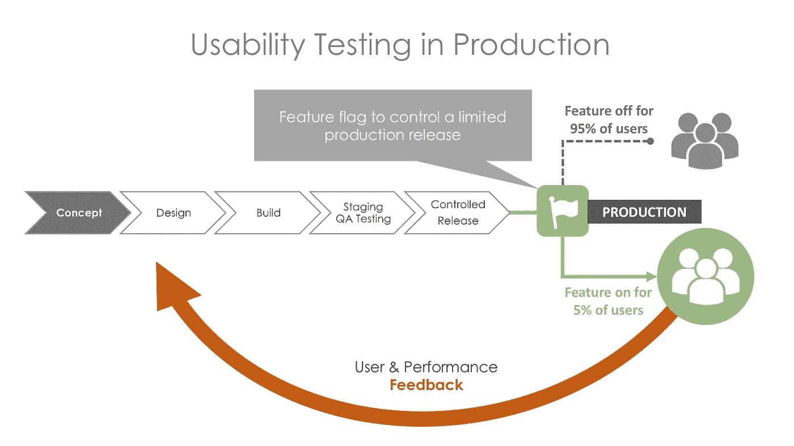

# 如何在实时应用上安全地测试新功能

> 原文：<https://medium.com/hackernoon/are-you-crazy-to-usability-test-in-production-heres-how-to-do-it-6b171283d640>

## 使用特性切换来安全地管理特性测试和发布

真实环境(生产环境)中的可用性测试让我们深入了解用户在日常生活中是如何使用我们的产品的。在实验室环境下运行测试是一回事，但让用户在走路、跑去机场、有压力和困倦时尝试功能是另一回事。

> 真实世界的可用性测试分析用户本地环境中的特性，收集直接和间接的反馈来改善用户体验。

无论我们如何努力，都很难真正模拟我们的应用在生产环境中的行为。我们可以运行焦点小组，在 beta 环境中运行 beta 测试，并在内部测试，但是我们如何在人工环境中真正模拟真实世界呢？换句话说，我们如何在模拟环境的同时测试一个特性呢？

UXteam.com

# 实验室测试的问题

真实世界的可用性测试分析用户本地环境中的特性，收集直接和间接的反馈来改善用户体验..然而，当我们在非生产环境中测试任何东西时，我们天生就偏向我们的测试。在基于实验室的可用性测试中:

*   用户过分关注他们正在测试的特性。
*   用户不自然地专注于测试新功能，而忽略了产品的其他部分。
*   用户使用虚假数据或不完整数据，并且没有充分利用实际用例。
*   很难测试可发现性(例如，用户能自己找到特性吗？).
*   用户倾向于忽略外部通知(脸书、Skype、短信等)等干扰。)并且只专注于手头的任务。
*   用户处于过度分析的模式，通常希望给出反馈。
*   用户过分宽容，寻求取悦！

这是否意味着在非生产环境中运行可用性测试是浪费时间？一点也不！这对于识别 bug、检查总体可用性以及快速征求反馈是绝对必要的。

然而，它应该只是一个全面的可用性测试过程中的一个步骤，这个过程包括内部、测试和产品可用性测试。

# 生产中可用性测试的好处

产品中可用性测试的主要目的是评估真实世界的用户行为，同时最小化偏差和性能风险。更多优势包括:

## 真实环境中的真实用户反馈

您可以从数量上了解您的功能的性能。它的伸缩性如何？用户在用吗？它对您的系统有何影响？你的参与度如何？

您会收到对您的功能功效的上下文洞察。用户看到新功能了吗？在您现有的功能集中，它是如何与上下文相结合的？人们是否按预期使用它？是不是人用了一次就不再用了？

你会收到定性的反馈。用户在抱怨吗？他们幸福吗？他们是中立的吗？他们提交支持票了吗？他们要走了吗？

## 没有选择加入偏见

用户测试特性时并不知道他们是测试的一部分。您可以通过使用 Full Story 之类的产品来记录会议或跟踪指标，来评估他们使用它的情况。因此，你得到了一个更有代表性的测试特性的样本，而不仅仅是早期的采用者。

## 测量实际系统性能

没有什么比您的生产环境更好的了，在生产环境中，您可以拥有复杂的节点、集群、cdn 等阵列。允许您的应用程序扩展。随着人们开始使用新特性，您可以看到它是如何影响您的实际系统的(加载时间、可发现性、缓存问题等)。).

# 在生产中管理可用性测试

当然，在您的生产环境中测试任何东西都有内在的风险，并且会产生现实世界的后果。如果你只是为了获得反馈而向每个人发布某个东西，而他们讨厌它，那么你就有可能永久失去这些用户。同样糟糕的是，不可预见的伸缩和性能问题会使整个应用程序瘫痪。

为了减轻这一点，像脸书、亚马逊和谷歌这样的公司通过发布功能标志背后的功能来收集[产品反馈](http://tech.co/the-dark-launch-how-googlefacebook-release-new-features-2016-04)。虽然我们不会深入到特性标志的具体剖析中，但是我们可以浏览一下发布背后的方法。

如果一个特性包含在一个特性标志中，那么它可以让您控制谁可以在什么时候看到这个特性。这意味着您可以使用百分比展开来执行有目标的和受控的发布，由此您可以将特性的可见性递增到 1%、5%和 100%的用户。

> 如果一个特性包含在一个特性标志中，那么它可以让您控制谁可以在什么时候看到该特性，包括完全关闭该特性的能力。

# 功能切换/标志

因此，您可以收集生产级别的反馈，因为您可以控制风险级别。如果一个新功能表现良好，那么您可以继续增加百分比卷展栏。如果它是坦克或损害性能，那么你可以减少推出或完全杀死它。

> 您可以收集生产层面的反馈，因为您可以控制风险水平。

因此，[特性标志](https://launchdarkly.com/featureflags.html)(也称为[特性切换](http://martinfowler.com/articles/feature-toggles.html)或配置开关)让您完全控制您的产品发布的风险。您可以通过将功能展示与代码部署分开来收集真实世界的用户反馈。

— — —

让我们保持联系吧！给我一个 ***关注*** *了解更多关于设计、开发、技术和任何想到的东西。*