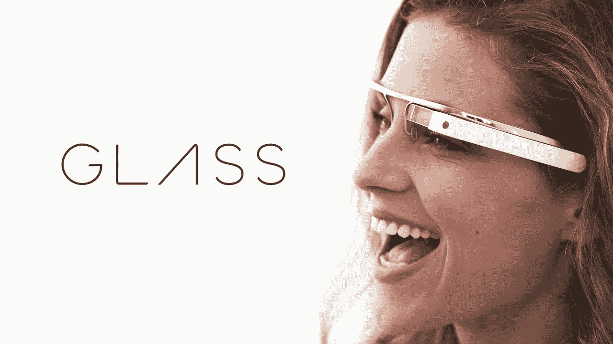

# ARKit 会给我们应得的谷歌眼镜

> 原文：<https://medium.com/hackernoon/arkit-will-give-us-the-google-glass-we-deserve-43ae21ffa0f7>

苹果公司 WWDC 最低调的声明之一是 ARKit 的发布。一个面向 iOS 开发者的 SDK，用于将增强现实添加到他们的应用中。虽然 AR SDKs 已经存在很长时间了，但它们要么价格昂贵，要么支持不力，要么性能不佳，并且构建自己的 AR 功能需要大量时间。

ARKit 改变了这一点，在这个过程中，它可以让谷歌眼镜承诺的梦想成为现实。

# 易接近

ARKit 使 AR 像其他任何 API 一样对开发者开放。当这种情况发生时，一项[技术](https://hackernoon.com/tagged/technology)的实验和新用途的数量总是会增加。开发人员将能够轻松地在他们的应用程序中构建少量的 AR 功能，而无需进行大量的工作。

每家服装公司都可以在他们的移动应用程序中便宜地添加实时虚拟试衣。每家家具店都可以让你看看他们的沙发在你的公寓里会是什么样子。

但它也将导致 AR 的新用途被探索并找到重要的用途。

# 但是谷歌呢…

初创公司和开发人员继续首先为 iOS 开发应用程序，但要想真正实现 AR 热潮，它还需要在 Android 上也能访问。

在过去的几年里，谷歌一直在开发 Tango，这是它自己的增强现实平台。Tango 使用特殊的传感器和软件来了解周围的世界，并将虚拟物体添加到世界中。

虽然它肯定比 ARKit 有更好的技术，但对特殊硬件的需求意味着很少有设备支持它(到目前为止只有 2 款商用)。这种支持设备的缺乏给了苹果一个优势，但这种情况在不久的将来会有所改变。

最初，Tango 设备很大，但最新设备华硕 Zenfone AR 的大小与当今任何流行的 Android 手机相当。随着 Pixel 的成功，很可能即将推出的 Pixel 设备也将 Tango 融入其中。随着为 iOS 开发的支持 Tango 的设备的 AR 应用的增加，他们也将在 Android 上有一个家。这将推动其他制造商采用 Tango 来支持所有这些 AR 应用程序。

# 将来的

但是你说基于手机的增强现实已经存在了？确实如此，但成功的例子很少，Pokemon Go 是一款具有单一可选 AR 功能的游戏，是典型的例子。现在我们将看到无数更多的应用程序可选地使用 AR 或将其作为核心体验。这种新 AR 应用的大量涌现将导致开发者最终找到 AR 的最佳用例。

这让我想到了 AR 眼镜。

谷歌眼镜领先于时代，不是在功能上，而是在外形和潜在的使用案例上。它承诺的太多，实现的太少。像今天的智能手表一样，它只是以稍微更方便的方式提供了我们智能手机上已经有的东西。再加上采用率低，开发者几乎没有动力去探索 AR 的用例。

但 ARKit 和 Tango 将带来许多新的基于 AR 的应用和服务，只是在等待合适的 AR 眼镜。为什么？增强现实眼镜将比基于手机的增强现实技术提高 10 倍。这些相同的服务将通过移植到 AR 眼镜上立即得到改善。AR 离你的眼睛越近，就越有沉浸感，每个杀手级 AR 应用在眼镜中都会更好。

# 结论

这就是 ARKit 如此重要的原因。这将刺激智能手机上使用 AR 技术的大量新应用和服务的开发。为了竞争，谷歌将继续缩小其 Tango 技术的规模，并将其引入智能手机。三星等 Android OEMs 厂商将采用它，这样他们的设备就可以支持使用 ARKit 在 iOS 上构建的相同应用程序。

然后我们会看到新的 AR 眼镜的发布。据传，苹果已经在研究这一技术，谷歌也有这方面的历史。随着手机上已经存在大量的 AR 应用程序，开发者将很容易将这些应用程序移植到眼镜上。最后，有了许多已经证明有用的增强现实服务，我们将拥有梦想中的谷歌眼镜。

至少我是这么预测的。

> [黑客中午](http://bit.ly/Hackernoon)是黑客如何开始他们的下午。我们是 [@AMI](http://bit.ly/atAMIatAMI) 家庭的一员。我们现在[接受投稿](http://bit.ly/hackernoonsubmission)，并乐意[讨论广告&赞助](mailto:partners@amipublications.com)机会。
> 
> 如果你喜欢这个故事，我们推荐你阅读我们的[最新科技故事](http://bit.ly/hackernoonlatestt)和[趋势科技故事](https://hackernoon.com/trending)。直到下一次，不要把世界的现实想当然！

