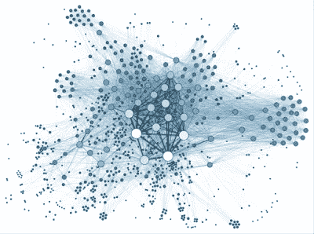

# 人工智能，UX &可发现性的未来

> 原文：<https://medium.com/hackernoon/artificial-intelligence-ux-the-future-of-findability-e4b5088f47b1>

[Credit: Martin Grandjean [CC BY-SA 3.0], via Wikimedia Commons](https://commons.wikimedia.org/wiki/File%3ASocial_Network_Analysis_Visualization.png)

我完全痴迷于使用人工智能、搜索模式和信息架构来提高内容的可查找性。痴迷。看起来我们正站在用聊天机器人和[数据](https://hackernoon.com/tagged/data)挖掘做惊人事情的风口浪尖，这可以增强人工信息架构工作，并带来更好的整体用户体验。

# 人工智能+ UX =更好的可发现性

假设您有一个包含搜索组件的服务。现在你的用户可能正在运行搜索，并使用手动过滤器对结果进行分类，就像搜索用户习惯做的那样。

你怎么知道他们是否找到了他们需要的东西？你可以依靠分析来了解他们是否正在访问你想要他们访问的内容，并通过用户研究来了解他们是否认为自己成功完成了任务。您可以通过分析使用数据、服务时间，并在访谈和反馈表格中直接询问他们来衡量整体用户满意度。

假设一些用户在搜索时有困难，或者没有去你期望的搜索结果。也许他们的总体体验还可以，但是看看搜索结果中的搜索词和点击量，你会发现他们的搜索结果可能会更好，或者找到与他们的任务相关的信息的路径会更清晰。

你如何帮助他们更好地搜索？也许如果他们使用稍微窄一点的术语或更全面的短语，他们也许能找到与他们的查询更相关的信息。但这些都是理论。

你开始重新设计服务，包括搜索，使用以用户为中心的设计方法。厉害！让我们在这个过程中加入一点人工智能。

当你开始你的 UX 设计过程时，你可以使用人工智能系统来分析大量看似无关的数据，以帮助你做出设计决策。例如，您可以设置您的数据挖掘工具来开始收集结构化和非结构化数据(分析、搜索查询和其他使用数据)。当您确定您试图为您的用户解决的问题时，您会连接一个人工智能(如 IBM Watson*)来开始分析非结构化数据。

# 人工智能培训

但是 AI 系统是如何知道该做什么的呢？这是有趣的部分:首先它解析数据的表面价值，然后你必须训练它。人工智能系统可以在比人工少得多的时间内分析大量数据，并可以实时学习。他们了解上下文，因此您可以通过以[业务](https://hackernoon.com/tagged/business)规则、元数据和问题的形式向他们提供额外信息，来帮助他们了解数据代表什么。

当你在用户体验研究和设计阶段工作时，你会不断地提炼你提出的问题，它会改变它分析的数据方面。你可以问一些简单的问题，比如:有多少人搜索 X？Y 有多少次被当作回应？关于 Z 我们有什么样的信息？系统根据对数据的分析，尽可能地回答问题。然而最美妙的是，你不会被你提问的能力所限制。系统接受你的问题和数据，并实际学习。它开始问自己的问题。随着时间的推移，随着搜索引擎中进行更多的查询，以及收集更多的用户分析，它可以更好地建立联系，识别趋势，提出假设，并产生更丰富的发现。

这对用户搜索有什么帮助？如果您的用户依靠搜索来查找信息，您可以用这些数据来提高搜索结果的质量。想想:更好的预测搜索词，更相关的搜索结果和类似亚马逊的跨主题推荐。这些都有可能带来更丰富的用户体验，因为你的用户需要的内容是由一个引擎直接提供给他们的，这个引擎会向之前的用户学习。

# IA 的 AI

它如何帮助设计更好的信息架构？信息架构中最难的部分之一是创建适当的内容分组，这些分组带有对用户有意义的标签。人工智能可以通过分析内容相关数据的趋势来帮助发现和提出内容之间的关系:从单词本身的含义到用户如何在其中导航或搜索，再到他们如何浏览网站或应用程序或服务，等等。人工智能能够突出我们人类自己可能看不到的趋势，这些趋势可以成为信息方面或新的内容用例。

如果您可以将用户研究与人工智能系统执行的大规模数据分析结合起来，以更好地识别内容类型之间的关系，并改善内容分组和交叉链接，会怎么样？以对用户更有意义的方式对内容进行分组和标记，在合适的时间提供合适的相关链接，并使你的网站、服务或产品更直观。如果它可以分析内部和外部数据，以帮助您确定如何最好地为内容管理人员(例如，您的内容管理系统)和最终用户(例如，您的网站或应用程序的菜单)构建内部信息结构，会怎么样？

# 我们仍然需要人类

现在，可以肯定的是，我不是在提议机器生成的 IAs(还不是；)但我认为，让一个人工智能分析来自许多看似不相关的来源的用户数据，可以产生趋势和关系，否则这些趋势和关系可能会一直不为人知。它可以为如何构建内容以更好地适应用户的决策提供有价值的信息。

如果在 UX 有什么我们可以更多利用的，我认为那不一定是数据；是智力。人工智能可以为我们带来我们目前缺少的关于不同数据源的情报。数据可视化可以帮助内部受众更好地理解人工智能的输出，以帮助制定决策。所有这些都是新生事物，这意味着数据科学家有机会成为 UX 设计流程的重要支持者。

# AI 到 IA 到 IM

除了支持信息架构设计之外，AI 通过增加潜在的可发现性和推荐性，为信息管理提供了一些真正有趣的机会。想想看:如果你再也不需要标记你上传到公司文档管理系统的内容，因为人工智能系统可以推断文档之间的意义和关系，会怎么样？

如果您的内部文档管理系统能够在有人上传您感兴趣的主题文档时主动通知您，会怎么样？如果它可以计算出文档与您的兴趣相关，即使任何特定的短语没有明确出现在文档中，但人工智能系统有能力分析文档中的非结构化内容，并将其映射到您已经添加书签的类似内容，会怎么样？如果登录到系统中，并获得与您实际相关并能帮助您完成工作的建议内容，那该有多好？

# 我们从哪里开始？

就我而言，我正在考虑将 Watson 接入我正在构建的系统的后端，以开始收集数据。我正在使用用户研究来帮助通知我将输入到引擎中的业务规则。我的目标是生成更好的搜索结果，并最终建立一个基于聊天机器人的推荐引擎，以帮助用户了解他们需要什么，以及他们应该从谁那里获得这些信息，因为，让我们面对现实吧，没有人知道大型组织是如何工作的，以及他们的请求应该指向哪里。

如果我至少可以帮助用户知道将他们的请求定向到哪里，我就可以为他们节省时间，为我的组织节省大量资金。这是一个很小的变化，却有可能产生巨大的影响。

但关键是开始:找到一些项目，并添加一个人工智能组件，看看它能做什么。开始向它抛出规则和问题，看看你(和它！)可以学习。

试试看。玩吧。黑。开始吧。

**想了解更多关于沃森的信息？看看这个短视频:* [*沃森是如何工作的*](https://www.youtube.com/watch?v=_Xcmh1LQB9I)

> [黑客中午](http://bit.ly/Hackernoon)是黑客如何开始他们的下午。我们是 [@AMI](http://bit.ly/atAMIatAMI) 家庭的一员。我们现在[接受投稿](http://bit.ly/hackernoonsubmission)，并乐意[讨论广告&赞助](mailto:partners@amipublications.com)机会。
> 
> 如果你喜欢这个故事，我们推荐你阅读我们的[最新科技故事](http://bit.ly/hackernoonlatestt)和[趋势科技故事](https://hackernoon.com/trending)。直到下一次，不要把世界的现实想当然！

