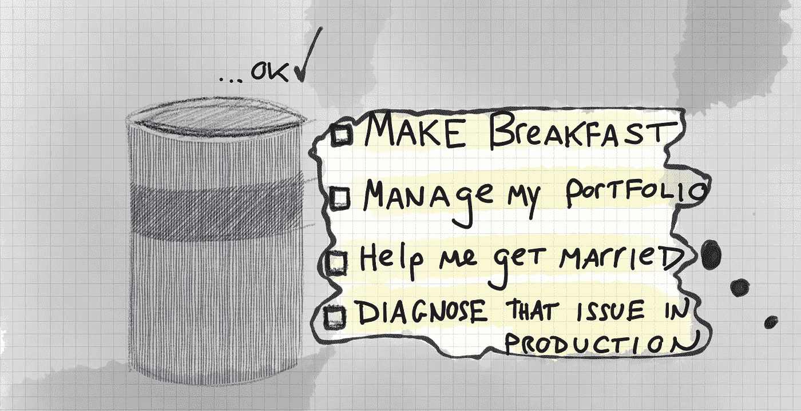

# 问 Alexa(为了更好地了解你的用户)

> 原文：<https://medium.com/hackernoon/ask-alexa-to-better-understand-your-users-cb3b1fd04a1c>

我最近一直在使用这个练习，并且在一些会议上提到过。

这个想法超级简单(几乎可以肯定不是原创)。非常重要的是，请考虑可访问性的挑战。我在这里描述的是一个简单的产品练习，可以拓展你的思维。对许多人来说，这些限制是现实。

带 Alexa(或类似设备)上班。把它放在房间的中间。想象一下，Alexa 是你产品的界面，所有的交互都是语音交互。假设用户不是简单地用他们的声音导航你当前的产品。

这些交易所会是什么样子？一些简单的例子:

> Alexa，给我讲一个关于我一个朋友的有趣故事
> 
> Alexa，下次我询问敏感财务信息时，请再次确认是我。我会更有安全感。
> 
> Alexa，你能从我们排名前三的餐馆中选择一家送餐吗？让它在我下班回家的时候送到？
> 
> Alexa，今晚请监视支持队列。尽力回答问题。如果发生严重的事情，立即通知我。
> 
> Alexa，最大化我的退款，防止审计！好吗？
> 
> Alexa，客户流失的主要预测因素是什么？我们能做些什么来解决这个问题呢？
> 
> Alexa，我们要去度假了。如果有人打电话来询问我们酒店的维护问题，找到可以解决问题的最低成本的供应商。

你会开始注意到一些有趣的事情。

*   人们什么时候问问题，什么时候发布命令？
*   他们如何请求信息？如果你的产品以图表和表格为特色，用户如何仅使用语音交互来实现他们的目标？
*   什么被遗漏了？
*   你在多大程度上让你的产品思维和你的产品界面一致？两者可以脱钩吗？

试试看。谁知道呢，这可能会让人们比你想象的更快地接触到你的产品。还是一样的产品吗？嗯嗯。:)