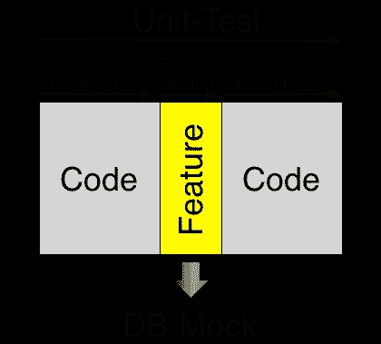
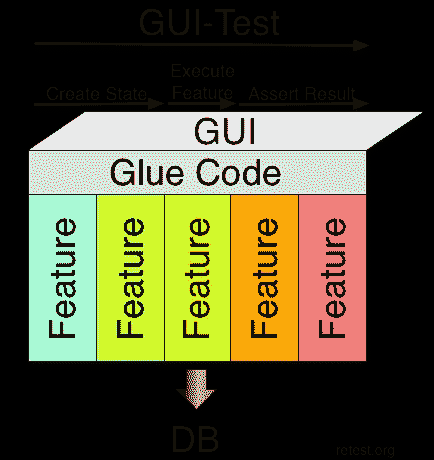
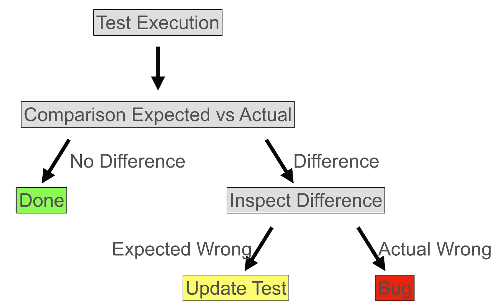
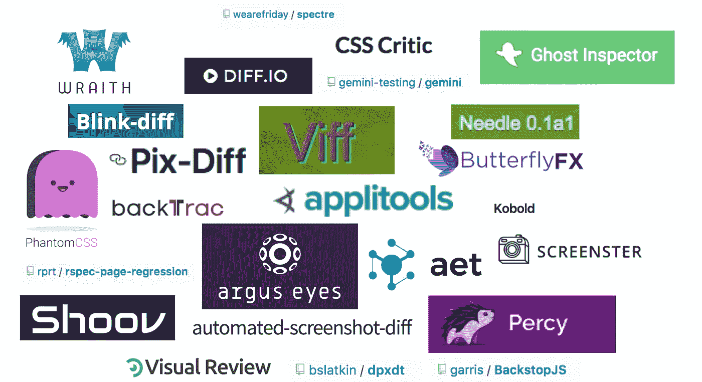
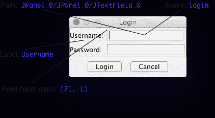

# 被认为有害的断言

> 原文：<https://medium.com/hackernoon/assertions-considered-harmful-d3770d818054>

断言是单元测试中的首选检查机制。然而，当应用于测试界面，特别是 GUI 时，我认为它们是有毒的。谢天谢地，有一个很有希望的选择。

JUnit 获得了巨大的成功，成为整个 Java 中[最常用的库](http://blog.takipi.com/the-top-100-java-libraries-in-2016-after-analyzing-47251-dependencies/)。JUnit 带来了著名的 *Assert.assert…* 语句。这种机制被设计成一次只能孤立地检查一件事情。当测试单个单元时，这是最明智的方法:我们希望尽可能忽略易变的上下文。我们希望集中在理想的情况下，只检查被测单元的一个方面。这创建了最大限度的持久测试。如果一个测试仅仅依赖于代码的一个方面，那么如果那个方面改变了，那么它只需要改变*。断言是实现这一点的自然而直观的机制。在测试过程中处于软件的“内部”,实际上所有的内部都以这样或那样的方式暴露出来，其他的一切都没有意义。*

因为它的成功，JUnit 被认为是测试自动化的艺术——确实如此。因此，它的机制也被应用于非单元测试，也就是说，它们被应用于界面测试(例如 GUI 测试)。直觉上，这是有道理的。因为，随着单个特征向接口堆积，接口变得非常不稳定。只测试系统的个别方面似乎可以解决这个问题。

但事实并非如此。虽然仍然可行，但要在单位一级达到这种分离程度已经很难。在接口层面，集成是不可避免的，但却是完全不可能的。实践证明了这一点。著名的测试金字塔形状的原因之一是，在那个层次上的测试往往会中断，并且需要大量的维护工作。

## 实际例子

假设您想要测试代码的一个方面——计算单个用户曾经购买的商品数量。在单元级别，您所需要的只是一个用户对象和一些相关的项目或事务。根据系统的复杂程度，您可以按需创建这些对象，也可以模仿它们。然后，您可以只测试计数项目的代码。

然而，在 GUI 级别，您首先需要使用一个现有用户登录到系统。然后，您需要导航到显示相关信息的特定页面。因此，即使您只创建一个*断言*来检查项目的数量，您的代码仍然依赖于一个工作的持久层、一个预定义的状态(例如，用户存在和正确的项目数量)、用户登录的能力和导航。这个测试的隔离程度如何？

在综合测试中，忽略上下文基本是不可能的。不由自主地，我们总是依赖于无数与我们想要测试的无关的方面。我们遭受着影响的倍增。这就是著名的[测试金字塔](https://martinfowler.com/bliki/TestPyramid.html)的原因。然而，如果我们不能忽视语境，也许我们应该拥抱它？

# 拥抱背景

想象一下，哪怕只有一秒钟，我们可以以某种方式减轻影响的倍增。然后，我们可以检查系统的完整状态，而不是单个方面。我们可以一次检查所有的东西！

所以因为接口是脆弱的，我们现在想要包含更多的上下文，使得我们的测试更加脆弱？因为现在的考试不是依赖单一方面，而是同时依赖所有方面？谁会想要那个？嗯…每个想知道界面是否改变的人。如果你想一想，同样的问题也适用于版本控制。版本控制系统是这样一个系统，每次你对*任何文件*中的*任何东西*进行更改，你都必须*手动批准*该更改。多么倍增的努力啊！真是浪费时间！除了*而不是*使用一个是一个非常糟糕的主意。

True for both Manual and Automated Test Execution

因为人们总是在无意中改变事物。他们无意中改变了系统的行为。这就是为什么我们首先要进行回归测试。但是有时候我们真的希望改变行为。然后你要更新回归测试。实际上，回归测试很像版本控制。

考虑到软件一直在变化，断言只是检测单个变化的一种手段。所以写断言就像把变更列入黑名单。另一种方法是一次检查所有内容，然后永久忽略个别更改——有效地将它们列入白名单。

Whitelisting of changes vs. blacklisting of changes

创建防火墙配置时，您更愿意选择哪种方法？将单个端口列入黑名单(即“关闭”)还是列入白名单(即“开放”)单个端口？同样的，对于测试…你是想检测一个变化，然后发现它没有问题，还是宁愿忽略所有的变化，除了那些你手工创建检查的变化？谷歌引入了白名单测试，因为他们不想再错过屏幕上的[跳舞的小马](https://www.youtube.com/watch?v=UMnZiTL0tUc&feature=youtu.be&t=325)*。白名单意味着小心谨慎。*

**

*Tools for pixel-based comparison aka visual testing*

*当然，我不是第一个想出这个主意的人。在他的书《T4 用遗留代码工作》中，Michael Feathers 称这种方法为特性测试，其他人称之为金主测试。今天有两种可能:基于像素的比较和基于文本的比较。因为基于像素的比较(通常称为视觉回归测试)容易实现，所以有[很多工具](https://visualregressiontesting.com/tools.html)。对于基于文本的比较，本质上有两个特定的测试工具: [ApprovalTests](http://approvaltests.com/) 和 [TextTest](http://texttest.sourceforge.net/) 。但是基于像素和基于文本的方法都受到效果倍增的影响。*

# *效果倍增*

*在 GUI 级别上，许多东西相互依赖，因为隔离实际上是不可能的。想象一下，你天真地将自动化测试写成一系列的动作。然后，如果有人改变了导航或登录屏幕，这种单一的改变很可能会影响每一个测试。这样，测试的隐式或显式依赖可能会导致单个更改的效果倍增。*

*我们如何才能遏制这种效应的倍增？一种可能性是创建一个额外的抽象层，就像由[单页对象](https://martinfowler.com/bliki/PageObject.html)或[对象映射](http://www.seleniumhq.org/docs/06_test_design_considerations.jsp#user-interface-mapping)所做的那样。但是，如果预期的变化发生了，为了以后以减少努力的形式收获成果，这需要预先手工努力。根据 [YAGNI](https://en.wikipedia.org/wiki/You_aren%27t_gonna_need_it) 的说法，实现“以防万一”的抽象实际上是一件坏事。*

*我们还有什么其他的可能性来抑制效果的倍增？在编程中做重构的时候，我们恰好也是这种情况。一个方法大概在几十个甚至上百个地方被调用。因此，当重命名一个方法时(请只在内部、非公开的 API 中这样做)，我们还需要改变调用该方法的每个地方。在某些情况下，我们可以从抽象语法树中得到这些位置。对于其他情况(属性文件、文档等)，我们必须依赖基于文本的搜索和替换。如果我们忘记或忽略了什么，这通常只在特定的情况下才会表现出来——通常是在执行软件的时候。但是对于测试来说，这是不同的。因为根据定义，测试已经在执行软件了。因此，我们可以看到所有发生变化的地方(例如，通过失败的测试)。现在我们只需要一个机制来“大规模应用”类似的变化。*

*有两种不同的变化:*布局差异*和*流程差异*。*

## *布局差异*

*例如，如果登录按钮现在叫做“登录”，有不同的内部名称、XPath 或 xy 坐标，这就是布局上的差异。布局上的差异相对容易用对象映射来解决。*

*但是，令人惊讶的是，如果我们有更多的上下文，布局上的差异也相对容易解决。如果我们知道整个拼图，而不仅仅是单个的碎片，我们就可以创建一对一的作业。这有助于非常鲁棒的对象识别。*

**

*想象一下，我们有一个添加了一些元素的表单。我们希望识别“接受”按钮来提交表单。如果按钮的一切都改变了，我们仍然可以根据剩余的*未使用的* UI 组件的一对一分配来识别它。*

*大规模应用这些变化也很容易。我们可以应用每一个相似的变化。例如，将“接受”到“保存”的所有变更实例合并到单个变更中，该变更只需要被审核一次。*

*有了这么强大的机制，冗余突然不再是问题了。因此，我们可以突然收集我们 UI 组件的许多属性，使我们对它们的识别更加稳健。*

**

*因此我们可以收集 XPath、名称、标签和像素坐标。如果一些值改变了，我们仍然有剩余的值来识别元素。大规模应用使其易于维护。*

## *流量差异*

*有时，软件的用例或内部过程会发生变化。这些可能是微小的更改(例如，如果需要额外的步骤—填写验证码或重置密码)。有时这些都是重大的改变——工作流程完全改变了。在后一种情况下，重写测试可能更容易。但这种情况很少发生。更多的时候，我们只需要稍微修改一下测试。*

*对象图不能解决流程中的差异。相反，我们需要其他形式的抽象:将循环流提取为“函数”或“过程”并重用它们。这可以通过页面对象来实现，但是需要手工操作和正确的抽象。*

*相反，我提出一种不同的方法:*被动更新*。我这么说是什么意思？传统上，我们必须主动识别测试中特定情况的所有出现，并手动更新它们。因此，如果我们需要调整登录过程，我们必须找到测试登录的所有实例。然后，我们需要相应地手动更改它们。这是主动更新。*

*被动更新是指定我们需要更新的情况以及如何更新的规则。因此，我们没有找到所有的登录尝试，而是指定了这样的情况:登录页面充满了凭证，并且显示了验证码。现在我们添加一个规则，关于如何更新一个发现自己处于这种情况的测试脚本——填充验证码。我们通过删除或插入单个动作，或两者的组合来做到这一点。然后，在执行测试时，被动地应用该更新。这意味着我们本质上是颠倒了过程的提取。*

*这种方法有多种优势:*

1.  *通过保留效果的倍增，这种方法**需要更少的努力**来更新你的测试。*
2.  *通过创建详细的规则，它允许在更新中更加细致入微。*
3.  *它实际上只影响在执行期间处于指定情况**的测试——不需要分析静态测试脚本并解释该情况是否适用于运行期间的测试或手动调试它。***
4.  *可以定义适用于各种情况的一般规则。所以我们可以有一个规则:每当测试发现自己有一个模态对话框并且只有一个选项(例如“ok”)，点击那个选项并继续测试。这使得我们的测试对于不可预见的变化更加健壮。*

*能够解决效应的倍增使我们能够拥抱测试的整个环境，而不是试图忽略它。这种方法有望使测试自动化和结果检查更加强大*和*更加健壮。*

**

***我们已经为 Java Swing 实现了这种方法。现在，我们想创建一个开源工具，以促进广泛采用。非常感谢任何支持——给我们反馈，支持我们或传播消息。***

***谢谢你！***