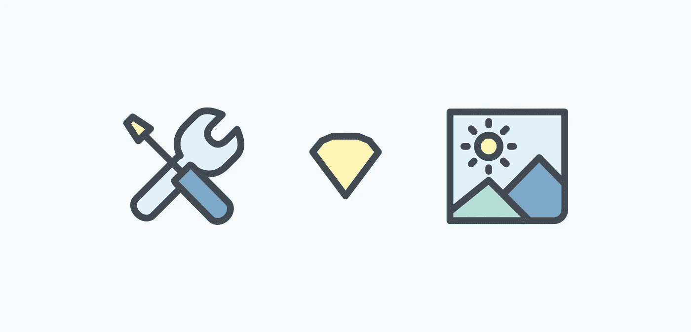

# 自动化草图:设计者和开发者快速指南

> 原文：<https://medium.com/hackernoon/automating-sketch-a-guide-338f2681c648>

## 既然可以自动化，为什么还要手动操作呢？

不久前，我在我们的 blog.blended.io 上写了一篇关于导出图片的文章。在这篇文章中，我想更详细地介绍一下。

( **Pssst:** blended.io 将推出两个工作坊:[版本控制草图给有技巧的设计师&设计团队](http://blended.io/sketch-workshop.html?ref=medium)和 [Git 给了不起的设计师](http://blended.io/git-workshop.html?ref=medium)



# 为什么我应该自动绘制草图

简单的回答是:为了节省时间。自动化就像服用类固醇一样。事实上，任务或一系列任务可以在眨眼之间完成。当然，不是所有的事情都可以自动化，但是简单而平凡的任务肯定可以。既然可以自动化，为什么不自动化呢！？

# 它在概念上是如何工作的

Sketch 的制作者提供了一个名为 Sketchtool 的命令行工具，用于[终端](http://guides.macrumors.com/Terminal)。每台 Mac 都自带终端。安装 Sketch 时，不会自动安装 Sketchtool。请参考[如何安装草图命令行工具 Sketchtool](https://blog.blended.io/automate-export-sketch-artboards-without-sketch/) 我之前的帖子。一旦安装，你必须先打开终端。然后只需在$后面键入 sketchtool。您将看到帮助信息。

现在，当执行命令时，该工具“查看”被引用的文件并提取所需的信息。根据命令，Sketchtool 提取纯文本数据、基于像素的文件或矢量文件。您还可以将输出定向到一个文件或不同的文件夹。

让我们处理一些用例来启发你自动化你自己的一些用例。

# 用例

**答:我已经没有草图的工作版本了**

场景:你的队友在草图中完成了所有的工作。现在，你想从文件中获取一些数据，你有一个问题。您自己不再拥有有效的版本。您不想安装版本。你的同事不再和你一起工作了。通过使用 Sketchtool，您可以在没有 Sketch 应用程序的情况下导出任何文件的视觉效果。

**B .我想经常导出> 50 张图像**

场景:您的团队处理一些草图文件，并且希望每隔一天更新屏幕的视觉效果。通过反复打开各种草图来手动完成这项工作是浪费时间。这可以自动化。

**C .我想在白板上可视化应用程序的整个流程**

场景:假设一个文件中有 50-100 个屏幕。你想把所有的屏幕放在白板上，打印出来。此外，屏幕通过箭头和语言细节进行视觉连接。Sketchtool 允许您导出页面(包含所有屏幕的画布)。此外，您可以导出可以打印的章节/部分中的页面。

**D .我想以不同的(jpg)压缩方式导出图像**

是的，这也是一个有趣的案例。我很想深入了解 sketchtool 的压缩特性，但是，它在测试各种命令时并不起作用。

# 它是如何实际操作


*截图 1:点击并拖动文件夹到终端窗口…*


*截图二:……为了自动完成文件夹路径。文件夹路径出现在* `*cd*` *之后。*

你需要什么

*   开放终端
*   答。该项目文件夹中包含 4–5 个以上画板的草图文件

Sketchtool 允许您使用以下命令导出画板、图层、页面或切片(在终端中执行，您必须移动到您的。草图文件已放置，见[本帖](https://blog.blended.io/automate-export-sketch-artboards-without-sketch/)中的操作方法)。

**注意:**在本文中，每当您看到一个$时，它基本上意味着后面的内容是要在终端中键入的命令。专业提示:在终端中，点击光标向上将显示前一个命令。

# 弄脏我们的手

**免责声明:**以下不是火箭科学。如果你是一个没有终端、**经验的设计师*，你可以做到。***

以下命令将所有画板导出到本地文件夹(在。草图文件)。

`$ sketchtool export artboards mySketchFile.sketch`

随着 iPhoneX 的出现，您可能希望以 3 倍的速度导出资源或视觉效果。只需运行:

`$ sketchtool export artboards mySketchFile.sketch --scales=2x`

你可以尝试任何数字，如 3 倍，4 倍或 10 倍。如果要导出所有画板，例如 3 个不同的草图文件，请运行以下命令。它还会将每个视觉效果导出到单独的子文件夹中:

`$ sketchtool export artboards mySketchFile-1.sketch --output=mySketchFile-1`

`$ sketchtool export artboards mySketchFile-2.sketch --output=mySketchFile-2`

`$ sketchtool export artboards mySketchFile-3.sketch --output=mySketchFile-3`

如果您想要以 JPG 和 PNG 格式导出所有视觉效果，请运行:

`$ sketchtool export artboards mySketchFile.sketch --format='jpg, png'`

如果要导出所有页面，请运行:

`$ sketchtool export pages mySketchFile.sketch`

Spolier:如果您只想导出几个页面，您必须首先从`.sketch`文件中获取页面 ID(我知道这不太好，但这是可行的)。

`$ sketchtool list pages mySketchFile.sketch`

这将在终端中显示`mySketchFile.sketch`的页面信息:

```
{
  "pages" : [
  {
  "name" : "Page 1",
  "id" : "730AC237-A2DA-4599-AC7A-8FA5A6FFCAB1",
  "bounds" : "-65.000000,-3713.000000,15440.000000,8253.000000"
  },
  {
  "name" : "Symbols",
  "id" : "07FB7092-487D-4F51-8357-BCBE784AA202",
  "bounds" : "-1253.000000,-531.000000,5894.000000,799.000000"
  }
  ]
}
```

**第二条免责声明:**以上/以下并非火箭科学。如果你是一个没有终端、**经验的设计师*，你可以做到。***

现在，像这样将 id 复制并粘贴到命令中(我使用了上面的第一个 id)。好的一面是，如果页面在 Sketch 中重命名，它也可以工作，因为我们使用的是 id。

`$ sketchtool list pages mySketchFile.sketch --item=730AC237-A2DA-4599-AC7A-8FA5A6FFCAB1`

这也适用于画板。唯一的问题是拿到身份证。为了得到这些，你必须列出所有的画板。奔跑

`$ sketchtool list artboards mySketchFile.sketch`

如果草图文件有许多画板，屏幕上会显示一个很长的列表。为了能够搜索真正的画板名称，最好将您在屏幕上看到的内容写入文件 artboards.txt，如下所示:

`$ sketchtool list pages mySketchFile-3.sketch > artboards.txt`

`>`符号会将屏幕上列出的所有信息写入文件`artboards.txt`。现在打开`.txt`文件，快速搜索您将在草图中看到的画板名称。然后运行:

`$ sketchtool list pages mySketchFile.sketch --item=id`

确保用实际的`id`替换 id。txt 文件类似于`730AC237-A2DA-4599-AC7A-8FA5A6FFCAB1`，不是您打开草图时看到的画板名称。

如果您想要获取页面或符号页面上所有画板的 id？运行:

`$ sketchtool metadata outreach.sketch`

最后一点有点麻烦，但我想启发你想出自己的自动化。任何时候都可以通过 [@andreehuk](http://www.twitter.com/andreehuk) 向我提问

最后注意:当执行`$ sketchtool`时，你会看到许多可以执行的选项。我既不能使用其中的一些，也看不出其中一些有什么真正的价值。你可以自己试驾。

# 自动化的类固醇

您在上面尝试过的任何命令也可以自动执行，或者按照特定的命令顺序执行。输入批处理文件或脚本。

在本文的最后，您可以下载一些自动化命令的脚本。你可以根据自己的喜好和愿望修改脚本。

• • •

**感谢阅读。**我们在 [blended.io](https://www.blended.io/?ref=medium) 对金融科技、投资科技和工业 4.0 中软件设计和工程的潜在创新飞跃感到无比兴奋和热情。[取得联系！](http://www.blended.io/contact.html?ref=medium)

## 保持在边缘

[获取关于创新、体验设计或工程的实用文章](https://confirmsubscription.com/h/t/3BFD03FDC169B5FE)！没有垃圾邮件和**有价值的内容只有**。

( **Pssst:** blended.io 将推出两个工作坊:[版本控制的熟练设计师草图&设计团队](http://blended.io/sketch-workshop.html?ref=medium)和[Git for wonderful Designers](http://blended.io/git-workshop.html?ref=medium)

*原载于 2017 年 10 月 2 日*[*blog . blended . io*](https://blog.blended.io/automating-sketch-a-quick-guide-for-designers-developers/)*。*